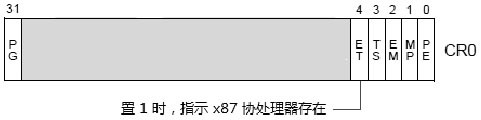
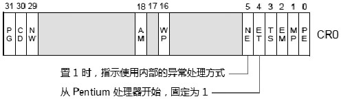

# x87 FPU

在早期的处理器上 (486DX 处理器之前) ​, FPU (Floating-Point Unit, 浮点处理单元) 并没有集成在处理器内部, 而是以 x87 兼容类的 numeric coprocessor (数字协处理器) 形式提供在主板上. 第 1 个实现的版本是在 8086/8088 处理器上使用的 8087 numeric coprocessor. 接着是 80286 处理器上使用的 287 numeric coprocessor, 80386 处理器上使用的 387 numeric coprocessor.

如上所示, 在 386 处理器的 CR0 寄存器上 ET (bit 4) 位是 Read/Write 位, 置位时表示存在 80287 或 80387 协处理器.

从 486DX 处理器开始 x87 数字协处理器被集成在处理器的 chip 内, 作为 FPU 形式存在. 软件可以使用 `CPUID.01H:EDX[0]` 位来检测处理器是否集成 x87 FPU.

从 486DX 处理器开始 CR0 寄存器为 floating-point 异常处理新增了一个 NE (Numeric Error) 控制位, 置 1 时使用处理器 native (内部原生的) 浮点异常处理方式, 清 0 时使用外部硬件的浮点异常处理方式 (Intel 称为 MS-DOS compatibility 处理模式)​, 关于浮点异常处理我们将在后面进行探讨.

对于 ET (Extension Type) 位, 从 Pentium 处理器开始, 这个位是保留的, 其值固定为 1 (指示存在 x87 FPU 单元) ​.

# MMX 技术

Intel 在 1996 年推出带 MMX 技术的 Pentium 处理器, 从那时起开创了 x86 体系的 SIMD (Single Instruction, Multiple Data, 单指令多数据处理) 的先河.

本质上看, MMX 技术在原 x87 FPU 环境上加入多种 packed integer (压缩的整数) 数据处理指令. 因此 MMX 指令的执行环境是与 x87 FPU 指令一致的.

软件使用 `CPUID.01H:EDX[23]` 位来检测是否支持 MMX 技术. 这个检测似乎有些多余, 现在的处理器都将支持 MMX 技术, 除非使用 Pentium 之前的处理器.
