<!-- @import "[TOC]" {cmd="toc" depthFrom=1 depthTo=6 orderedList=false} -->

<!-- code_chunk_output -->

- [1. x87 FPU 的资源](#1-x87-fpu-的资源)
  - [1.1. x87 FPU 的操作 Environment(环境) 信息](#11-x87-fpu-的操作-environment环境-信息)
  - [1.2. x87 FPU 指令支持的数据类型](#12-x87-fpu-指令支持的数据类型)
  - [1.3. x87 FPU 提供的指令](#13-x87-fpu-提供的指令)
- [2. x87 FPU 数据寄存器](#2-x87-fpu-数据寄存器)
  - [2.1. 扩展双精度浮点数](#21-扩展双精度浮点数)
- [3. x87 FPU 的 stack 结构](#3-x87-fpu-的-stack-结构)
  - [3.1. Stack 顶指针](#31-stack-顶指针)
  - [3.2. Stack 的溢出](#32-stack-的溢出)
  - [3.3. 浮点数据寄存器值的状态](#33-浮点数据寄存器值的状态)
    - [3.3.1. Tag 寄存器初始值](#331-tag-寄存器初始值)
    - [3.3.2. 读 Tag 寄存器值](#332-读-tag-寄存器值)
    - [3.3.3. 修改 Tag 寄存器值](#333-修改-tag-寄存器值)
  - [3.4. x87 FPU 寄存器 stack 的操作](#34-x87-fpu-寄存器-stack-的操作)
    - [3.4.1. Load 指令](#341-load-指令)
    - [3.4.2. Load 常数值](#342-load-常数值)
    - [3.4.3. Store 指令](#343-store-指令)
    - [3.4.4. 交换 stack 中数据](#344-交换-stack-中数据)
    - [3.4.5. stack 中数据的复制](#345-stack-中数据的复制)
    - [3.4.6. 动态加减 TOP 指针](#346-动态加减-top-指针)
    - [3.4.7. 读取 stack 中数据](#347-读取-stack-中数据)
    - [3.4.8. Indefinite(不确定) 编码值](#348-indefinite不确定-编码值)

<!-- /code_chunk_output -->


# 1. x87 FPU 的资源

为了支持浮点指令的执行, 在处理器内的 x87 FPU 提供了下面的硬件物理资源.

1) 8 个 data register(浮点数据寄存器)​: R0 ~ R7 寄存器.

2) status register(状态寄存器)​.

3) control register(控制寄存器)​.

4) tag word register(标记字寄存器)​.

5) last instruction pointer register(最后一条指令指针寄存器)​: 其中包括 CS selector 部分.

6) last data operand pointer register(最后的 data 操作数指针寄存器)​: 包括 DS selector 部分.

7) opcode register(opcode 寄存器)​.

加入了两种浮点异常处理模式: native 模式和 DOS compatibility 模式. native 模式使用 16 号中断 vector(#MF 异常 vector)​. 而 DOS compatibility 模式使用外部的 8259 类 PIC(中断控制器) 的中断请求方式来处理浮点异常.

## 1.1. x87 FPU 的操作 Environment(环境) 信息

在 x87 FPU 中区分两大类信息: environment(环境) 信息和 data 寄存器信息, 如下表所示.

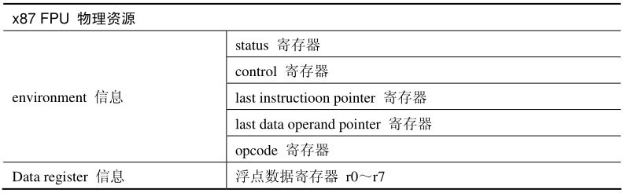

由 8 个 data register 组成的 FPU stack 信息区别于 environment 信息.

## 1.2. x87 FPU 指令支持的数据类型

x87 FPU 的指令支持下面 5 大类数据类型.

1) single precision floating-point: 32 位的单精度浮点数.

2) double-precision floating-point: 64 位的双精度浮点数.

3) double extended-precision floating-point: 80 位的扩展双精度浮点数.

4) integer: 包括 16 位, 32 位, 以及 64 位的整型数.

5) packed BCD 码: 80 位的压缩 BCD 码.

## 1.3. x87 FPU 提供的指令

包括下面 5 大类指令.

1) data transfer(数据传送类) 指令: 包括一部分 load constant(加载常数) 的指令.

2) arithmetic(运算类) 指令: 包括基本和复杂的运算指令.

3) comparison(比较类) 指令: 提供 FPU 的比较指令.

4) transcendental(卓越的) 指令: 这是 Intel 认为独特的, 卓越的指令. 可以归为 arithmetic 类.

5) control(控制类) 指令: 对 x87 FPU 运行环境进行控制.

在控制类指令中, 部分指令包括 wait 和 non-wait 版本.

# 2. x87 FPU 数据寄存器

x87 FPU 所使用的 data register 是 80 位宽, 如下所示.

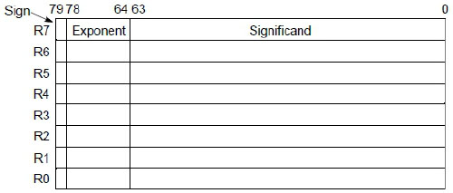

## 2.1. 扩展双精度浮点数

在 x87 FPU 的底层使用 double extended-precison floating-point(扩展双精度浮点数) 格式, 我们从上图可以看到, 扩展双精度浮点数的 significand(有效数) 位是 64 位, 指数位是 15 位. 关于浮点数格式, 请参考 1.2.2 节的描述.

x87 FPU 会自动处理数据格式之间的问题.

1) 当从内存中 load 数据时, 内存中的非扩展双精度数据会自动转换为扩展双精度格式, 再放入 x87 FPU stack 顶寄存器 st(0) 中.

2) 当将 stack 顶寄存器 st(0) 的值 store 到内存时, 扩展双精度格式会自动转换为相应的目标数据格式.

# 3. x87 FPU 的 stack 结构

x87 FPU 浮点指令的执行基于由这 8 个 data register(R0 ~ R7 寄存器) 组成的寄存器 stack 结构. x87 FPU 寄存器 stack 的操作和维护与内存中的 stack 结构类似, 如下所示.

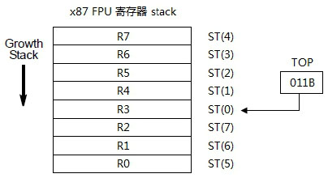

与内存 stack 不同的是, x87 FPU 寄存器 stack 以环形结构组织, 当 stack 顶位于物理 R0 寄存器时, 下一个 load 操作会使 stack 顶指针回绕到 R7 寄存器.

## 3.1. Stack 顶指针

x87 FPU 寄存器 stack 顶指针名字永远都是 ST(0)​, ST(0) 指针哪个物理 data 寄存器由 status 寄存器的 TOP 域 (bit 13 ~ bit 11) 反映出来, 如下所示.

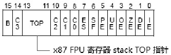

如上所示, 3 个位的 TOP 指针的值从 000B 到 111B, 允许 ST(0) 指针指向 R0 ~ R7 寄存器.

在 x87 FPU 寄存器 stack 结构图中, TOP 的值为 3(011B)​, 那么 ST(0) 指向 R3 寄存器, 接下来 ST(1) 指向 R4 寄存器, ST(7) 指向 R2 寄存器.

x87 FPU 寄存器 stack 也是向下生长. 以当前 ST(0) 指向 R3 寄存器为例. 当执行 load 指令操作时 (即 push 操作)​, TOP 值减 1(值为 010B)​, 那么 ST(0) 将指向 R2 寄存器.

若执行 store-and-pop 类指令操作 (即 pop 操作)​, ST(0) 的值将被 store 到内存中, TOP 值加 1(值为 100B)​, ST(0) 指向 R4 寄存器.

## 3.2. Stack 的溢出

由于 x87 FPU 的 stack 由 8 个数据寄存器以环形结构组成, stack 很容易达到溢出状态. stack 的溢出包括下列类型.

1) stack overflow(栈向上溢出)​.

2) stack underflow(栈向下溢出)​.

当 load 一个数据到 stack 中 (push 操作) 时, 如果新的 ST(0) 指针不为空, 将会产生 overflow 溢出, x87 FPU 会指示为 stack overflow 异常发生. 当使用空的 stack 寄存器时 (例如 pop 操作)​, 将会产生 underflow 溢出, x87 FPU 会指示为 stack underflow 异常发生.

因此, 当 stack 中的数据不需要时, 应该主动 POP 出避免发生 overflow 溢出, 需要引用 stack 数据时要确保不为空值.

## 3.3. 浮点数据寄存器值的状态

在 x87 FPU 中为每个 data 寄存器保存的值定义了一些状态值.

1) Valid(值有效)​.

2) Zero(值为 0)​.

3) Speical(特殊的值)​, 包括: invalid(无效的值, NaN 和 unsupported 类型)​, infinity(无穷大) 和 denormal(不合规格的)​.

4) Empty(值为空)

这些 data 寄存器值的状态由 Tag 寄存器指示, 如下所示.

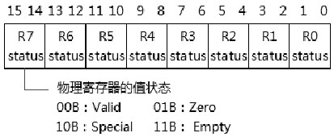

16 位的 Tag 寄存器每 2 位对应一个物理的 data 寄存器. 00B 值为 Valid 状态, 01B 值为 Zero 状态, 10B 值为 Special 状态, 11B 值为 Empty 状态.

### 3.3.1. Tag 寄存器初始值

在处理器 Power-up 或 Reset 后, Tag 寄存器的值为 5555H, 指示各个 data 寄存器为 0. 软件执行 FINIT 或 FNINIT 指令将 Tag 寄存器置为 FFFFH 值, 指示各个 data 寄存器为 Empty. 软件使用 FSAVE 或 FNSAVE 指令保存 x87 FPU 状态的同时, 也能将 Tag 寄存器置为 FFFFH 值.

### 3.3.2. 读 Tag 寄存器值

在 x87 FPU 中并没有指令直接对 Tag 寄存器进行读 / 写操作, 需要通过内存 image 的 load/store 操作数来达到读 / 写 Tag 寄存器的目的, 如以下代码所示.

```cpp
fstenv [x87env32]    ;store x87 FPU environment 信息
mov ax, [x87env32 + 8]   ; 读 Tag 寄存器值
```

可以使用 FSTENV/FNSTENV 或 FSAVE/FNSAVE 指令将 x87 FPU 的环境信息保存在内存映像中, 然后从内存映像中读取 Tag 寄存器值.

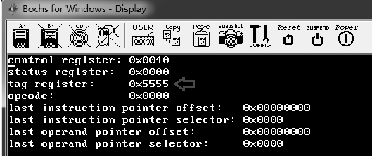

上面是运行在 Bochs 中的结果图, 打印出的 tag 寄存器值为 5555H.

### 3.3.3. 修改 Tag 寄存器值

软件可以使用 FLDENV 或 FRSTOR 指令从内存 image 中加载值到 Tag 寄存器, 如以下代码所示.

```cpp
mov WORD [x87env32 + 8], 0xFFFF  ; 置内存 image 中的 Tag 寄存器值
fldenv [x87env32]      ; 从内存 image 中加载 environment 信息
```

上面的代码将内存 image 中的 Tag 寄存器值设置为 FFFFH, 在加载环境信息时, x87 FPU 将使用这个值设置 Tag 寄存器.

可是, 并不是内存 image 中 tag 寄存器的任何值在 load 的时候 x87FPU 都会接受, 有下面的逻辑处理手法.

```cpp
/*
* 假如内存 image 中 tag 寄存器相应的 tag 值为 3 时
* 指示: Empty 状态
*/
if (x87env.tag[0] == 3)  /* 对应 R0 寄存器 */
{
    tag[0]=3;    /* 加载后就为 3 */
}
else
{
    /* 读 R0 寄存器的值, 检查并设置相应状态 */
    tag[0]=tag_of(R0);
}
if (x87env.tag[1] == 3)  /* 对应 R1 寄存器 */
{
    tag[1]=3;
}
else
{
    tag[1]=tag_of(R1);
}
... ...        /* 依此类推 */
```

从上面我们可以看到:

1) 内存 image 中的相应的 tag 值为 3 时, 加载后 tag 寄存器的相应值就为 3.

2) 若非 3 值 (即非 Empty 状态)​, x87 FPU 会根据相应的 data 寄存器值而设置相应的状态.

假如, 像下面的代码这样设置值.

```cpp
mov WORD [x87env32 + 8], 0xFF00  ; tag[0] 到 tag[3] 为 0(valid 状态)
fldenv [x87env32]      ; 从内存 image 中加载 environment 信息
```

tag[0] 到 tag[3] 的值为 0(即指示为 valid 状态)​, 加载后的 tag 寄存器可能并不是 0xff00 值, 有可能会是 0xff55 值 (即 tag[0] 到 tag[3] 为 Zero 状态)​.

x87 FPU 的这个措施能有效地防止对 tag 寄存器设置错误的状态值.

## 3.4. x87 FPU 寄存器 stack 的操作

在 x87 FPU 中, 并没有指令直接对物理的浮点 data 寄存器进行 load/store 操作, 这些 data 寄存器的 load/store 操作是基于对 x87FPU 寄存器 stack 的 TOP(栈顶) 进行 push 与 pop 操作的基础之上.

当执行一条 load 指令时, TOP 指针值减 1, 源操作数压入 ST(0) 寄存器中. x87 FPU 有三类指令对 data 寄存器进行 load 操作.

1) 提供源作数 load 进 ST(0) 中.

2) load 一个浮点常数值到 ST(0) 中.

3) 使用 FXCH 或 FCMOVcc(条件传送) 类指令进行 ST(0) 和 ST(i) 交换.

x87 FPU 使用 FST 类指令将 ST(0) 值 store 往内存中, 并可以选择是否从 stack 中 POP 出 ST(0) 值.

### 3.4.1. Load 指令

x87 FPU 的 load 指令支持三种数据类型: 浮点类型 (包括单精度, 双精度和扩展双精度)​, 整数类型, 以及 BCD 数据类型 (packed integer)​. 这些数据在 load 进 stack 寄存器时, x87 FPU 会自动将其转换为 80 位的扩展双精度浮点数.

load 操作根据数据类型产生不同的指令形式.

1) FLD 指令: load 浮点数.

2) FILD 指令: load 整数.

3) FBLD 指令: load BCD 数据.

FLD 指令支持两种操作数: 内存操作和 stack 寄存器形式, 如以下指令所示.

```cpp
fld DWORD [memfp32]  ; 32 位的内存 operand size 加载到 ST(0) 里
fld QWORD [memfp64]  ; 64 位的内存 operand size 加载到 ST(0) 里
fld TWORD [memfp80]  ; 80 位的内存 operand size 加载到 ST(0) 里
fld st2      ; 使用 stack 寄存器操作数, ST(2) 加载到 ST(0) 里
```

假如, 执行这条指令之前, TOP 值为 3, 即 ST(0) 指向 R3 寄存器, 以 fld st2 指令的执行为例, 如下面示意图所示.

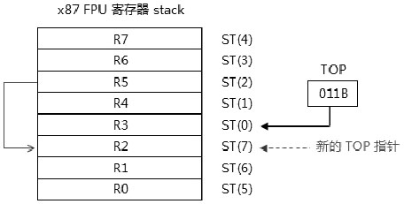

原来的 ST(2) 指向 R5 寄存器, x87 FPU 执行的操作如下.

1) ST(2) 保存到 temp 值.

2) TOP 指针值减 1, 新的 TOP 指针将指向 R2 寄存器.

3) temp 值写入 ST(0) 中.

这条指令的结果是, 将 R5 寄存器的值写入 R2 寄存器. 当执行 fld st0 指令时, 它的效果将等于复制 ST(0) 的值.

注意: stack 寄存器的位置也会随着变化, ST(7) 将指向 R1 寄存器, 而 ST(1) 将指向 R3 寄存器. 也就是这个环形的 stack 整体向下移动一位.

FILD 指令从内存中 load 整数值到 ST(0) 中, operand size 可以是 16 位, 32 位, 以及 64 位. 这个整数值会自动转换为 80 位的扩展双精度浮点数.

```cpp
fild DWORD [memint32]   ; [memint32] 的值为 2
```

如以上代码所示, 内存操作数的值为整数 2, 当执行这条指令时, 当前 ST(0) 的值将是 2.0. 在 ST(0) 的十六进制值是 0x4000_80000000_00000000(80 位宽).

如以上代码所示, 内存操作数的值为整数 2, 当执行这条指令时, 当前 ST(0) 的值将是 2.0. 在 ST(0) 的十六进制值是 0x4000_80000000_00000000(80 位宽).

FBLD 指令将 packed BCD(压缩的 BCD 码) 数据从内存 load 到 ST(0) 中, FBLD 指令的内存操作数是 80 位, 如下面代码所示.

```
fbld [membcd]   ; 80 位的 BCD 转换为扩展双精度 load 进 ST(0)
; 假设内存中的 BCD 码为 10
membcd dq 10H    ; packed BCD 码 10
           dw 0     ; 80 位宽
```

当执行 FBLD 指令后, 当前的 ST(0) 值将是 10.0(浮点数), 在 ST(0) 的十六进制值是 0x4002_A0000000_00000000(80 位宽).

### 3.4.2. Load 常数值

x87 FPU 中有一组常数的 load 指令.

1) FLDZ 指令: 加载 0.0 值到 ST(0).

2) FLD1 指令: 加载 1.0 值到 ST(0).

3) FLDPI 指令: 加载 Pi 值到 ST(0).

4) FLDL2T 指令: 加载 log2(10) 到 ST(0).

5) FLDL2E 指令: 加载 log2(e) 到 ST(0).

6) FLDLG2 指令: 加载 log10(2) 到 ST(0).

7) FLDLN2 指令: 加载 loge(2) 到 ST(0).

### 3.4.3. Store 指令

与 load 指令相对应, 当 x87 FPU 执行 store 指令时, x87 FPU 会自动将 80 位宽的扩展双精度转换为目标操作数的类型 (包括: 相应宽度的浮点型数据, 整型数据, 以及 80 位的 packed BCD 码数据) 后, 保存在内存中.

x87 FPU 的 store 指令支持两种操作模式.

1) store 模式: 仅 ST(0) 值 store 在内存中. 对应的指令有 FST 和 FIST, 支持浮点数和整型数.

2) store-and-pop 模式: ST(0) 值 store 在内存中, 同时 POP 出寄存器 stack. 对应的指令有 FSTP,FISTP, 以及 FBSTP, 将支持浮点数, 整型数, 以及 packed BCD 数.

FSTP 的规格对应于 FLD 指令, 操作数支持 stack 寄存器和内存操作数.

```markdown
fstp DWORD [mem]    ; store 内存 32 位浮点格式, 并 POP 栈
fstp QWORD [mem]    ; store 内存 64 位浮点格式, 并 POP 栈
fstp TWORD [mem]    ; store 内存 80 位浮点格式, 并 POP 栈
fstp st2      ; ST(0) 复制到 ST(2), 并 pop 栈
```

在 store-and-pop 操作中, ST(0) 寄存器的值保存在内存中. 以 fstp DWORD [mem] 指令为例, 它执行的操作如下所示.

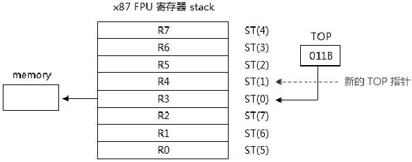

在指令执行前, TOP 的值为 3,ST(0) 指向 R3 寄存器, 指令执行的操作如下.

1) ST(0) 寄存器的值 store 往内存中.

2) TOP 的值加 1, 此时 TOP 值为 4,ST(0) 将指向 R4 寄存器.

注意: stack 寄存器相应的位置也会随着变化, ST(7) 将指向 R3 寄存器, ST(1) 将指向 R5 寄存器. 也就是这个环状的 stack 整体向上移动一位.

当执行 FISTP 指令时, x87 FPU 将 ST(0) 的值转化为整型数据后 store 往内存中, 再执行 POP 操作. FBSTP 指令的操作数只支持 80 位宽, ST(0) 寄存器中的扩展双精度浮点数将转换为 18 个 BCD 码再保存在 80 位的内存操作数中.

### 3.4.4. 交换 stack 中数据

x87 FPU 提供了一条 FXCH 指令来实现交换 stack 内的数据, FXCH 指令有两种形式.

1) 无操作数形式: 将交换 ST(0) 与 ST(1) 的值.

2) 提供目标的 stack 寄存器 ST(i)​: 将交换 ST(0) 与 ST(i) 的值.

我们可以使用 fxch st2 指令来交换 ST(2) 与 ST(0) 的值, 如下所示.

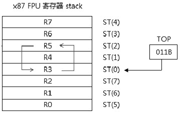

值得注意的是, ST(0) 与 ST(2) 交换后, TOP 的值是保持不变的.

### 3.4.5. stack 中数据的复制

stack 中数据的复制是在 ST(0) 与 ST(i) 之间操作的, 我们前面已经了解过复制的指令.

1) 使用 FLD 指令: 将 ST(i) 的值复制到新的 ST(0) 寄存器中.

2) 使用 FST 指令: 将 ST(0) 的值复制到 ST(i) 寄存器中.

3) 使用 FCMOVcc 条件移动指令: 根据条件值将 ST(i) 的值复制到 ST(0) 寄存器中.

FLD 指令将会改变 TOP 值, 减 1 向下移一位. 而 FST 指令不改变 TOP 值, 可是使用 FSTP 指令则同样会改变 TOP 值, 加 1 向上移一位. FCMOVcc 系列指令不改变 TOP 值.

### 3.4.6. 动态加减 TOP 指针

x87 FPU 提供了一组加减 TOP 的指令: FINSTP 和 FDECSTP.

1) FINSTP 指令执行 TOP 值加 1. 当 TOP 值为 7 时, 加 1 的结果是回绕到 0.

2) FDECSTP 指令执行 TOP 值减 1. 当 TOP 值为 0 时, 减 1 的结果是回绕到 7.

### 3.4.7. 读取 stack 中数据

x87 FPU 不提供直接读取 data 寄存器的值, 软件只能利用 store 指令保存在内存中, 从内存中读取值. 或者使用 FSAVE/FNSAVE 指令保存 x87 FPU 的全部 image 状态值, 然后从内存映像中读取 data 寄存器值.

代码清单 20-1(lib\x87.asm)​:

```asm
;--------------------------
; 得到所有 data 寄存器的值
;--------------------------
get_data_register_value:
       push edx
       push ecx
       call get_top          ; 得到 TOP 指针值
       mov edx,eax
       mov ecx,8
get_data_register_value_loop:
       mov eax,[data_register_file + edx * 4]    ; 读取目标寄存器内存地址
       fstp TWORD [eax]         ; 保存在相应的内存中
       inc edx
       and edx,7           ; 计算对应的物理寄存器
       dec ecx
       jnz get_data_register_value_loop
       pop ecx
       pop edx
       ret
;; FSAVE/FNSAVE,FRSTOR 指令的附加映像
;; 定义 8 个 80 位的内存地址保存 data 寄存器值
r0_value dt 0.0
r1_value dt 0.0
r2_value dt 0.0
r3_value dt 0.0
r4_value dt 0.0
r5_value dt 0.0
r6_value dt 0.0
r7_value dt 0.0
; x87 FPU 寄存器组内存地址集
data_register_file dd r0_value,r1_value,r2_value,r3_value
                       dd r4_value,r5_value,r6_value,r7_value,0
```

get_data_register_value(​) 函数实现在 lib\x87.asm 库里, 它使用 fstp 指令将 8 个 data 寄存器的值保存在内存里.

> 实验 20-1: 打印 x87 FPU 的全部信息

现在, 我们利用前面所述知识来打印 x87 FPU 的全部信息, 包括: x87 FPU 环境信息和 x87 FPU 数据寄存器的信息.

代码清单 20-2(topic20\ex20-1\protected.asm)​:

```asm
;
;** 实验 20-1: 打印 x87 FPU 全部信息
;
       finit       ; 初始化 x87 FPU
       fld1       ; load 1.0
       fild DWORD [memint32]   ; load 从 integer 型数 2
       call dump_x87fpu    ; 打印 x87 FPU 信息
```

在这个主体代码里, 只是 load 了两个值进入 stack 中, 关键的函数是 dump_x87fpu(​)​, 它负责打印 x87 FPU 信息.

代码清单 20-3(lib\x87.asm)​:

```asm
;-----------------------------------
; 打印 x87 FPU 信息
;-----------------------------------
dump_x87fpu:
       jmp do_dump_x87fpu
dxf_msg db '------------------ x87 FPU stack ------------------',10,0
do_dump_x87fpu:
       call dump_x87env    ; 打印环境信息
       mov esi,dxf_msg
       call puts
       call dump_data_register   ; 打印 stack 信息
       ret
```

dump_x87fpu(​) 函数调用 dump_x87env(​) 函数打印环境信息, 调用 dump_data_register(​) 函数打印 stack 信息, 这两个函数实现在 lib\x87.asm 库里, 比较长, 这里不再贴出.

下面是运行在 Bochs 里的结果截图, 这个结果和真实机器测试是一致的.

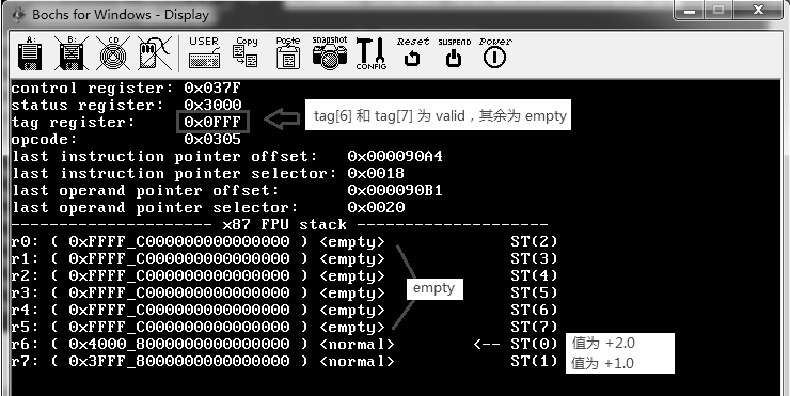

我们可以看到 x87 FPU 当前的信息: tag 寄存器指示 R6 和 R7 寄存器的值为 Valid, 其余寄存器值为 Empty, 在下面的 x87 FPU stack 信息里, 这些 Empty 值的寄存器的二进制值为 0xFFFF_C0000000_00000000, 这是一个 indefinite(不确定值) 编码值.

在初始状态下, TOP 指针值为 0. 在实验的主体代码里, 使用了 FLD1 指令加载一个常数值 + 1.0 到 stack 里, TOP 指针减 1 变成了 7(因此在 R7 寄存器存入 + 1.0 值)​.

再使用 FILD 指令加载一个整型数 2 进入 stack,TOP 值减 1 变成 6, 因此在 R6 寄存器存入 + 2.0 值, 转换为扩展双精度格式后为 0x4000_80000000_00000000(80 位宽)​.

### 3.4.8. Indefinite(不确定) 编码值

我们看到上面的运行结果图中, 当 stack 中的值为 Empty 时, 保存的是 indefinite 值. x87 FPU 中使用的 indefinite 编码值如下表所示.

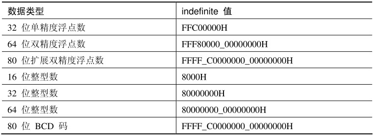

