在 x87 FPU(包括后续的 SSE 系列的 SIMD 指令)中的 floating-point 数操作指令中, 总共有 6 类异常. 这些 floating-point 异常, 也被称为 numeric 异常. 而对于不是因为 floating-point 数操作产生的异常, 称为 non-numeric 异常.

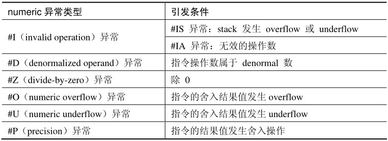

在上表所列的 numeric 异常里,#I 异常下又分为:#IS(stack overflow or underflow)异常及 #IA(Invalid arithmetic operand)异常, 因此实际上共有 7 类异常.

这些异常可以在 x87 FPU control 寄存器相应的 exception mask 位置位而被 masked(屏蔽)​,x87 FPU 初始化后, 所有的异常都是被屏蔽的.

当发生的异常属于 unmasked(未屏蔽)时, 软件需要提供相应的异常处理程序. 使用 native 或 DOS compatibility 模式依赖于 CR0.NE 位的设置(NE=1 时使用 native 模式, NE=0 时使用 DOS compatibility 模式)​.

# 1. status 寄存器的异常标志位

在 status 寄存器中与异常相关的标志位包括: B 标志位, ES 标志位, 以及 6 个异常发生标志位. status 寄存器的 bit5～bit0 是 exception flag(异常标志)位, 对应着 x87 FPU 的 6 大类异常.

1) IE 标志(bit0)​: 置位指示发生了 #I 异常(Invalid operation)​.

2) DE 标志(bit1)​: 置位指示发生了 #D 异常(Denormalized operand)​.

3) ZE 标志(bit2)​: 置位指示发生了 #Z 异常(Divide-by-zero)​.

4) OE 标志(bit3)​: 置位指示发生了 #O 异常(numeric overflow)​.

5) UE 标志(bit4)​: 置位指示发生了 #U 异常(numeric underflow)​.

6) PE 标志(bit5)​: 置位指示发生了 #P 异常(inexact result for percision)​.

Intel 明确提到,#I(invalid operation)异常,#Z(divide-by-zero)异常和 #D(denormal operand)异常是 pre-computation(指令运算前)就检测到的异常类型. 显然, 这些在执行前检测到的异常, 指令还没执行完毕.

而 #O(numeric overflow)异常,#U(numeric underflow)异常, 以及 #P(percision)异常是 post-computation(指令运算后)类型, 在指令执行完毕后检测出来的异常.

这些标志位是 "sticky" 位, 也就是 x87 FPU 置位后, 从不会进行清位. 对异常标志位清位, 是软件的职责. 软件可以使用 FCLEX/FNCLEX 指令和 FINIT/FNINT 指令进行显式的清位. 也可以使用 FLDENV 或 FRSTOR 指令进行隐式的清位.

当进入浮点异常处理程序执行时, 处理程序的职责之一是在退出处理程序前清异常标志位. 如果在处理程序里包含有 x87 FPU 指令, 那么要在执行任何 x87 FPU 指令 (除了 non-wait 类指令) 或 MMX 指令前清这些异常标志位.

## 1.1. ES(Error summary status)标志

x87 FPU 设置 status 寄存器的 bit7 位 ES 标志(x87 FPU 错误总结状态位)​, 指示 x87 FPU 的异常处理程序已经被 pending(提交处理器期间)​.

因此, ES 标志位的置位要满足两个条件.

1) bit0～bit5 的任何一个异常标志位被置位.

2) 对应的异常是 unmasked 的, 即未被屏蔽的.

在上述条件产生后, ES 标志位置位. x87 FPU 将 pending 等待处理器响应执行异常处理程序.

## 1.2. B(Busy)标志

在现在的处理器里这个标志位未用, B 标志位是为保持兼容而来(兼容 286 及 287 的处理模式)​, 实际上 B 标志的值等于 ES 标志的值.

# 2. 异常的屏蔽

当异常属于 masked 时, 异常发生后处理器使用默认的处理方法. 对于每类异常处理器都有相应的默认处理操作, 这些默认的处理方法能很好地工作并适合于大部分软件的需求.

如果软件需要自定义异常处理, 那么需要在 control 寄存器去掉相应的 mask 位, 并提供相应的异常处理程序.

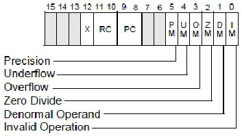

如上所示, bit5～bit0 是 6 个异常类的 mask 位. 当它们置位时, 相应的异常将被屏蔽. 软件可以使用 FLDCW 指令 (或者 FLDENV 与 FRSTOR 指令) 来修改 control 寄存器的值, 如以下代码所示.

```assembly
fstcw [control_word]     ; 读取 control 寄存器
and word [control_word],0xFFC0   ; 清所有 mask 位
fldcw [control_word]     ; 回写 control 寄存器
```

这段代码将清所有的 mask 位, 那么所有的异常发生后将会调用自定义的异常处理程序.

# 3. #IS 与 #IA 异常

在 #I(invalid operation)异常下的两个子异常:#IS(stack overflow 或 underflow)异常和 #IA(invalid arithmetic operand)异常, 它们是根据 status 寄存器的 SF 标志位来判断. 如下表所示.

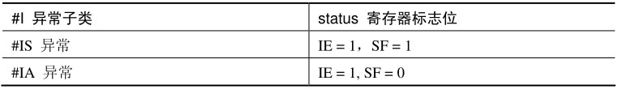

## 3.1. SF(Stack fault)标志

status 寄存器的 bit6 位是 SF 标志位, 置位指示发生了 Stack fault, 这个栈错误是下面的情况.

1) Stack overflow(栈向上溢出)​.

2) Stack underflow(栈向下溢出)​.

当尝试 load 一个值到 ST(0)​, 而 ST(0)是非 empty 状态 (即 tag 值不是 11B) 时, 就会产生 stack overflow 异常. 此时, 条件码 C1=1, 指示 stack fault 类型是 overflow.

当尝试引用 (指令的操作数是 stack 寄存器, 例如: store 往内存) 一个 empty 值 (即 tag 值是 11B) 时, 就会产生 stack underflow 异常. 此时, 条件码 C1=0, 指示 stack fault 类型是 underflow.

当 SF 置位时, 同时 IE 也被置位 (SF=1,IE=1)​, 此时就产生了 #IS(stack overflow 或 underflow) 异常.

```assembly
fcomi st0,st7  ; ST(7) 当前为 empty 状态
```

当执行上面这条指令时, 就会产生 #IS 异常, 如下所示.

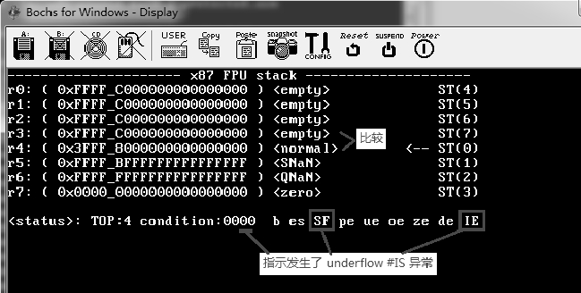

Fcomi st0,st7 指令的源操作数引用了 empty 寄存器, 因此产生了 underflow 类型的 #IS 异常(IE=1,SF=1,C1=0)​.

由于这个 #I 异常是被屏蔽的, 处理器并没有调用异常处理程序, ES 标志和 B 标志为 0.

```assembly
fincstp   ; ST(0) 向上移一位, ST(0)非 empty
fldz   ; load 0.0 值
```

而执行上面两条指令, 将会产生 overflow 类型的 #IS 异常. 因为当前 ST(0)不为 empty. 尝试 load 进非 empty 的 stack 寄存器, 属于 overflow 类型的 #IS 异常.

## 3.2. #IA 异常

当 IE=1,SF=0 时, 这个异常属于 #IA(Invalid arithmetic operand)异常. 任何的 arithmetic(运算类)指令使用了下面类型的操作数就会产生 #IA 异常.

1) Unsupported 数据.
2) SNaN 数据.

某些指令使用 infinite 数据也会产生 #IA 异常. 对于 NaN 类型, 某些指令支持 QNaN 类型而不会产生 #IA 异常, 例如 fucom 系列比较指令. 而对于其他算术运算类指令, 使用 SNaN 会产生 #IA 异常.

```assembly
fadd st0,st1   ; 加一个 SNaN 数
fadd st0,st2   ; 加一个 QNaN 数
```

如上所示, 分别使用 ST(0)加上 SNaN 和 QNaN 数时, 会产生不同的结果.

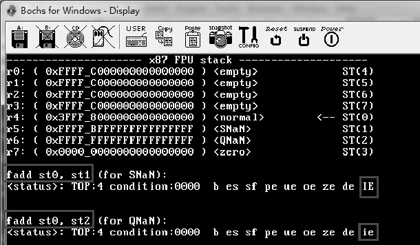

我们看到, FADD 指令使用 SNaN 操作数会产生 #IA 异常, 而使用 QNaN 操作数并没产生 #IA 异常. 注意 IE 位是 sticky 位, 需要手动去清标志位(可以使用 fclex 指令)​.

# 4. #D 异常

在下面的情形里, 会产生 #D(denormal operand)异常.

1) 当 load 一单精度或双精度 denormal 浮点数时.

2) 当 arithmetic 类指令的操作数属于 denormal 类型时.

在 load 操作时, 这个浮点数如果是 80 位的 denormal 类型, 是不会产生 #D 异常的.

```assembly
fld DWORD [denormal]  ; 加载一个单精度的 denormal 浮点数, 产生 #D 异常
fld QWORD [denormal]  ; 加载一个双精度的 denormal 浮点数, 产生 #D 异常
fld TWORD [denormal]  ; 加载 80 位的扩展双精度 denormal 浮点数, 不会产生 #D 异常
```

在 load 单精度或双精度 denormal 数时产生 #D 异常. 当 #D 被屏蔽时, x87 FPU 自动转换为一个 normal 类型的扩展双精度数, 如下所示.

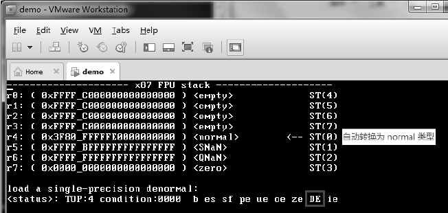

然而, 当 load 一个扩展双精度 denormal 数时, ST(0)当前是 denormal 类型, 但不产生 #D 异常. 当我们执行 fadd 指令, 其中一个操作数是 denormal 数时, 如下列代码:

```assembly
fadd st0,st3     ; 当前 ST(0)为 denormal, 产生 #D 异常
```

当前的 ST(0)为 denormal 数, ST(3)为 0 值, 这两个数相加会产生 #D 异常, 如下所示.

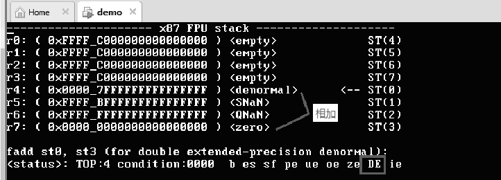

# 5. #Z 异常

当执行一条除指令, 源操作数为 0 时, 会产生 #Z(divide-by-zero)异常.

```assembly
fdiv st0,st4
```

如果 ST(4)里的值为 0, 这条指令将产生 #Z 异常. FYL2X 和 FXTRACT 指令也可以产生 #Z 异常.

值得注意的是, 如果一个 QNaN 数除 0, 将不会产生 #Z 异常, 而是以 QNaN 数返回到目标 stack 寄存器里.

# 6. #O 与 #U 异常

#O,#U 异常都是指示指令的结果值出现了不正确的情形.

① #O(numeric overflow, 值上溢异常)​: 舍入结果值超出了目标格式的最大值, 产生 #O 异常.

② #U(numeric underflow, 值下溢异常)​: 舍入结果值超出了目标格式的最小值, 产生 #U 异常.

当 #O 和 #U 异常被 masked 时, 需要 #P 异常同时产生处理器才会报告 #O 异常或 #U 异常. 因此, masked #O 或 #U 异常与 #P 异常一起引发. 那么, 当运算结果没发生 round(舍入)而超过了目标格式的最大 / 最小值时,#O 或 #U 不会被引发. 下面是典型的例子.

```assembly
fld TWORD [infinite]    ; 加载 infinite(无穷大)数
fldz         ; 加载 zero 值
fadd st0,st1      ; 0 加无穷大数, 结果为 infinite 值, 没产生 #O 异常
```

在上面的代码里, 使用 zero 加上无穷大的数, 其结果是无穷大数, 这里并没有产生 #O 异常和 #P 异常(没有 rounded)​. 可是, 对于 non-masked(未屏蔽的)#O 或 #U 异常,#O 与 #U 异常可能不会与 #P 异常一起产生.

在下面的扩展双精度浮点数相加中, 就会产生 #O 异常和 #P 异常.

* `1.1 × (2 ^ 16383) + 1.0 × (2 ^ 16382)`

`1.1 × (2 ^ 16383)` 的扩展双精度值是 `0x7FFE_C0000000_00000000`, 而 `1.0 × (2 ^ 16382)` 的扩展双精度值是 `0x7FFD_80000000_00000000`, 这个式子相加过程中 significand 部分将超出 64 位精度产生 rounded 操作, 结果值为 infinite, 从而产生 #O 和 #P 异常.

执行 FST/FSTP 指令 store 单精度或双精度格式时, 也会产生 #O 或 #U 及 #P 异常.

## 6.1. #O 异常的临界值

当目标格式所能表达的最大值, 实际上就是当一个舍入结果值大于或等于 infinite 时, 就会引发 #O 异常, 如下表所示.

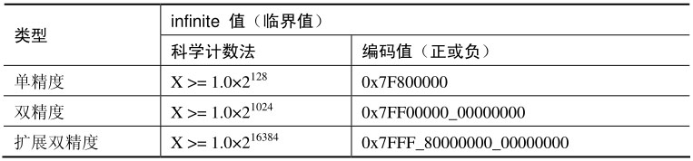

关于浮点数的更多信息, 请参考 1.2.2 节所述.

当目标格式 rounded 的结果值 X 大于或等于上面所列出的 infinite(无穷大)值时就会产生 #O 异常. 这个 infinite 值包括: 正无穷大和负无穷大.

典型地, 对于单精度和双精度浮点数, 我们可以使用 FST/FSTP 指令 store 往内存 (单精度或双精度格式) 产生 #O 和 #P 异常.

关于浮点数格式的转换, 详见 1.2.5 节所述.

看看下面使用 FST 指令产生 #O 异常的例子.

* 例 1: 将 stack 寄存器中的值 (2^128) 以单精度格式 store 在内存.

(2^128) 是单精度的 infinite 值, 它在 stack 寄存器中以扩展双精度格式存在, 那么这个值的扩展双精度编码值为 0x407F_80000000_00000000(扩展双精度值)​.

```assembly
       fld TWORD [infinite32]   ; 加载单精度的无穷大数 2^128 值
       fst DWORD [f]     ; 以单精度格式保存在内存中
       call dump_data_register   ; 打印信息
       call println
       call dump_x87_status   ; 打印 status
       ... ...
;; 80 位扩展双精度编码值(2 ^ 128)
infinite32 dd 0
               dd 0x80000000
               dw 0x407f    ; 128 + 16383=0x407f(扩展双精度的 exponent)
```

我们将单精度的 infinite(以扩展双精度编码值形式)加载到 stack 寄存器, 然后再 store 往内存, 打印出信息. 结果如下所示.

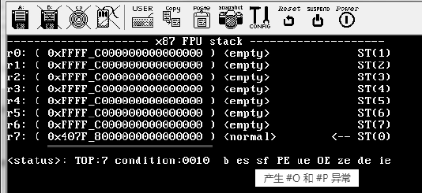

我们看到 stack 寄存器中的扩展双精度转换为单精度 rounded 的值等于单精度的 infinite 时产生了 #O 异常, 同时也产生了 #P 异常.

## 6.2. #U 异常的临界值

#U 异常的临界值来自于目标格式所能表达的最小值, 如下表所示.

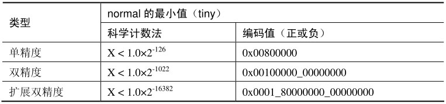

关于浮点数的更多信息, 请参考 1.2.2 节所述.

在最小值里, 它的 exponent(指数)部分为 1,significand 部分为 1.0(单精度和双精度的 J-bit 位隐含)​. 注意这里的条件是, X 需要小于最小值.

当舍入的结果值小于上面的 tiny 值时就会发生 underflow 异常. 同样, 我们看看下面产生 #U 异常的例子.

* 例 2: 将 stack 寄存器中的值 `(1.00...001 × (2 ^ -127))` 以单精度格式 store 在内存.

值得注意的是,`(1.0 × (2 ^ -127))` 值并不能使 FST 指令产生 underflow 异常(并没有发生舍入)​, 因此这里使用 `(1.00...001 × (2 ^ -127))`(bit 0 位为 1)​, 它的编码值为 0x3F80_80000000_00000001(扩展双精度格式)

```assembly
       fld TWORD [minimun32]   ; 加载单精度最小值 2^-127
       fst DWORD [f]     ; 以单精度格式保存在内存中
       call dump_data_register   ; 打印信息
       call println
       call dump_x87_status   ; 打印 status
       ... ...
;; 80 位扩展双精度编码值(2 ^ -127)
minimun32  dd 1     ; bit 0=1
           dd 0x80000000
           dw 0x3F80    ; -127 + 16383=0x3F80(扩展双精度的 exponent)
```

关于精度转换的 underflow 更多的信息请参考 1.2.6 节所述.

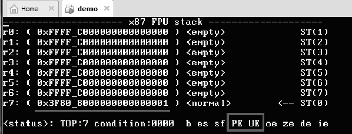

我们看到, 这条 FST 指令产生了 #U 和 #P 异常.

## 6.3. #P 异常的产生

当执行一个 x87 FPU 浮点数操作, 目标格式的 precision 不能表达结果值时, 意味着结果值是 inexact result(不精确的结果)​. 这将产生 round(舍入)操作, x87 FPU 将标记为 #P(percision)异常. 因此,#P 异常将与 round(舍入)行为同时产生.

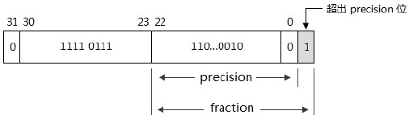

inexact result 发生在结果值的 fraction(小数)部分超出了目标格式的 precision 位数, 如上所示, 单精度格式 percision 为 23 位, 结果值的 fraction(小数)部分有 24 位. 目标格式的 precision 位数如下表所示.

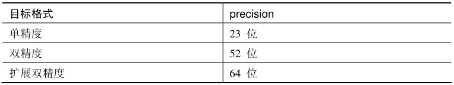

如果超出精度的 fraction 部分不为 0, 那么这个超出精度的位将会发生 round(舍入)操作来达到在 precision 范围内.

# 7. 舍入

在舍入操作中, 有两种舍入结果.

1) 向上舍入.

2) 不向上舍入.

当发生 #P 异常时, 在 x87 FPU 的 stack 寄存器 C1 条件码记录着这个结果, C1 为 1 时指示发生向上舍入. C1 为 0 时, 指示没有向上舍入. 这两种结果如下所示.

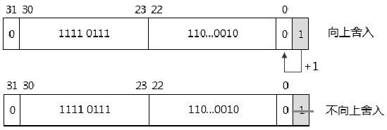

产生哪个舍入结果依赖于选择的舍入方式, IEEE754 定义了 4 种舍入的模式.

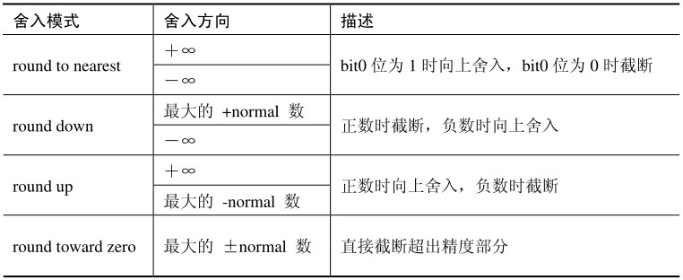

## 7.1. round to nearest 模式

实际上在这种舍入模式里, bit0 位的值始终为 0, 有下面的两种情形.

1) 当 bit0 为 1 时, 将向上舍入, 如下所示.

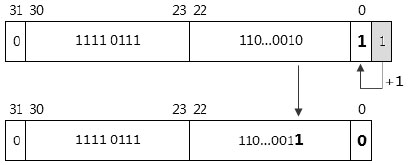

这个舍入等同于加 1, 结果导致 bit0 为 0, 向前进 1 位.

2) 当 bit0 为 0 时, 将不向上舍入(截断)​, 如下所示.

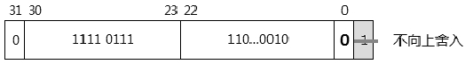

这个舍入还是维持 bit0 为 0, 直接截断超出精度部分, 精度的值维持不变.

在这种模式里并不区分正方向和负方向, 正数和负数的操作是相同的.

## 7.2. round down 模式

在负数里, round down 模式将朝 infinite 值舍入; 在正数里, 将朝最大的 finite 数 (即最大的 normal 值) 舍入. 因此, 它也有两种情形.

1) 正数时截断, 如下所示.

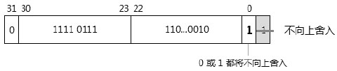

在正数里, 无论 bit0 是 0 还是 1, 都将不向上舍入, 直接截断超出部分.

2) 负数时向上舍入, 如下所示.

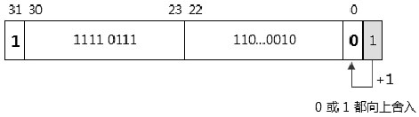

为负数时, 无论 bit0 是 0 还是 1, 都将向上舍入(等同于加 1)​.

## 7.3. round up 模式

与 round down 模式刚好相反, 它也区分正数和负数两种情形, 如下所示.

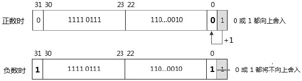

我们看到, 在正数时向上舍入, 负数时不向上舍入(截断)​.

## 7.4. round toward zero 模式

最后, 在 round toward zero 模式里, 无论是正数还是负数都不向上舍入.


这种舍入模式是最简单的一种, 任何情况下都将直接截断超出精度的 fraction 部分.

## 7.5. 舍入控制

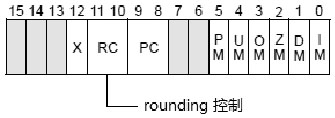

control 寄存器的 bit11～bit10 是 RC(舍入控制)位. 它有 4 个值, 对应于 IEEE754 定义的 4 种舍入模式.

1) 00B: 选择 round to nearest 模式.

2) 01B: 选择 round down 模式.

3) 10B: 选择 round up 模式.

4) 11B: 选择 round toward zero 模式.

软件可以使用 FLDCW 或 FLDENV 指令来修改 control 寄存器的值, 如以下代码所示.

```assembly
fstcw WORD [control_word]    ; 得到 control 寄存器值
and WORD [control_word],0xF3FF   ; 清 RC 位
or WORD [control_word],0x800   ; 使用 round up 舍入模式
fldcw WORD [control_word]    ; 设置 control 寄存器
```

这段代码将使用 round up 舍入模式, 意味着在正数里当超出精度位为 1 时向 bit0 位舍入.