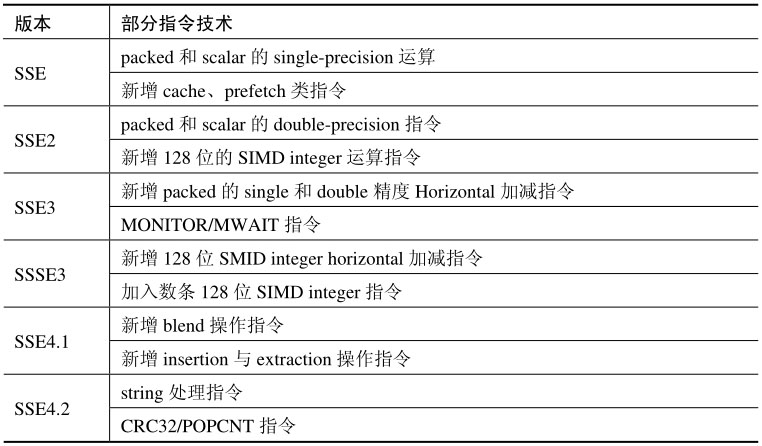

Intel 继 MMX 技术之后, 在 Pentium Ⅲ 处理器上接着发布了 SSE(Streaming SIMD Extension)指令集, 此后, Intel 继续推进 SIMD 指令规格, SIMD 技术得到了快速发展.

SSE 系列指令一共经历了 6 个版本, 这些 SSE 相对于最初的 SIMD 指令(即 MMX 指令)​, 不断地加入了新的技术, 如下表所示.

SSE 4.2 指令是 SSE 系列的最后一个版本. 在 SSE 4 指令集之后, Intel 和 AMD 都另辟天地了, Intel 开创了 AVX 与 FMA3 指令集, AMD 则效仿 Intel 开创了 XOP 与 FMA4 指令集. 当然, AVX/FMA 和 XOP 指令可以说是在被抛弃的 SSE5 基础上演变或扩展而来的.

# 与 MMX 环境的不同

SSE 系列指令使用全新的执行单元和环境, 不同于 MMX 指令与 x87FPU 指令共用同一环境(除 SSE 系列的部分 64 位 SIMD integer 指令还需要使用 MMX 寄存器外)​.

MMX 指令只是单调地处理 64 位的 SIMD integer 数据. 而我们看到, 随着不断地增强, 整个 SSE 系列 (从 SSE 到 SSE 4.2) 已经支持很多种操作模式.

1) packed 和 scalar 的 single 与 double 精度数据的操作.

2) 64 位与 128 位的 SIMD integer 数据的操作.

3) 支持 floating-point 与 integer 的 Horizontal 处理指令.

4) 支持对数据进行 shuffle, blend, insertion, 以及 extraction 处理.

5) 额外增加了一些非 SIMD 数据处理指令: cache 类, MONITOR/NWAIT, CRC32/POPCNT 等有用的指令.

除此之外, SSE 系列指令还有很强大的 Load/Store 和 Move 类数据传送指令, 以及数据转换类指令. SSE 的这些指令使得可以高效地处理各种数据.
