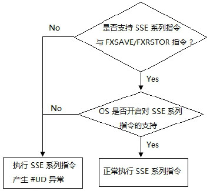
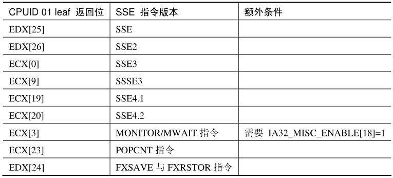
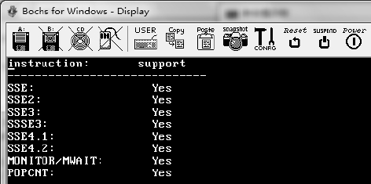
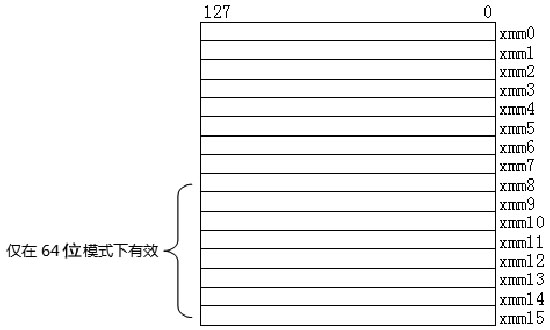
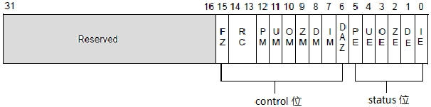
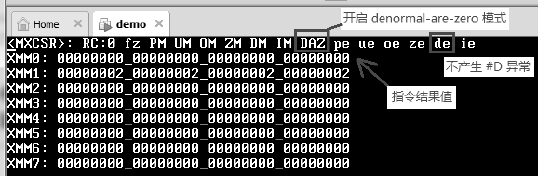
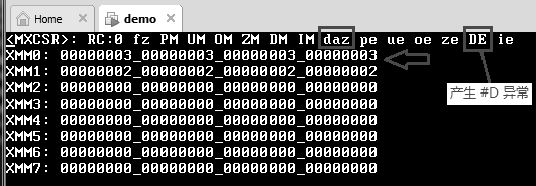
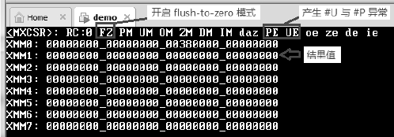
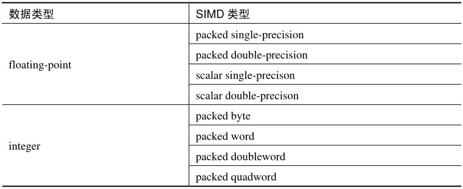

# 概述

由于使用了全新环境, 因而处理器需要为 SSE 系列指令提供可执行的平台环境, 同时还需要保持向下的兼容性. 在 x86/x64 平台上, 软件在使用新功能时应该先检测处理器是否支持.

从 SSE 系列指令开始, 处理器提供了另一个机制, 分开了两个支持环境.

1) 由处理器提供物理支持.

2) 由 OS 提供软件支持.

与 x87 FPU 与 MMX 指令环境不同, SSE 系列指令需要 OS 提供额外的软件环境. 少了上面的任何一个支持要素, 软件都不能使用 SSE 系列指令. SSE 系列指令执行产生两种结果, 如下所示.



无论是处理器不支持, 或者是 OS 不支持, 执行任何一条 SSE 系列指令都将产生 `#UD` 异常.

# 处理器对 SSE 指令的支持

软件在使用前, 特别是 OS 软件在开启 SSE 指令支持环境时, 应检查处理器是否提供物理上的支持. 用户软件和 OS 软件都可以使用 CPUID 指令来查询 01 leaf, 从返回的 ECX 与 EDX 寄存器相关位来检测处理器是否支持, 如下表所示.



MONITOR/MWAIT 与 POPCNT 虽然是 SSE 系列指令, 但需要另外检测. 只有当 IA32_MISC_ENABLE 寄存器的 bit 18 位为 1 时, 才可以使用 `CPUID.01:ECX[3]` 位检测到 MONITOR/MWAIT 指令是否支持.

我们可以写一个简单的示例来显示处理器对这些指令的支持, 下面是使用 dump_sse_support() 函数打印出来的结果(dump_sse_support() 函数实现在 `lib\cpuid.asm` 模块里).



在 AMD Bulldozer 微架构之前的处理器上并不支持 SSE4.1 和 SSE4.2 指令, 可是加入了 SSE4a 指令集(这是 Intel 处理器没有的), 从 Bulldozer 后完整地支持了全系列的 SSE 指令集.

OS 在开启 SSE 系列指令支持前, 也必须通过 `CPUID.01:EDX[24]` 位来检测处理器是否支持 FXSAVE 与 FXRSTOR 指令.

软件可以使用 FXSAVE 指令保存 x87 FPU, MMX 及 SSE 指令的 state 信息, 使用 FXRSTOR 指令恢复 x87 FPU,MMX 及 SSE 指令的 state 信息.

# 128 位的 XMM 寄存器

从 SSE 指令开始引入了 128 位的 SIMD 数据操作, 由此增添了 128 位全新的 XMM 寄存器, 如下所示.



共 16 个 XMM 寄存器, XMM0~XMM15, 其中 XMM8~XMM15 仅在 64 位模式下有效. 不像 MMX 指令与 x87 FPU 单元共用同一物理资源, 这些 XMM 寄存器是独立的.

在 64 位模式下, 软件可以使用全部的 16 个 XMM 寄存器. 指令 encode 中的 REX prefix 提供对扩展的 XMM 寄存器寻址.

# MXCSR

SSE 系列指令使用 MXCSR 作为 SSE 指令环境的 control 与 status 寄存器, 如下所示.



我们看到 32 位的 MXCSR 分为两部分: status 位与 control 位, 将 x87 FPU 单元的 status 寄存器与 control 寄存器结合起来. bit 0~bit 5 对应着 x87 FPU 单元 status 寄存器的部分状态位, bit 6~bit 15 对应 x87 FPU 单元 control 寄存器的部分控制位.

## Status 位(bit5~bit0)

如同 x87 FPU 单元, 这 6 个状态位是 SSE 系列指令的 numeric-exception 位, 也就是浮点异常标志位.

1) IE(#I 异常位): 置位时, 指示产生 Invalid operation 异常.

2) DE(#D 异常位): 置位时, 指示产生 Denormal operand 异常.

3) ZE(#Z 异常位): 置位时, 指示产生 Divide-by-zero 异常.

4) OE(#O 异常位): 置位时, 指示产生 numeric overflow 异常.

5) UE(#U 异常位): 置位时, 指示产生 numeric underflow 异常.

6) PE(#P 异常位): 置位时, 指示产生 Inexact result for percision 异常.

同样, 这些异常标志位也是 "sticky", 一旦置位需要软件进行显式清位. 这些异常可以被 masked(屏蔽)使用 MXCSR 的相应异常 mask 位. 关于浮点异常的相关信息请参考 20.2 节所述.

与 x87 FPU 单元的浮点异常不同的是, SSE 系列的 #I 异常并没有 #IA(Invalid arithmetic operand)和 #IS(Stack overflow or underflow)异常之分.

## control 位(bit15 ~ bit6)

MXCSR 的 control 位分为下面几部分.

1) 异常 mask 位(bit7~bit12): 置位时相应的浮点屏常将被屏蔽.

2) Denormal-Are-Zero 位(bit6): 当指令的操作数是 denormal 数时, 操作数被将置为 ±0 值(符号位是操作数的符号位).

3) Flush-To-Zero 位 (bit15): 当指令的结果产生 #U(numeric underflow) 时, 如果 #U 异常被屏蔽则处理器将结果置为 ±0 值(符号位是结果值的符号位)

4) Rounding Control 位(bit14 ~ bit15): 这是 SIMD numeric 的舍入控制位, 与 x87 FPU 单元 control 寄存器的舍入控制是同一个意义, 详情请参考 20.2.7 节所述.

## denormal-are-zero 模式

当 DAZ 位 (bit6) 置位时, 128 位 SIMD 单元使用 denormal-are-zero 模式, 在 numeric 运算里(即 floating-point 运算), 当指令的操作数属于 denormal 数时, 操作数将被置为 0 值后再进行运算, 如下面代码所示.

```
movups xmm0, [a]    ; a 的值为 00000001_00000001_00000001_00000001
movups xmm1, [b]   ; b 的值为 00000002_00000002_00000002_00000002
addps xmm0, xmm1   ; 两个 packed sigle-percision 值相加
```

a 和 b 的值都是 denormal 数, 那么 addps 指令的两个操作数 xmm0 和 xmm1 都是 denromal 数. 指令执行后, 目标操作数 xmm0 寄存器最终值为 00000000_00000000_00000000_00000000, 如下所示.



我们看到, 在 denormal-are-zero 模式下, 在属于 denormal 操作数时, 无论 #D 异常是否被屏蔽, 都不会产生 #D(denormal operand)异常.



在非 DAZ 模式里, addps 指令的执行产生了 #D 异常, 结果值 (XMM0 寄存器) 是相加后的结果.

## flush-to-zero 模式

当 bit15 位置位时, 开启 flush-to-zero 模式. 然而, flush-to-zero 模式的使用只有在 #U 异常被屏蔽的情况下才有效.

当开启 flush-to-zero 模式并且 #U 异常被屏蔽时, 如果指令的结果产生 underflow 溢出, MXCSR 寄存器的 UE 位与 PE 都被置位, 指示发生了 #U 异常和 #P 异常. 结果值被置为 0.

```
movupd xmm0, [a]   ; a 为 double-precision 值 1.0 × 2-127
cvtpd2ps xmm1, xmm0  ; double-precision 转换为 single-precision
```

上面代码使用 CVTPD2PS 指令将双精度数 2-127 转化为单精度数, 这已经产生了 #U 异常.



在上面的图里, 开启 flush-to-zero 模式后, CVTPD2PS 指令执行产生了 #U 异常, 结果值被置为 0.

## MXCSR 寄存器的读 / 写

软件通过使用 STMXCSR 指令将 MXCSR store 在内存里, 使用 LDMXCSR 指令从内存里 load 到 MXCSR 的方法来读 / 写 MXCSR.

```
stmxcsr [esp]    ; 读 MXCSR
bts DWORD [esp], 6   ; DAZ=1
ldmxcsr [esp]    ; 写 MXCSR
```

上面这段代码将 MXCSR.DAZ 位置位, 开启 denormal-are-zero 模式.

# SIMD 数据类型

SSE 系列指令能处理两大类 SIMD 数据: floating-point(或称 numeric)与 integer 类型, 如下表所示.



floating-point 类型的 SIMD 数据按 packed(或称 vector)与 scalar 来组合. 在 packed 类型的处理中, 每个 single-precision 或 double-precision floating-point 数据都参与操作. 而在 scalar 类型处理中, 仅使用低位的 single/double-precision floating-point 值. 关于 SIMD 数据另参考 1.2.8 节所述.