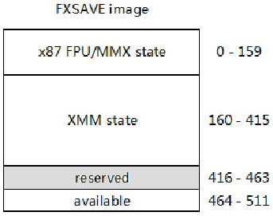
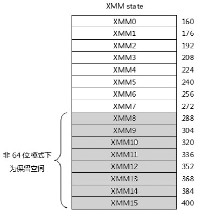
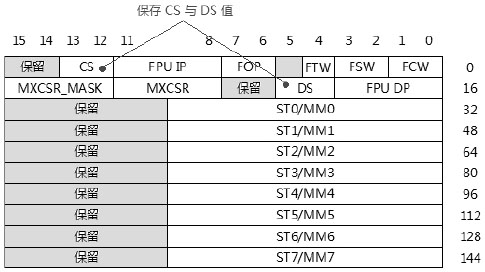
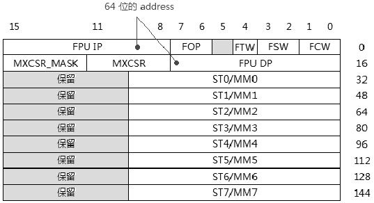
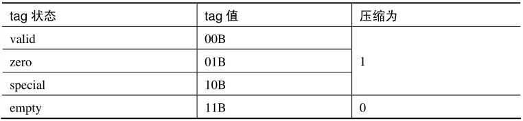
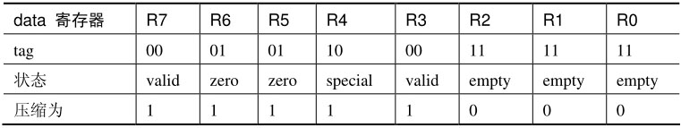
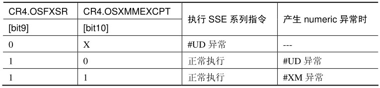
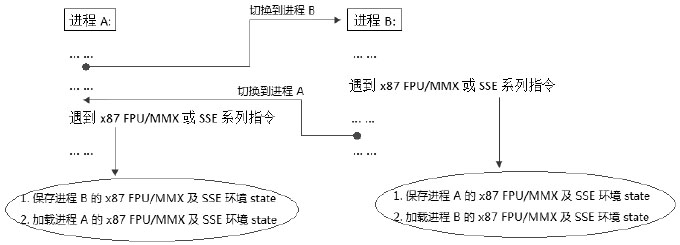

软件能够执行 SSE 系列指令, OS 必须提供一个 SSE 系列指令可使用的操作环境, OS 软件需要做一些环境设置工作, 包括:

① 检测 SSE 系列指令的支持度, SSE～SSE4.2, 以及 FXSAVE 与 FXRSTOR 指令.

② 对 SSE 执行环境进行必需的设置, 提供 SSE 系列指令的 State(状态)信息环境以供 SSE 环境 context 的切换.

③ 提供 SIMD numeric 异常处理机制和 #XM 异常 handler 程序.

④ 提供必要的 non-numeric 异常支持, 例如 #GP,#PF,#UD 等异常 handler 支持.

# SSE 系列指令支持

软件使用 CPUID 指令的 01 leaf, 从返回的 ECX 与 EDX 寄存器的相应位可以查看处理器对 SSE 系列指令的支持度, 正如前面 21.1.1 节所介绍. 后面版本还需要对前面版本的 SSE 指令的依赖, 尽管不太可能出现支持 SSSE3 指令而不支持 SSE3 指令的情况, 然而 Intel 推荐的检测步骤如下.

## 检测 SSE 与 SSE2 指令支持

SSE 指令需要 CPUID.01:EDX[25]=1,SSE2 指令需要 CPUID.01:EDX[26]=1.

## 检测 SSE3 指令支持

先检测上面的 SSE 与 SSE2 指令的支持, 然后再检测 SSE3 指令支持, 需要 CPUID.01:ECX[0]=1, 而 SSE3 加入的 FISTTP 指令仅需要检测 SSE3 支持就可以了.

SSE3 加入的 MONITOR 与 MWAIT 指令仅需要检测 CPUID.01:ECX[3]=1.

## 检测 SSSE3 指令支持

先检测 SSE 与 SSE2 指令的支持, 然后再检测 SSSE3 指令的支持, 需要 CPUID.01:ECX[9]=1.

## 检测 SSE4.1 指令支持

先检测 SSE 与 SSE2 指令的支持, 还需要检测 SSE3 与 SSSE3 指令的支持. 最后检测 SSE4.1 指令的支持, 需要: CPUID.01:ECX[19]=1.

## 检测 SSE4.2 指令支持

SSE4.2 指令加入了 4 条 string 处理指令(PCMPxSTRx 指令)​,1 条 SIMD integer 比较指令 PCMPGTQ 和 CRC32 与 POPCNT 指令.

PCMPxSTRx 指令与 PCMPGTQ 指令需要分别检测 SSE,SSE2,SSE3,SSSE3,SSE4.1 指令的支持, 然后到 SSE4.2 的支持: CPUID.01:ECX[20]=1.

CRC32 指令仅需检测 SSE4.2 指令的支持, 而 POPCNT 指令需要 SSE4.2 的支持, 以及 POPCNT 指令的支持(需要 CPUID.01:ECX[23]=1)​.

# SSE 系列指令 State 信息

SSE 系列指令的执行环境包括了 16 个 XMM 寄存器和 MXCSR, 因此指令的 state 信息保存在这些 XMM 寄存器和 MXCSR 里.

软件可以选择使用两种方法来保存和恢复 SSE 系列指令的 state 信息.

① 仅保存 XMM 寄存器和 MXCSR 的 state.

② 使用 FXSAVE 和 FXRSTOR 指令来保存和恢复 SSE 系列指令的 state 信息.

FXSAVE 指令保存的内存 image 将包括 x87 FPU 环境 state 信息 (包括 MMX 环境 state 信息) 和 SSE 系列指令环境 state 信息. 同样地, FXRSTOR 指令也将恢复 x87 FPU 与 SSE 系列指令的 state 信息.

## 保存 XMM 与 MXCSR 信息

软件可以使用 MOVDQU 或 MOVDQA 指令来逐个 store 与 restore XMM 寄存器值, 在 64 位模式下可以保存 16 个 XMM 寄存器. 使用 STMXSCR 指令来 store MXCSR,LDMXCSR 指令来 restore MXCSR.

如以下代码保存 SSE state 信息.

```assembly
store_sse:
      movdqu [XMM0_IMAGE],xmm0   ; store XMM0 寄存器
      ... ...
      movdqu [XMM7_IMAGE],xmm7   ; store XMM7 寄存器
      stmxcsr [MXCSR_IMAGE]    ; store MXCSR
```

下面的代码恢复 SSE state 信息.

```assembly
restore_sse:
      movdqu xmm0,[XMM0_IMAGE]   ; restore XMM0 寄存器
      ... ...
      movdqu xmm7,[XMM7_IMAGE]   ; restore XMM7 寄存器
      ldmxcsr [MXCSR_IMAGE]    ; restore MXCSR
```

这种 store 和 restore 方式一般使用在需要临时保存 SSE state 信息的情景, 例如进入中断 handler 需要保存 SSE state 信息时.

## 使用 FXSAVE 与 FXRSTOR 指令

FXSAVE 指令保存 x87 FPU 与 SSE 环境的 state 信息. 值得注意的是, 使用 FSAVE/FNSAVE 指令保存的 x87 FPU 单元 state 信息与 FXSAVE 指令所保存的 x87 FPU 单元 state 信息是不同的.



如上所示, FXSAVE 和 FXRSTOR 指令 store/restore 的内存 image 共 512 个字节.

① 0～159 字节是 x87 FPU 与 MMX 的 state 信息, 其中也包括 MXCSR 的值.

② 160～415 字节是 16 个 XMM 寄存器的值, 共 256 个字节.

③ 416～463 字节是保留空间, 共 48 个字节. 而 464～511 字节是空闲, 可供软件使用, 处理器执行 FXSAVE 指令时, 并不会写此空间.

值得注意的是, FXSAVE 和 FXRSTOR 指令使用的内存 image(首字节)必须在 16 字节边界上对齐, 否则会产生 #GP 异常.

FXSAVE 与 FXSRTOR 的 image 因处理器工作模式和 operand-size 的不同存在 3 个版本.

① 在非 64 位模式下的 image.

② 64 位模式下 64 位操作数的 image.

③ 64 位模式下 32 位操作数的 image.

### XMM state 空间

在非 64 位模式 (legacy 及 compatibility 模式) 只保存 8 个 XMM 寄存器(XMM0～XMM7)​, 那么接下来的 8 个 XMM 寄存器空间将是保留域(288～415 字节)​, 如下所示.



而在 64 位模式下(包括 64 位和 32 位操作数)​, 处理器将保存全部的 16 个 XMM 寄存器.

### 64 位模式下的 FXSAVE 与 FXRSTOR 指令

在 64 位模式下 FXSAVE 与 FXRSTOR 指令的 default operand-size(默认操作数大小)是 32 位, 为了使用 64 位的操作数, 软件可以手工加上 REX prefix, 并且 REX.W=1 使用 64 位操作数.

```assembly
DB 0x48      ; REX.W=1
fxsave [rax]    ; store 64 位模式的 image
```

也可以使用 Intel 提供的伪 opcode 指令 FXSAVE64(在 AMD 里并没有看到相关说明)​, 代码如下.

```assembly
fxsave64 [rax]    ; store 64 位模式的 image
```

使用这两种方式结果是完全一样的, FXSAVE64 指令等于加上 REX prefix(REX.W=1)前缀的 FXSAVE 指令. 编译器会译出完全相等的 encode(机器编码)​. 使用 FXSAVE64 形式显得更直观易懂, 更形象.

```assembly
DB 0x48      ; REX.W=1
fxrstor [rax]    ; restore 64 位模式的 image: 或
fxrstor64 [rax]    ; 结果是一样的
```

同样, 如上面代码所示, Intel 也提供了 FXRSTOR64 指令, 与 FXRSTOR 指令加上 REX prefix 的结果是一样的.

### x87 FPU/MMX state 空间

非 64 位模式与 64 位模式除了保存的 XMM 寄存器数不同外, 它们的 x87 FPU/MMX state 保存区域也有所区别.



上图是在非 64 位模式下 (legacy 模式和 compatibility 模式) 的 x87FPU 与 MMX 环境的 state 信息, 这个 image 也同样适用于 64 位模式下的 32 位操作数 (FXSAVE 指令无 REX prefix 或 REX.W=0) 情况下的 state image, 这些信息如下.

① FCW(FPU control word)​:0～1 字节.

② FSW(FPU status word)​:2～3 字节.

③ FTW(FPU tag word)​: 只有 1 个字节, byte 5 是保留字节.

④ FOP(FPU last instruction opcode)​:6～7 字节.

⑤ FIP(FPU last instruction pointer)​:8～11 字节.

⑥ CS(FPU last instruciton CS)​:12～13 字节.

⑦ FDP(FPU last instruction operand pointer)​:16～19 字节.

⑧ DS(FPU last instruction operand DS)​:20～21 字节.

⑨ MXCSR 寄存器 image:24～27 字节.

⑩ MXCSR_MASK 值: 28～31 字节.

在 64 位模式下使用 FXSAVE64 指令保存 state 的内存 image, 如下所示.



上面两幅图的区别在于, 使用 64 位操作数不保存 CS 与 CS 值, 并且 FPU IP 与 FPU DP 保存为 64 位值.

FXSAVE/FXSAVE64 指令只保存 x87 FPU Tag word 时, tag word 寄存器被压缩为 1 个字节, 也就是 2 位压缩为 1 位, 如下所示.



例如: x87 FPU tage 寄存器值为 163Fh, 指示 x87 FPU data 寄存器的状态如下.



FXSAVE 保存在内存 image 中的 tag word 值将是 F8h. 而执行 FXRSTOR 指令进行 restore 时, x87 FPU 的 tag 寄存器根据 image 中的 tag word 值进行解压缩. 处理器将自动检查对应的 x87 FPU data 寄存器的值, 设置正确的 tag 值.

### MXCSR_MASK 值

32 位的 MXCSR 中有部分位是保留的, 当写这些保留位时会产生 #GP 异常. MXCSR_MASK 值的作用是检查哪些位是保留位(为 0 是保留位)​, 哪些位是可用位(为 1 是可用位)​.

读 MXCSR_MASK 的值需要使用 FXSAVE 指令保存在内存 image 中, 然后从 image 中读取, Intel 推荐在 store 前先清 512 个字节的 image 全部为 0 值.


上图中的 MXCSR_MASK 值是从 image 中读取出来, 它的值为 0000FFFFh. 它表示 MXCSR 的 bit 0～bit 15 是可用的, 而 bit 16～bit 31 是保留位.

如果读出来的值为 00000000H, 那么代表着 MXCSR_MASK 有一个默认的值为 0000FFBFh, 它表示 bit 6 是保留位(即 denormal-are-zero 位是保留不可用的)​.

# SSE 系列指令环境的设置

检测到处理器支持一系列的 SSE 指令后, OS 也要开启支持环境, 需要设置 CR4 与 CR0 的相关控制位.

## CR4 的设置

CR4 的 bit 9 是 OSFXSR 控制位, 置位将允许软件使用 FXSAVE 与 FXRSTOR 指令 store 与 restore 状态信息. bit 10 是 OSXMMEXCPT 控制位, 允许产生 numeric 异常时调用 #XM 异常 handler.



CR4.OSFXSR=0 时, 执行 SSE 系列指令将会产生 #UD 异常, 而 CR4.OSXMMEXCPT=0 时, SSE 系列指令产生 numeric 异常时将调用 #UD 异常 handler.

因此, OS 软件应该置 CR4 的 OSFXSR 与 OSXMMEXCPT 控制位为 1 值, 保证 SSE 系列指令能够得到正确执行.

CR0 的设置 CR0 的 EM,MP 及 TS 控制位同样对 SSE 系列指令环境起作用.

① CR0.EM=1 时, 执行 SSE 系列指令将会产生 #UD 异常.

② CR0.MP 位用来监控 FWAIT/WAIT 指令的执行. 当 CR0.MP=1 时执行 FWAIT/WAIT 指令将产生 #NM 异常.

③ CR0.TS 位用来设置在任务切换时对 SSE 系列指令环境产生 context 延时切换.

关于 CR0.EM,CR0.MP 及 CR0.TS 的更多信息请参考 20.6.1 节所述. 因此, OS 软件对这些控制位的推荐设置如下.

① CR0.EM=0: 允许执行 x87 FPU,MMX 及 SSE 系列指令.

② CR0.MP=1: 允许监控 FWAIT/WAIT 指令的执行.

③ CR0.TS: 在进行进程切换时, OS 的切换程序设置 TS 位从而使软件遇到第 1 条 x87 FPU,MMX 或者 SSE 系列指令时产生 #NM 异常.

## MXCSR 的设置

在处理器 power-up 或 reset 时, MXCSR 的值为 1F80H, 也就是除了所有的异常 mask 位置位, 其他都为 0, 这个默认的值已经能够很好地工作了.

软件可以选择开启 DAZ(denormal-are-zero)位或 FZ(flush-to-zero)位, Intel 提到 DAZ 位可能在某些实现上不支持, 因此在设置 DAZ 位时应通过读取 MXCSR_MASK 值来确定处理器是否支持.

# x87 FPU/MMX 与 SSE 环境的延时切换

假设有两个进程: 进程 A 与进程 B.OS 需要在这两个进程里进行切换, 如下所示.



在 x87 FPU/MMX 与 SSE 环境的延时切换里, 从进程 A 切换到进程 B 时, OS 的切换程序不进行立即的 state 信息切换, 而是将 CR0.TS 置位.

进程 B 运行直至遇到第 1 条 x87 FPU 指令, MMX 指令或者 SSE 系列指令时, 由于 CR0.TS=1 而产生 #NM 异常, 在 #NM 异常 handler 里负责清 CR.TS 控制位, 而进行进程 A 与进程 B 的 state 信息切换.

同样, 当从进程 B 切换到进程 A 时, OS 切换程序负责将 CR0.TS 置位, 进程 A 运行直至遇到第 1 条 x87 FPU/MMX 指令或 SSE 系列指令时产生 #NM 异常, 在 #NM 异常 handler 里进行 state 的切换.

在 20.6.1 节里, 以及实验 20-6 里, 我们已经了解过 x87 FPU 与 MMX 的延时切换. 当处理器支持 SSE 系列指令, 并且 OS 已经开启对 SSE 系列指令的支持 (即 CR4.OSFXSR=1) 时, 在这个 state 的切换里, 我们需要使用 FXSAVE 与 FXRSTOR 指令来代替 x87 FPU 单元的 FSAVE/FNSAVE 与 FRSTOR 指令.