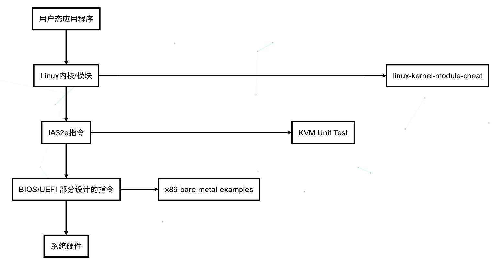

<!-- @import "[TOC]" {cmd="toc" depthFrom=1 depthTo=6 orderedList=false} -->

<!-- code_chunk_output -->

- [1. 学习内容](#1-学习内容)
  - [1.1. BIOS/UEFI 部分设计的指令](#11-biosuefi-部分设计的指令)
  - [1.2. IA32e 指令](#12-ia32e-指令)
  - [1.3. Linux 内核/模块](#13-linux-内核模块)
- [2. 如何利用 QEMU 学习](#2-如何利用-qemu-学习)
  - [编译生成内核文件](#编译生成内核文件)
  - [在虚拟机中作为内核直接运行(-kernel)](#在虚拟机中作为内核直接运行-kernel)
  - [制作一个镜像文件, 并且使用 QEMU 启动](#制作一个镜像文件-并且使用-qemu-启动)
- [调试虚拟机代码](#调试虚拟机代码)
- [3. 参考](#3-参考)

<!-- /code_chunk_output -->

# 1. 学习内容



上图用户层应用程序以及硬件部分暂不是本文考虑范围, 中间的三个软件部分"**Linux 内核/模块**"、"**IA32e 指令**"以及"**BIOS/UEFI 部分指令**"都可以通过**本文的方法学习**.

需要说明的是, 虽然这里划分了三个部分, 并不是操作系统上的划分, 只是一个**建议的学习的阶段划分**.

## 1.1. BIOS/UEFI 部分设计的指令

是指**硬件上电后 CPU 执行的最早期的指令**.

通常包括 BIOS、boot loader 等.

这部分可以通过[x86-bare-metal-examples](https://github.com/cirosantilli/x86-bare-metal-examples)来学习

## 1.2. IA32e 指令

是指操作系统已经经过一些**初始化操作**, 例如开启页表、开启 32bit 或者 32e 模式、段寄存器初始化、开启中断(APIC/X2APIC)、开启 SMP 支持等.

在这样的环境中, 我们可以更专注于 X86 指令集的研究. 上述**初始化过程**可以等日后展开讲述.

## 1.3. Linux 内核/模块

基本上 Linux 内核开发涵盖之前两个方面, 只是上来就学习 Linux 内核有点复杂, 代码量太大.

并且, 本系教程的重点在于**学习 X86 指令**, 并不在 Linux 中复杂的功能实现.

# 2. 如何利用 QEMU 学习

首先确保系统里安装了 qemu, 步骤略.

大概有两种形式使用 QEMU.

## 编译生成内核文件

随便举个例子, 来自 kvm-unit-test:

```
gcc  -mno-red-zone -mno-sse -mno-sse2 -m64 -O1 -g -MMD -MF x86/.new-ut.d -Wall -Wwrite-strings -Wclobbered -Wempty-body -Wuninitialized -Wignored-qualifiers -Wunused-but-set-parameter -Werror  -fno-omit-frame-pointer    -Wno-frame-address   -fno-pic   -Wmissing-parameter-type -Wold-style-declaration -Woverride-init -Wmissing-prototypes -Wstrict-prototypes -std=gnu99 -ffreestanding -I /root/kvm-unit-tests/lib -I /root/kvm-unit-tests/lib/x86 -I lib   -c -o x86/new-ut.o x86/new-ut.c

gcc  -mno-red-zone -mno-sse -mno-sse2 -m64 -O1 -g -MMD -MF x86/.new-ut.d -Wall -Wwrite-strings -Wclobbered -Wempty-body -Wuninitialized -Wignored-qualifiers -Wunused-but-set-parameter -Werror  -fno-omit-frame-pointer    -Wno-frame-address   -fno-pic   -Wmissing-parameter-type -Wold-style-declaration -Woverride-init -Wmissing-prototypes -Wstrict-prototypes -nostdlib -o x86/new-ut.elf -Wl,-T,/root/kvm-unit-tests/x86/flat.lds x86/new-ut.o x86/cstart64.o lib/libcflat.a /usr/lib/gcc/x86_64-redhat-linux/4.8.5/libgcc.a

objcopy -O elf32-i386 x86/new-ut.elf x86/new-ut.flat
```

针对`x86/new-ut.c`文件要执行上面的命令, 必须先将

```
# make
gcc -m64 -g -Wall -fno-pic -no-pie -std=gnu99 -ffreestanding \
	-I /home/works/kvm-unit-tests/lib -I /home/works/kvm-unit-tests/lib/x86 -I ./lib \
	-c -o x86/tsc.o x86/tsc.c

gcc -I /home/works/kvm-unit-tests/lib -I /home/works/kvm-unit-tests/lib/x86 \
	-I lib -T /home/works/kvm-unit-tests/x86/flat.lds  -fno-pic -no-pie -nostdlib \
	x86/tsc.c x86/cstart64.o lib/libcflat.a /usr/lib/gcc/x86_64-linux-gnu/5/libgcc.a \
	-o x86/tsc.elf

objcopy -O elf32-i386 x86/tsc.elf x86/tsc.flat  ##&& ./x86-run x86/tsc.flat
```

编译一个 test case, 代码如下:

```cpp
int main(void)
{
        u64 t1, t2;
        asm volatile ("rdtsc" : "=a"(a), "=d"(d));
        t1 = a | ((long long)d << 32);

        asm volatile ("rdtsc" : "=a"(a), "=d"(d));
        t2 = a | ((long long)d << 32);

        printf("rdtsc latency %u\n", (unsigned)(t2 - t1));

        return 0;
}
```

这样得到一个测试**两次 rdtsc 指令**执行的**时间差**的测试 tsc.flat. 当然上面辣么麻烦的编译啊、链接啊都是为了得到最终的测试的 binary, 或者叫可执行文件?！我们后面有很多种方法以及机会得到这样的测试代码, 如果读者一时没有成功, 不要终止于此, 不要气馁.

## 在虚拟机中作为内核直接运行(-kernel)

```
qemu-system-x86_64 -vnc none -serial stdio -machine accel=kvm -kernel x86/tsc.flat
```

这样运行的虚拟机, 看上去并不真的像是一个"虚拟机", 因为没有窗口, 仅仅是 console 端文字输出. 但这样足够我们**验证和尝试 CPU 指令**, 而且非常的轻量. 个人比较喜欢这样的运行方式.

详细参见 kvm-unit-tests 官网: https://www.linux-kvm.org/page/KVM-unit-tests

## 制作一个镜像文件, 并且使用 QEMU 启动

我们可以**手动制作一个镜像**, 步骤如下. 但**最后一步安装 grub**的时候, 需要的条件有点苛刻, 需要本地装有较新版本的 grub-x86_64-efi.

如果本地没有环境的同学, 可以直接跳过制作镜像, 直接下载文末的制作好的镜像文件 raw.img.

```
$  dd if=/dev/zero of=raw.img bs=512 count=1048576
1048576+0 records in
1048576+0 records out
536870912 bytes (537 MB, 512 MiB) copied, 1.22641 s, 438 MB/s

$ losetup /dev/loop0 raw.img
$ fdisk /dev/loop0
Welcome to fdisk (util-linux 2.27.1).
Changes will remain in memory only, until you decide to write them.
Be careful before using the write command.
Device does not contain a recognized partition table.
Created a new DOS disklabel with disk identifier 0xe68d8ac0.

Command (m for help): g
Created a new GPT disklabel (GUID: 93A91033-E421-48DD-88E9-662C17E83136).

Command (m for help): n
Partition number (1-128, default 1):
First sector (2048-999966, default 2048):
Last sector, +sectors or +size{K,M,G,T,P} (2048-999966, default 999966):
Created a new partition 1 of type 'Linux filesystem' and of size 487.3 MiB.

Command (m for help): t
Selected partition 1
Hex code (type L to list all codes): 1
Changed type of partition 'Linux filesystem' to 'EFI System'.


Command (m for help): w

#then to ensure the disk status
$ sudo fdisk -l /dev/loop0


#注意:
#1.the disk type must be gpt
#2.disk identifier should have sha id
#3.the type must be EFI System
Disklabel type: gpt
Disk identifier: 93A91033-E421-48DD-88E9-662C17E83136
Device       Start    End Sectors   Size Type
/dev/loop0p1  2048 999966  997919 487.3M EFI System

$ partprobe /dev/loop0
$ lsblk
loop0                   7:0    0 488.3M  0 loop
└─loop0p1             259:4    0 487.3M  0 loop

$ sudo mkfs.vfat -F 32 /dev/loop0p1
mkfs.fat 3.0.28 (2015-05-16)
$ mkdir /virtfs
$ mount -o rw,umask=000 /dev/loop0p1 /virtfs
$ grub-install --removable --root-directory=/virtfs --target=x86_64-efi  /dev/loop0p1
Installing for x86_64-efi platform.
Installation finished. No error reported.

$ cp /boot/grub/grub.cfg /virtfs/boot/grub/grub.cfg
```

同样, 这里附上 UEFI/OVMF 的 build 方法, 但同样可以直接下载文末的 binary, 毕竟这不是本文的主要内容.

```
$ git clone git://github.com/tianocore/edk2.git
$ cd edk2
# Because the latest version is missing a file, switch to an older version
$ git checkout 984ba6a467
$ cd edk2
$ make -C BaseTools
$ . edksetup.sh


$ vi Conf/target.txt
#Find
# ACTIVE_PLATFORM       = Nt32Pkg/Nt32Pkg.dsc
# and replace it with
# ACTIVE_PLATFORM       = OvmfPkg/OvmfPkgX64.dsc
# Find
#  TOOL_CHAIN_TAG        = MYTOOLS
# and replace it with your version on GCC here for example GCC 4.6 will be used.
# TOOL_CHAIN_TAG        = GCC5  //this is your gcc version
# Find
# TARGET_ARCH           = IA32
# and replace it with 'X64' for 64bit or 'IA32 X64' to build both architectures.
# TARGET_ARCH           = X64
#mode detail:https://wiki.ubuntu.com/UEFI/EDK2
$ build
$ find -name "OVMF.fd"
#./Build/OvmfX64/DEBUG_GCC5/FV/OVMF.fd
$ vim ~/.bashrc
# add this to bashrc "export OVMF_PATH=/home/huihuang/git/edk2/Build/OvmfX64/DEBUG_GCC5/FV/OVMF.fd"
$ source ~/.bashrc
```

```
#!/bin/bash
        mkdir -p virt_fs
        sudo losetup /dev/loop7 raw.img
        partprobe /dev/loop7
        sudo cp x86/tsc.elf virt_fs/tsx.elf
#        sudo umount $(virt_fs_path)
```

上面这个脚本是将之前生成的 tsx.flat 文件 copy 到预先准备好的镜像里面. 同时, 需要确保镜像中的 grub.cfg 文件中有正确的 entry:

```
menuentry 'acrn_unit_test' {
                recordfail
                load_video
                insmod gzio
                if [ x$grub_platform = xxen ]; then insmod xzio; insmod lzopio; fi
                insmod part_gpt
                insmod ext2
                set root='hd0,gpt0'
                search --no-floppy --fs-uuid --set=root --hint-bios=hd0,gpt0 --hint-efi=hd0,gpt0 --hint-baremetal=ahci0,gpt4  A807-B387
                multiboot /tsx.elf
}
```

要启动这个镜像需要使用 OVMF(EDK2 项目中的软件模拟的 UEFI). 下面是 QEMU 的启动参数

```
       DISPLAY=:0 qemu-system-x86_64 --bios OVMF_CODE.fd \
-drive file=raw.img,index=0,media=disk,format=raw \
-serial mon:stdio -m 1024M -smp cpus=4 \
-cpu  Nehalem,+sse,+avx,+xsave,+sse2,+sse3,+mpx,+fpu,level=13 #-vnc :0
```

这里所需的所有文件都放在文末以备下载.

这样启动的虚拟机, 就有种仪式感了, QEMU 会创建一个窗口, 同时因为有 UEFI/OVMF, 所以可以看到一个虚拟的 BIOS 画面, 然后还有 GRUB 的选择菜单, 选择刚刚创建的 tsx.elf 的入口.

# 调试虚拟机代码

参考: http://ysun.coding.me/2018/12/24/qemu-debug/

# 3. 参考

http://ysun.coding.me/2019/07/12/study-x86-using-qemu/