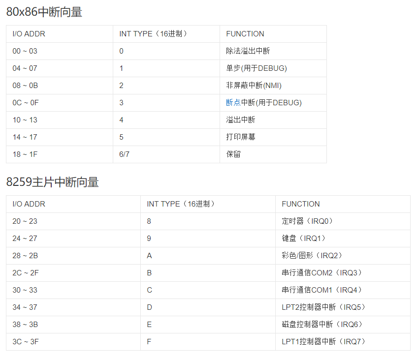
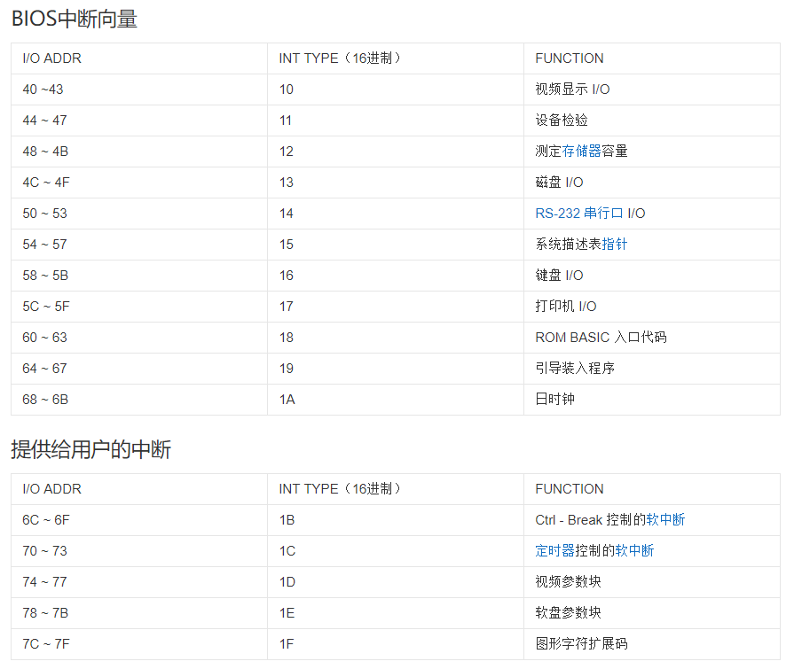
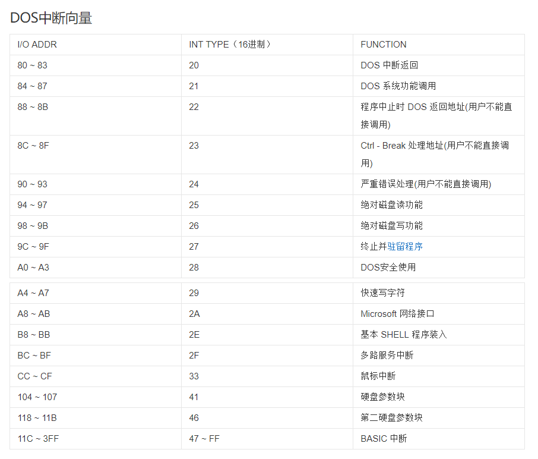
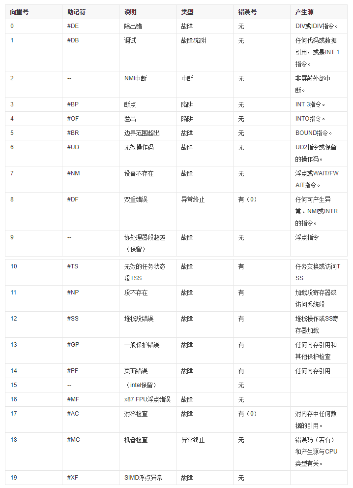

参考:

- Operating System/Linux/Linux 内核完全剖析—基于 0.12 内核/4. 80x86 保护模式及其编程/6. 中断和异常处理

- Operating System/Linux/Linux 内核完全剖析—基于 0.12 内核/5. Linux 内核体系结构/4. 中断机制

- Assembly/x86/x86 汇编语言_从实模式到保护模式/第三部分 32 位保护模式/17. 中断和异常的处理与抢占式多任务/1. 中断和异常

- Assembly/x86/x86 汇编语言_从实模式到保护模式/第二部分 16 位处理器下的实模式/9. 中断和动态时钟显示/

中断源的识别标志可用来形成相应的中断服务程序的入口地址或存放中断服务程序的首地址称为中断向量.

在 Pc/AT 中由硬件产生的中断标识码被称为中断类型号(当然中断类型号还有其他的产生方法如指令中直接给出、CPU 自动形成等)即在中断响应期间 8259A 产生的是当前请求中断的最高优先级的中断源的中断类型号.

中断类型号和中断向量之间有下面的关系:

中断类型号×4=存放中断向量的首地址

有了存放中断向量的首地址从该地址开始的 4 个存储单元中取出的就是中断服务程序的入口.

## 中断向量

是指中断服务程序入口地址的偏移量与段基值一个中断向量占据 4 字节空间. 中断向量表是 8088 系统内存中最低端 1K 字节空间它的作用就是按照中断类型号从小到大的顺序存储对应的中断向量总共存储 256 个中断向量. 在中断响应过程中 CPU 通过从**接口电路**获取的中断类型号(中断向量号)计算对应中断向量在表中的位置并从中断向量表中获取中断向量将程序流程转向中断服务程序的入口地址.

## 中断向量表

80x86 系统是把所有的中断向量集中起来按中断类型号从小到大的顺序存放到存储器的某一区域内这个存放中断向量的存储区叫做中断向量表即中断服务程序入口地址表.

由于中断向量表可以在操作系统层面灵活修改因此不同的系统的中断向量表可能是不同的. 此外 intel 在 CPU 的保护模式下占用了 0x00 ~ 0x1F 共 32 个中断号在 Linux 下是从 0x20 开始用于系统自身的中断的包括 8259 芯片的中断重置.

BIOS(实模式)的中断向量表如下:

在 DOS 系统(实模式)下从 0x20 开始用于操作系统本身.

### 保护模式下的中断向量表

在 Linux 下(保护模式)没有使用 BIOS 设置的中断向量表(**没办法使用了 BIOS 中断属于 16 位实模式的方式**)0x00 ~ 0x1F 是 CPU 保护模式下的默认中断向量而 0x20 开始都是被 Linux 系统重新设置的.

X86 占用的中断向量表如下:

Linux 设置的中断是内核初始化的.