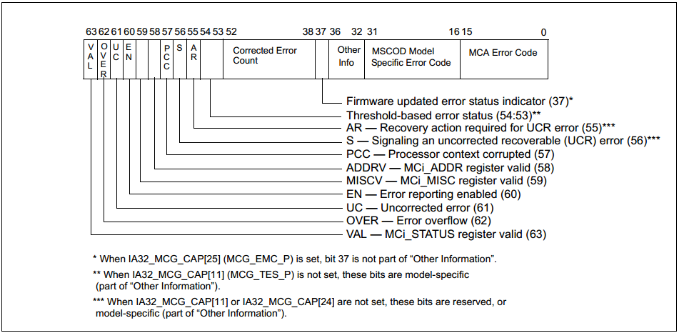

<!-- @import "[TOC]" {cmd="toc" depthFrom=1 depthTo=6 orderedList=false} -->

<!-- code_chunk_output -->

- [1. 概述](#1-概述)
  - [1.1. 不可纠正的 MCE(uncorrected machine-check error)](#11-不可纠正的-mceuncorrected-machine-check-error)
  - [1.2. 可纠正的 MCE(corrected machine-check error)](#12-可纠正的-mcecorrected-machine-check-error)
  - [1.3. 额外功能](#13-额外功能)
- [2. Machine Check MSR](#2-machine-check-msr)
  - [2.1. Machine-Check Global Control MSRs](#21-machine-check-global-control-msrs)
    - [2.1.1. IA32_MCG_CAP MSR](#211-ia32_mcg_cap-msr)
    - [2.1.2. IA32_MCG_STATUS MSR](#212-ia32_mcg_status-msr)
    - [2.1.3. IA32_MCG_CTL MSR](#213-ia32_mcg_ctl-msr)
    - [2.1.4. IA32_MCG_EXT_CTL MSR](#214-ia32_mcg_ext_ctl-msr)
    - [2.1.5. Enabling Local Machine Check](#215-enabling-local-machine-check)
  - [2.2. 错误报告寄存器组 (Error-Reporting Register Banks)](#22-错误报告寄存器组-error-reporting-register-banks)
    - [2.2.1. IA32_MCi_CTL MSRs](#221-ia32_mci_ctl-msrs)
    - [2.2.2. IA32_MCi_STATUS MSRS](#222-ia32_mci_status-msrs)
    - [2.2.3. IA32_MCi_ADDR MSRs](#223-ia32_mci_addr-msrs)
    - [2.2.4. IA32_MCi_MISC MSRs](#224-ia32_mci_misc-msrs)
    - [2.2.5. IA32_MCi_CTL2 MSRs](#225-ia32_mci_ctl2-msrs)
- [3. CMCI](#3-cmci)
- [4. MCA 的初始化](#4-mca-的初始化)
- [5. MSR 的读写](#5-msr-的读写)
- [6. 参考](#6-参考)

<!-- /code_chunk_output -->

# 1. 概述

Intel 从奔腾 4 开始的 CPU 中增加了一种机制称为 MCA——Machine Check Architecture 它用来**检测硬件**(这里的 Machine 表示的就是硬件)错误比如系统总线错误、ECC 错误、奇偶校验错误、缓存错误、TLB 错误等等. 不仅硬件故障会引起 MCE 不恰当的 BIOS 配置、firmware bug、软件 bug 也有可能引起 MCE.

这套系统通过**一定数量的 MSR**(Model Specific Register)来实现这些 MSR 分为两个部分一部分用来**进行设置**另一部分用来**描述发生的硬件错误**.

## 1.1. 不可纠正的 MCE(uncorrected machine-check error)

当 CPU 检测到**不可纠正的 MCE(Machine Check Error**)时就会触发 `#MC`(**Machine Check Exception**, 中断号是十进制 18)通常**软件**会**注册相关的函数**来处理\#MC 在这个函数中会通过读取 MSR 来收集 MCE 的错误信息但是**不被允许重启处理器**.

- 当然由于发生的**MCE**可能是**非常致命**的**CPU 直接重启**了**没有办法完成 MCE 处理函数**;

- 甚至有可能在**MCE 处理函数**中又触发了**不可纠正的 MCE**也会导致**系统直接重启**.


## 1.2. 可纠正的 MCE(corrected machine-check error)

从 CPUID 的 `DisplayFamily_DisplayModel` 为 `06H_1AH` 开始, CPU 可以报告**可纠正的机器检查错误信息**, 并为软件提供**可编程中断**来响应 MC 错误, 称为**可纠正机器检查错误中断**(CMCI).

CPU 检测到**可纠正的 MCE**当可纠正的 MCE 数量**超过一定的阈值**时会触发**CMCI(Corrected Machine Check Error Interrupt**)此时软件可以捕捉到该中断并进行相应的处理.

CMCI 是在**MCA 之后才加入**的算是对 MCA 的一个增强在此之前**软件只能通过轮询可纠正 MCE 相关的 MSR**才能实现相关的操作.

Corrected machine-check error interrupt (CMCI) 是 MCA 的增强特性. 在原来的芯片里面都是使用一种叫做 threshold-based error reporting 的机制来处理 corrected error. 但是 threshold-based error reporting 需要系统软件周期性的轮询检测硬件的 corrected MC errors 造成 CPU 的浪费.  CMCI 提供了一种机制当 corrected error 发生侧次数**到达阀值**的时候就会**发送一个信号给本地的 CPU**来通知系统软件.

当然系统软件可以通过`IA32_MCi_CTL2 MSRs`来控制该特性的开关

发现硬件错误时触发的异常(exception)中断号是 18 异常的类型是 abort:


## 1.3. 额外功能

支持**机器检查架构**和**CMCI**的**英特尔 64 处理器**还可以支持**额外的增强功能**即支持从**某些不可纠正**的**可恢复机器检查错误**中进行**软件恢复**.

# 2. Machine Check MSR


上图基本包含了 MCA 相关的所有 MSR.

它分为左右两个部分左边的是全局的寄存器右边表示的是多组寄存器.

i 表示的是各个组的 Index. 这里的组有一个称呼是 Error Reporting Register Bank.

MCA 通过若干 Bank 的 MSR 寄存器来表示各种类型的 MCE.

下面简单介绍一下这些寄存器.

## 2.1. Machine-Check Global Control MSRs

机器检查**全局控制 MSR**包括`IA32_MCG_CAP``IA32_MCG_STATUS`以及可选的`IA32_MCG_CTL`和`IA32_MCG_EXT_CTL`.

### 2.1.1. IA32_MCG_CAP MSR

这个 MSR 描述了**当前 CPU 处理 MCA 的能力**机器检查体系结构的信息, 具体每个位的作用如下所示:


BIT0-7: 表示的是特定 CPU 支持可用的**硬件单元错误报告库的个数(hardware unit error-reporting banks**);

BIT8: 1 表示**IA32\_MCG\_CTL**有效如果是**0 的话表示无效**读取该 IA32\_MCG\_CTL 这个 MSR 可能发生 Exception(至少在 UEFI 下是这样);

BIT9: 1 表示**IA32\_MCG\_EXT\_CTL**有效反之无效这个与 BIT8 的作用类似;

BIT10: 1 表示**支持 CMCI**但是 CMCI 是否能用还需要通过**IA32\_MCi\_CTL2**这个 MSR 的**BIT30 来使能**;

BIT11: 1 表示 IA32\_MCi\_STATUS 这个 MSR 的 BIT56\-55 是保留的 BIT54-53 是用来上报 Threshold-based Error 状态的;

BIT16-23: 表示存在的 Extended Machine Check State 寄存器的个数;

BIT24: 1 表示 CPU 支持 Software Error Recovery;

BIT25: 1 表示 CPU 支持**增强版的 MCA**;

BIT26: 1 表示支持更多的错误记录(需要 UEFI、ACPI 的支持);

BIT27: 1 表示支持 Local Machine Check Exception;

### 2.1.2. IA32_MCG_STATUS MSR

该 MSR 记录了**MCE 发生时 CPU 的状态**主要的 BIT 位介绍如下:


- Bit 0: Restart IP Valid. 表示程序的执行是否可以在被异常中断的指令处重新开始.
- Bit 1: Error IP Valid. 表示被中断的指令是否与 MCE 错误直接相关.
- Bit 2: Machine Check In Progress. 表示 machine check 正在进行中.
- bit 3: 设置后说明生成本地 machine\-check exception. 这表示当前的机器检查事件仅传递给此逻辑处理器.

### 2.1.3. IA32_MCG_CTL MSR

这个寄存器的存在依赖于 IA32_MCG_CAP 这个 MSR 的 BIT8.

这个寄存器主要用来 Disable(写 1)或者 Enable(写全 0)**MCA 功能**.

### 2.1.4. IA32_MCG_EXT_CTL MSR

这个寄存器同样依赖于 IA32\_MCA\_CAP 这个 MSR 这次依赖的是 BIT9.

该 MSR 的 BIT 位说明如下图所示:


目前有就 BIT0 有用用来 Disable(写 1)或者 Enable(写 0)**LMCE**这个 LMCE 的功能就是使**硬件**能够将**某些 MCE**发送给**单个的逻辑处理器**.

### 2.1.5. Enabling Local Machine Check

LMCE 的预期用途需要平台软件和系统软件的正确配置.  平台软件可以通过设置 IA32\_FEATURE\_CONTROL MSR(MSR 地址 3AH)中的位 20(LMCE\_ON)来打开 LMCE.

系统软件必须确保在尝试设置 IA32\_MCG_EXT_CTL.LMCE_EN(位 0)之前设置 IA32_FEATURE_CONTROL.Lock(位 0)和 IA32_FEATURE_CONTROL.LMCE_ON(位 20).

当系统软件**启用 LMCE**时**硬件**将确定**是否只能将特定错误**传递给**单个逻辑处理器**.  软件不应假设硬件可以选择作为 LMCE 提供的错误类型.

## 2.2. 错误报告寄存器组 (Error-Reporting Register Banks)

以上都是全局的 MSR.

**每个错误报告寄存器库**可以包含 IA32\_MCi\_CTLIA32\_MCi\_STATUSIA32\_MCi\_ADDR 和 IA32\_MCi\_MISC MSR. 报告库的数量由 IA32\_MCG\_CAP MSR(地址 0179H)的位\[7: 0]表示. 第一个错误报告寄存器(IA32\_MC0\_CTL)**始终从地址 400H 开始**.

有关 Pentium 4Intel Atom 和 Intel Xeon 处理器中错误报告寄存器的地址请参阅"英特尔®64 和 IA-32 架构软件开发人员手册"第 4 卷第 2 章"特定于型号的寄存器(MSR)". 以及错误报告寄存器 P6 系列处理器的地址.

这些寄存器的第一个是 IA32\_MC0\_CTL 它的地址一般都是 400H.

之后接着的是 IA32\_MC0\_STATUSIA32\_MC0\_ADDRIA32\_MC0\_MISC 但是在之后并不是 IA32\_MC0\_CTL2 而是 IA32\_MC1\_CTL; 对于 IA32\_MCi\_CTL2 来说它的地址跟上面的这些不在一起第一个 IA32\_MC0\_CTL2 是在 280H 之后是 IA32\_MC1\_CTL2 在 281H 以此类推.

### 2.2.1. IA32_MCi_CTL MSRs

IA32\_MCi\_CTL MSR 控制\#MC 的信号以发现由特定硬件单元(或硬件单元组)产生的错误.

每个 Bank 的 CTL 的作用是用来控制在发生**哪些 MCA**的时候来**触发\#MC**:


这里的 64 个 BIT 位设置某个 BIT 位就会使对应 BIT 位的**MCA 类型在发生**时**触发\#MC**.

### 2.2.2. IA32_MCi_STATUS MSRS

这类 MSR 的作用就是显示 MCE 信息:



注意只有当 VAL 这个 BIT 位(BIT63)为 1 时才表示发生了对应这个 Bank 的 MCE. 当 MCE 发生了软件需要给这个 VAL 位写 0 来清零(如果有可能的话因为对于不可纠正的 MCE 可能软件会 来不及写)不能往这位写 1 会出现 Exception.

BIT0-15BIT16-31: 这个两个部分都表示 MCE 的错误类型前者是通用的后者是跟 CPU 有关的;

BIT58: 1 表示 IA32_MCi_ADDR 这个 MSR 是有效的反之无效;

BIT59: 1 表示 IA32_MCi_MISC 这个 MSR 是有效的反之无效; 这两个 BIT 是因为不同 MCE 错误并不是都需要 ADDR 和 MSIC 这样的 MSR;

BIT60: 这个位于 IA32_MCi_CTL 中的位是对应的那边使能了这里就是 1;

BIT61: 表示 MCE 是不可纠正的;

BIT62: 表示发生了二次的 MCE 这个时候到底这个 Bank 表示的是哪一次的 MCE 信息需要根据一定的规则来确定:


其它寄存器不介绍了, 详细看手册

### 2.2.3. IA32_MCi_ADDR MSRs


这个地址指向**内存中导致 MCE 的代码或者数据**.

注意这个地址在不同的内存模型下可以是偏移地址虚拟地址和物理地址中的一种这个需要 MISC 这个 MSR 来确定下面会讲到.

这个 MSR 也可以手动清零写 1 会出错.

### 2.2.4. IA32_MCi_MISC MSRs

这个寄存器的 BIT 位说明如下:


这里的 Address Mode 说明如下:


### 2.2.5. IA32_MCi_CTL2 MSRs

这个寄存器就是为 CMCI 使用的 BIT 位说明如下:


一个是用于使能 CMCI 另一个是用来设置 CMCI 的阈值.

除了上述的 MSR 之外在 IA32_MCG_CAP 这个 MSR 的说明中还提到过它的 BIT16-23 还提到了额外的 MSR 它们称为 Extended Machine Check State 这些 MSR 的描述如下:


上图实际上只展示了非 64 位 CPU 的 MSR 还有一个 64 位 CPU 的 MSR 这里就不再多说.


需要注意实际上上面的这些寄存器并不需要自己一个个去对比和解析 Intel 提供了一个工具叫做**MCE Decoder**可以用来**解析 MCE**.

另外在 Intel 的开发者手册中有专门的一个章节解析 MCE 错误: 《CHAPTER 16 INTERPRETING MACHINE-CHECK ERROR CODES》.

# 3. CMCI

前面以及提到 CMCI 是后期加入到 MCA 的一种机制它将**错误上报的阈值操作**从原始的**软件轮询**变成了**硬件中断触发**.

一个 CPU**是否支持 CMCI**需要查看**IA32\_MCG\_CAP**的 BIT10 如果该位是 1 就表示支持.

另外**CMCI 默认是关闭的**需要通过 IA32\_MCi\_CTL2 的 BIT30 来打开并设置 BIT0-14 的阈值注意 **每个 Bank 都要设置！！！**.

设置的时候首先**写 1**到**IA32\_MCi\_CTL2**的**BIT30**再**读取**这个值如果值变成了 1 说明 CMCI 使能了否则就是 CPU 不支持 CMCI; 之后再写阈值到 BIT0-14 如果读出来的值是 0 表示不支持阈值否则就是成功设置了阈值.

CMCI 是通过 Local ACPI 来实现的具体的示意图如下:


在**Local ACPI Table**中有专门处理 CMCI 的寄存器称为**LVT CMCI Register (FEE0 02F0H**):


BIT0-7: 中断向量;

BIT8-10: Delivery Mode 比如 SMINMI 等;

BIT12: Delivery Status0 表示没有中断 1 表示中断正在发生;

BIT17: Interrupt Mask0 表示接收中断 1 表示屏蔽中断;

关于 CMCI 的初始化和 CMCI 处理函数的实现手册上有部分的介绍不过没有什么源代码可以借鉴这个不展开了.

# 4. MCA 的初始化

手册上有一个伪代码可供参考

```
IF CPU supports MCE
THEN
	IF CPU supports MCA
	THEN
		IF (IA32_MCG_CAP.MCG_CTL_P = 1)
		(* IA32_MCG_CTL register is present *)
		THEN
			IA32_MCG_CTL ← FFFFFFFFFFFFFFFFH;
			(* enables all MCA features *)
		FI
		IF (IA32_MCG_CAP.MCG_LMCE_P = 1 and IA32_FEATURE_CONTROL.LOCK = 1 and IA32_FEATURE_CONTROL.LMCE_ON= 1)
		(* IA32_MCG_EXT_CTL register is present and platform has enabled LMCE to permit system software to use LMCE *)
		THEN
			IA32_MCG_EXT_CTL ← IA32_MCG_EXT_CTL | 01H;
			(* System software enables LMCE capability for hardware to signal MCE to a single logical processor*)
		FI
		(* Determine number of error-reporting banks supported *)
		COUNT← IA32_MCG_CAP.Count;
		MAX_BANK_NUMBER ← COUNT - 1;
		IF (Processor Family is 6H and Processor EXTMODEL:MODEL is less than 1AH)
		THEN
			(* Enable logging of all errors except for MC0_CTL register *)
			FOR error-reporting banks (1 through MAX_BANK_NUMBER)
				DO
					IA32_MCi_CTL ← 0FFFFFFFFFFFFFFFFH;
				OD
		ELSE
			(* Enable logging of all errors including MC0_CTL register *)
			FOR error-reporting banks (0 through MAX_BANK_NUMBER)
				DO
					IA32_MCi_CTL ← 0FFFFFFFFFFFFFFFFH;
				OD
		FI
		(* BIOS clears all errors only on power-on reset *)
		IF (BIOS detects Power-on reset)
		THEN
			FOR error-reporting banks (0 through MAX_BANK_NUMBER)
				DO
					IA32_MCi_STATUS ← 0;
				OD
		ELSE
			FOR error-reporting banks (0 through MAX_BANK_NUMBER)
				DO
					(Optional for BIOS and OS) Log valid errors
					(OS only) IA32_MCi_STATUS ← 0;
				OD
		FI
	FI
	Setup the Machine Check Exception (#MC) handler for vector 18 in IDT
	Set the MCE bit (bit 6) in CR4 register to enable Machine-Check Exceptions
FI
```

# 5. MSR 的读写

x86 平台读写 MSR 有专门的指令分别是 rdmsr 和 wrmsr. 下面是 MSR 读写的一个基本实现:

```cpp
/**
  Returns a 64-bit Machine Specific Register(MSR).
  Reads and returns the 64-bit MSR specified by Index. No parameter checking is
  performed on Index, and some Index values may cause CPU exceptions. The
  caller must either guarantee that Index is valid, or the caller must set up
  exception handlers to catch the exceptions. This function is only available
  on IA-32 and X64.
  @param  Index The 32-bit MSR index to read.
  @return The value of the MSR identified by Index.
**/
UINT64
EFIAPI
AsmReadMsr64 (
  IN      UINT32                    Index
  )
{
  UINT32 LowData;
  UINT32 HighData;

  __asm__ __volatile__ (
    "rdmsr"
    : "=a" (LowData),   // %0
      "=d" (HighData)   // %1
    : "c"  (Index)      // %2
    );

  return (((UINT64)HighData) << 32) | LowData;
}

/**
  Writes a 64-bit value to a Machine Specific Register(MSR), and returns the
  value.
  Writes the 64-bit value specified by Value to the MSR specified by Index. The
  64-bit value written to the MSR is returned. No parameter checking is
  performed on Index or Value, and some of these may cause CPU exceptions. The
  caller must either guarantee that Index and Value are valid, or the caller
  must establish proper exception handlers. This function is only available on
  IA-32 and X64.
  @param  Index The 32-bit MSR index to write.
  @param  Value The 64-bit value to write to the MSR.
  @return Value
**/
UINT64
EFIAPI
AsmWriteMsr64 (
  IN      UINT32                    Index,
  IN      UINT64                    Value
  )
{
  UINT32 LowData;
  UINT32 HighData;

  LowData  = (UINT32)(Value);
  HighData = (UINT32)(Value >> 32);

  __asm__ __volatile__ (
    "wrmsr"
    :
    : "c" (Index),
      "a" (LowData),
      "d" (HighData)
    );

  return Value;
}
```

上面是 GCC 版本的还有汇编版本的:

```assembly
;-------------------------------------------------------
; UINT64
; EFIAPI
; AsmReadMsr64 (
;   IN UINT64  Index
;   );
;-------------------------------------------------------
AsmReadMsr64    PROC
    mov     ecx, [esp + 4]
    rdmsr
    ret
AsmReadMsr64    ENDP

;-------------------------------------------------------
; UINT64
; EFIAPI
; AsmWriteMsr64 (
;   IN UINT32  Index,
;   IN UINT64  Value
;   );
;--------------------------------------------------------
AsmWriteMsr64   PROC
    mov     edx, [esp + 12]
    mov     eax, [esp + 8]
    mov     ecx, [esp + 4]
    wrmsr
    ret
AsmWriteMsr64   ENDP
```

# 6. 参考

- x86 架构——MCA: https://blog.csdn.net/jiangwei0512/article/details/62456226
- Intel 手册卷 3 第 15 章(CHAPTER 15 MACHINE-CHECK ARCHITECTURE)、16 章(CHAPTER 16 INTERPRETING MACHINE-CHECK ERROR CODES)
- 怎么诊断 MACE: http://linuxperf.com/?p=105
- MCA 机制: 硬件错误检测架构: https://blog.csdn.net/chengm8/article/details/53003134