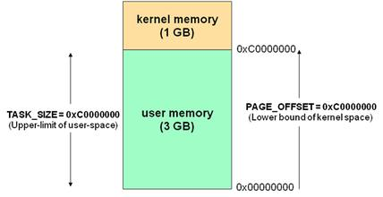
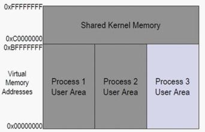
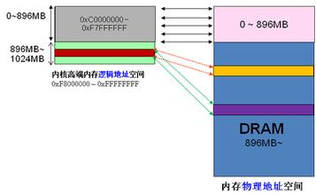
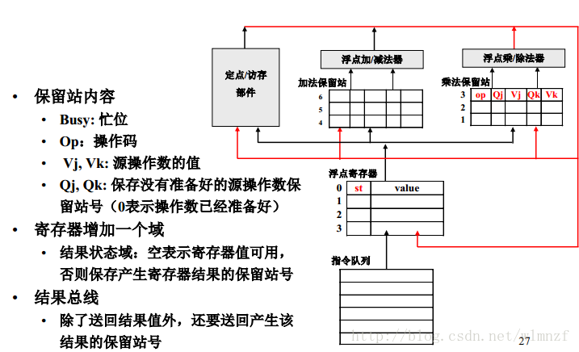
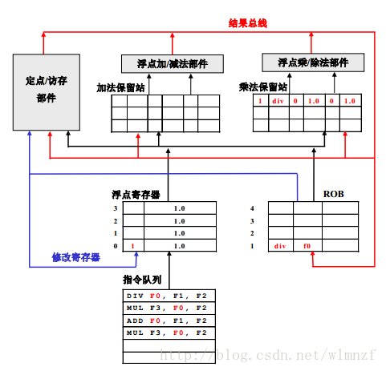
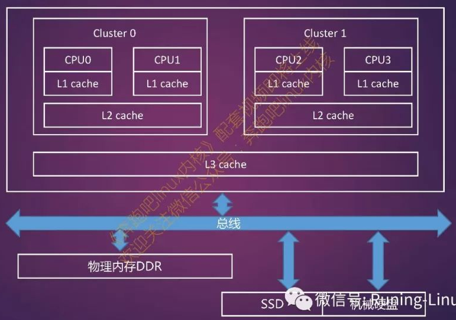
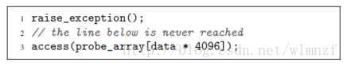
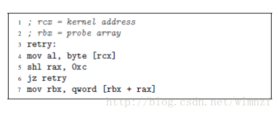
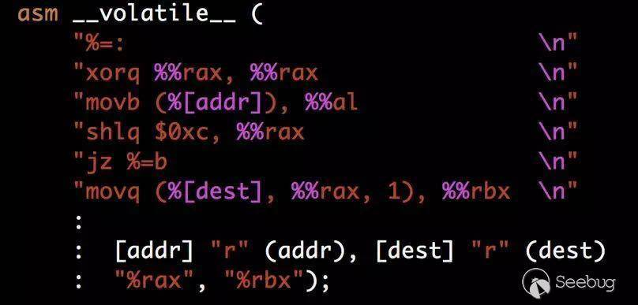
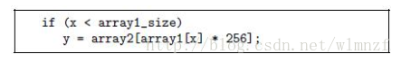

https://blog.csdn.net/wlmnzf/article/details/79319509

Spectre 以及 meltdown 漏洞是前段时间, 十分热门的两个漏洞, 它们之所以广受重视, 是因为它们根据的是体系结构的设计漏洞, 而非针对某个系统或者某个软件, 因此它几乎可以遍及大多数近代的 CPU.

这里主要有三个漏洞:

- Variant 1: bounds check bypass (CVE-2017-5753)【绕过边界检查】
- Variant 2: branch target injection (CVE-2017-5715)【分支目标注入】
- Variant 3: rogue data cache load (CVE-2017-5754)【恶意数据缓存载入】

Spectre 主要利用前两个漏洞进行攻击, 而 meltdown 则主要利用第三个漏洞进行攻击.

# 1 内存映射

Linux 和 Windows 的内存映射方法是不同的, 在 linux 中, 虚拟空间地址有 4G, 0\~3G 为用户空间, 3\~4G 为内核空间



其中**内核空间都相同**, 准确的讲是**每个进程共享同一个内核空间**



Linux 在启动时会**初始化一个进程**, 然后通过**fork()生成子进程**, Linux 的 fork 机制会把**父进程的页表和堆栈等一模一样地复制一份**, 然后在**运行**时, **子进程**通过**缺页异常**等操作来**改变用户空间**, 如果**内核空间部分也改变**了, 则**只修改初始化进程的内核空间(！！！**), 其它**子进程访问该页**时, 再通过**缺页中断**将这部分内容**从父进程更新过来**.

一般来讲, 当**进程**进行**系统调用**进入**内核态**的时候, 它应该能够访问**整个地址空间**的, 但是在这里**只能访问自己的 1G 的地址空间**, 于是我们需要通过**地址的映射**, 来使他可以**访问整个空间**, 内核空间分为: ZONE\_DMA(内存开始的 16MB) 、ZONE\_NORMAL(16MB\~896MB)、ZONE\_HIGHMEM(896MB \~ 结束)三个区域, 其中 0\~896M 是直接映射的, 其余部分会进行非线性映射.



# 2 Tomasulo 算法



原始的 Tomasulo 算法是为了**寄存器重命名**以便**消除指令的数据**相关, **数据一到就可以执行指令**.

1. **指令**首先存在于**指令队列(L1 Instruction cache**)之中.

2. 指令一条一条地从**队列中取出来**, 进行**译码**, 然后放到**对应的操作保留站**中, 比如**加法指令**放到**加法保留站**中. **乘法指令**放到**乘除法保留站**中. **Vj**和**Vk**中是用来**存储源操作数**的(已经**就绪的源操作数值**取自于**浮点寄存器**), 若**源操作数还没有准备好**, 则通过**Qj**和**Qk**指向**操作数的保留站号**, 等到**被指向的保留站**中的**操作计算出了结果**, 则结果可以通过**结果总线**传回到**保留站中需要的指令**, 然后将其**Qj**和**Qk**中的**值改为 0(表示已经准备好**).

3. 当**Qj**和**Qk**都为**0**时, 那**一条指令**就可以**送到乘/除器中执行**.

# 3 乱序执行

最早期 CPU 都是**顺序执行**的, 前一条指令未执行完毕, 则后一条指令必须等待着, 就像我们烧水, 必须洗茶壶, 烧水, 洗茶杯, 倒水必须按照顺序来做, 但是事实上烧水和洗茶杯可以同时执行, 其实有很多指令也是如此, 调整它们的顺序可以加快程序执行的速度

可能会造成**乱序执行**的原因:

1. **编译器**为了**优化**而实现**指令重排(静态调度**)
2. CPU 实现**指令的多发射**, 以及**并行执行**, 并为了优化实现**指令的重排(动态调度**)

程序的乱序执行并不意味着在所有步骤中, 指令的顺序都是混乱的, 事实上, **指令**在**发射时**和**提交时**依然是**顺序**的, 只是在**执行**的过程中会**打乱顺序**.

为了支持乱序执行



我们在 Tomasulo 算法中加入了**ROB**来使得**提交结果**的时候能够按照**顺序提交**, 执行的**结果暂时存放于 ROB**而**不直接写入寄存器堆**, 然后再按**顺序提交数据**. 从而可以不出问题.

本次的漏洞就是利用了这一特性来实现的

# 4 分支预测

由于在指令中存在许多跳转和分支, 为了提前访问分支中的代码以解决时间, 我们加入了分支预测功能

## 4.1 静态分支

对于所有的**跳转指令**, 我们都预测执行**跳转**或者执行**不跳转**, 则称其为**静态跳转**

## 4.2 动态分支

**动态分支**将会通过**历史跳转信息**来**预测下一次分支**应该**选择跳转**还是**选择不跳转**. 在 intel 设计中有一个称为**BTB(Branch Target Buffer**)的部件, 当我们**执行分支指令**时, 会将**执行结果**和**分支指令地址**记录在其中, 当**下次取址**时, 查询**其中的记录**, 若存在, 则根据历史执行记录进行预测是否跳转.

若**不存在此记录**, 我们将会使用**静态分支预测器**, 我们一般将**向上跳转的分支指令**看作**循环**, 对于循环我们**倾向于接受跳转**, 而对于**向下跳转**, 我们**倾向于不跳转**.

# 5 Cache 结构



- 处理器**首次访问主存上的某地址**时, 会将此地址所在**单位大小的内容**依次载入 L3, L2, L1 Cache
- 短时间内, 处理器再次访问这个地址时, 将直接从 L1 Cache 读取

# 5 Meltdown

利用了处理器对**乱序(out\-of\-order)执行**处理不当的缺陷. 现代处理器为了提高各个运算单元的利用率, 不是一次执行一条指令, 而是综合考虑当前指令和后续几条指令, 一次批量调度多条指令到空闲的运算单元并行执行, 所以代码里指令的先后关系并不一定是指令执行的先后关系.

如果**用户空间一条指令**读取了**内核的内存地址**, 正常情况下**该指令会导致陷入**(trap), 从而**终止该指令的执行**. 但由于**乱序**原因, 该指令**后续指令**可能会在**trap 发生之前就得到执行**. 如果后续是精细策划的恶意代码, 就能够抓住上面提到的处理器漏洞, **把"一闪而过"的内核数据"藏匿"在 Cache 里**, 偷运出去.

## 5.1 示例 1

```assembly
; flush cache

; rcx = kernel address

; rbx = probe array

retry:

mov al, byte [rcx]

shl rax, 0xc

jz retry

mov rbx, qword [rbx + rax]

; measure which of 256 cachelines were accessed
```

首先将**256 条 cache line 清空**(x86 有指令), 即**这些 cache line 不包含任何内存数据**. 这一点有很多办法可以做到. 接下来, 从**rcx**指向的**内核空间**读取**一个字节**, 存放在**寄存器 al**里:

```assembly
mov al, byte [rcx]
```

系统会感知到你处在 ring\-3\-level, 没有权限访问内核(ring\-0\-level)的数据, 随即**抛出陷入(trap**), 当然 al(rax 的低位)的值也不会有任何敏感数据. 如果没有乱序执行, 一切都完美结束, 一次低级的攻击企图被击破. 但是乱序出英雄. 由于**乱序**, 在**trap 真正发生之前**, 处理器自作聪明地执行了后续几条指令, 而且还犯了前面提到的错误, 导致无可挽回的后果.

为了支持乱序执行, 处理器里实际上有上百个不可见的寄存器, 尽管只有 16 个寄存器是可见的. 所以即便寄存器 al(即 rax)不包含内核数据, 但是有一个不可见的寄存器与 rax 是对应的, 并且处理器处理不当, 把**内核数据**写进了这个**隐藏的 rax**里. 如果一切正常, 最终**这个隐藏 rax 会变成 rax**, 从而**完成赋值**操作. 但在此场景里这**不会发生**, 因为 trap 的出现会终止赋值. 尽管如此, 在乱序执行过程中, **隐藏的 rax**还是拥有和 rax 一样的地位, 故**后续指令里用到的 rax**实际上**就是隐藏的 rax(！！！**), **已经包含了内核数据(！！！**). 这正是黑客梦寐以求的, 接下来要做的就是在**trap 发生前**, **尽快将数据转手**.

首先**藏匿在 Cache**里:

```assembly
shl rax, 0xc
mov rbx, qword [rbx + rax]
```

所谓"**藏匿"在 Cache**里, 就是对**这个字节对应的 Cache Line 发起一次读操作**. 首先**将内核数据平移 12 位**, 从而**指向一条 Cache Line 的边界(起点**). 通常**一条 Cache Line 大小是 64 字节**, 只需要**平移 6 位**就行了. **平移 12 位**是考虑到**处理器的 prefetch**可能会**一次加载进多条相邻的 Cache Line**, 造成混淆.

后面**读操作**的目的是把**内存里的数**加载到**内核数据值对应的 Cache Line**里, 这就是个标记: **Cache 里其它 Cache Line 都是空的**, 唯独这个 Cache Line 和内存一致(up\-to\-date). 接下来等处理器恍然大悟, 触发了 trap, 为时已晚, 标记已经做好了, 而且由于处理器的缺陷, **没有清除 Cache 里留下的痕迹**. 接下来黑客可以**遍历所有 256 根 Cache Line(一个字节有 256 种可能性**), 找到刚刚**做过标记的那根**, 比如第 45 根, 那么刚才"窃取"的内核数据就是 45.

## 5.2 示例 2



在**第一行**, 我们**引发了一个异常**, 若程序按照**顺序执行**, 第三行的 access 将不会被执行, 但是由于程序是**乱序执行**的, 因此在**异常引发之前**, 第三行的 access 将被执行, 但是**执行结果存在 ROB**中**不会被提交**, 当异常触发以后, 第三行的执行结果将被撤销掉, 从计算机外部看来第三行的 access 就跟从未被执行过一样, 但是事实上它**只是在后期被撤销**了, 这会带来一个小问题, 就是在**执行过程中**, **刚才读取的数据**已经被**存储到高速缓存**中.

我们可以通过**侧信道攻击**来确认刚才访问的数据是什么.



这段代码揭示了**攻击的关键部分**

首先我们将**访问内核地址**并**取内容到寄存器**内, 若这一举动可以**触发异常**, 则**对应的寄存器清零！！！**, 若**异常未处理**, 则**应用程序将会被终止**, 并且**取出的值**将会**存入应用程序核心转储的寄存器**中. 我们要做的就是**通过第 5 行将相应的寄存器清零**, 从而可以**判断这是一个错误的值**. 然后**再次重试**, 直到**遇到一个不为 0 的值**, 然后将**秘密的值作为地址**, 去做**读取操作**, 以便**cache 记录到这个地址**, 实现**侧信道攻击**.

## 5.3 代码分析




# 6 Spectre



**Spectre**主要利用了**分支预测**和**乱序执行**的漏洞实现的, 如图所示的代码, 看起来十分地正常, 若 x 小于 array1 的长度的时候, 循环顺利执行. 但是我们假设这里有一个存储密码的变量地址为 secret, 并且令 a=secret-array1, 于是我们可以使用 array1[a]来表示 secret 的值. 当多次执行循环的时候, 我们的 x 满足循环条件, 则我们的分支预测模块会认为下一个循环也满足循环条件而去预执行这个循环, 若此时我们将 a 的值赋值给 x, 则分支预测模块预测本次循环为执行(其实并不会执行), CPU 会预执行这个循环体, 然后将我们存储密码的 secret 值取出来, 并将其作为地址去访问 array2, 但是最终发现循环不应该被执行, 于是刚才取出来的值将会被作废. 但是我们的这个 secret 值的地址已经被存入到缓存中去. 我们最终可以将 array2 读取一遍, 若读取某个地址的时候, 访问的时间特别短, 则说明这个地址就是那个被存入缓存的地址(即我们的密码值).

# 7 参考

https://googleprojectzero.blogspot.co.at/2018/01/reading-privileged-memory-with-side.html

https://lwn.net/Articles/738975/

http://lib.csdn.net/article/linux/29085

https://bugs.chromium.org/p/project-zero/issues/detail?id=1272

http://blog.csdn.net/yiyeguzhou100/article/details/72875122

https://bbs.pediy.com/thread-61327.htm

http://blog.csdn.net/muxiqingyang/article/details/6686738