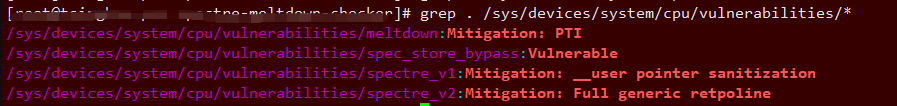
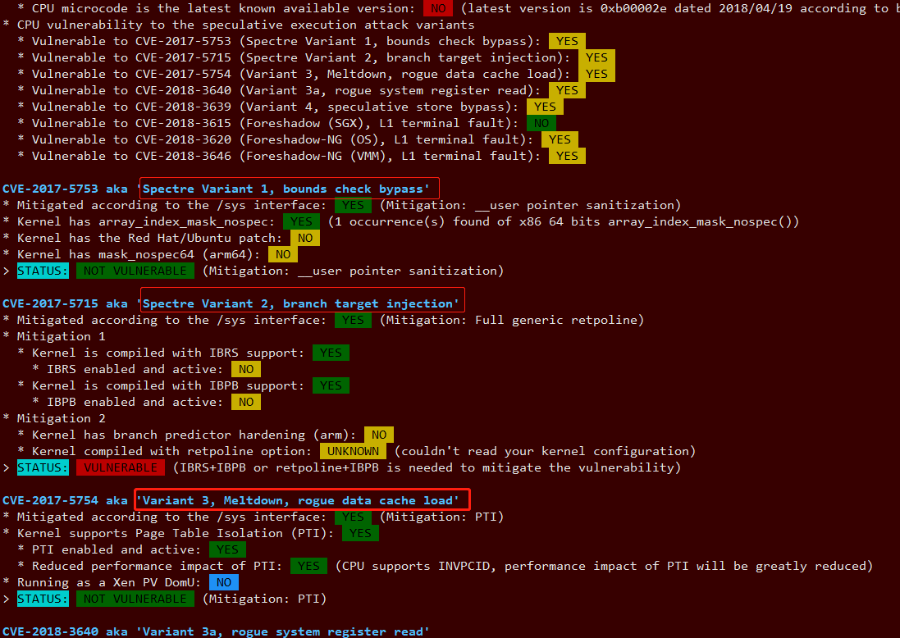

# 简单测试

顶级的 Linux 内核开发人员之一提供了一种简单的方式来检查系统在 Meltdown 和 Specter 漏洞方面的状态. 它是简单的, 也是最简洁的, 但它不适用于每个系统. 有些发行版不支持它. 即使如此, 也值得一试.

```
grep . /sys/devices/system/cpu/vulnerabilities/*
```



# 2 脚本

```
#git clone https://github.com/speed47/spectre-meltdown-checker.git

#cd spectre-meltdown-checker

#./spectre-meltdown-checker.sh
```

首先, 脚本检查你的硬件, 然后运行三个漏洞检查: Specter v1、Spectre v2 和 Meltdown. 每个漏洞都有自己的部分. 在这之间, 脚本明确地告诉你是否受到这三个漏洞的影响.

