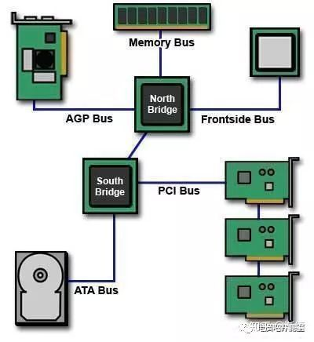
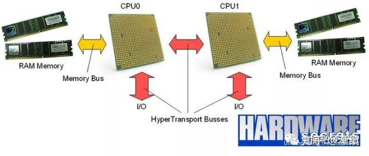
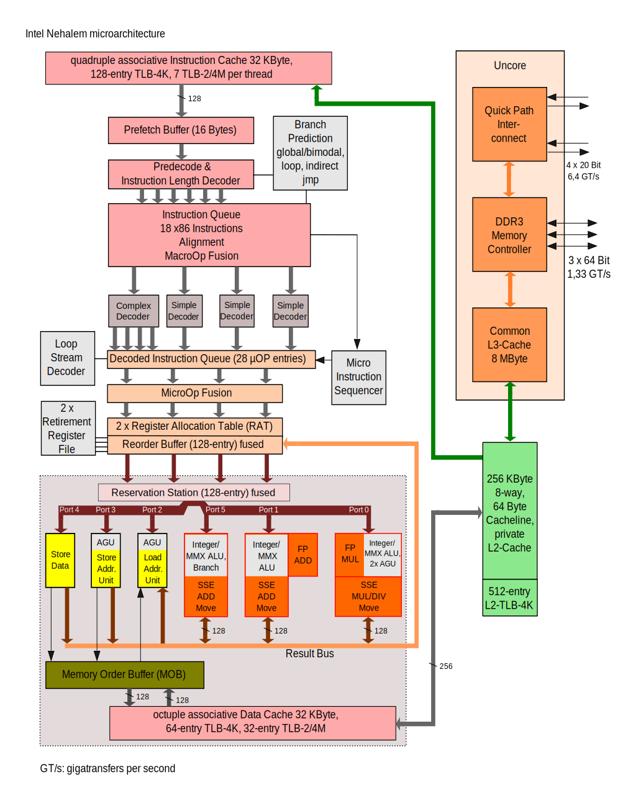
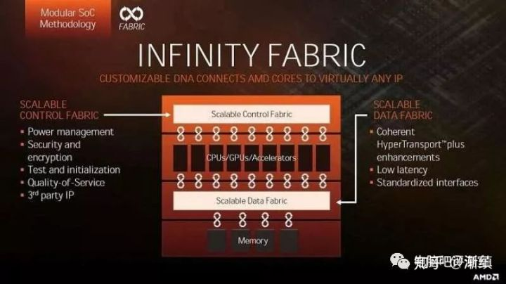

<!-- @import "[TOC]" {cmd="toc" depthFrom=1 depthTo=6 orderedList=false} -->

<!-- code_chunk_output -->

- [1 FSB(Front Side Bus)](#1-fsbfront-side-bus)
- [2 HT LINK](#2-ht-link)
- [3 QPI LINK(Quick Path Interconnect)](#3-qpi-linkquick-path-interconnect)
- [4 Infinity Fabric](#4-infinity-fabric)
- [5 UPI(Ultra Path Interconnect)](#5-upiultra-path-interconnect)
- [参考](#参考)

<!-- /code_chunk_output -->

CPU 到现在发展已经经过了 40 个年头而牙膏厂也在今年推出了 8086K 牙膏厂 40 周年 cpu 纪念版用来纪念第一颗 8086CPU. 而 CPU 总线也经历了好多代的更迭以牙膏厂为例 CPU 的总线从 FSB 进化到 QPI 而 AMD 则是 FSB 进化为 HT LINK 一直到现在的 GMI 总线. 那么今天就让我们来看看这些总线吧.

# 1 FSB(Front Side Bus)

熟悉电脑的老朋友都知道**老的主板**是分**南北桥**的.

而**CPU**想要和**内存通信**的话就要通过**北桥**来进行即**CPU\-北桥\-内存**. 而**CPU 和北桥**的这个**通信总线就是 FSB**.

在早期的时候**CPU 的外频**和**FSB 的频率保持同步**. 即**外频频率=FSB 频率**举例赛扬 300A 的**外频为 66MHz**那么它的**FSB 频率也是 66MHz**.

而到了**奔腾 4 时代****FSB 总线速度**已经**无法满足 CPU 的带宽需求**于是牙膏厂引入了**Quad Pumped Bus**技术让**FSB**在**一个周期**内可以传输**四倍的数据**. 这就是我们最熟悉的计算方式了: **FSB 频率**=**外频频率 x4**比如**333MHz 的外频的 CPU**其**FSB 频率为 1333MHz**. 大大扩展了**CPU 与北桥的传输速度**.

而**FSB 早期**不仅仅用于**CPU 和北桥通信**牙膏厂早期的胶水**双核**也是通过**FSB 总线来进行数据交换**的. 因为牙膏厂只是简单的把**两个 die**封装到了**一个 chip**上所以**CPU 之间**想要**通信**必须经过**北桥！！！来进行**. 早期的 AMD 也是使用 FSB 总线.

# 2 HT LINK

这是 AMD 在 K8 处理器上首次提出的总线结构也叫 HyperTransport. AMD 提出的最早时间是 1999 年后来这个阵营里有 NV,ATI,IBM 等大佬支持. HT 总线技术对外开放而改进则由联盟内的大佬进行. 而 HT 总线具有恐怖的传输速率. 最早的 1.0 版本推出时间是 2001 年它的双向传输速率最大就达到了 12.8GB/s 虽然 AMD 用的单路 16 位远远没有达到这个速度. 而同时期的牙膏厂还在使用 FSB 总线 533MHz 下只有 4.3GB/s 的传输带宽. 而 HT 总线有多个版本最后的 HT3.1 总线发布于 2008 年最大带宽为 51.2GB/s. 这个数据即便放到今天也是很可怕的. 而 HT 总线同样不仅仅用于和内存通信 AMD 的多路 CPU 之间也在使用而思科更是把 HT 总线丢到了路由器和交换机上大大提升了交换机的多路传输性能而 AMD 也是最早把内存控制器集成在 CPU 内的厂家.

# 3 QPI LINK(Quick Path Interconnect)

QPI 的全称是**快速通道互联**其实 QPI 总线在早期已经用于**安腾(Itanium**)以及**至强(Xeon**)平台上用于取代老旧的**FSB**. 而下放到**桌面级**则是从**第一代 Nehalem 处理器**上. 一直到今天我们用的 8700K 全部是基于 QPI 总线来进行通信.

和**HT LINK**一样 QPI 总线一样是**点对点通信**用于**CPU****北桥****南桥**之间的**点对点连接**. 而它的速度也已经远远超越了 FSB 总线以末代的 1600MHz 的 FSB 为例它的传输速度为**12.8GB/s**而**初版的 QPI 总线**就达到了**25.6GB/s**相比上一代直接翻了一倍而到了**SNB**上内置 CPU**内存控制器的总线**依旧是由**QPI 总线衍生**而来只不过由于是环形总线不仅大大提升了速度也保持了缓存的一致性. 而和**南桥之间的通信**一直用的都是**DMI 总线**.

在英特尔 Nehalem 微架构上 QPI 是其中'uncore'的组成部分.

# 4 Infinity Fabric

其实第一次听说这个新总线的时候新闻上把它叫做 GMI 总线而正式定名则是在 AMD 的 ZEN 处理器发布的 PPT 上命名为 Infinity Fabric 而我们更多的时候叫它 CCX 总线. 其实 Infinity Fabric 并不是什么深奥的东西它由 HT 总线衍生而来但是相比 HT 总线技术对外开放 Infinity Fabric 总线则是 AMD 的专利技术你想用先交授权费. Infinity Fabric 可以说是 AMD 这个时代的基石它的传速速率从 30GB/s 到 512GB/s 并且不和 HT 总线兼容. Infinity Fabric 分为 SCF 和 SDF. SDF 负责数据传输而 SCF 则负责控制传输命令. SDF 部分就是 HT 总线衍生的产物了. 而 Infinity Fabric 和 HT 总线一样也不仅仅限制于 CPU 上进行使用包括 CPUGPUAPU 这些都可以使用只不过它们的 SDF 层是不一样的. 不过在最新的 APU 上 CPU 和 GPU 之间仍旧使用的 PCI-E 总线互联并没有见到 CCX 总线也许这一代 APU 仅仅只是 AMD 赶工的产物希望下一代可以看到完全体的 APU.

# 5 UPI(Ultra Path Interconnect)

Ultra Path Interconnect(超级通道互连)数据传输率可达 9.6GT/s、10.4GT/s 带宽更足灵活性更强每条消息可以发送多个请求. Intel 还曾经用过"KTI"(Keizer Technology Interconnect)的名字.

从 Skylake\-SP(Scalable Processor)微架构处理器(即 Intel Xeon Scalable)开始, 采用了新一代高速互连 UPI(Ultra Path Interconnect)系统汇流排设计来取现有的 QPI 系统汇流排新 Xeon Scalable 系列同样搭配有最多 3 个 UPI 系统汇流排 UPI 最高速度可以达到每秒最高 10.4GT 至于原本 Xeon E5 v4 的 QPI 最高只到 9.6GT/s

# 参考

- 本文来自知乎专栏, 链接: https://zhuanlan.zhihu.com/p/38984035?utm_source=wechat_session&utm_medium=social&utm_oi=50718148919296
- QPI: https://zh.wikipedia.org/wiki/%E5%BF%AB%E9%80%9F%E9%80%9A%E9%81%93%E4%BA%92%E8%81%94
- CPU 的快速互联通道(QPI)详解: https://blog.csdn.net/Hipercomer/article/details/27580323
- 注意看维基百科下面的资料源
- Intel 快速通道互联简介: https://www.intel.cn/content/www/cn/zh/io/quickpath-technology/quick-path-interconnect-introduction-paper.html