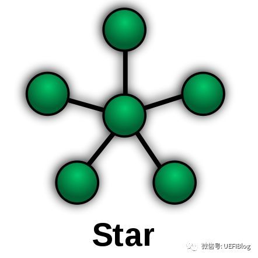
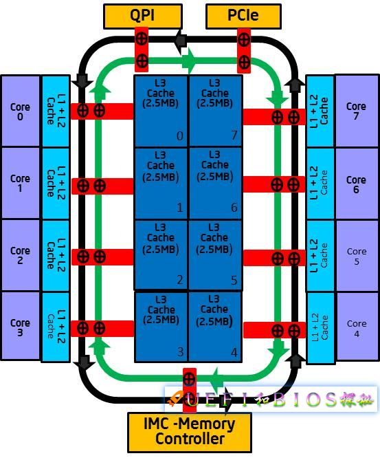
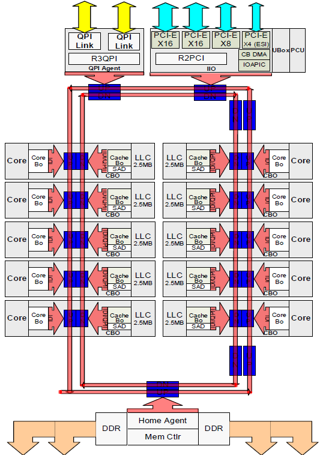
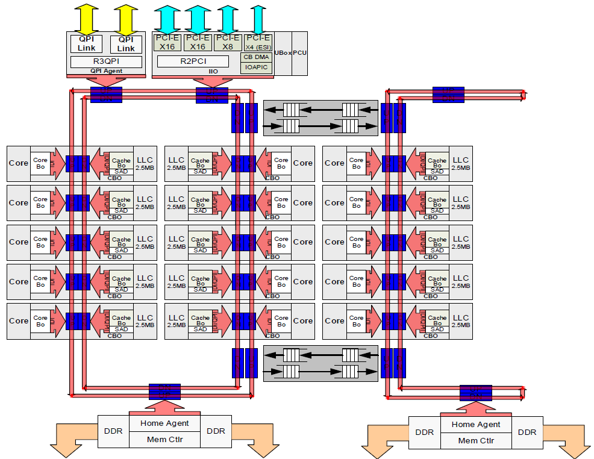
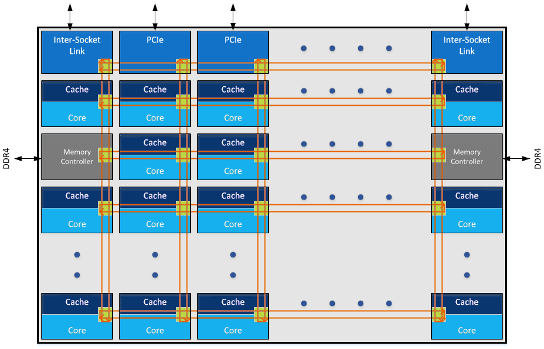
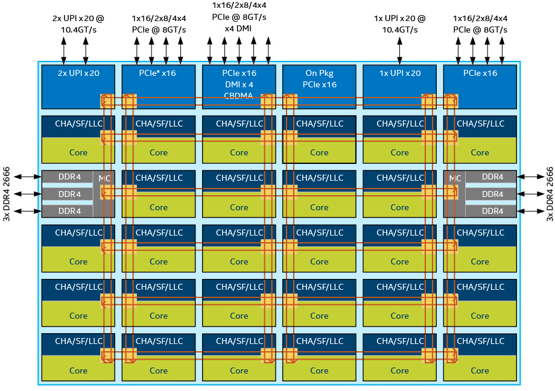
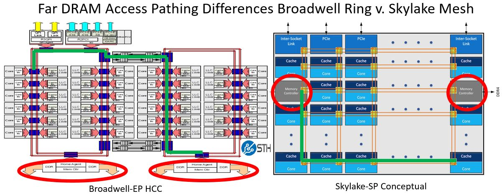
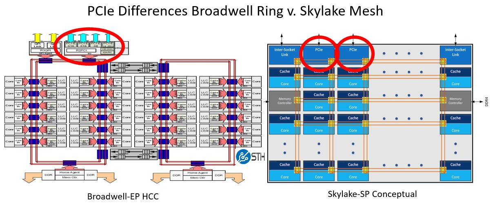
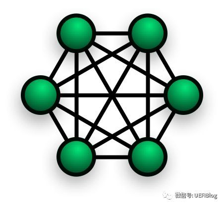

<!-- @import "[TOC]" {cmd="toc" depthFrom=1 depthTo=6 orderedList=false} -->

<!-- code_chunk_output -->

- [1 概述](#1-概述)
- [2 为什么需要片内总线?](#2-为什么需要片内总线)
- [3 星型连接](#3-星型连接)
- [4 环形总线(Ring Bus)](#4-环形总线ring-bus)
- [5 Mesh 网路](#5-mesh-网路)
- [6 结论](#6-结论)
- [7 参考](#7-参考)

<!-- /code_chunk_output -->

# 1 概述

在大多数普通用户眼里 CPU 也许就是一块顶着铁盖子的电路板而已. 但是如果我们揭开顶盖深入正中那片小小的集成电路我们会发现这里有着人类科技史上最伟大的奇迹. 几十亿个晶体管层层叠叠密密麻麻挤在一起占据着这个仅有一点几个平方厘米的狭小世界. **晶体管**们在"上帝之手"的安排下组成了**各个功能模块**. 而这些**功能模块之间**则是宽阔无比的**超高速公路**. 这条超高速公路如此重要以至于它的距离、速度和塞车与否会大大影响这个小小世界的效率.

这些**模块**就是**CPU 内部的功能模块**例如**内存控制器！！！**、**L3/L2 Cache**、**PCU**、**PCIe root complex！！！**等等而这条高速公路就是我们今天的主角片内总线了.

# 2 为什么需要片内总线?

片内总线**连接 Die 内部**的**各个模块(！！！各个模块！！！**)是它们之间信息交流的必须途径. 它的设计高效与否会大大影响 CPU 的性能. 如果我们把各个模块看做一个个节点那么它们之间相互连接关系一般可以有以下几种:

而我们 CPU 片内总线连接就经历了从**星型(Star**)连接 \-\-> **环形总线**(Ring Bus)\-\-> **Mesh 网络**的过程.

# 3 星型连接

早期 CPU 内部**模块数目较少**结构单一星型连结不失是一个简单高效的办法.

我们尊贵的**Core**无可争议的被放在**中心的位置**各个模块都和它连接而彼此并不直接交互必须要**Core 中转**. 这种设计简单高效被使用了相当长的时间.

问题随着**多 core**的出现而显现出来这个多出来的 core 放在哪里合适呢?一种星型连接的变种被利用起来. 它类似一种**双星结构**中间的节点似乎进行了有丝分裂一分为二各自掌管着自己的势力范围. 同时为了高效每个 Core 又伸出了些触手和别的 Core 的小弟发生了些不清不楚的关系. 问题被暂时解决了这种混乱的关系被固定下来世界又恢复了些许和平直到**Core 数目的进一步增加**.

# 4 环形总线(Ring Bus)

Intel 的服务器产品线是第一个受不了这种临时安排的. **至强 CPU**必须提供**更多的 CPU**而**低效的变种星形连结**限制了内核数目的增加加上各个模块之间通讯的需求越来越多一种新的总线便孕育而出.

在**Nehalem EP/EX**这个划时代的产品中很多新技术被引入进来 Intel 也由此确定了领先的地位. 而**Ring Bus**就是其中重要的一个.

我们可以看到 Ring Bus 实际上是**两个环**一个**顺时针环**和一个**逆时针环**. **各个模块**一视同仁的通过**Ring Stop**挂接在**Ring Bus**上. 如此设计带来很多好处:

1. **双环**设计可以保证**任何两个 ring stop 之间距离不超过 Ring Stop 总数的一半**延迟较低.
2. 各个模块之间交互方便**不需要 Core 中转**. 这样一些高级加速技术如 DCA(Direct Cache Access), Crystal Beach 等等应运而生.
3. **高速的 ring bus**保证了性能的极大提高. Core to Core latency 只有**60ns**左右而带宽则高达数百 G(记得 Nehalem 是 192GB/s).
4. 方便灵活. **增加一个 Core**只要在 Ring 上面加个新的 ring stop 就好不用像以前一样考虑复杂的互联问题.

Intel Xeon E5 v4 Low Core Count(LCC, 最多 10 个 core)

真是个绝妙的设计！然而**摩尔定律**是无情的计划能使用好久的设计往往很快就过时了这点在计算机界几乎变成了普遍规律.

Ring Bus 的缺点也很快随着内核的快速增加而暴露出来. 由于**每加一个 Core****ring bus**就长大一些**延迟就变大一点**很快 ring bus 性能就随着 core 的增多而严重下降**多于 12 个 core**后会严重拖累系统的**整体延迟**.

和星型连接一样一种变种产生了:

Intel Xeon E5-2600 V4 **High Core Count** Die(HCC, 16 个 core 以上)

注: **只有第一个 NUMA 节点**才连接 QPI Link、PCIE、UBox 和 PCU, 但是每个都连接了 Memory Controller

在**至强 HCC(High Core Count, 核很多版**)版本中又加入了一个 ring bus.

**两个 ring bus**各接**12 个 Core**将**延迟**控制在可控的范围内. **俩个 Ring Bus**直接用两个**双向 Pipe Line 连接**保证通讯顺畅. 于此同时由于 Ring 0 中的模块访问 Ring 1 中的模块延迟明显高于本 Ring 亲缘度不同所以**两个 Ring 分属于不同的 NUMA！！！**(Non\-Uniform Memory Access Architecture)node. 这点在 **BIOS 设计！！！** 中要特别注意.

这个是 **一个 socket！！！** 里面的**很多 core** 也就是说 **NUMA 不是以 socket 划分的！！！**, 而**和它的结构有关系！！！**

聪明的同学可能要问了如果 Core 比 12 个多比 24 个少些呢?是不是凑合塞到第一个 ring 里拉倒呢?其实还有个 1.5 ring 的奇葩设计:

Intel Xeon E5 V4 MCC(最多 12 \~ 14 个 core)

核大战的硝烟远远尚未平息摩尔定律带来的晶体管更多的都用来增加内核而不是提高速度([为什么 CPU 的频率止步于 4G?我们触到频率天花板了吗?](https://zhuanlan.zhihu.com/p/30409360))24 个 Core 的至强也远远不是终点那么更多的 Core 怎么办呢?三个 Ring 设计吗?多于 3 个 Ring 后它们之间怎么互联呢?这些困难促使 Intel 寻找新的方向.

# 5 Mesh 网路

Intel 在**Skylake**和**Knight Landing**中引入了新的**片内总线**: **Mesh**.

它是一种**2D**的 Mesh 网络:

Intel Skylake SP Mesh Architecture Conceptual Diagram:

Mesh 网络近几年越来越火热它的灵活性吸引越来越多的产品加入对它的支持包括我们的 Wifi 等等系统. Mesh 网络引入片内总线是一个巨大的进步它有很多优点:

1. 首先当然是灵活性. 新的模块或者节点在 Mesh 中增加十分方便它带来的延迟不是像 ring bus 一样线性增加而是非线性的. 从而可以容纳更多的内核.
2. 设计弹性很好不需要 1.5 ring 和 2ring 的委曲求全.
3. 双向 mesh 网络减小了两个 node 之间的延迟. 过去两个 node 之间通讯最坏要绕过半个 ring. 而 mesh 整体 node 之间距离大大缩减.
4. 外部延迟大大缩短:

⓵ RAM 延迟大大缩短:

Broadwell Ring V Skylake Mesh DRAM Example:

左边的是 ring bus 从**一个 ring**里面访问**另一个 ring**里面的**内存控制器！！！**. 最坏情况下是那条绿线拐了一个大圈才到达内存控制器需要 310 个 cycle. 而在 Mesh 网络中则路径缩短很多.

⓶ IO 延迟缩短:

Broadwell Ring V Skylake Mesh PCIe Example:

注: 在过去的几代中英特尔一直在使用 QuickPath Interconnect(QPI)作为高速点对点互连.  QPI 已被 Ultra Path Interconnect(UPI)取代后者是可扩展系统的更高效的一致性互连允许多个处理器共享一个共享地址空间. 根据确切的型号**每个处理器**可以有**两个或三个 UPI 链接**连接到**其他处理器**.

# 6 结论

Mesh 网络带来了这么多好处那么缺点有没有呢?它网格化设计带来复杂性的增加从而对 Die 的大小带来了负面影响这个我们会在下一篇文章中介绍同时介绍相关性能详细数据尽情期待.

最后请大家思考一下为什么不干脆用全互联 Full Connected 网络来连接 Die 中的各个节点呢?

# 7 参考

- 本文章来自: https://zhuanlan.zhihu.com/p/32216294
- Xeon\_e5 的 wikichip: https://en.wikichip.org/wiki/intel/xeon_e5
- Mesh Interconnect Architecture-Intel: https://en.wikichip.org/wiki/intel/mesh_interconnect_architecture
- Things are getting Meshy: Next-Generation Intel Skylake-SP CPUs Mesh Architecture: https://www.servethehome.com/things-are-getting-meshy-next-generation-intel-skylake-sp-cpus-mesh-architecture/
- Intel Core i9 7900X review: the best around, but the worst time to buy a high-end CPU: https://www.pcgamesn.com/intel/intel-core-i9-7900x-review-benchmarks
- Skylake(server): https://en.wikichip.org/wiki/intel/microarchitectures/skylake_(server)