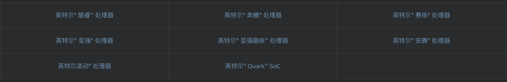
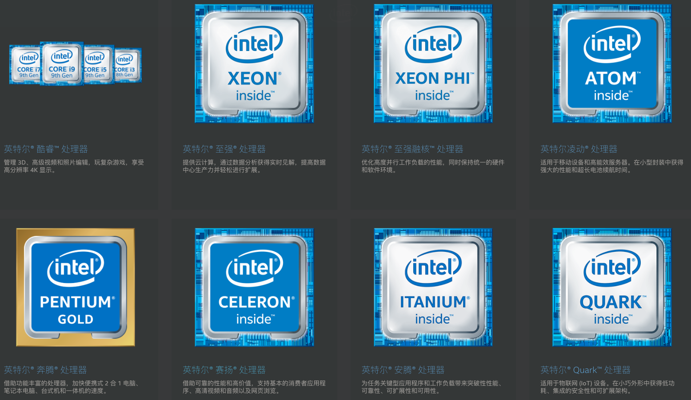
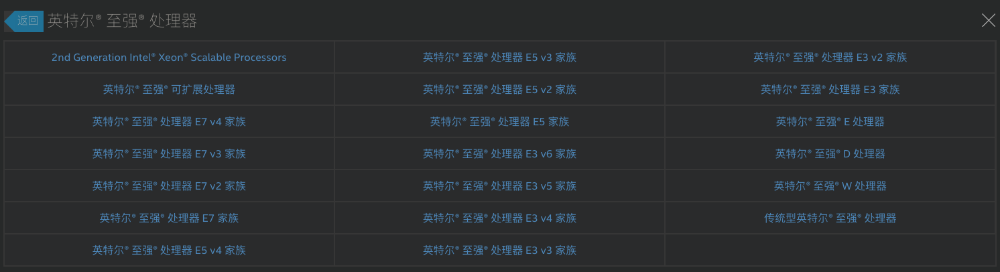

<!-- @import "[TOC]" {cmd="toc" depthFrom=1 depthTo=6 orderedList=false} -->

<!-- code_chunk_output -->

- [1 系列分类](#1-系列分类)
- [2 系列的所有产品](#2-系列的所有产品)
- [3 某个产品参数](#3-某个产品参数)
- [4 处理器编号的意义](#4-处理器编号的意义)
- [5 桌面 CPU 性能配置天梯图](#5-桌面-cpu-性能配置天梯图)
- [6 笔记本 CPU 性能配置天梯图](#6-笔记本-cpu-性能配置天梯图)
- [7 Intel 微架构](#7-intel-微架构)

<!-- /code_chunk_output -->

# 1 系列分类

链接: https://ark.intel.com/content/www/cn/zh/ark.html#@Processors

处理器以及场景用途: https://www.intel.cn/content/www/cn/zh/products/processors.html

这是目前在售的全部 8 个产品系列

在第二个链接, 可以通过筛选"台式机"、"移动式"、 "服务器"、 "工作站"

# 2 系列的所有产品

每一个系列的产品可以点进去查看, 比如 Xeon

# 3 某个产品参数

从上面可以点入查看详细信息参数

# 4 处理器编号的意义

笔记本电脑、台式机、移动设备的处理器编号: https://www.intel.cn/content/www/cn/zh/processors/processor-numbers.html

微服务器、服务器和工作站的处理器编号: https://www.intel.cn/content/www/cn/zh/processors/processor-numbers-data-center.html

# 5 桌面 CPU 性能配置天梯图

Intel 和 AMD 的: http://www.mydrivers.com/zhuanti/tianti/cpu/index.html

点击分别会进入 Intel 和 AMD 的详细信息, 包括 CPU 型号、架构、工艺、核心/线程、核心频率等.

# 6 笔记本 CPU 性能配置天梯图

http://www.mydrivers.com/zhuanti/tianti/cpum/index.html

# 7 Intel 微架构

https://www.intel.cn/content/www/cn/zh/architecture-and-technology/microarchitecture/microarchitecture-overview-general.html