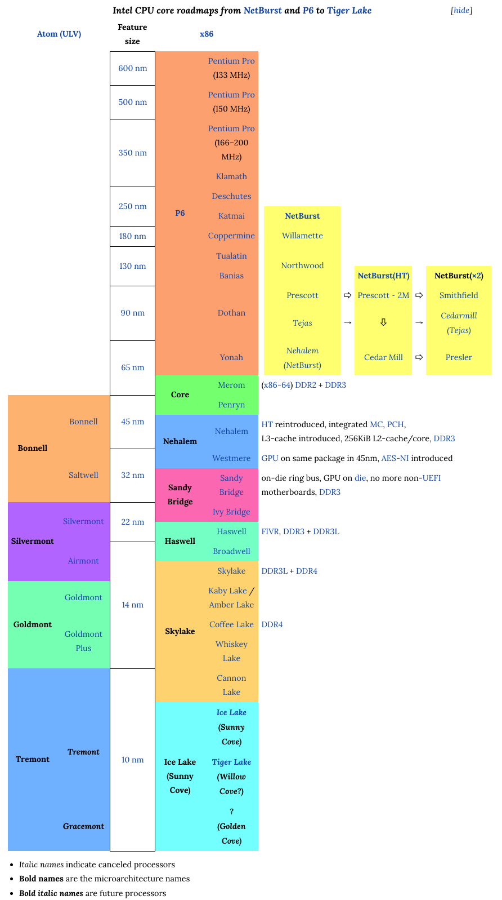
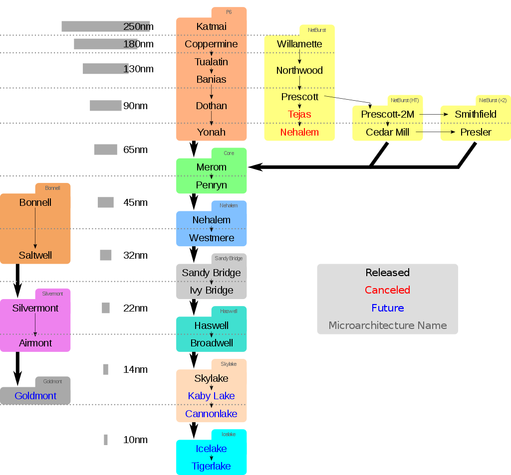
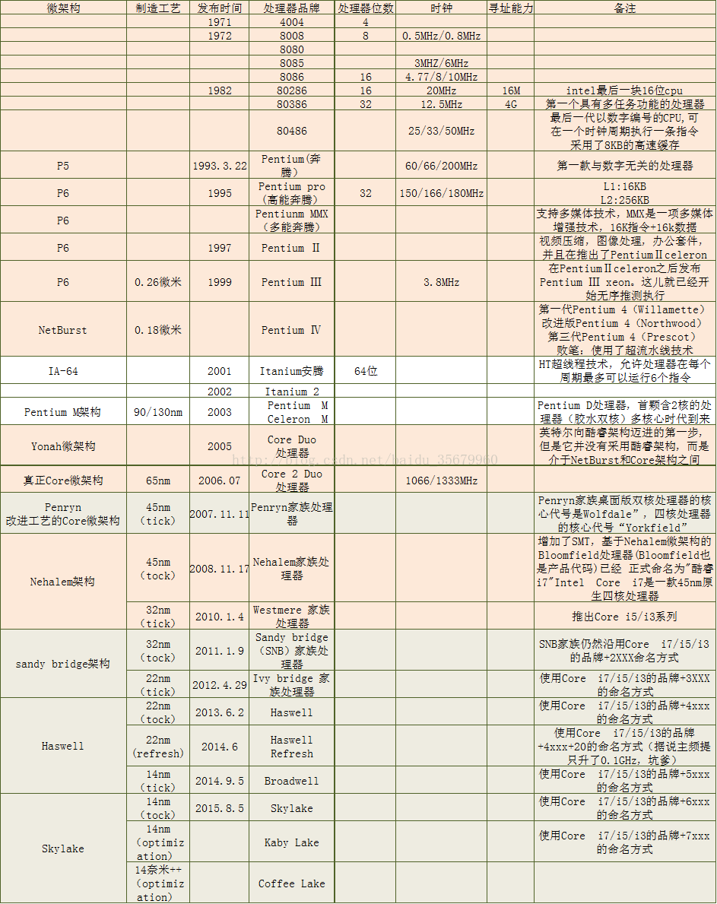
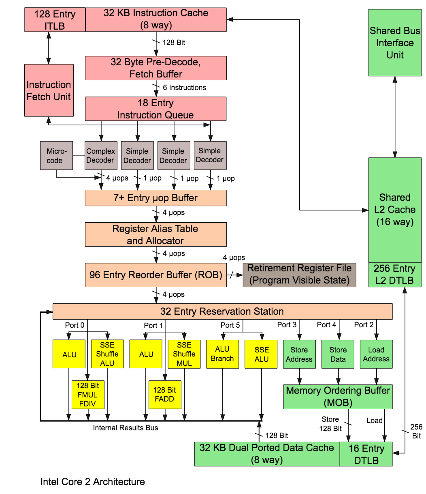
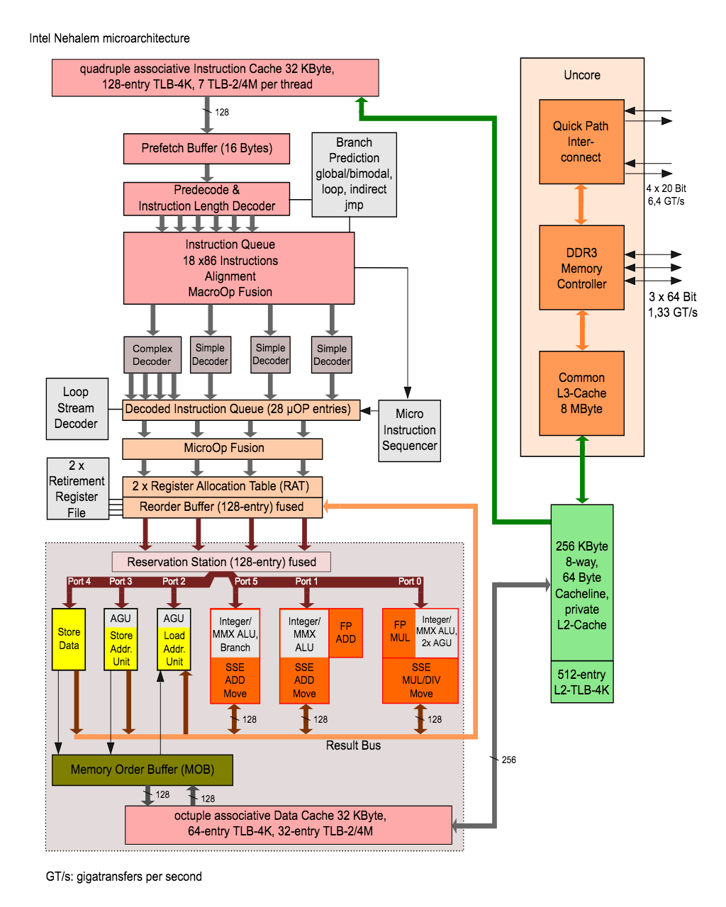
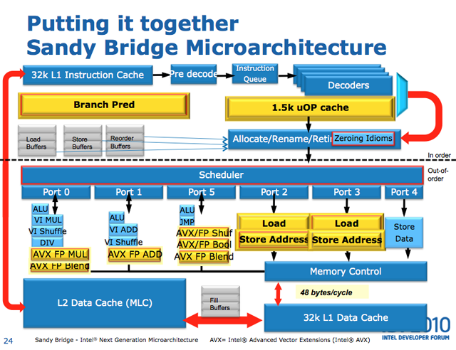
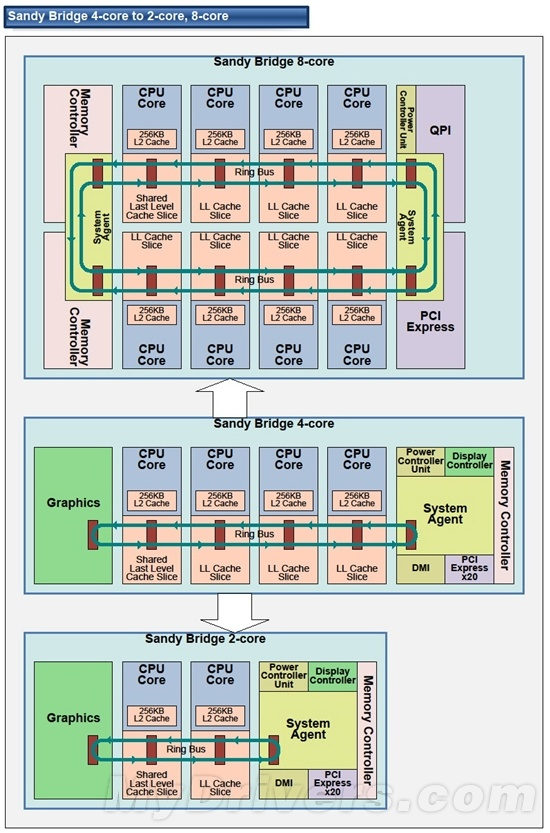
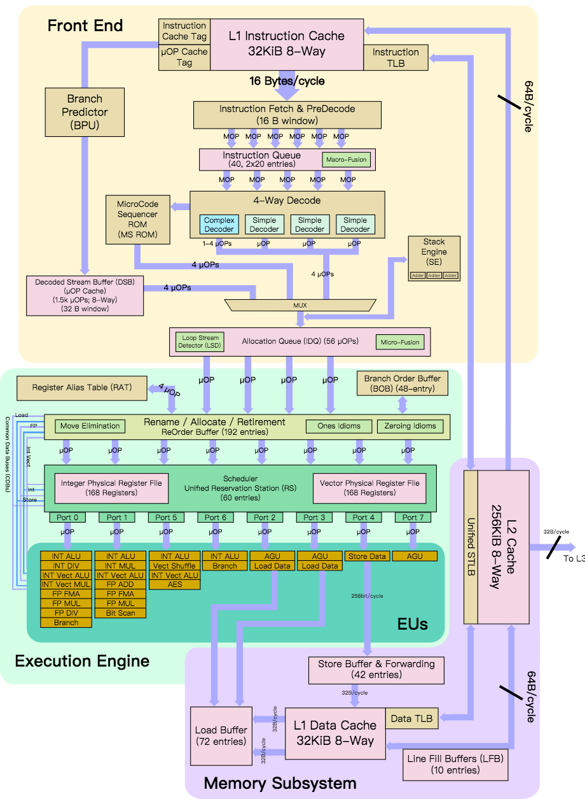
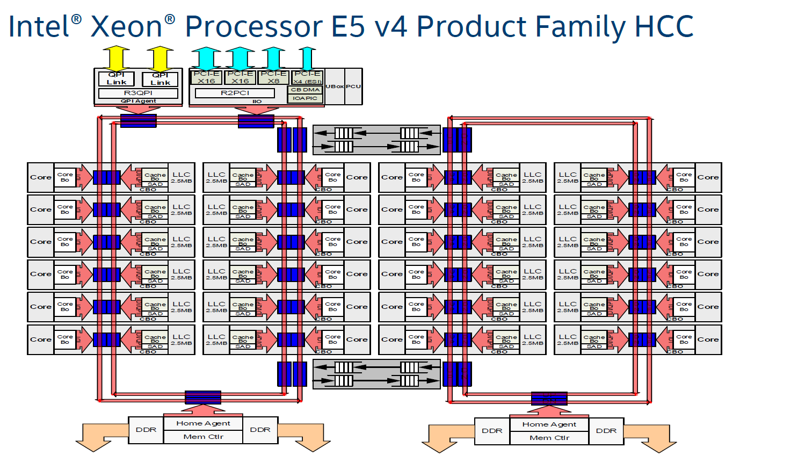
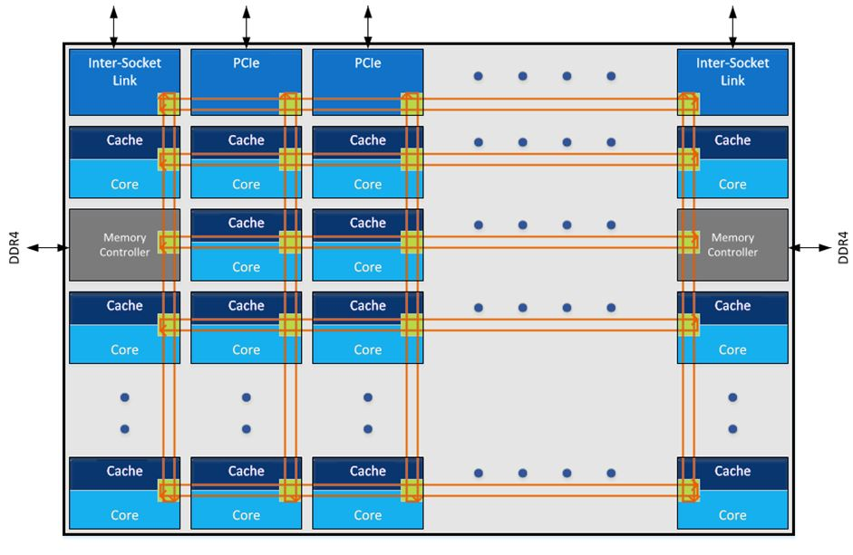

<!-- @import "[TOC]" {cmd="toc" depthFrom=1 depthTo=6 orderedList=false} -->

<!-- code_chunk_output -->

- [微处理器发展模式](#微处理器发展模式)
  - [Tick-Tock 模式](#tick-tock-模式)
  - [Process-Architecture-Optimization 模式](#process-architecture-optimization-模式)
- [产品发布路线图](#产品发布路线图)
- [P6](#p6)
- [Core](#core)
- [Nehalem](#nehalem)
- [Sandy Bridge](#sandy-bridge)
- [Haswell](#haswell)
- [Skylake](#skylake)
- [What's new!](#whats-new)
- [参考](#参考)

<!-- /code_chunk_output -->

# 微处理器发展模式

## Tick-Tock 模式

Tick-Tock 是 Intel 公司发展微处理器芯片设计制造业务的一种发展战略模式在 2007 年正式提出.

Intel 指出每一次处理器**微架构(microarchitecture**)的更新和每一次**芯片制程**的更新它们的时机应该错开使他们的微处理器芯片设计制造业务更有效率地发展. "Tick-Tock" 的名称源于时钟秒针行走时所发出的声响.

Intel 指出

- 每一次"**Tick**"代表着一代微架构的**处理器芯片制程**的更新意在处理器性能几近相同的情况下缩小芯片面积、减小能耗和发热量, 有时候也会引入新的指令, 比如 2014 年末的 Broadwell;
- 而每一次"**Tock**"代表着在上一次"Tick"的芯片制程的基础上更新**微处理器架构**提升性能, 原来是每次 tock 定义一个新的微体系架构. 但在进入 14nm 时明显碰壁, 2014 年时候, 在 Intel 以微架构的较小更新的形式创建了 tock(当时是 Haswell)的新概念"tock refresh(当时是 Haswell Refresh"), 其以改进 Haswell 为主, 不将其认为是新一代架构.

一般一次"Tick-Tock"的周期为两年"Tick"占一年"Tock"占一年.

此策略常被许多计算机玩家戏称"挤牙膏策略"因为每一代新处理器性能和前一代处理器性能的差距很短就好像 Haswell 的 4790K 和 Skylake 的 6700K 那样

## Process-Architecture-Optimization 模式

2016 年 3 月 22 日 Intel 在 [Form 10-K](https://www.wikiwand.com/en/Form_10-K) 报告中宣布, 弃用"Tick\-Tock"模式, 采用三步"Process\-Architecture\-Optimization"模式, 即"制程、架构、优化". 具体来讲, 将 Tick Tock 放缓至三年一循环即增加优化环节进一步减缓实际更新的速度.

在此模式下, 三代处理器都将是同一个制程流程下生产, 三代中第三代专注于优化(Optimization).

举例, Process 是 Broadwell(代表 14nm 第一代), Architecture 是 Skylake(代表这个微架构的第一代, 但是制程还是 14nm), 第一代优化(Optimization)是 Kaby Lake. 第二代优化是 Coffee Lake, 在 14nm 上共生产了 4 代. 这些名称称为 code name.

当前的环节为: Process, Architecture, Optimization 即制程、架构、优化

- 制程: 在架构不变的情况下缩小晶体管体积以减少功耗及成本
- 架构: 在制程不变的情况下更新处理器架构以提高性能
- 优化: 在制程及架构不变的情况下进行修复及优化将 BUG 减到最低并提升处理器时脉

# 产品发布路线图

Intel 的微处理器架构路线图, 从 NetBurst 以及 P6 到 Tiger Lake

处理器与微架构对照表: https://blog.csdn.net/qq_43401808/article/details/85553914 (更新至 2019/01/01)

Microprocessor name | Microarchitecture code name
------- | -------
Intel Pentium | P5 
Intel Pentium MMX  | P5 
Intel Pentium Pro & II & III | P6 
Intel Pentium 4 (NetBurst)  | Netburst 
Intel Pentium 4 with EM64T, Pentium D, etc. | Netburst, Prescott 
Intel Pentium M, Core Solo, Core Duo | Dothan, Yonah 
Intel Core 2  | Merom, Wolfdale 
Intel Core i7  | Nehalem, Westmere
Intel 2nd generation Core  | Sandy Bridge 
Intel 3rd generation Core  | Ivy Bridge 
Intel 4th generation Core  | Haswell 
Intel 5th generation Core  | Broadwell 
Intel 6th generation Core  | Skylake 
Intel 7th generation Core  | Kabylake
Intel 8th generation Core  | Coffee Lake
Intel 9th generation Core  | Coffee Lake Refresh

# P6

[P6](https://www.wikiwand.com/en/P6_(microarchitecture)) 是 Intel 在 1995 年推出的**第六代微架构**它的后继者是 2000 年的 NetBurst 微架构但是最后在 Pentium M 之间又出现 P6 的踪影. 而 Pentium M 的 P6 的后继者则是 Intel Core 微架构.

最早用于 **1995** 年的 Pentium Pro 处理器后面 2000 的 NetBurst 感觉应该也算是包含在 P6 这个大系列里面一直到 2006 年的 Core 为止.

这个横跨了将近 10 年的架构系列最早是 600nm 的工艺一直到最后达到了 65nm 算是不断摸索完善出来的也是 Intel 走上比较规则的架构发展之路的一个起点.

P6 相对于之前的架构加入了很多新的技术:

- 预测执行(Speculation)和乱序执行！！！
- 14 级流水线第一代奔腾的流水线只有 5 级 P6 的 14 级在当时是最深的
- 片内的 L2 cache！！！
- 物理地址扩展达到最大 36 位理论上这个位宽最大可以支持到 64G 的内存(虽然制程的地址空间还是只能用到 4G)
- 寄存器重命名！！！
- MMX 和 SSE 指令集扩展开始 SIMD 的思路了

以上这些都是现代处理器中非常重要的设计.

更重要的是从这里开始奠定了 Intel 沿着摩尔定律发展的 Tick-Tock 架构演进道路:

- Tick 改进制程工艺微架构基本不做大改重点在把晶体管的工艺水平往上提升
- Tock 改进微架构设计保持工艺水平不变重点在用更复杂、更高级的架构设计

然后就是一代 Tick 再一代 Tock 交替演进.

P6 的末尾阶段首次出现了双核当时的双核还是基本上像是把两个单核用胶水粘在一起的感觉.

具体可以参见相关维基

P6 中文维基: https://zh.wikipedia.org/wiki/P6%E5%BE%AE%E6%9E%B6%E6%A7%8B

# Core

最早的名字里面带 Core 这个牌子的处理器是 Core Duo 它的架构代号是 Yonah 其实还是算是个 NetBurst 的改版只是跟后期的 NetBurst 走向了不同的发展道路虽然名字上有 Core 但不是 Core 架构. 主要的设计目标是面向移动平台因此很多设计都是偏向低功耗高能效的.

再后来的 Core 2 Duo 才是采用 Core 架构的新一代处理器全线 65nm 然后微架构在 Yonah 之上做了比较大的改动.

Core 架构把 NetBurst 做深了的流水线级数又砍下来了**主频**虽然降下来了(而且即使后来工艺提升到 45nm 之后也没有超过 NetBurst 的水平)但是却**提高了整个流水线中的资源利用率**所以性能还是提升了; 把奔腾 4 上曾经用过的超线程也砍掉了; 对各个部分进行了强化双核共享 L2 cache 等等.

从 **Core** 架构开始是**真的走向多核**了就不再是以前"胶水粘的"伪双核了这时候已经有最高 4 核的处理器设计了.

# Nehalem

Core 从 65nm 改到 45nm 之后基于 45nm 又推出了新一代架构叫 Nehalem 这一代的提升引入了相当多的新技术算是个非常重要的里程碑.

Core 这个名字变成了桌面 PC 以及笔记本处理器的系列名后面架构继续更新然而 Core(酷睿) 这个名字就留下来了然后系列开始细分这个架构推出了第一代的 i7.

相对上一代的主要改进:

- 引入了片内 4-12 MB 的 L3 cache！！！
- 重新加入超线程(奔腾 4 时代有后来砍掉了这一代开始重新引入)
- Intel Turbo Boost 1.0！！！
- 分支预测器分级！！！
- 二级的 TLB
- 每个核上有 3 个整数 ALU, 2 个向量 ALU and 2 个 AGU
- 采用 Intel QPI 来代替原来的前端总线！！！
- PCIE 和 DMI 控制器直接做到片内了不再需要北桥
- IMC(集成内存控制器)内存控制也从北桥移到了片内
- 第二代的 Intel 虚拟化技术
- 流水线加到 20 到 24 级
- 其他指令扩展升级等等

相对上一代的性能:

- 同等功耗下 10-25% 的单线程性能提升 20-100% 的多线程性能提升！！！
- 同等性能下功耗降低 30%
- 15-20% 的 clock-to-clock(不知道这个词应该怎么翻译) 性能提升

工艺提升到 32nm 的 Westmere 后推出了第一代的 i5 和 i3.

Xeon 系列也从 Westmere 开始推出了第一代 E 命名的 E7-x8xx 系列.

# Sandy Bridge

32nm 的下一代 Tock 是 Sandy Bridge 二代 Core i 系列以及第一代 Xeon E3、E5 系列也基于这个架构:

- Intel Turbo Boost 2.0
- 增大了 L1 和 L2 cache
- 共享的 L3 cache 也同时支持片上的核芯显卡
- IMC 强化成了 GMCH(integrated graphics and memory controller)片上显卡共用主存作为它的显存
- 每个核上的运算部件增强
- 分支预测增强
- 微操作译码部分新增了一个 cache(uop cache)
- 14 到 19 级指令流水线！！！(长度区别基于上面那个 uop cache 是否命中)
- 多个核间、核芯显卡、cache 间用了环状总线(ring bus)
- Intel Quick Sync Video 支持视频的硬解码
- 其他指令扩展升级等等

Ring Bus:

真是令人惊叹的操作啊.

- 这个故事教育我们 cache 这个思路很多地方都能用到！！！
- 这个简单的想法能起到的效果可不简单~~

相对上一代的性能:

- 11.3% 的 clock-to-clock 性能提升
- 2 倍的显示性能提升(...这个不用想都知道会很多...)

Tick 到 22nm 的下一代架构叫 Ivy Bridge 三代 Core i 系列和二代 Xeon E 系列:

- 16 位浮点指令
- 片内硬件随机数生成器
- PCIE 3.0
- 其他各个部分都做了很多提升

# Haswell

22nm 的 Tock 到了 Haswell 四代 Core i 系列和三代 Xeon E 系列:

- 每个核内的部分进一步升级更多的 ALU、各种带宽增加等等
- 支持 DDR4 内存
- 提供部分雷电接口(Thunderbolt)支持
- 完整集成电压调节器(FIVR)把主板上的一部分电源控制做到了片内
- 更高级的功耗控制系统增加了 L6 和 L7 两级 CPU 睡眠状态
- 其他指令扩展升级等等

相对上一代的性能:

- 8% 的向量运算能力提升
- 5% 的单线程性能和 6% 的多线程性能

好像提的不是很多 Intel 开始挤牙膏了

14nm 的 Tick 到了 Broadwell 五代 Core i 系列和四代 Xeon E 系列. 各种指令集升级、支持了很多新功能特性.

# Skylake

14nm 的 Tock 到了 Skylake 进入 XXlake 时代六代 Core i 系列.

一系列指令集升级、新功能特性等等. 上一代加入的 FIVR 这里又拿掉了其他包括雷电 3.0 等等好多升级什么的.

>从比较粗粒度的架构图来看 Skylake 的架构基本上跟前面那张 Haswell 的没什么差别大概就是寄存器什么的数字上往上涨了一些所以图这里就不贴了.
>(当然细节上肯定还是有挺多升级的)
>挤牙膏啊挤牙膏疯狂挤牙膏

这个阶段的微架构除了升级指令、加上更多扩展功能以外不像 Nehalem 和 Sandy Bridge 那时候能有更多革新的设计了而且由于制程已经达到了很小的程度再往下可能很快就要碰到工艺极限了所以摩尔定律开始放缓性能很难有特别大的提升了.

所以 Intel 开始从 Tick-Tock 两步升级战略转变到 Process-Architecture-Optimization 的三步升级战略分别是提升工艺制程升级微架构然后再在微架构基础上进行优化.

其实这个三步战略从上面 Haswell 时代就已经开始了 Broadwell 前面还有个 refresh 的 Haswell 升级版 i3/i5/i7 4x20 系列.

Skylake 优化版的下一代是 Kaby Lake 即七代 Core i 系列. 相比 Skylake 提升了主频频率切换更快提升了显示核心等等.

Kaby Lake 继续优化到了 Coffee Lake 八代 Core i 系列. 这个系列的 i3 提到了 4 核 i5、i7 都从 6 核开始起步然后继续提升主频各种优化等等.

# What's new!

话说 Kaby Lake 和 Coffee Lake 这个时代 Intel 又推出了新的 Core i 系列命名为 Core i9 第一代的桌面版 Core i9 是 Skylake 架构(Skylake-X)第一代笔记本版 i9 是 Coffee Lake 架构.

那么本该在这个时候推出的第五代 Xeon 也就是 E3/E5/E7 的 xxxx v5 版呢?

Skylake 的第五代 Xeon 摆脱了原本的系列名而是重新改成了 Bronze、Silver、Gold、Platinum 4 个系列(一股浓浓的网络游戏装备风说不定再下次改名就可能改名叫稀有、史诗、传说什么的 -> _ -> ). 青铜和白银系列支持双路(原本的 E5-24xx、E7-28xx 系列)黄金系列支持四路(原本的 E5-46xx、E7-48xx 系列)白金系列支持八路(原本的 E7-88xx 系列).

这里还有个重要变动 Intel 沿用了很多年的 Ring Bus 片内总线从 Skylake-X 开始改掉了！前面说 Sandy Bridge 开始微架构设计上已经全面采用了 Ring Bus 其实最早到 Nehalem 时代的 Xeon 系列就已经开始用上 Ring Bus 了主要用于解决多核(非常非常多的核)之间的共享、扩展等等的问题.

然而随着 CPU 的发展核越来越多所以一个 CPU 片内还可能有多个 Ring Bus 就像下面这样. 这会有什么问题呢?

以前我们考虑多路服务器里面的 CPU 亲和性的时候只考虑过 socket 之间的 NUMA 关系两片 CPU 核之间会有亲和性问题. . . . . . 谁想过在下面这种结构的单片 CPU 里面其实也已经是个 NUMA 结构了！！！

但是当核的数量持续增长 Ring Bus 的延迟也会越来越高终究不是个办法 Intel 在 KNL 上已经试过 2D Mesh 的总线结构了大概是效果比较好于是从 Skylake-X 开始之后的系列开始全面改用 Mesh 结构.

[破茧化蝶从 Ring Bus 到 Mesh 网络 CPU 片内总线的进化之路](https://zhuanlan.zhihu.com/p/32216294)

# 参考

- Intel 官方 Tick\-Tock 模式主页: https://www.intel.com/content/www/us/en/silicon-innovations/intel-tick-tock-model-general.html
- Intel 处理器架构演进: http://jcf94.com/2018/02/13/2018-02-13-intel/
- Tick-Tock 维基百科: https://www.wikiwand.com/en/Tick%E2%80%93tock_model
- 中文 Tick-Tock 维基: https://zh.wikipedia.org/wiki/Intel_Tick-Tock
- Intel 微处理器列表: https://zh.wikipedia.org/wiki/%E8%8B%B1%E7%89%B9%E5%B0%94%E5%BE%AE%E5%A4%84%E7%90%86%E5%99%A8%E5%88%97%E8%A1%A8
- WikiChip: https://en.wikichip.org/wiki/WikiChip
- MOEPC: http://www.moepc.net/
- 科普: intel CPU 微架构的发展史: https://blog.csdn.net/baidu_35679960/article/details/77884485

