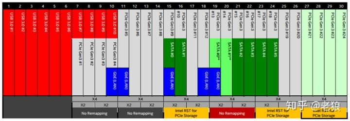

<!-- @import "[TOC]" {cmd="toc" depthFrom=1 depthTo=6 orderedList=false} -->

<!-- code_chunk_output -->

- [南桥的江湖地位问题](#南桥的江湖地位问题)
- [为什么不是 SOC](#为什么不是-soc)
- [什么是 HSIO?](#什么是-hsio)
- [DMI 的带宽问题](#dmi-的带宽问题)
- [结论](#结论)
- [参考](#参考)

<!-- /code_chunk_output -->

南桥芯片这个统管外部 IO 的芯片组正在逐步变得面目可憎起来. 经历了 ICH 到 PCH 的转变越来越多的人都在质疑它的存在. 为什么不把 PCH 集成进 CPU 中?**DMI 4 个 lane**的小水管下面带那么多 PCIe root port 加各种 USB 3.0/3.1 和 SATA port 会不会肠梗阻?今天我们一起来分析一下这么做背后深层次的原因.

# 南桥的江湖地位问题

熟悉计算机系统演变历史的小伙伴们都知道. 很久很久以前(也没有多久了)计算机主板上有**CPU**、**北桥(MCH**)和**南桥(ICH**)这三个主要的芯片:

由于**FSB**变成了**系统效能的瓶颈**和**对多 CPU 的制约**在**台式机**和**笔记本**电脑中**MCH**被请进**CPU 中****服务器**市场虽然短暂的出现了**IOH**但也慢慢的**被 CPU 吞噬**.

前后简单的对比:

注: 上面的是 Intel G45 和 Intel H55 芯片组

**CPU 中 MCH 原来的部分(！！！**), 在**桌面 CPU**中叫做 System Agent(SA), 在**服务器 CPU**中叫做**uncore(和内核 core 对应**). 它基本还负责原来的功能, 那就是 **内存管理(！！！内存控制器在 CPU 里面???**) 和提供 **至少 16 个 Lane** 的**PCIe Root port(！！！RC 在 CPU 里面??**)来驱动**显卡！！！**(服务器 uncore 还包括 QPI).

这绝不是表面看起来"换个马甲"这么简单. 脱离了**FSB 这条小细管道****内存控制器**、**PICe Root Port 的 root complex**和**内核**之间的通信变成了**ring bus**乃至**目前的 Mesh 网络**这种**片内总线**羊肠小路变成了高速公路. 如此改变让原来的瓶颈消失了计算机效能才在酷睿后有了质的飞跃.

作为统管大部分 IO 设备的江湖大佬 ICH 到 PCH 的转变却十分的小时至今日除了**DMI**随着**PCIe 3.0**升级到**DMI 3.0**和增加了更多的功能外变化相对较小. 很多人看他不顺眼欲除之而后快让江湖最后一个大佬 CPU 一统主板.

如果也把**PCH 整合进 CPU 单芯片解决方案！！！**也就是**SOC(System On a Chip！！！**)会带来很多好处:

- 主板可以更便宜. 少一块芯片的钱主板设计简单一些线路少些这些都会帮助主板成本下降.
- **南桥的设备**可以摆脱**DMI 3.0 8Gbps \* 4**的带宽限制. 如果我们把 PCH 中高速的 USB 3.0/3.1 SATA ports 和 PCIe root ports 提供的带宽都加在一起我们就会发现这个数字会远远高于 DMI 3.0 能够提供的带宽. 如果将南桥整合进 CPU 这些设备也就可以和原北桥的 PCIe root port 一样接入 IOSF 骨干 bus 摆脱 DMI 小水管.

# 为什么不是 SOC

现实中我们除了看到**ATOM 系列全部是 SOC**、部分低端入门系列服务器是 SOC(它原因比较有趣我们今后再说)外绝大部分主流系统 PCH 还是傲娇地继续战斗在第一线. 这是为什么呢?

有两个原因十分明显:

- 集成进 PCH 会造成**CPU Die 增大不少**从而造成 CPU 良率下降很多成本增加明显. 这里有一篇讨论 Die 大小和良率的文章: [CPU 制造的那些事之二: Die 的大小和良品率](https://zhuanlan.zhihu.com/p/29767262)
- **PCH 和 CPU 松耦合**从而 CPU 和 PCH 可以单独生产采用不同的工艺. 实际上**CPU**往往采用**最新的制程**而**PCH**往往使用**前期的制程**.

还有一个十分重要的原因也许是最重要的原因往往不被人所知那就是**CPU 的引脚 pin 不够用了**！

如果我们看现在的 CPU 引脚因为内存 channel 的不断增加和一些新的功能 LGA 封装的引脚不断增加一千多个引脚密密麻麻蔚为壮观. 随便增加引脚会带来 CPU 兼容性的问题 Intel 花了很大力气才能基本保证 2 年的引脚不变而 AMD 则为了保证 4 年引脚兼容性更付出了巨大的代价个中原因我们今后再讲.

如果我们再看**PCH 的引脚**就会发现它比 CPU 还要糟糕.

- 几乎所有**低速的引脚**都**被复用**了某些引脚甚至有三到四个功能！需要**BIOS 来选择(通过 MUX**).

- **高速引脚**通过**HSIO**也被**复用**.

如果**PCH 被整合到 CPU**中会给引脚问题带来灾难性的后果而主板因为引脚的急剧增加也对工艺和稳定性带来负面影响.

# 什么是 HSIO?

**PCH 的引脚**就那么多而人们对**高速设备**尤其是**USB host**和**PCIe root port**的需求却越来越大. 在所有低速引脚已经被充分挖潜而**低速引脚**和**高速引脚不能复用**(想想看为什么)的前提下如何提供**更多的高速设备**同时**尽可能不很快增加引脚数量**的问题被提上日程.

在引入 Flex IO 后逐渐在所有 PCH 甚至 ATOM SOC 上 HSIO 被作为一种高速设备复用技术被集成进入芯片中:

Denverton microserver SOC:

每一路 HSIO Lane 提供 8 Gbps 的带宽. 内部的 PCIe/USB/SATA 设备控制器通过一层 HSIO 映射关系表对应到外部引脚上:

譬如我们可以将 HSIO \#10 选择连接到 USB 3.0 \#10 上或者是 PCIe \#4 上甚至是 GBe(PCH 集成网卡). 如此这般给了主板厂商很大的自由度让主板厂商根据主板的实际情况自由选择要多少 PCIe 多少 USB 或者 SATA.

另外需要澄清的是 DMI 并不在 HSIO 中.

# DMI 的带宽问题

DMI 3.0 4 × 8Gbps 怎么带动这么多的高速 IO?我们上图中有 30 个 HSIO 每个支持 8Gbps 如果他们都接上设备会不会在 DMI 上造成拥堵?

当然会不过在普通的台式机上这个问题不是很严重而在高端台式机和服务器上是通过高端 PCH 提供的 uplink 直连 CPU 来解决的. 你看的没错 PCH 也有很多种高端 PCH 甚至 HSIO 都会多一些. 借用一句《动物庄园》里的话:

所有 PCH 生来平等但贵的 PCH 更平等一些.

# 结论

引脚的稀缺性很多人都没有意识到. 于此同理 HSIO 资源也是稀缺的每升级一代 PCH 就会提供更多的 HSIO 来提供更多的 USB port 因为现在越来越多的人选择 M.2 NvME SSDPCIe root port 也捉襟见肘起来. 更多的 HSIO 可以让主板厂商有更多的腾挪和发挥空间.

最后给大家两个思考题 Coffeelake CPU 引脚图如下:

Kabylake CPU:

1. 说引脚不够用为什么电源和地占据了几乎一半引脚?
2. 同样 1151 socket 从 Kabylake 到 Coffeelake 什么变了为什么?

# 参考

- 本文章来自于: https://zhuanlan.zhihu.com/p/47479121
- 问题 1 答案在: [CPU 底部的小块是干什么用的?为什么 CPU 这么多电源引脚?](https://zhuanlan.zhihu.com/p/48593932)