<!-- @import "[TOC]" {cmd="toc" depthFrom=1 depthTo=6 orderedList=false} -->

<!-- code_chunk_output -->

- [物理内存条](#物理内存条)
- [2 DRAM 原理](#2-dram-原理)
- [3 内存颗粒容量限制](#3-内存颗粒容量限制)
- [4 结论](#4-结论)
- [5 参考](#5-参考)

<!-- /code_chunk_output -->

# 物理内存条

我们平时看到内存条有的上面单面有 8 个内存颗粒:

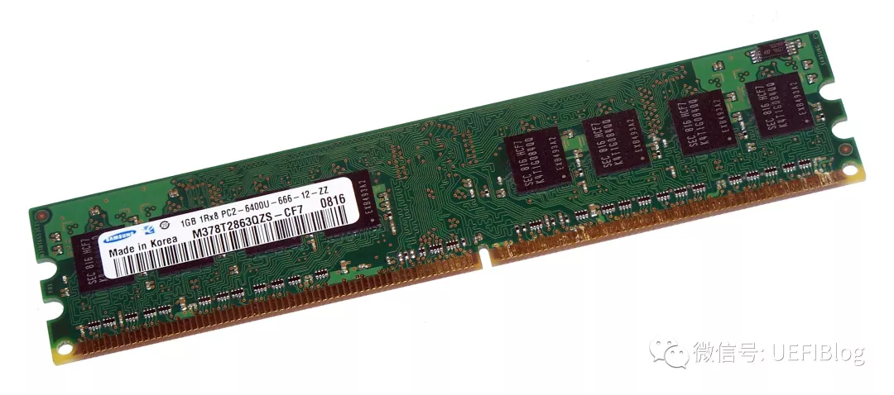

上图就是 1R X 8 DIMM

有的则有 16 个内存颗粒:

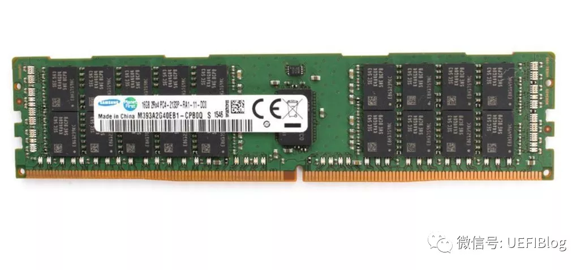

上图就是 2R X 4 DIMM; 多出来几个颗粒是 ECC 校验用

甚至还有单面 32 个颗粒的超高怪物:

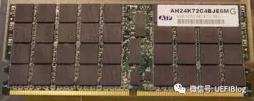

上图就是 4R X 4 DIMM.

另一篇文章讨论了服务器能够支持的内存最大容量.

得出了结论: **最大内存**是由能够**插多少条内存**决定的因为**每根内存条**现在**最大 128GB(傲腾内存已经超过 512GB 了**)**整体内存容量**就**被限制**了下来这不是钱多钱少的问题.

是不是可以通过不停增加颗粒数目来堆出超高内存容量的内存条呢?答案当然是否定的了. 今天我们就一起来探讨一下问什么.

首先我们假定不考虑内存颗粒能不能做出这么大的容量仅仅理论探讨. 限于篇幅为了简化讨论范围我们给问题设置了一些限制:

1. **仅讨论 DDR4**包括**UDIMM DDR4**和**RDIMM DDR4**. DDR3 因为本身支持的容量就小而且基本已被淘汰我们就不必哀悼它了. DDR5 目前还没有上市我们等它成熟后再来重新回顾它的理论极限. LRDIMM 会有些许顾及担不是重点.

2. 讨论基于**DDR 内存的标准**: **JEDEC 标准**.

**内存条的容量**和它的**基本单位**: **内存颗粒**的**组织方式**息息相关. 如果我们仔细看上面那三种内存条和注解你能不能发现一些规律呢?细心的同学也许发现了:

- **越大的内存容量****nR**中的**n 就越大**;
- 与此相反**越大的内存容量**X n 中的**n 反而越小**.

这是为什么呢?我们需要从 DRAM 的原理讲起.

# 2 DRAM 原理

内存**DRAM**的**每个单元**可以看作**一个晶体管**和**一个电容**的组合:

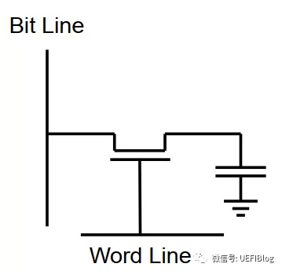

电容负责存储充过电时是 1 没充过电是 0 这就是内存是如何存储数据的.

**晶体管**是个**开关**用于**选中该电容**. **Word line 被选中**晶体管导通电容的就和 bit line 导通可以读出 0 和 1. 正是因为**内存每个单元如此简单**才能如此大规模组织起来形成**低价而密度很高的内存颗粒**.

这种方式设计简单但是在充放电时电压和电荷管理有很多麻烦. 所以引入了 Sense Amplifier. 单元就变成了这样:

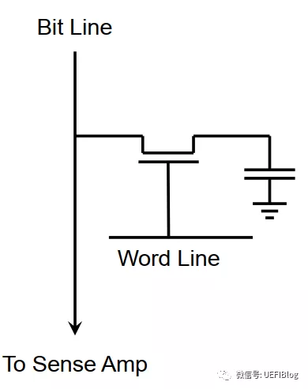

单元还是只有一个电容和一个晶体管. 但 Sense Amp 就复杂了不少:

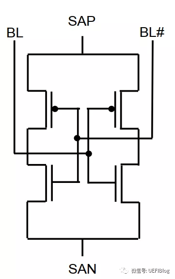

Sense Amp 一般由 6 个以上的晶体管组成. 比较昂贵但是因为整个 bank 只有一组 Sense Amplifier 所以问题不大而且好处不少.

好了有了单个单元我们来组成一个内存组试试:

上图中绿色箭头是 Sense Amp

看起来简单而优美一个 word line,选中后所有 16 单元都被 Sense Amp 缓存漂亮！慢着似乎那里不对?是的这样效率太低原来 1 个单元有 1 个晶体管和一个电容组成现在平均变成了 7 个晶体管和 1 个电容这和 DRAM 的低成本设计目标是违背的必须减少 Sense Amp 的个数. 有没有更好的解决办法呢?

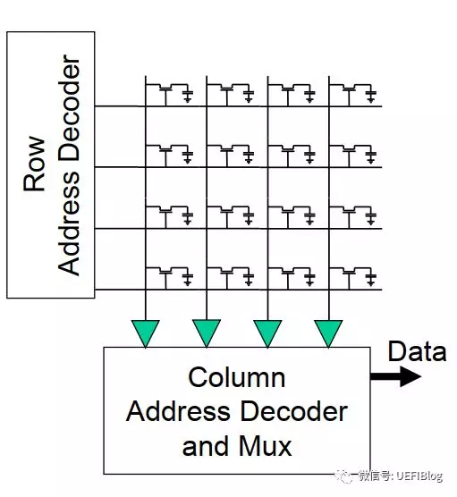

这样好多了还是 16 个存贮单元但是仅仅用了 4 个 sense amp 代价是 word line 从一个变成了 4 个. 这是减低成本必须付出的代价. 现在我们推广成更大的形式:

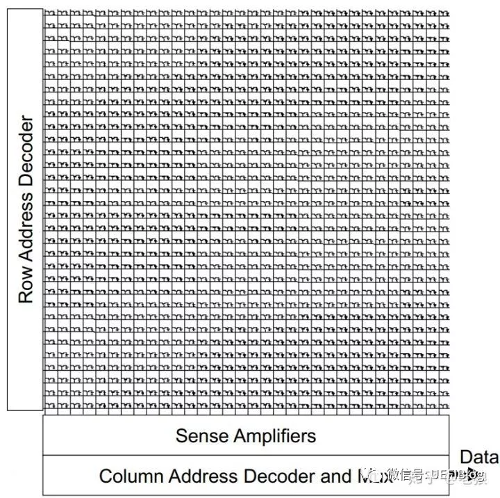

bank 里的每个 row 共享一个 word line 行激活 ACT 后该 row 上的 word line 高电平 row 上的存储内容会被该 bank 的 Sense Amplifier 缓存. 这个内存单元有 32 个行地址(row address)32 个列 5 个列地址(column address). 地址线太多有没有办法减低呢?如果一次列选中能够送出多个内容就好了:

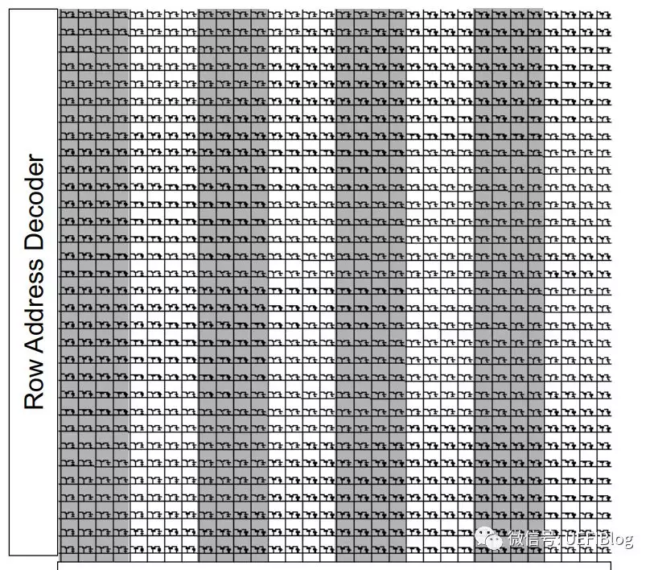

上图属于: X 4 内存 array32 Bit 位宽

这样同样寻址这些单元但列地址从 5 个减小成 3 个. 太棒了！

我们知道 X86 的 cache line 是 64 Bytes 它会一次向内存控制器请求整个 cache line. 内存控制器发现他们是连续的地址后会用一次用 burst 方式读取 8 个字长每字长是 64 个 bits. 64 个 bits 是内存控制器读取的最小单位. 这非常重要为了完成必要条件我们必须继续扩展内存单元:

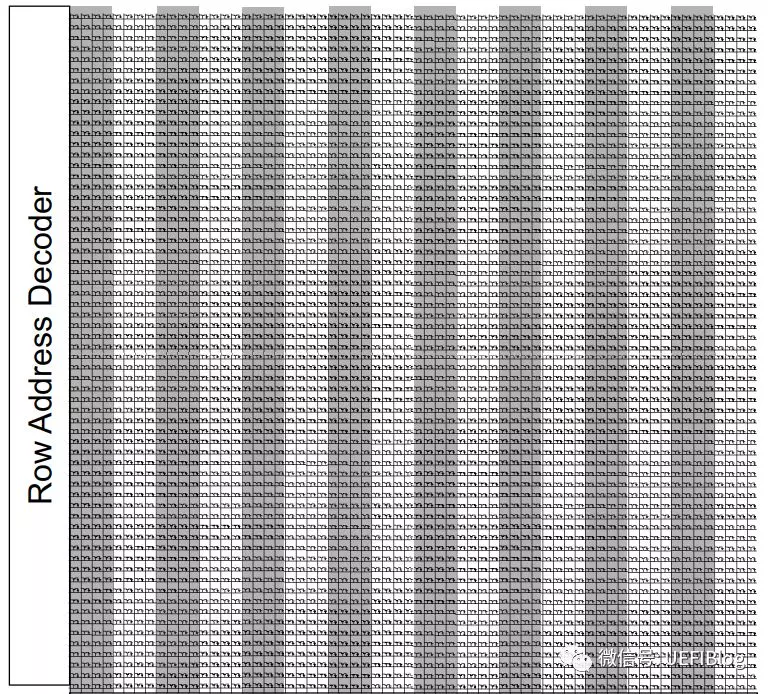

上图是: X 4 内存 array64Bit 位宽

我们数一下共有 16 个 column4 个 column address. 继续扩张成 DDR4 标准的 4 个 bank 就变成了:

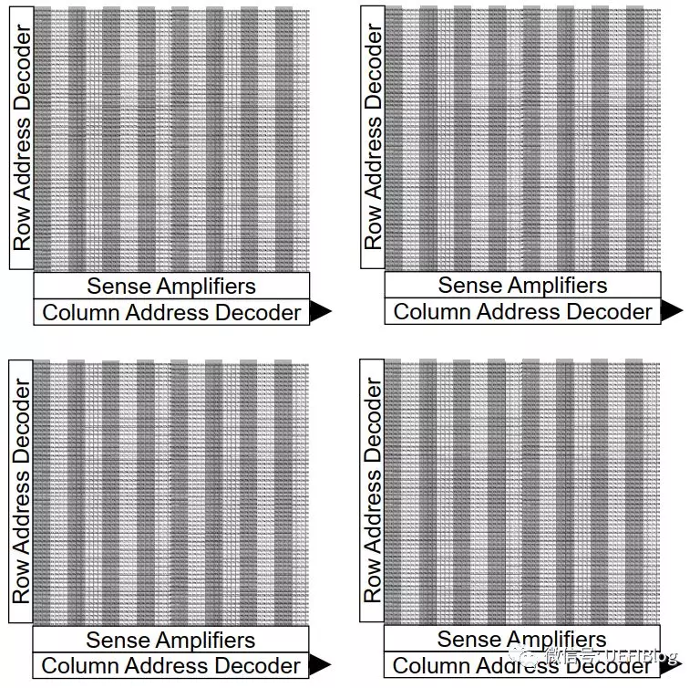

上图是: X 4 内存 array64Bit 位宽 4 个 bank

至于什么是 bank 可以见我的这几篇入门文章:

- [内存系列一: 快速读懂内存条标签](http://mp.weixin.qq.com/s?__biz=MzI2NDYwMDAxOQ==&mid=2247483747&idx=1&sn=23667a382c3a88799934bee2ad260f68&chksm=eaab61dfdddce8c9f269947e788e1896735b84d994efb89bae513a4d894ab9db4d63b41298e3&scene=21#wechat_redirect)
- [内存系列二: 深入理解硬件原理](http://mp.weixin.qq.com/s?__biz=MzI2NDYwMDAxOQ==&mid=2247483754&idx=1&sn=7e9cdcdefc6f821e51263730e1dc2cb6&chksm=eaab61d6dddce8c022a40c6b9ac654f2617bbe0dde3efae40ee9e8f141c7dc7a1bf72d56ceb9&scene=21#wechat_redirect)

这就是现代内存组成的原理.

好了我们可以回过头来看看:  nR X m 是啥意思了.

1.R 是 Rank 的缩写 n 是多少有个 Rank. 每个 Rank 有自己的片选信号: CS. 各个 rank 单独工作 JEDEC 标准 DDR4 可以取 124 个 rank.

2.X m 中的 m 就是前面讲的每个列的位宽 X4 就是每列输出 4 个 bitX8 就是每列输出 8 个 bit. JEDEC 标准只有 4816 三个选项.

明显的 rank 越多用同种内存颗粒可以做出的内存条容量就大. 那么是不是内存颗粒 X mm 越大内存就大呢?恰恰相反同样容量的内存颗粒 m 越小就可以用更多的内存颗粒拼起来组成大内存. 我们看个例子:

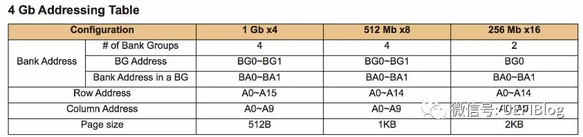

同样 4Gb(注意这里是小 b)的内存颗粒为了组成 64 Bit 的位宽我们可以用 16 个 X 4 颗粒那么总容量是:

4 Gb X (64/4)= 64 Gb = 8GB

而用 X 16 的颗粒呢?只能用 4 个:

4 Gb X (64/16)= 16Gb = 2GB

那么单内存颗粒是不是容量就可以无穷大呢?并不是.

# 3 内存颗粒容量限制

内存颗粒并不能无限变大因为没有那么多地址线. 尽管从 DDR 开始 JEDEC 标准就不停的增加地址线但到了 DDR4 地址还是有限的这也是 DDR5 必须尽早出来的原因之一. 地址线的多少决定了可以寻址多大空间也决定了单颗内存容量的上限.

我们来看看 DDR4 对地址线的定义:

1. 行地址: A0\~A17 共 18 根

2. 列地址: A0\~A9

3. Bank Addr: BA0BA1 两个

4. Bank Group: BG0BG1 两个

好了我们可以来算算颗粒的容量了如果我们用 X4 的颗粒

(2\^18) X (2\^10) X (2\^2) X (2\^2) X 4 = 16Gb

我们来算一下 DIMM 的容量:

16 Gb X 16 个 X 4 个 rank = 128GB

这就是单根内存条的理论最大容量.

# 4 结论

单根 UDIMM/RDIMM 的容量最大 128GB 这是 JEDEC 的标准所允许的最大容量. LRDIMM 可以达到更大容量它的原理我们今后再讲.

另外我们看到如果选用 X16 的颗粒单颗颗粒可以容量更大但是总容量受只能用 4 个颗粒的限制还是不能超过 64GB. 而同样容量的内存颗粒因为单元数目相同成本差别不大为了组成更大内存内存条厂商往往选择 x 4 的来组成大容量内存. 这也就为什么超大容量内存条总是 X 4 的原因.

# 5 参考

- 本文章参考: 微信公众账号 UEFIBlog, [点此进入文章](https://mp.weixin.qq.com/s?__biz=MzI2NDYwMDAxOQ==&mid=2247484244&idx=1&sn=71930d3c6e90b0da0ecd8f77f9e339ee&chksm=eaab63e8dddceafe99acb4c78eeb9988a1898a208fbd92e12c0148cb9bfbb68ffa2558b2cbdc&mpshare=1&scene=1&srcid=#rd)
- [内存系列一: 快速读懂内存条标签](http://mp.weixin.qq.com/s?__biz=MzI2NDYwMDAxOQ==&mid=2247483747&idx=1&sn=23667a382c3a88799934bee2ad260f68&chksm=eaab61dfdddce8c9f269947e788e1896735b84d994efb89bae513a4d894ab9db4d63b41298e3&scene=21#wechat_redirect)
- [内存系列二: 深入理解硬件原理](http://mp.weixin.qq.com/s?__biz=MzI2NDYwMDAxOQ==&mid=2247483754&idx=1&sn=7e9cdcdefc6f821e51263730e1dc2cb6&chksm=eaab61d6dddce8c022a40c6b9ac654f2617bbe0dde3efae40ee9e8f141c7dc7a1bf72d56ceb9&scene=21#wechat_redirect)
