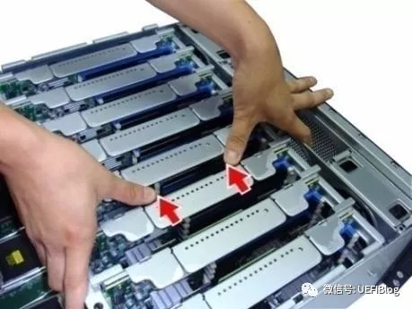

<!-- @import "[TOC]" {cmd="toc" depthFrom=1 depthTo=6 orderedList=false} -->

<!-- code_chunk_output -->

- [概述](#概述)
- [CPU 内核和操作系统](#cpu-内核和操作系统)
- [内存子系统](#内存子系统)
- [结论](#结论)
- [参考](#参考)

<!-- /code_chunk_output -->

# 概述

24TB 这个数字框定了利润的上限这是更多的金钱所不能突破的.

这带来一个根本性的问题单机服务器最大内存的极限是怎么确定的?它的制约因素有哪些?为了简化讨论范围我们限定在占据服务器市场 98% 以上的**X86 服务器**并假设不受成本的约束. 我们从 CPU 内核和操作系统、以及存储子系统两方面来寻找答案.

# CPU 内核和操作系统

操作系统和 CPU 内核都支持６４位地址空间它能够访问的地址空间是

2＾64＝16384 PB

好大的空间似乎永远也用不完. 是不是这个是内存容量的极限呢?实际上即使在 CPU 内核中还有一个因子限制了 CPU 和操作系统的寻址空间那就是 bitwidth. 它决定了页表转换的地址长度它现在最大是 48 位根据 64 位最大地址转换, 能有 52 位最大物理地址.

2＾52＝4096 TB

是不是这就是内存容量的极限了呢?实际上并不是.

# 内存子系统

现代计算机系统的内存都由 CPU 内置的内存控制器来管理为了寻找内存的极限我们把目光投入到志强中的战斗机**E7 服务器**上.

E7 面向对高可靠性和高可扩展性需求强烈的用户当然价格也十分感人. 高可靠性说的是 RAS 高可扩展性是说可以扩展为**4 路****8 路**甚至**16 路服务器**. 所谓 n 路通俗的说就是有**n 个物理 CPU**.

16 路服务器十分十分罕见部分原因在于从 8 路扩展为 16 路后保证 cache 一致性所发的 snoop 包会降低性能在某些情况下得不偿失. 我们这里就略过. 8 路服务器作为主流最高端服务器它的内存最大能够达到多少呢?

我们先来看一下它的内存子系统:

**E7 CPU**后面并**不直接插内存条 DIMM！！！**这点**和 E5 不一样(！！！这个和处理器紧紧相关！！！**). 内存条插在一个叫做**SMB(Scalable Memory Buffer)的芯片**后面. **每个 SMB**支持**两个 Channel****每个 Channel**后面最多可以插**3 根 DIMM**(图里是两个实际可插三个). **SMB 和 CPU 直接！！！** 通过一种叫做**SMI Link(Scalable Memory Interconnect**)的**总线！！！连接****一个 CPU**可以连接**四个 SMB**.

框图不够生动我们来看个实际的例子:

这个板子叫做**Memory Riser****红框**的部分就是**SMB**有**两个**. 蓝框的部分是内存插槽. 大家数一下可以看到一个 SMB 后面可以插**6 根 DIMM**分别**属于两个 Channel**. 一个照的比较好的:

上图来源:Dell E7 服务器宣传照

有的同学要问了不是说好每个 CPU 后面接 4 个 SMB 吗?怎么才两个?别着急因为每个 CPU 后面可以接两个 Memory Riser:

上图: 4 路 E7 服务器可以插 8 个 Memory Riser

上图: 插满 8 个 Memory Riser

总结: **一个 CPU**后面可以接**两个 Memory Riser**, 而**每个 Memory Riser**上面**两个 SMB**, **每个 SMB**后面可以接**两个 channel**, **每个 channel**后面最多可以插**3 根 DIMM(即插槽**), 即**每个 SMB**有**6 个插槽**. 即**每个 CPU**有**2 个 MS**, 或者说**4 个 SMB**, 或者说**8 个 channel**, 或者说**最多 24 个 DIMM(即 24 个插槽**).

另外注意: CPU 是和 SMB 直接连接的. 芯片组支持的插槽数不一定全部有连接, 可能有些管道, 而 dmidecode 是基于 DMI/SMBIOS 规范的, 取决于主板/系统制造者的实现.

好了我们可以计算一下了**8 路**可以插**16 个 Memory Riser****每个 Memory Riser**可以插**12 个 DIMM**:

>16 X 12 = 192 根

共可以插 192 根 DIMM. 现在焦点落在单根 DIMM 的容量上了. LRDIMM 往往可以支持更大的内存容量(原理见其他)目前据我所知最大的 LRDIMM 容量是 128GB. 所以 8 路最大内存容量为:

192 X 128 = 24576 GB = 24 TB

现在你知道前面的 24 TB 哪里来的了吧！

# 结论

服务器最大支持的内存数量不在于是 64 位还是 Bitwidth 而在于能够插多少内存条. 如果是**16 路 E7****最大内存**可以达到**48TB**. E5 系列内存相比 E7 就差一大截了.

**DIMM 形式封装**的**傲腾内存**在不远的将来也许会打破这种限制傲腾 DIMM 内存可以达到**2T 以上每根**到那时**也许 bitwidth**必须要加宽了.

# 参考

- 本文章参考: 微信公众账号 UEFIBlog, [点此进入文章](https://mp.weixin.qq.com/s?__biz=MzI2NDYwMDAxOQ==&mid=2247484239&idx=1&sn=7de79a00bcfcb0732b27d946e0c78258&chksm=eaab63f3dddceae5dacdd78547b5ee1a9ea43d217c7aec3a117d51ff5d59155422564251c1cb&mpshare=1&scene=1&srcid=#rd)
