<!-- @import "[TOC]" {cmd="toc" depthFrom=1 depthTo=6 orderedList=false} -->

<!-- code_chunk_output -->

- [带宽和位宽和时钟频率](#带宽和位宽和时钟频率)
- [双通道与四通道内存](#双通道与四通道内存)
- [不对称双通道](#不对称双通道)
- [磁盘阵列](#磁盘阵列)
- [参考](#参考)

<!-- /code_chunk_output -->

# 带宽和位宽和时钟频率

电脑里各个元器件之间有大量的数据要进行交换和处理那么这些数据传输是要经过一定的通道的这些通道就和我们城市间的马路一样只不过上面走的不是汽车而是数据了. 那么既然是电脑中的道路那他和实际的道路一样有自己的车道数量有速度限制. 所以这里就可以引出两个名词位宽和时钟频率了.

- 而**位宽**这个名词你可以简单的理解为**车道的数量**

- 而**时钟频率**你可以理解为**车道的车辆限速**.

- 而**带宽**你就可以简单理解为这条道路的**车流通行能力**.

那这里就可以引入一个公式:

>**带宽=时钟频率 x 总线位数/8**

那么影响电脑里数据交换能力的主要关键因素就是:

车道的数量(位宽)还有车道限速(电脑元器件时钟频率)

# 双通道与四通道内存

这里就可以解释双 8G 和单 16G 到底谁好了. 如果你是就一条 16G 你这时候打开一个软件这个软件的数据就只会在这个内存里. 而如果是双 8G 内存那么你打开的这个软件会被平均分到两个内存里那么**CPU 在读取这个软件数据**的时候就是**同时从两个内存获取数据**那么也就是**车道的数量翻倍**了也就是**位宽翻倍**而假设双 8G 内存和单 16G 内存频率是完全一样的根据公式: **带宽=时钟频率 x 总线位数/8**那么双 8G 内存的总带宽就是单 16G 的两倍带宽代表数据交换的能力那么就可以理解为双 8G 内存的数据读写速度是单 16G 的两倍.

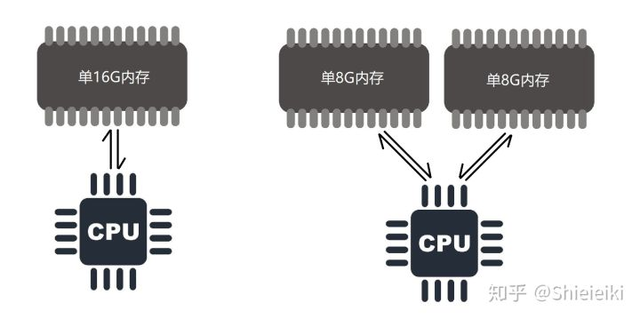

而很多人所追求的高频内存一方面是因为频率高了内存的响应速度快了另一方面也是因为时钟频率的提高带来的带宽提升的收益. 而频率提高的收益相对于双通道内存太小了假设单通道 2400 内存的速度是 15GB/S 那双通道 2400 的内存速度也许可以到 30GB/S 而单通道 3000 频率的内存速度可能也就是 20GB/S. 因此**双通道**的作用就比**高频优先级要高**一些当然最好就是**双通道高频**全都要不过预算也就上去了.

如果是 2 个槽的内存那插满就是双通道了那么很多人就说了我的主板上有 4 个内存槽那我插满 4 条是不是就可以 4 通道了?当然不是**CPU**里用于和**内存交互数据**的东西叫**内存控制器**而家用平台比如 Z 系列主板 B 系列主板 H 系列主板即便他有 4 个内存槽因为**内存控制器本身**只能支持**双通道内存**所以最高也就是双通道 4x8G 的速度和 2X16G 是完全一样的因为他们都是双通道. 而只有 X99X299X399 这样的至尊平台他们的主板上是有 8 个内存槽的他们的 **CPU 内存控制器都是四通道！！！** 的这些主板才有资格享用四通道内存(听说最近 AMD 好像搞出 8 通道的消费级平台了?)

# 不对称双通道

很多人也提到过一个情况我的电脑本身有 8G 内存 我买不起 8G 的但是我想买个 4G 内存凑合一下这样能不能组双通道呢?其实是可以的这就是不对称双通道.

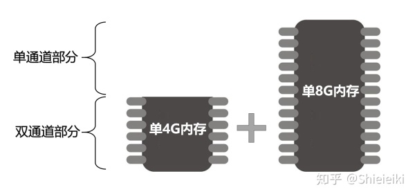

4+8 这种组合其中 4+4 的部分也就是那条 4G 和 8G 的前半部分是双通道而 8G 的后半部分还是单通道. 那么这里还有个问题就是系统会优先使用哪部分呢?根据我查询到的资料 windows 会把这两部分当做等同来看待也就是说他并不会说优先把你的游戏往双通道里塞很多的软件又尤其吃内存带宽比如吃鸡就对内存带宽非常敏感双通道内存会比单通道高 10 多帧因此你不可能指望系统优先把你的游戏往双通道部分丢这样就会导致实际虽然你组出来了双通道但是可能性能提升并不明显. 当然肯定也要比单 8 强很多毕竟还有 8G 部分是双通的. 那么如果是 4 条内存比如 2+4+2+4 那这里面有 8G 是双通道 4G 是单通道就是 2 条 2G 全是双通道两条 4G 的前半部分的 2G 是双通道后半部分 2G 是单通道所以最后就是 2+2+2+2 是双通道 2(4*1/2)+2(4*1/2)是单通道

# 磁盘阵列

既然内存可以双通道那硬盘是不是也可以"双通道呢"当然可以这就是磁盘阵列系统.

以下内容参考文章: [图文并茂 RAID 技术全解 - RAID0、RAID1、RAID5、RAID100......](https://www.hack520.com/169.html)

在正常情况下如果你有多个磁盘的话这多个磁盘里的数据都是相互独立的他们之间都是完全不相关的这就是传统的 JBOD 磁盘系统.

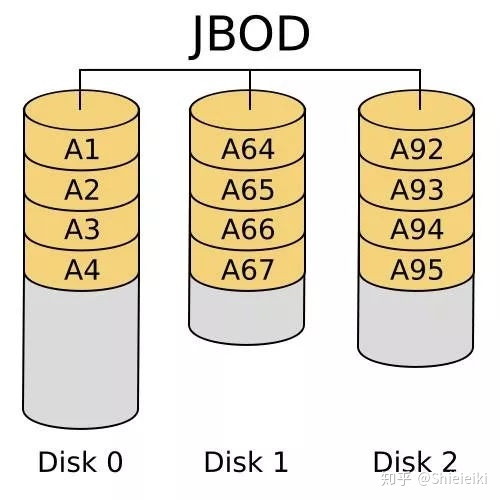

RAID0 系统: 这个系统很像磁盘双通道一个软件的数据会被平均分散到两个甚至多个磁盘里电脑在读取数据的时候同时从两个或者多个磁盘读取数据这样可以搭建和类似双通道一样的带宽翻倍的效果. 而且不涉及到内存控制的问题这里主要是磁盘控制器只要你的磁盘数量足够多那你就可以获得成倍的连续读写速度翻倍的效果. 这里磁盘 RAID0 只能提高连续读写性能随机读写性能甚至可能还会下降. 虽然 RAID0 性能高但是任意一个磁盘出现损坏后所有的数据都是报废的因为你光有另一半数据是没法知道这是个什么东西的.

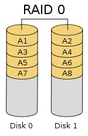

RAID1 系统: 此系统常见于企业用户两个磁盘的数据内容完全一样也就是这个系统的作用就是数据备份当然你也可以挂 2 个硬盘然后手动复制但是磁盘 RAID1 后这个数据备份就是全自动了完全不需要你干预如果其中某个磁盘损坏或者数据丢失另外一个磁盘依旧可以正常找回数据.

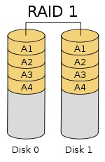

RAID2 系统: RAID2 称为纠错海明码磁盘阵列其设计思想是利用海明码实现数据校验冗余. 海明码是一种在原始数据中加入若干校验码来进行错误检测和纠正的编码技术其中第 2n 位( 1, 2, 4, 8, ... )是校验码其他位置是数据码. 因此在 RAID2 中数据按位存储每块磁盘存储一位数据编码磁盘数量取决于所设定的数据存储宽度可由用户设定. 图所示的为数据宽度为 4 的 RAID2 它需要 4 块数据磁盘和 3 块校验磁盘. 如果是 64 位数据宽度则需要 64 块 数据磁盘和 7 块校验磁盘. 可见 RAID2 的数据宽度越大存储空间利用率越高但同时需要的磁盘数量也越多.

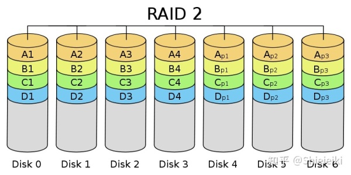

RAID3 系统: RAID3 系统非常像 RAID0 他也会将数据打散到各个磁盘去来借此提高读取速度但是和 RAID3 不一样的地方是他有一块磁盘里存取着校验数据这样即便 012 里任意一块磁盘损坏也不会影响到整体的数据安全向 RAID3 写入数据时必须计算与所有同条带的校验值并将新校验值写入校验盘中. 一次写操作包含了写数据块、读取同条带的数据块、计算校验值、写入校验值等多个操作系统开销非常大性能较低.

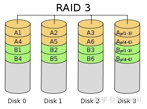

RAID4 系统: 相对于 RAID3 来说将校验的数据进行了压缩采用块的方式来组织数据写操作只涉及当前数据盘和校验盘两个盘多个 I/O 请求可以同时得到处理提高了系统性能.

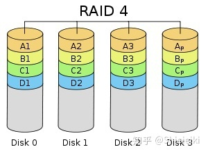

RAID5 系统: RAID5 应该是目前最常见的 RAID 等级它的原理与 RAID4 相似区别在于校验数据分布在阵列中的所有磁盘上而没有采用专门的校验磁盘. 对于数据和校验数据它们的写操作可以同时发生在完全不同的磁盘上. 因此 RAID5 不存在 RAID4 中的并发写操作时的校验盘性能瓶颈问题. 另外 RAID5 还具备很好的扩展性. 当阵列磁盘 数量增加时并行操作量的能力也随之增长可比 RAID4 支持更多的磁盘从而拥有更高的容量以及更高的性能.

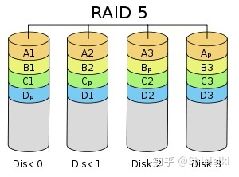

RAID6 系统: 前面所述的各个 RAID 等级都只能保护因单个磁盘失效而造成的数据丢失. 如果两个磁盘同时发生故障数据将无法恢复.  RAID6 引入双重校验的概念它可以保护阵列中同时出现两个磁盘失效时阵列仍能够继续工作不会发生数据丢失.  RAID6 等级是在 RAID5 的基础上为了进一步增强数据保护而设计的一种 RAID 方式它可以看作是一种扩展的 RAID5 等级.

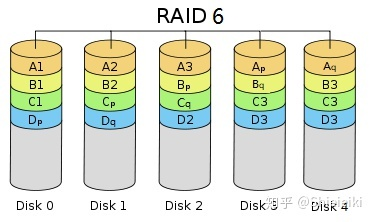

那么常见的 RAID 系统就这些 RAID 系统除了独立存在外还可以组合存在比如先组个 RAID0 然后再用两个 RAID0 系统再组合一个 RAID1. 下图就举例了几种 RAID 的组合当然我们家用一般就是 RAID0 RAID1 RAID5 就没有这么复杂了.

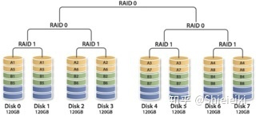

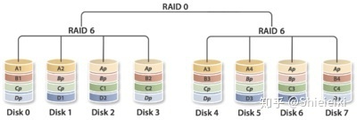

# 参考

- 本文来自知乎专栏: https://zhuanlan.zhihu.com/p/51371002
- [图文并茂 RAID 技术全解 - RAID0、RAID1、RAID5、RAID100......](https://www.hack520.com/169.html)