<!-- @import "[TOC]" {cmd="toc" depthFrom=1 depthTo=6 orderedList=false} -->

<!-- code_chunk_output -->

- [第 1 章 PCI 总线的基本知识](#第-1-章-pci-总线的基本知识)
  - [PCI 总线的组成结构](#pci-总线的组成结构)
    - [1.1.3 PCI 设备](#113-pci-设备)
    - [1.1.4 HOST 处理器](#114-host-处理器)
  - [1.2 信号定义](#12-信号定义)
- [第 2 章 PCI 总线的桥和配置](#第-2-章-pci-总线的桥和配置)
  - [2.1 存储器域和 PCI 总线域](#21-存储器域和-pci-总线域)
  - [2.2 HOST 主桥](#22-host-主桥)
  - [2.3 桥和设备的配置空间](#23-桥和设备的配置空间)
  - [2.4 PCI 总线的配置](#24-pci-总线的配置)
  - [2.5 非透明桥](#25-非透明桥)
- [第 3 章 PCI 总线的数据交换](#第-3-章-pci-总线的数据交换)
  - [3.1 BAR 空间的初始化](#31-bar-空间的初始化)
  - [3.2 设备的数据传递](#32-设备的数据传递)
  - [3.3 与 cache 相关的事务](#33-与-cache-相关的事务)
  - [3.4 预读机制](#34-预读机制)
- [第 4 章 PCIe 总线概述](#第-4-章-pcie-总线概述)
  - [4.1 pcie 总线基础知识](#41-pcie-总线基础知识)
  - [4.2 PCIE 体系结构组成部件](#42-pcie-体系结构组成部件)
  - [4.3 pcie 设备的扩展配置空间](#43-pcie-设备的扩展配置空间)
- [第 5 章 Montevina 的 MCH 和 ICH](#第-5-章-montevina-的-mch-和-ich)
  - [5.1 pci0 的 device0 设备管理 PCI 总线地址和存储器地址](#51-pci0-的-device0-设备管理-pci-总线地址和存储器地址)
  - [5.2 存储空间的组成结构](#52-存储空间的组成结构)
  - [5.3 存储器域的 PCI 总线地址空间](#53-存储器域的-pci-总线地址空间)
- [第 6 章 PCIE 事务层](#第-6-章-pcie-事务层)
- [第 7 章 链路层和物理层](#第-7-章-链路层和物理层)
- [第 8 章 链路训练和电源管理](#第-8-章-链路训练和电源管理)
- [第 9 章 流量控制](#第-9-章-流量控制)
- [第 10 章 MSI 和 MSI\-X 中断机制](#第-10-章-msi-和-msi-x-中断机制)
- [第 11 章 PCI/PCIE 的序](#第-11-章-pcipcie-的序)
- [第 12 章 PCIE 总线的应用](#第-12-章-pcie-总线的应用)
  - [12.1 capric 卡的工作原理](#121-capric-卡的工作原理)
  - [12.3 基于 pcie 的设备驱动](#123-基于-pcie-的设备驱动)
  - [12.4 带宽和时延](#124-带宽和时延)
- [第 13 章 PCI 与虚拟化技术](#第-13-章-pci-与虚拟化技术)

<!-- /code_chunk_output -->

https://www.cnblogs.com/yuanming/p/6904474.html

PCI 总线作为处理器系统的局部总线主要目的是为了连接外部设备而不是作为处理器的系统总线连接 Cache 和主存储器

PXI 规范是 CompactPCI 规范的扩展 , 面向仪器系统的 PCI 扩展

PCI Express 的接口根据总线位宽不同而有所差异包括 X1、X4、X8 以及 X16. 较短的 PCI Express 卡可以插入较长的 PCI Express 插槽中使用.

# 第 1 章 PCI 总线的基本知识

PCI Express 总线简称为 PCIe 总线 PCI-to-PCI 桥简称为 PCI 桥 PCI Express-to-PCI 桥简称为 PCIe 桥 Host-to-PCI 主桥简称为 HOST 主桥. 值得注意的是许多书籍将 HOST 主桥称为 PCI 主桥或者 PCI 总线控制器.

1) PCI 总线规范定格在 V3.0. PCI 总线规范的许多内容都与基于 IA (Intel Architecture)架构的 x86 处理器密切相关

2) HOST 主桥的一个重要作用就是将处理器访问的存储器地址转换为 PCI 总线地址.

3) 在 1 颗 PCI 总线树上最多只能挂接 256 个 PCI 设备(包括 PCI 桥).

4) PCI 设备使用的地址可以根据需要由系统软件动态分配

5) 每一个 PCI 设备都有独立的配置空间在配置空间中含有该设备在 PCI 总线中使用的基地址系统软件可以动态配置这个基地址从而保证每一个 PCI 设备使用的物理地址并不相同. PCI 桥的配置空间中含有其下 PCI 子树所能使用的地址范围.

6) 32 位/33MHz 的 PCI 总线可以提供 132MB/s 的峰值带宽 PCIE 可达几个 GB

7) HOST 主桥和 PCI 桥都包含 PCI 总线仲裁器 PCI 设备通过仲裁获得 PCI 总线的使用权后才能进行数据传送

8) PCI 总线的外部设备如网卡、声卡、USB 扩展卡等 显卡是 AGP 总线(会往 PCIe 过渡)

x86 处理器将 PCI 总线作为标准的局部总线连接各类外部设备 PowerPC、MIPS 处理器也将 PCI 总线作为标准局部总线.

在 ARM 处理器中使用 SoC 平台总线即 AMBA 总线连接片内设备.

9)PCI 总线上的设备可以通过四根中断请求信号 INTA~D#向处理器提交中断请求

## PCI 总线的组成结构

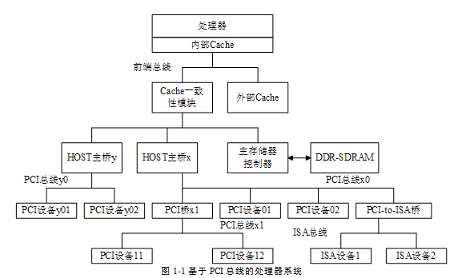

1) HOST 主桥与主存储器控制器在同一级总线上 PCI 设备可以方便地通过 HOST 主桥访问主存储器即进行 DMA 操作.

2) 处理器与 PCI 设备间的数据交换主要由"处理器访问 PCI 设备的地址空间"和"PCI 设备使用 DMA 机制访问主存储器"这两部分组成.

有几个 HOST 主桥就有几个 PCI 总线域.

3) HOST 主桥在处理器系统中的位置并不相同如 PowerPC 处理器将 HOST 主桥与处理器集成在一个芯片中.

而有些处理器不进行这种集成如 x86 处理器使用南北桥结构处理器内核在一个芯片中而 HOST 主桥在北桥中.

### 1.1.3 PCI 设备

1) 在 PCI 总线中有三类设备 PCI 主设备、PCI 从设备和桥设备.

其中 PCI 从设备只能被动地接收来自 HOST 主桥或者其他 PCI 设备的读写请求;

而 PCI 主设备可以通过总线仲裁获得 PCI 总线的使用权主动地向其他 PCI 设备或者主存储器发起存储器读写请求.

2) 一个 PCI 设备可以即是主设备也是从设备 (叫做 PCI Agent)但是在同一个时刻这个 PCI 设备或者为主设备或者为从设备.

网卡、显卡、声卡等设备都属于 PCI Agent 设备

### 1.1.4 HOST 处理器

HOST 主桥中设置了许多寄存器 HOST 处理器通过操作这些寄存器管理这些 PCI 设备.

如在 x86 处理器的 HOST 主桥中设置了 0xCF8 和 0xCFC 这两个 I/O 端口访问 PCI 设备的配置空间

## 1.2 信号定义

1) PCI 是共享总线 通过一系列信号与 PCI 总线相连这些信号由地址/数据信号、控制信号、仲裁信号、中断信号等多种信号组成.

也是同步总线每一个设备都具有一个 CLK 信号其发送设备与接收设备使用这个 CLK 信号进行同步数据传递.

# 第 2 章 PCI 总线的桥和配置

## 2.1 存储器域和 PCI 总线域

1) 每个桥和设备都有配置空间由 HOST 主桥管理

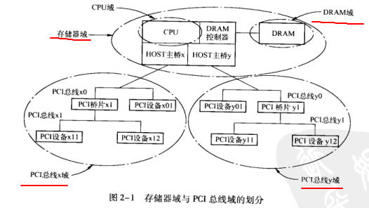

2)处理器包括多个 CPU 外部 cache 中断控制器 DRAM 控制器

x86 中 PCI 总线统一管理全部外部设备

3)PCI 总线地址空间在初始化时映射成为存储器域的存储地址

如 32 位的 PCI 总线中每一个总线域的地址范围都是 0x0000 0000 \~ 0xFFFF FFFF

## 2.2 HOST 主桥

1) PowerPC MPC8548 处理器

AMBA: ARM 中典型的 soc 平台总线

RapidIO 总线是用于解决背板互连的外部总线

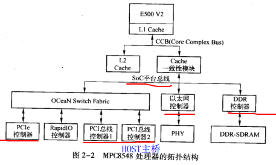

2) 配置空间的访问

用 ID 号寻址 ID 号包括: 总线号设备号功能号

总线号由系统软件决定与主桥相连的 PCI 总线编号为 0

设备号由设备的 IDSEL 信号与总线地址线的连接关系确定;

功能号与设备的具体设计相关大多只有一个功能设备

a. 内部寄存器 存放在 BASE\_ADDR 为起始地址的"1MB 的物理地址空间"中通过 BASE\_ADDR+ 0x8000 即为 CFG\_ADDR

CFG\_ADDR 保存 ID 号和寄存器号要访问配置空间时需先设置该寄存器

CFG\_DATA 是大端 PCI 设备的 配置寄存器 采用小端编址

b. 存储器地址转换为 PCI 地址 outbound

ATMU 寄存器组包括 outbound 和 inbound 寄存器组

3) x86 的 HOST 主桥

x86 有两个 I/O 端口寄存器分别为 CONFIG\_ADDRSS 和 CONFIG\_DATA0xCF8 和 0xCFC

x86 处理器采用小端地址模式南北桥升级为 MCH 和 ICHMCH 基础存储器控制器、显卡芯片、HOST\-to\-PCIe 主桥

ICH 包括 LPC、IDE、USB 总线; 而最新的 nehalem I7 中 MCH 一分为二存储控制器和图形控制器与 CPU 内核集成剩下与 ICH 合并为 PCH

## 2.3 桥和设备的配置空间

1) 三种类型的配置空间: PCI agent PCI 桥 cardbus 桥片

PCI 桥不需要驱动来设置被称为透明桥还有种非透明的 PCI 桥

PCI 设备将配置信息存放在 E2PROM 中上电初始化时把 E2PROM 读到配置空间中作为初始值由硬件逻辑完成; 然后系统会根据 DFS 算法初始化配置空间.

2) PCI agent 配置

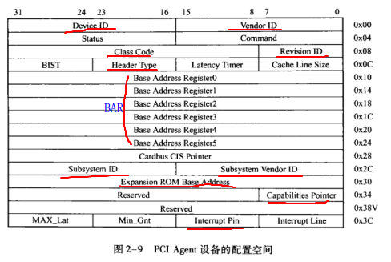

vendor id , 生产厂商 intel 是 0x8086, 0xffff 无效

device id, 具体设备 这两个是由 PCISIG 分配的.

revision id, 版本号

class code, PCI 设备的分类 包括 base class code (显卡、网卡、PCI 桥等) sub class code,  interface

header type, 区分 PCI Agent、 桥、 cardbus

Expansion ROM base address  有些设备需要在操作系统运行前完成初始化如显卡键盘硬盘这个 PCI 设备需要运行 ROM 的地址

capabilities pointer capabilities 组的基地址存放扩展配置信息 PCI 可选 PCI-X 和 PCIE 设备必须支持

interrupt line  PCI 设备使用的中断向量号 驱动得到后注册 ISR 到 OS, 只对 8259A 中断控制器有效多数处理器没有用这个

interrupt pin 使用的中断引脚 1 表示 INTA#

base address register 0~5, BAR 保存基地址 linux 用 pci\_resource\_start 读 ioremap 物理地址转为逻辑地址直接读 BAR 不对(得到 PCI 物理地址)

command, 命令寄存器设置才能访问 IO 和存储

status 得到设备状态

letency timer 控制 PCI 设备占用总线的时间

3) 桥的配置空间

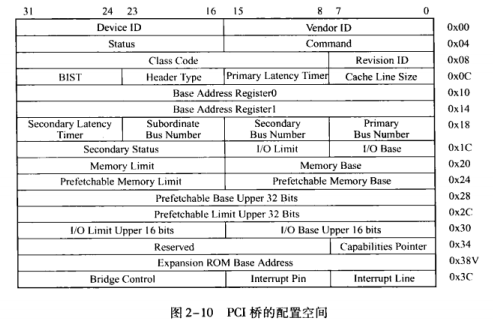

## 2.4 PCI 总线的配置

1) 两种配置请求:  type 00, type 01, 穿桥只能 01

2)系统软件用 DFS 初始化 bus 号 device 号

## 2.5 非透明桥

1) 可以方便的连接两个处理器系统(不是 cpu)对 PCI 总线 x 域和 y 域进行隔离但不隔离存储器域空间

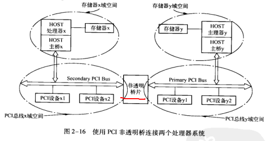

# 第 3 章 PCI 总线的数据交换

## 3.1 BAR 空间的初始化

1) 系统使用 DFS 遍历 PCI 总线时会初始化 BAR 等寄存器然后就可以进行数据传递

2) powerPC 中通过 inbound 和 outbound 实现两域之间的转换; x86 没有这个机制而是直接相等但还是是不同域的地址

## 3.2 设备的数据传递

## 3.3 与 cache 相关的事务

1) powerPC 设置 inbound 来设置是否进行 cache 一致性操作

x86 使用 MTRR 寄存器设置

(cache 好复杂待续)

## 3.4 预读机制

1) 使用预读机制降低了 cache 行失效带来的影响有 指令预读、数据预读、外部设备的预读队列、操作系统的预读策略

指令预读: CPU 根据程序的执行情况提前把指令从主存预读到指令 cache 中

# 第 4 章 PCIe 总线概述

## 4.1 pcie 总线基础知识

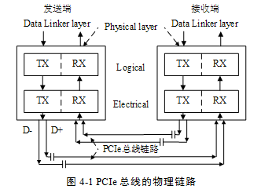

1) PCI 是并行连接一条总线上的多个设备共享总线带宽;

PCIe 是差分总线端到端连接频率更高;

2) 一个数据通路(Lane),有两组差分信号即 4 根信号线 TX 部件和 RX 部件相连(这为一组)

一个 pcie 链路可以有多个 lane

2.a) 一个差分信号由 D+和 D-两根信号组成接收端通过比较它们的差值来判断是 1 还是 0 与单端信号比抗干扰能力更强.

2.b)外部噪声加在两根信号上的影响一样所以可以使用更高的总线频率

3) pcie 链路支持 1、2、4、8、16、32 个 lane 即支持这些数据位宽, 常用的是 x1

intel 的 ICH 集成了多个 x1 的 pcie 链路 MCH 集成了 x16 的 pcie 链路用于连接显卡控制器

powerPC 支持 x1,x2,x4,x8

PCIE 不分多少数据位 PCI\-E 总线更类似串行线**一次通信走 1 个 Bit**. 比较快主要是频率高 V3.0 总线频率达 4Ghz,单 lane 的峰值可达 8GT/s=8Gb/s

表 4\‑1 **PCIe 总线规范**与**总线频率**和**编码**的关系

<table>
    <tr>
        <th rowspan="2">PCIe 总线规范</th>
        <th rowspan="2">总线频率</th>
        <th rowspan="2">单 Lane 的峰值带宽</th>
        <th rowspan="2">编码方式</th>
        <th rowspan="1", colspan="4">吞吐量
            <tr>
                <th>x1</th>
                <th>x4</th>
                <th>x8</th>
                <th>x16</th>
            </tr>
        </th>
    </tr>
    <tr>
        <th>1.x</th>
        <th>1.25GHz</th>
        <th>2.5GT/s</th>
        <th>8/10b 编码</th>
        <th>250MB/s</th>
        <th>1GB/s</th>
        <th>2GB/s</th>
        <th>4GB/s</th>
    </tr>
    <tr>
        <th>2.x</th>
        <th>2.5GHz</th>
        <th>5GT/s</th>
        <th>8/10b 编码</th>
        <th>500MB/s</th>
        <th>2GB/s</th>
        <th>4GB/s</th>
        <th>8GB/s</th>
    </tr>
    <tr>
        <th>3.x</th>
        <th>4GHz</th>
        <th>8GT/s</th>
        <th>128/130b 编码</th>
        <th>984.6MB/s</th>
        <th>3.938GB/s</th>
        <th>7.877GB/s</th>
        <th>15.754GB/s</th>
    </tr>
    <tr>
        <th>4.x</th>
        <th>8GHz</th>
        <th>16GT/s</th>
        <th>128/130b 编码</th>
        <th>1.969GB/s</th>
        <th>7.877GB/s</th>
        <th>15.754GB/s</th>
        <th>31.508GB/s</th>
    </tr>
    <tr>
        <th>3.x</th>
        <th>16GHz</th>
        <th>32 or 25GT/s</th>
        <th>128/130b 编码</th>
        <th>3.9 or 3.08GB/s</th>
        <th>15.8 or 12.3GB/s</th>
        <th>31.5 or 24.6GB/s</th>
        <th>63.0 or 49.2GB/s</th>
    </tr>
</table>

目前最新量产使用的是 PCIe 3.x

注: 这里的**总线频率**指的是**差分信号**按照**逻辑"0**"和"**1**"**连续变化时的频率(！！！**)

1GHz 是 10\^9(10 的 9 次方), 每秒 10 的 9 次方

**PCIe 3.0**的**总线频率 4GHz**, 即**每秒变化 4 x (10 的 9 次方)次**; **一个数据通路(Lane**)有**两组差分信号**, 两两分组, **每组一次 1 位**, 也就是说**一次可以传输 2 bit**, 也就是说每条数据通路(Lane)每秒传输 8 x (10 的 9 次方)次, 这就是上面的**单 Lane 的峰值带宽(！！！次数概念！！！**); 一个数据通路(Lane)**每秒传输 8 x (10 的 9 次方)个 bit**, 即**每一条 Lane 上支持每秒钟内传输 8G 个 bit**; 由于编码是 128/130b, 所以**每一条 Lane 支持 8 \* 128 / 130 = 7876923080 bps = 984615385 B/s ≈ 984.6MB/s**. 也就是上面的吞吐量

GT/s 是 Giga Transmissionper second (千兆传输/秒)即**每一秒内传输的次数**. 重点在于描述物理层通信协议的速率.

Gbps —— Giga Bits Per Second (千兆位/秒).

GT/s 与 Gbps 之间不存在成比例的换算关系. GT/s 着重描述端口的速率属性可以不和链路宽度等关联这样来描述"可以进行链路宽度扩展"的高速串行接口更为合适一些.  需要**结合具体的物理层通信协议**来分析.

例如: **PCI\-e2.0** 协议支持**5.0 GT/s**, 即**每一条 Lane 上支持每秒钟内传输 5G 个 bit(5Gbps**); 但这**并不意味着 PCIe 2.0 协议的每一条 Lane 支持 5Gbps 的速率(！！！**). 为什么这么说呢? 因为 PCIe 2.0 的物理层协议中使用的是 **8b/10b 的编码机制**.  即**每传输 8 个 bit 需要发送 10 个 bit**; 这**多出的 2 个 bit**并**不是对上层有意义的信息**.  那么**PCIe 2.0**协议的**每一条 Lane 支持 5 \* 8 / 10 = 4Gbps 的速率(！！！**).  以一个 PCIe 2.0 x8 的通道为例 x8 的可用带宽为 4 \* 8 = 32 Gbps.

4) PCIE 使用的信号

pcie 设备使用 2 种电源信号供电 Vcc 和 Vaux 电压为 3.3v, Vcc 为主电源

PERST#信号 全局复位复位设备

REFCLK+ 和 REFCLK-信号用于与处理器同步

WAKE# 设备休眠时主电源停止供电了可以用该信号通知处理器来唤醒设备

SMCLK, SMDAT, 即 SMBus 总线源于 I2C 管理处理器系统的外部设备特别是智能电源

JTAG 信号用于芯片内部测试包括 TRST#,TCK,TDI,TDO,TMS 信号

PRSNT1#PRSNT2#, 热插拔相关

5) PCIE 总线的层次结构

事务层接收来自核心层的数据并封装为 TLP 还有就是处理 pcie 中的"序"

数据链路层继续添加 sequence 前缀和 CRC 后缀有多种 DLLP 包

物理层 LTSSM 状态机管理链路状态 PLP 包系统程序员仍有必要深入理解物理层工作原理

6) pcie 链路的扩展

用 switch, 1 个上游端口连 RC 多个下游端口连 EP

7) pcie 设备的初始化

传统复位 convertional reset: 包括 fundametal 和 non-fundametal, fundametal 又分 cold 和 warm reset;  non\-fundametal 指的是 hot reset

FLR 复位只复位与 PCIE 链路相关的部分逻辑

## 4.2 PCIE 体系结构组成部件

1) 大多使用 RC、switch、PCIe\-to\-PCI 桥连接设备而基于 pcie 总线的设备称为 EP(endpoint)

**RC**(PCI Express root complex)根联合体, 相当于**PCIE 主桥**也有称为**pcie 总线控制器**

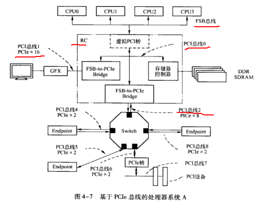

**RC**在**x86**中由 **MCH 和 ICH 组成**, PCIe 总线端口存储器控制器等接口集成在一起统称 RC

2) PCIE 设备包括 EP(如显卡、网卡等)、switch、PCIE 桥

3) RC 与 HOST 主桥不同的是还有 RCRB, 内置 PCI 设备 event collector

深入理解 RC 对理解 pcie 体系结构非常重要

4) switch 有一个上游端口和多个下游端口上游端口连接 RC、其他 switch 的下游端口也支持 crosslink 连接方式(上连上下连下)

其实是多个 PCI 桥组成的

PCIE 采用虚拟多通路 VC 技术这些报文中设定 TC 标签分为 8 类优先权. 每条链路最多支持 8 个 VC 用来收发报文.

软件设置哪类 TC 由哪个 VC 传递许多处理器 Switch 和 RC 只支持一个 VC,而 x86 和 PLX 的 switch 可以支持两个 VC

TC 和 VC 是多对一

5) 不同 ingress 发向同一个 egress 端口涉及端口仲裁和路由选径

switch 中设有仲裁器规定报文通过 switch 的规则. 分别基于 VC 和基于端口的仲裁机制

6) PCIE 桥

## 4.3 pcie 设备的扩展配置空间

1) PCIE 要求设备必须支持 capability 结构重点关注电源管理、MSI 中断的 capability 结构

电源管理 capability 有 PMCR 和 PMCSR 寄存器

2) capability 结构: PCIE capability register device/link/slot 等 capability 寄存器

# 第 5 章 Montevina 的 MCH 和 ICH

intel 的一款笔记本平台

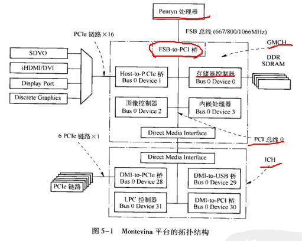

pci 0 上的 MCH 和 ICH 是 FSB 总线的延伸虚拟的 PCI 设备只是使用 PCI 的管理方法

Intel 后续的处理器, 使用 QPI 总线(又称 Multi\-FSB 总线)代替了 FSB, 南桥使用 PCH(Platform Controller Hub)集成南桥代替了 ICH.

Intel 在**CPU 内部保留了 QPI 总线**用于**CPU 内部的数据传输**. 而在**与外部接口设备进行连接**的时候需要有一条简洁快速的通道就是**DMI 总线**. 这样这两个总线的传输任务就分工明确了 QPI 主管内 DMI 主管外. 也就是说 DMI 往下就不是 CPU 内部了, 尽管 PCH 和 MCH 都属于 RC 的一部分.

## 5.1 pci0 的 device0 设备管理 PCI 总线地址和存储器地址

device0 被认为是 HOST 主桥

## 5.2 存储空间的组成结构

存储器域(CPU 可访问)、PCI 总线域、DRAM 域(主存)有些 DRAM 只能被显卡控制器访问到不能被 cpu 访问

legacy 地址空间: x86 固有的一段 1MB 内存空间 DOS 内存等

DRAM 域: 大小保存在 MCH 的 TOM 中即 PCI0 的配置空间中 legacy 地址在它里面

存储器域:

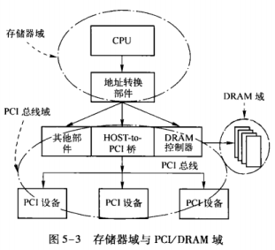

## 5.3 存储器域的 PCI 总线地址空间

PCI 总线地址空间氛围 最低可用 TOLUD~4GBTOUUD~64GB

1) APIC 是 x86 使用的中断控制器

2) ECAM 方式读写 PCIE 扩展配置空间 CONFIG\_ADDRESS 和 CONFIG\_DATA 访问前 256B

ECAM 是直接映射到内存来访问

# 第 6 章 PCIE 事务层

# 第 7 章 链路层和物理层

# 第 8 章 链路训练和电源管理

# 第 9 章 流量控制

合理的使用物理链路避免接收端缓冲区容量不足而丢弃发生端的数据从而要求重新发送.

# 第 10 章 MSI 和 MSI\-X 中断机制

PCI: 必须支持 INTx,MSI 可选

PCIe: 必须支持 MSIINTx 可选

MSI 使用存储器写请求 TLP 向处理器提交中断请求即 MSI 报文. PowerPC 使用 MPIC 中断控制器处理 MSI 中断请求 X86 使用 FSB interrupt message 方式处理.

绝大多数 PCIe 设备使用 MSI 提交中断请求

# 第 11 章 PCI/PCIE 的序

序是指数据传送的顺序保证数据完整性的基础

# 第 12 章 PCIE 总线的应用

## 12.1 capric 卡的工作原理

1) PCIe 设备: Vetex-5 内嵌的 EP 模块该模块也被 xilinx 称为 LogiCORE

先主存到 FPGA 的片内 SRAM(DMA 读), 单次 DMA 最大 0X7FF B  2KB

SRAM 到主存(DMA 写)

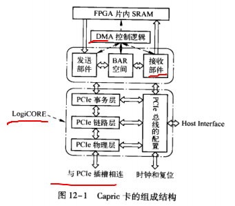

2) 仅使用 BAR0 大小 256B 里面有 DCSR1/2 WR\_DMA\_ADR/SIZE, INT\_REG, ERR

## 12.3 基于 pcie 的设备驱动

属于 char 类型驱动

1) 加载与卸载

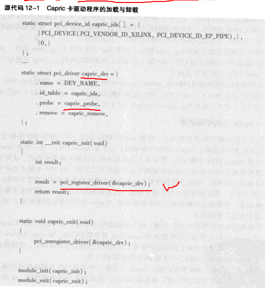

这段代码主要作用是软件结构 pci\_driver 与硬件结构 pci\_dev 建立联系 pci\_register\_driver 会做这个

2) 初始化和关闭

系统在 PCI 树中发现 capric 卡后 local\_pci\_probe 调用 capric\_probe 入口参数 pci\_dev 和 ids 进行初始化

初始化调用 pci\_enable\_device 使能 PCIE 设备(会修改 command 的 io space 和 memory space 位看配置空间是否使用它们)调用 pcibios\_enable\_irq 分配设备使用的中断向量号

DMA 掩码: 存储域 physical\_addr&DMA\_MASK = physical\_addr 表示可以对这段内存 DMA 操作

a) linux 中存储器映射的寄存器和 io 映射的寄存器都是 ioresources 管理 pci\_request\_regions 把 capric 卡的 BAR0 使用的 resource 结构其 name 设置为 DEV\_NAME, flags 设为 IORESOURCE\_BUSY

b) pci\_resource\_start 获得 pci\_dev 资源的 BAR0 空间的基地址(存储器域物理地址)pci\_read\_config\_word 是 pci 域

c) ioremap 将存储器域物理地址映射为 linux 虚拟地址

d) register\_chrdev 注册 char 设备驱动

e) pci\_enable\_msi 使能 MSI 中断请求机制

f) request\_irq(capric\_interrupt) 使用中断服务例程

3) DMA 读写

DMA 写:  与 capric\_read 对应

kmalloc 实际驱动中很少在读写服务例程中申请内存容易产生内存碎片时间花费也长.

pci\_map\_single 虚拟地址转换为 PCI 物理地址

DMA 读: capric\_write

dma\_sync\_single 存储器与 cache 同步

interruptible\_sleep\_on 等待

4) 中断处理

系统的 do\_IRQ 调用 capric\_interrupt

这里直接设置读写例程里面的等待事件就好

5) 存储器地址到 PCI 地址转换

pci\_map\_single

最初 x86 是直接相等的关系为了支持虚拟化技术使用了 VT\-d/IOMMU 技术

powerpc 是 inbound 寄存器把 PCI 转换为存储器地址 inbound 可以看做一种 IOMMU

6) 存储器与 cache 同步

低端处理器不支持硬件 cache 共享一致性需要在 DMA 操作之前用软件将操作的数据区域与 cache 同步

多数 PCI 设备 cache 一致性可以由硬件保证

## 12.4 带宽和时延

优化: 减少对寄存器的读操作如要读终端控制器状态寄存器可以改为收发等分开的 IRQ

流水线 ring buffer 技术多路 DMA 读写并行执行

# 第 13 章 PCI 与虚拟化技术

多个虚拟处理器系统多个独立的操作系统用一套 CPU、内存和外部设备