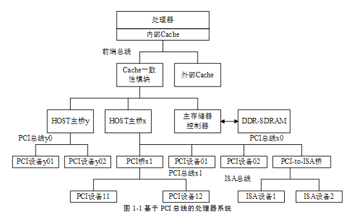
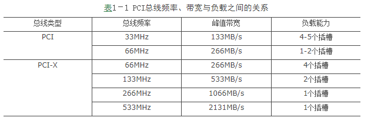

<!-- @import "[TOC]" {cmd="toc" depthFrom=1 depthTo=6 orderedList=false} -->

<!-- code_chunk_output -->

- [整体结构](#整体结构)
  - [1. HOST 主桥](#1-host-主桥)
  - [2. PCI 总线](#2-pci-总线)
  - [3. PCI 设备](#3-pci-设备)
  - [4. HOST 处理器](#4-host-处理器)
  - [5. PCI 总线的负载](#5-pci-总线的负载)

<!-- /code_chunk_output -->

# 整体结构

PCI 总线作为处理器系统的局部总线, 是处理器系统的一个组成部件. 在一个处理器系统中, 与 PCI 总线相关的模块如图 1‑1 所示.



如图 1-1 所示在一个处理器系统中, 与 PCI 总线相关的模块包括: HOST 主桥、PCI 总线、PCI 桥和 PCI 设备. PCI 总线由 HOST 主桥和 PCI 桥推出, HOST 主桥与主存储器控制器在同一级总线上, 因此 **PCI 设备**可以方便地**通过 HOST 主桥访问主存储器**, 即进行 **DMA** 操作.

值得注意的是, PCI 设备的 DMA 操作需要与处理器系统的 Cache 进行一致性操作, 当 PCI 设备通过 HOST 主桥访问主存储器时, Cache 一致性模块将进行地址监听, 并根据监听的结果改变 Cache 的状态.

在一些简单的处理器系统中, 可能不含有 PCI 桥, 此时所有 PCI 设备都是连接在 HOST 主桥推出的 PCI 总线上, 此外在一些处理器系统中可能含有多个 HOST 主桥, 如在图 1-1 所示的处理器系统中含有 HOST 主桥 x 和 HOST 主桥 Y.

## 1. HOST 主桥

HOST 主桥是一个很特别的桥片, 其主要功能是**隔离**处理器系统的**存储器域**与处理器系统的**PCI 总线域**, 管理 PCI 总线域, 并完成**处理器与 PCI 设备间的数据交换**.

处理器与 PCI 设备间的数据交换主要由 "**处理器访问 PCI 设备的地址空间**" 和 "**PCI 设备使用 DMA 机制访问主存储器**" 这两部分组成.

下文将处理器系统的存储器域简称为**存储器域**, 而将处理器系统的 PCI 总线域称为**PCI 总线域**, 存储器域和 PCI 总线域的详细介绍见第 2.1 节. 值得注意的是, 在一个处理器系统中, 有**几个 HOST 主桥**, 就有**几个 PCI 总线域**.

HOST 主桥在处理器系统中的位置并不相同, 如 PowerPC 处理器将 HOST 主桥与处理器集成在一个芯片中. 而有些处理器不进行这种集成, 如**x86 处理器使用南北桥结构**处理器内核在一个芯片中而**HOST 主桥在北桥中**. 但是从处理器体系结构的角度上看, 这些集成方式并不重要.

PCI 设备通过 HOST 主桥访问主存储器时, 需要与处理器的 Cache 进行一致性操作, 因此在设计 HOST 主桥时需要重点考虑 Cache 一致性操作. 在 **HOST 主桥**中, 还含有许多**数据缓冲**, 以支持 PCI 总线的预读机制.

**HOST 主桥是联系处理器与 PCI 设备的桥梁**. 在一个处理器系统中, **每一个 HOST 主桥**都管理了**一颗 PCI 总线树**, 在**同一颗 PCI 总线树上的所有 PCI 设备属于同一个 PCI 总线域**. 如图 1‑1 所示, HOST 主桥 x 之下的 PCI 设备属于 PCI 总线 x 域, 而 HOST 主桥 y 之下的 PCI 设备属于 PCI 总线 y 域. 在这颗总线树上的所有 PCI 设备的配置空间都由 HOST 主桥通过配置读写总线周期访问.

如果 **HOST 主桥**支持 `PCI V3.0` 规范的 `Peer-to-Peer` 数据传送方式, 那么**分属不同 PCI 总线域！！！的 PCI 设备可以直接进行数据交换**. 如图 1‑1 所示如果 **HOST 主桥 y** 支持 Peer-to-Peer 数据传送方式, PCI 设备 y01 可以直接访问 PCI 设备 01 或者 PCI 设备 11 而不需要通过处理器的参与. 但是这种**跨越总线域的数据传送方式在 PC 架构中并不常用**, 在 PC 架构中, 重点考虑的是 PCI 设备与主存储器之间的数据交换, 而不是 PCI 设备之间的数据交换. 此外在 PC 架构中, **具有两个 HOST 主桥的处理器系统也并不多见**.

> y01 -> 01 or 11, 只需要 HOST 主桥 y 支持 Peer-to-Peer 数据传送方式, 不需要 HOST 主桥 x 支持 Peer-to-Peer 数据传送方式.

在 PowerPC 处理器中, HOST 主桥可以通过设置 Inbound 寄存器, 使得分属于不同 PCI 总线域的设备可以直接通信. 许多 PowerPC 处理器都具有多个 HOST 主桥, 有关 PowerPC 处理器使用的 HOST 主桥详见第 2.2 节.

## 2. PCI 总线

在处理器系统中, 含有**PCI 总线**和**PCI 总线树**这两个概念. 这两个概念并不相同, 在一颗 PCI 总线树中可能具有多条 PCI 总线, 而具有血缘关系的 PCI 总线组成一颗 PCI 总线树. 如在图 1‑1 所示的处理器系统中, **PCI 总线 x 树**具有**两条 PCI 总线**, 分别为 **PCI 总线 x0** 和 **PCI 总线 x1**. 而**PCI 总线 y 树**中仅有**一条 PCI 总线**.

**PCI 总线**由 **HOST 主桥或者 PCI 桥管理**, 用来连接各类设备, 如声卡、网卡和 IDE 接口卡等. 在一个处理器系统中, 可以**通过 PCI 桥扩展 PCI 总线**, 并形成具有血缘关系的多级 PCI 总线, 从而形成 PCI 总线树型结构. 在处理器系统中有**几个 HOST 主桥**, 就有**几颗**这样的 **PCI 总线树**, 而每**一颗 PCI 总线树**都与**一个 PCI 总线域对应**.

与 HOST 主桥直接连接的 PCI 总线通常被命名为 PCI 总线 0. 考虑到在一个处理器系统中可能有多个主桥, 图 1‑1 将 HOST 主桥 x 推出的 PCI 总线命名为 x0 总线, 而将 PCI 桥 x1 扩展出的 PCI 总线称之为 x1 总线; 而将 HOST 主桥 y 推出的 PCI 总线称为 y0~yn. 分属**不同 PCI 总线树**的设备, 其使用的 PCI 总线**地址空间**分属于**不同的 PCI 总线域空间**.

## 3. PCI 设备

在 PCI 总线中有三类设备: **PCI 主设备、PCI 从设备和桥设备**. 其中**PCI 从设备只能被动地接收来自 HOST 主桥或者其他 PCI 设备的读写请求; 而 PCI 主设备可以通过总线仲裁获得 PCI 总线的使用权主动地向其他 PCI 设备或者主存储器发起存储器读写请求. 而桥设备的主要作用是管理下游的 PCI 总线并转发上下游总线之间的总线事务**.

**一个 PCI 设备可以既是主设备也是从设备(！！！)但是在同一个时刻这个 PCI 设备或者为主设备或者为从设备**. PCI 总线规范将 PCI 主从设备统称为 PCI Agent 设备. 在处理器系统中常见的 PCI 网卡、显卡、声卡等设备都属于 PCI Agent 设备.

在 PCI 总线中**HOST 主桥是一个特殊的 PCI 设备**该设备**可以获取 PCI 总线的控制权访问 PCI 设备也可以被 PCI 设备访问**. 但是**HOST 主桥并不是 PCI 设备. PCI 规范也没有规定如何设计 HOST 主桥**.

在 PCI 总线中还有一类特殊的设备即**桥设备**. 桥设备包括**PCI 桥(PCI-to-PCI 桥)、PCI-to-(E)ISA 桥和 PCI-to-Cardbus 桥**. 本篇重点介绍 PCI 桥而不关心其他桥设备的实现原理. PCI 桥的存在使 PCI 总线极具扩展性处理器系统可以使用 PCI 桥进一步扩展 PCI 总线.

PCI 桥的出现使得采用 PCI 总线进行大规模系统互连成为可能. 但是**在目前已经实现的大规模处理器系统中并没有使用 PCI 总线进行处理器系统与处理器系统之间的大规模互连**. 因为 PCI 总线是一个以 HOST 主桥为根的树型结构使用主从架构因而不易实现多处理器系统间的对等互连.

即便如此 PCI 桥仍然是 PCI 总线规范的精华所在掌握**PCI 桥是深入理解 PCI 体系结构的基础**. **PCI 桥可以连接两条 PCI 总线上游 PCI 总线和下游 PCI 总线(PCI 总线 x0 和 PCI 总线 x1)**这两个 PCI 总线属于同一个**PCI 总线域(PCI 总线树)**使用 PCI 桥扩展的所有 PCI 总线都同属于一个 PCI 总线域.

其中对**PCI 设备配置空间的访问**可以从**上游总线转发到下游总线**而数据传送可以双方向进行. 在 PCI 总线中还存在一种**非透明 PCI 桥**该桥片不是 PCI 总线规范定义的标准桥片但是适用于某些特殊应用本篇将在第 2.5 节中详细介绍这种桥片. 在本书中如不特别强调 PCI 桥是指透明桥**透明桥也是 PCI 总线规范定义的标准桥片**.

PCI-to-(E)ISA 桥和 PCI-to-Cardbus 桥的主要作用是通过 PCI 总线扩展(E)ISA 和 Cardbus 总线. 在 PCI 总线推出之后(E)ISA 总线并没有在处理器系统中立即消失此时需要使用 PCI-(E)ISA 桥扩展(E)ISA 总线而使用 PCI-to-Cardbus 桥用来扩展 Cardbus 总线本篇并不关心(E)ISA 和 Cardbus 总线的设计与实现.

## 4. HOST 处理器

PCI 总线规定在**同一时刻内在一颗 PCI 总线树上有且只有一个 HOST 处理器**. 这个 HOST 处理器可以通过 HOST 主桥发起 PCI 总线的配置请求总线事务并对 PCI 总线上的设备和桥片进行配置.

在 PCI 总线中 HOST 处理器是一个较为模糊的概念. 在 SMP(symmetric multiprocessing)处理器系统中所有 CPU 都可以通过 HOST 主桥访问其下的 PCI 总线树**这些 CPU 都可以作为 HOST 处理器**. 但是值得注意的是**HOST 主桥才是 PCI 总线树的实际管理者而不是 HOST 处理器**.

**在 HOST 主桥中设置了许多寄存器 HOST 处理器通过操作这些寄存器管理这些 PCI 设备**. 如在 x86 处理器的 HOST 主桥中设置了 0xCF8 和 0xCFC 这两个 I/O 端口**访问 PCI 设备的配置空间**而 PowerPC 处理器的 HOST 主桥设置了 CFG\_ADDR 和 CFG\_DATA 寄存器访问 PCI 设备的配置空间. 值得注意的是在 PowerPC 处理器中并没有 I/O 端口因此使用存储器映像寻址方式访问外部设备的寄存器空间.

```
[root@CentOS7 ~]# cat /proc/ioports | grep PCI
0000-03bb : PCI Bus 0000:00
03bc-03df : PCI Bus 0000:00
03e0-0cf7 : PCI Bus 0000:00
0cf8-0cff : PCI conf1
1000-7fff : PCI Bus 0000:00
  2000-2fff : PCI Bus 0000:02
8000-ffff : PCI Bus 0000:80
```

## 5. PCI 总线的负载

PCI 总线的所能挂接的负载与总线频率相关其中总线频率越高所能挂接的负载越少. 下文以 PCI 总线和 PCI-X 总线为例说明总线频率、峰值带宽和负载能力之间的关系如表 1‑1 所示.



由表 1‑1 所示 PCI 总线频率越高所能挂接的负载越少但是整条总线所能提供的带宽越大. 值得注意的是 PCI-X 总线与 PCI 总线的传送协议略有不同因此 66MHz 的 PCI-X 总线的负载数较大 PCI-X 总线的详细说明见第 1.5 节. 当 PCI-X 总线频率为 266MHz 和 533MHz 时该总线只能挂接一个 PCI-X 插槽. 在 PCI 总线中一个插槽相当于两个负载接插件和插卡各算为一个负载在表 1‑1 中 33MHz 的 PCI 总线可以挂接 4\~5 个插槽相当于直接挂接 8\~10 个负载.