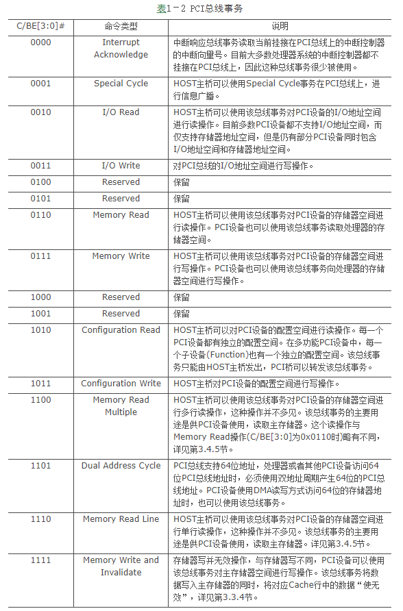
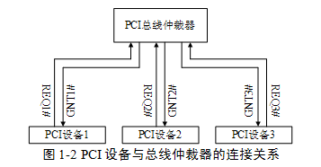

<!-- @import "[TOC]" {cmd="toc" depthFrom=1 depthTo=6 orderedList=false} -->

<!-- code_chunk_output -->

- [1. 概述](#1-概述)
- [2. 地址和数据信号](#2-地址和数据信号)
- [3. 接口控制信号](#3-接口控制信号)
- [4. 仲裁信号](#4-仲裁信号)
- [5. 中断请求等其他信号](#5-中断请求等其他信号)

<!-- /code_chunk_output -->

# 1. 概述

PCI 总线是一条共享总线在**一条 PCI 总线上可以挂接多个 PCI 设备**. **这些 PCI 设备通过一系列信号与 PCI 总线相连**这些信号由地址/数据信号、控制信号、仲裁信号、中断信号等多种信号组成.

**PCI 总线是一个同步总线每一个设备都具有一个 CLK 信号**其**发送设备与接收设备使用这个 CLK 信号进行同步数据传递**. PCI 总线可以使用 33MHz 或者 66MHz 的时钟频率而 PCI-X 总线可以使用 133MHz、266MHz 或者 533MHz 的时钟频率.

除了 `RST#`、`INTA~D#`、`PME#` 和 `CLKRUN#` 等信号之外 PCI 设备使用的绝大多数信号需要与 CLK 信号同步. 其中 `RST#` 是复位信号 PCI 设备使用 `INTA\~D#` 信号进行中断请求. 本篇并不关心 `PME#` 和 `CLKRUN#` 信号.

# 2. 地址和数据信号

在 PCI 总线中与地址和数据相关的信号如下所示.

(1) `AD[31:0]` 信号

PCI 总线复用地址与数据信号. PCI 总线事务在启动后的第一个时钟周期传送地址这个地址是 PCI 总线域的存储器地址或者 I/O 地址; 而在下一个时钟周期传送数据(双地址周期在第一、二个时钟周期都传送地址). 传送地址的时钟周期也被称为地址周期而传送数据的时钟周期也被称为数据周期. PCI 总线支持突发传送即在一个地址周期之后可以紧跟多个数据周期.

(2) PAR 信号

PCI 总线使用奇偶校验机制保证地址和数据信号在进行数据传递时的正确性. PAR 信号是 `AD[31:0]` 和 `C/BE[3:0]` 的奇偶校验信号. PCI 主设备在地址周期和数据周期中使用该信号为地址和数据信号线提供奇偶校验位.

(3) `C/BE[3:0]#` 信号

PCI 总线复用命令与字节选通引脚. 在地址周期中 `C/BE[3:0]` 信号表示 PCI 总线的命令. 而在数据周期 `C/BE[3:0]` 引脚输出字节选通信号其中 C/BE3、C/BE2、C/BE1 和 C/BE0 与数据的字节 3、2、1 和 0 对应. 使用这组信号可以对 PCI 设备进行单个字节、字和双字访问. PCI 总线通过 `C/BE[3:0]#` 信号定义了多个总线事务. 这些总线事务如表 1‑2 所示.

# 3. 接口控制信号

在 PCI 总线中接口控制信号的主要作用是保证数据的正常传递并根据 PCI 主从设备的状态暂停、终止或者正常完成当前总线事务其主要信号如下.

(1) `FRAME#` 信号

该信号指示一个 PCI 总线事务的开始与结束. 当 PCI 设备获得总线的使用权后将置该信号有效即置为低启动 PCI 总线事务当结束总线事务时将置该信号无效即置为高. PCI 设备(HOST 主桥)只有通过仲裁获得当前 PCI 总线的使用权后才能驱动该信号.

(2) `IRDY#` 信号

该信号由 PCI 主设备(包括 HOST 主桥)驱动该信号有效时表示 PCI 主设备的数据已经准备完毕. 如果当前 PCI 总线事务为写事务表示数据已经在 `AD[31:0]` 上有效; 如果为读事务表示 PCI 目标设备已经准备好接收缓冲目标设备可以将数据发送到 `AD[31:0]` 上.

(3) `TRDY#` 信号

该信号由目标设备驱动该信号有效时表示目标设备已经将数据准备完毕. 如果当前 PCI 总线事务为写事务表示目标设备已经准备好接收缓冲可以将 `AD[31:0]` 上的数据写入目标设备; 如果为读事务表示 PCI 设备需要的数据已经在 `AD[31:0]` 上有效.

该信号可以和 IRDY#信号联合使用在 PCI 总线事务上插入等待周期对 PCI 总线的数据传送进行控制.

(4) `STOP#` 信号

该信号有效时表示目标设备请求主设备停止当前 PCI 总线事务. 一个 PCI 总线事务除了可以正常结束外目标设备还可以使用该信号终止当前 PCI 总线事务. 目标设备可以根据不同的情况要求主设备对当前 PCI 总线事务进行重试(Retry)、断连(Disconnect)也可以向主设备报告目标设备夭折(Target Abort).

目标设备要求主设备 Retry 和 Disconnect 并不意味着当前 PCI 总线事务出现错误. 当目标设备没有将数据准备好时可以使用 Retry 周期使主设备重试当前 PCI 总线事务. 有时目标设备不能接收来自主设备较长的 Burst 操作时可以使用 Disconnect 周期将一个较长的 Burst 操作分解为多个 Burst 操作. 当主设备访问的地址越界时目标设备可以使用 Disconnect 周期终止主设备的越界访问.

而 Target Abort 表示在数据传送中出现错误. 处理器系统必须要对这种情况进行处理. 在 PCI 总线中出现 Abort 一般意味着当前 PCI 总线域出现了较为严重的错误.

(5) IDSEL 信号

PCI 总线在进行配置读写总线事务时使用该信号选择 PCI 目标设备. 配置读写总线事务与存储器读写总线事务在实现上略有不同. 在 PCI 总线中**存储器读写总线事务**使用**地址译码**方式访问外部设备. 而**配置读写总线事务**使用 "**ID 译码方式**" 访问 PCI 设备即通过 PCI 设备的总线号、设备号和寄存器号访问 PCI 设备的配置空间.

IDSEL 信号与 PCI 设备的设备号相关相当于 PCI 设备配置空间的片选信号这部分内容将在第 2.4.4 节中详细介绍.

(6) `DEVSEL#` 信号

该信号有效时表示 PCI 总线的目标设备准备好该信号与 TRDY#信号不同之处在于该信号有效仅表示目标设备已经完成了地址译码. 目标设备使用该信号通知 PCI 主设备其访问对象在当前 PCI 总线上但是并不表示目标设备可以与主设备进行数据交换. 而 TRDY#信号表示数据有效 PCI 主设备可以向目标设备写入或者从目标设备读取数据.

PCI 总线规范根据设备进行译码速度的快慢将 PCI 设备分为快速、中速和慢速三种设备. 在 PCI 总线上还有一种特殊的设备即负向译码设备在一条 PCI 总线上当快速、中速和慢速三种设备都不能响应 PCI 总线事务的地址时负向译码设备将被动地接收这个 PCI 总线事务. 如果在 PCI 主设备访问的 PCI 总线上没有任何设备可以置 DEVSEL#信号为有效主设备将使用 Master Abort 周期结束当前总线事务.

(7) `LOCK#` 信号

PCI 主设备可以使用该信号将目标设备的某个存储器或者 I/O 资源锁定以禁止其他 PCI 主设备访问此资源直到锁定这个资源的主设备将其释放. PCI 总线使用 LOCK#信号实现 LOCK 总线事务只有 HOST 主桥、PCI 桥或者其他桥片可以使用 LOCK#信号. 在 PCI 总线的早期版本中 PCI Agent 设备也可以使用 LOCK#信号而目前 PCI 总线使用 LOCK#信号仅是为防止死锁和向前兼容. LOCK 总线事务将严重影响 PCI 总线的传送效率在实际应用中设计者应当尽量避免使用该总线事务.

# 4. 仲裁信号

PCI 设备使用该组信号进行总线仲裁并获得 PCI 总线的使用权. 只有 PCI 主设备需要使用该组信号而 PCI 从设备可以不使用总线仲裁信号. 这组信号由 REQ#和 GNT#组成. 其中 PCI 主设备的 REQ#和 GNT#信号与 PCI 总线的仲裁器直接相连.

PCI 主设备的总线仲裁信号与 PCI 总线仲裁器的连接关系如图 1‑2 所示. 值得注意的是每一个 PCI 主设备都具有独立的总线仲裁信号并与 PCI 总线仲裁器一一相连. 而总线仲裁器需要保证在同一个时间段内只有一个 PCI 设备可以使用当前总线.

在一个处理器系统中一条 PCI 总线可以挂接 PCI 主设备的数目除了与负载能力相关之外还与 PCI 总线仲裁器能够提供的仲裁信号数目直接相关.

在一颗 PCI 总线树中每一条 PCI 总线上都有一个总线仲裁器. 一个处理器系统可以使用 PCI 桥扩展出一条新的 PCI 总线这条新的 PCI 总线也需要一个总线仲裁器通常在 PCI 桥中集成了这个总线仲裁器. 多数 HOST 主桥也集成了一个 PCI 总线仲裁器但是 PCI 总线也可以使用独立的 PCI 总线仲裁器.

PCI 主设备使用 PCI 总线进行数据传递时需要首先置 REQ#信号有效向 PCI 总线仲裁器发出总线申请当 PCI 总线仲裁器允许 PCI 主设备获得 PCI 总线的使用权后将置 GNT#信号为有效并将其发送给指定的 PCI 主设备. 而 PCI 主设备在获得总线使用权之后将可以置 FRAME#信号有效与 PCI 从设备进行数据通信.

# 5. 中断请求等其他信号

PCI 总线提供了 `INTA#`、`INTB#`、`INTC#` 和  `INTD#` 四个中断请求信号, PCI 设备借助这些中断请求信号, 使用电平触发方式向处理器提交中断请求. 当这些中断请求信号为低时, PCI 设备将向处理器提交中断请求; 当处理器执行中断服务程序清除 PCI 设备的中断请求后, PCI 设备将该信号置高(`INTx#` 这组信号为开漏输出当所有的驱动源不驱动该信号时该信号由上拉电阻驱动为高), 结束当前中断请求.

> `INTA#` 这组信号为开漏输出, 当所有的驱动源不驱动该信号时, 该信号由上拉电阻驱动为高.

PCI 总线规定**单功能设备**只能使用 `INTA#` 信号, 而多功能设备才能使用 `INTB#/C#/D#` 信号. PCI 设备的这些中断请求信号可以通过某种规则进行线与, 之后与中断控制器的中断请求信号线相连. 而处理器系统需要预先知道这个规则, 以便正确处理来自不同 PCI 设备的中断请求, 这个规则也被称为中断路由表有关中断路由表的详细描述见第 1.4.2 节.

PCI 总线在进行**数据传递过程**时, 难免会出现**各种各样的错误**, 因此 PCI 总线提供了一些**错误信号**, 如 `PERR#` 和 `SERR#` 信号. 其中当 `PERR#` 信号有效时, 表示数据传送过程中出现奇偶校验错(Special Cycle 周期除外); 而当 `SERR#` 信号有效时, 表示当前处理器系统出现了三种错误可能, 分别为**地址奇偶校验错**, 在 **Special Cycle** 周期中出现数据奇偶校验错, 或者系统出现其他严重错误.

如果 PCI 总线支持 64 位模式, 还需要提供 `AD[63:32]`、`C/BE[7:4]`、REQ64、ACK64 和 PAR64 这些信号. 此外 PCI 总线还有一些与 JTAG、SMBCLK 以及 66MHz 使能等信号本章并不关心这些信号.