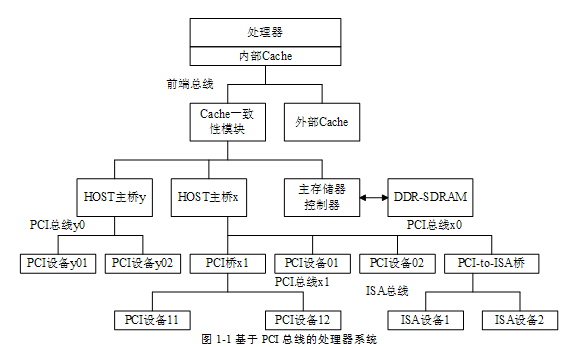

<!-- @import "[TOC]" {cmd="toc" depthFrom=1 depthTo=6 orderedList=false} -->

<!-- code_chunk_output -->

- [1. 两种译码方式两种总线事务](#1-两种译码方式两种总线事务)
- [2. PCI 总线的存储器读写总线事务](#2-pci-总线的存储器读写总线事务)
- [3. PCI 总线事务的时序](#3-pci-总线事务的时序)
- [4. POSTED 和 NON-POSTED 传送方式](#4-posted-和-non-posted-传送方式)
- [5. CPU 访问 PCI 设备](#5-cpu-访问-pci-设备)
  - [5.1. 设备 BAR 空间](#51-设备-bar-空间)
  - [5.2. I/O 读写请求](#52-io-读写请求)
  - [5.3. 存储器读写请求](#53-存储器读写请求)
  - [5.4. 带 PCI 桥的存储器读写请求](#54-带-pci-桥的存储器读写请求)
- [6. PCI 设备读写主存储器(DMA)](#6-pci-设备读写主存储器dma)
  - [6.1. DMA 写](#61-dma-写)
  - [6.2. DMA 读](#62-dma-读)
- [7. PCI 设备之间的数据交换](#7-pci-设备之间的数据交换)
- [8. DELAYED 传送方式](#8-delayed-传送方式)

<!-- /code_chunk_output -->

# 1. 两种译码方式两种总线事务

总线的基本任务是实现数据传送, 将一组数据从一个设备传送到另一个设备, 当然总线也可以将一个设备的数据**广播**到多个设备. 在处理器系统中, 这些数据传送都要依赖一定的规则, PCI 总线并不例外.

PCI 总线使用**单端并行数据线**, 采用

* **地址 译码方式** 使用**地址信号**, 用于**存储器读写总线事务**, 也就是传递数据;

> Memory Read/Write TLP

* **ID 译码方式**使用 **PCI 设备的 ID 号**, 包括 `Bus Number`、`Device Number`、`Function Number` 和 `Register Number`, 用于 **配置读写总线事务**, 也就是传递配置信息.

> Configuration Read/Write TLP

下面将以图 1-1 中的处理器系统为例, 简要介绍 PCI 总线支持的总线事务及其传送方式.

由表 1-2 可知, PCI 总线支持多种总线事务. 本节重点介绍**存储器读写总线事务**与 **I/O 读写总线事务**, 并在第 2.4 节详细介绍**配置读写总线事务**. 值得注意的是, PCI 设备只有在系统软件初始化配置空间之后, 才能够被其他主设备访问.

> MMIO 或者 Port I/O

# 2. PCI 总线的存储器读写总线事务

> 这几种都是使用 **地址译码方式**.

当 **PCI 设备**的**配置空间被初始化**之后, 该设备在当前的 PCI 总线树上将拥有一个独立的 **PCI 总线地址空间**, 即 **BAR**(Base Address Register) 寄存器**所描述的空间**, 有关 BAR 寄存器的详细说明见第 2.3.2 节.

**处理器**与 **PCI 设备**进行**数据交换**, 或者 **PCI 设备之间**进行存储器**数据交换**时, 都将通过 PCI 总线地址完成. 而 **PCI 设备**与**主存储器**进行 **DMA** 操作时, 使用的也是 **PCI 总线域的地址**, 而**不是存储器域的地址**, 此时 HOST 主桥将完成 **PCI 总线地址**到**存储器域地址**的**转换**, 不同的 HOST 主桥进行地址转换时使用的方法并不相同.

PCI 总线的配置读写总线事务与 HOST 主桥与 PCI 桥相关, 因此读者需要了解 HOST 主桥和 PCI 桥的详细实现机制之后, 才能深入理解这部分内容. 在第 2.4 节将详细介绍这些内容. 在下文中, 假定所使用的 PCI 设备的配置空间已经被系统软件初始化.

PCI 总线支持以下几类**存储器读写总线事务**.

(1) **处理器**对 PCI **设备**的 **BAR** 空间进行**数据读写**, BAR 空间可以使用**存储器**或者 **I/O 译码方式**. HOST 处理器使用 PCI 总线的**存储器读写总线事务**和 **I/O 读写总线事务**访问 PCI 设备的 BAR 空间.

> CPU -> BAR, MMIO 或者 Port I/O

(2) PCI **设备之间**的数据传递. 在 PCI 总线上的两个设备可以直接通信, 如一个 PCI **设备**可以访问另外一个设备的 **BAR** 空间. 不过这种数据传递在 PC 处理器系统中**较少**使用.

> PCI Device -> PCI Device

(3) PCI **设备**对**主存储器**进行**读写**, 即 **DMA** 读写操作. DMA 读写操作在所有处理器系统中都较为常用, 也是 PCI 总线数据传送的重点. 在多数情况下, **DMA 读写操作结束后**将伴随着**中断的产生**. PCI 设备可以使用 `INTA#`、`INTB#`、`INTC#` 和 `INTD#` 信号提交**中断请求**, 也可以使用 **MSI 机制**提交中断请求.

> PCI Device -> Main Memory

# 3. PCI 总线事务的时序

PCI 总线使用第 1.2 节所述的信号进行数据和配置信息的传递, **一个 PCI 总线事务**的基本访问时序如图 1-3 所示, 与 PCI 总线事务相关的控制信号有 `FRAME#`、`IRDY#`、`TRDY#`, `DEVSEL#` 等其他信号.

当一个 PCI 主设备需要使用 PCI 总线时, 首先需要发送 `REQ#` 信号, 通过**总线仲裁**获得**总线使用权**, 即 `GNT#` **信号有效**后, 使用以下步骤完成一个完整 PCI 总线事务, 对目标设备进行存储器或者 I/O 地址空间的读写访问.

(1) 当 PCI 主设备获得总线使用权之后, 将在 CLK1 的上升沿置 `FRAME#` 信号有效, 启动 PCI 总线事务. 当 PCI 总线事务结束后, `FRAME#` 信号将被置为无效.

(2) PCI 总线周期的第一个时钟周期 (CLK1 的上升沿到 CLK2 的上升沿之间) 为地址周期. 在地址周期中, PCI 主设备将访问的目的地址和总线命令分别驱动到 `AD[31:0]` 和 `C/BE#` 信号上. 如果当前总线命令是配置读写, 那么 IDSEL 信号线也被置为有效, IDSEL 信号与 PCI 总线的 `AD[31:11]` 相连, 详见第 2.4.4 节.

(3) 当 `IRDY#`、`TRDY#` 和 `DEVSEL#` 信号都有效后, 总线事务将使用数据周期进行数据传递. 当 IRDY#和 TRDY#信号没有同时有效时, PCI 总线不能进行数据传递, PCI 总线使用这两个信号进行传送控制.

(4) PCI 总线支持突发周期, 因此在地址周期之后可以有多个数据周期, 可以传送多组数据. 而目标设备并不知道突发周期的长度, 如果目标设备不能继续接收数据时, 可以 disconnect (断连) 当前总线事务. 值得注意的是, 只有存储器读写总线事务可以使用突发周期.

一个完整的 PCI 总线事务远比上述过程复杂得多, 因为 PC 总线还支持许多传送方式如双地址周期、fast back-to-back (快速背靠背) 、插入等待状态、重试和断连、总线上的错误处理等一系列总线事务. 本书不一一介绍这些传送方式.

# 4. POSTED 和 NON-POSTED 传送方式

PCI 总线规定了两类数据传送方式, 分别是 Posted 和 Non-Posted 数据传送方式. 其中使用 Posted 数据传送方式的总线事务也被称为 Posted 总线事务; 而使用 Non-Posted 数据传送方式的总线事务也被称为 Non-Posted 总线事务.

其中 Posted 总线事务指 PCI 主设备向 PCI 目标设备进行数据传递时, 当**数据**到达 **PCI 桥**后, 即由 PCI 桥接管来自上游总线的总线事务, 并将其**转发到下游总线**. 采用这种数据传送方式, 在数据还没有到达最终的目的地之前, PCI 总线就可以结束当前总线事务, 从而在定程度上解决了 PCI 总线的拥塞问题.

而 Non-Posted 总线事务是指 PCI 主设备向 PCI 目标设备进行数据传递时, **数据必须到达最终目的地**之后, 才能结束当前总线事务的一种数据传递方式.

显然采用 Posted 传送方式, 当这个 Posted 总线事务通过某条 PCI 总线后, 就可以释放 PCI 总线的资源; 而采用 Non-Posted 传送方式, PCI 总线在没有结束当前总线事务时必须等待. 这种等待将严重阻塞当前 PCI 总线上的其他数据传送, 因此 PCI 总线使用 **Delayed 总线事务**处理 Non-Posted 数据请求, 使用 Delayed 总线事务可以相对缓解 PCI 总线的拥塞. Delayed 总线事务的详细介绍见下面.

PCI 总线规定只有**存储器写请求** (包括存储器写并无效请求) 可以采用 Posled 总线事务, 下文将 Posted 存储器写请求简称为 PMW(Posted Memory Write), 而存储器读请求、I/O 读写请求、配置读写请求只能采用 Non-Posted 总线事务.

下面以图 1-1 的处理器系统中的 **PCI 设备 11** 向**存储器**进行 **DMA 写**操作为例, 说明 Posted 传送方式的实现过程.

PCI 设备11 进行 DMA 写操作时使用**存储器写总线事务**, 当 PCI 设备 11 获得 PCI **总线x1** 的**使用权**后, 将发送存储器写总线事务到 **PCI 总线 x1**.

当 PCI **桥1** 发现这个总线事务的**地址不在该桥管理的地址范围内**, 将首先**接收这个总线事务**, 并结束 PCI 总线 x1 的总线事务. 此时 PCI **总线x1** 使用的资源已被释放, PCI 设备 11 和 PCI 设备 12 可以使用 PCI 总线 x1 进行通信.

PCI **桥1** 获得 PCI **总线x0** 的**使用权**后, 将**转发**这个**存储器写总线事务**到 PCI **总线x0**, 之后 **HOST 主桥x** 将接收这个存储器写总线事务, 并最终**将数据写人主存储器**.

由以上过程可以发现, Posted 数据请求在通过 PCI 总线之后, 将逐级释放总线资源, 因此 PCI 总线的利用率较高. 而使用 Non-Posted 方式进行数据传送的处理过程与此不同, NonPosted 数据请求在通过 PCI 总线时, 并不会及时释放总线资源, 从而在某种程度上影响 PCI 总线的使用效率和传送带宽.

# 5. CPU 访问 PCI 设备

> CPU -> BAR, MMIO 或者 Port I/O

HOST 处理器对 PCI 设备的数据访问主要包含两方面内容:

* 一方面是**处理器**向 PCI **设备**发起**存储器读写请求和 I/O 读写请求**;

> MMIO 或者 Port I/O

* 另一方面是**处理器**对 PCI **设备**进行**配置读写**.

这里**只讨论** 处理器对 PCI 设备的**存储器读写请求**和 **I/O 读写请求**, 有关配置读写请求的详细介绍见第 2.4 节.

## 5.1. 设备 BAR 空间

在 PCI 设备的配置空间中, 共有 6 个 BAR 寄存器. **每一个 BAR 寄存器**都与 PCI 设备使用的**一组 PCI 总线地址空间**对应, **BAR 寄存器**记录这组**地址空间的基地址**. 本书将与 BAR 寄存器对应的 PCI 总线地址空间称为 BAR 空间, 在 BAR 空间中可以存放 **I/O 地址空间**, 也可以存放**存储器地址空间**.

PCI 设备可以根据需要, 有选择地使用这些 BAR 空间. 值得注意的是, 在 **BAR 寄存器**中存放的是 PCI 设备使用的 "**PCI 总线域**" 的**物理地址**, 而**不是** "**存储器域**" 的**物理地址**, 有关 BAR 寄存器的详细介绍见第 2.3.2 节.

## 5.2. I/O 读写请求

> CPU -> I/O BAR

HOST 处理器访问 PCI **设备 I/O 地址空间**的过程, 与访问存储器地址空间略有不同. 有些处理器, 如 x86 处理器, 具有独立的 I/O 地址空间.

* x86 处理器可以将 PCI **设备使用的 I/O 地址映射到存储器域的 I/O 地址空间**中;

* 之后处理器可以使用 **IN**、**OUT** 等指令对存储器域的 I/O 地址进行访问;

* 然后通过 **HOST 主桥**将**存储器域的 I/O 地址**转换为 **PCI 总线域的 I/O 地址**;

* 最后使用 PCI 总线的 **I/O 总线事务**对 PCI **设备的 I/O 地址进行读写访问**.

* 在 **x86 处理器**中, **存储器域的 I/O 地址**与 **PCI 总线域的 I/O 地址相同**.

对于有些没有独立 I/O 地址空间的处理器, 如 PowerPC 处理器, 需要在 HOST 主桥初始化时, 将 PCI 设备使用的 I/O 地址空间映射为处理器的存储器地址空间. PowerPC 处理器对这段 "存储器域" 的存储器空间进行读写访问时, HOST 主桥将存储器域的这段存储器地址转换为 PCI 总线域的 I/O 地址, 然后通过 PCI 总线的 I/O 总线事务对 PCI 设备的 I/O 地址进行读写操作.

## 5.3. 存储器读写请求

> CPU -> Memory BAR

在 PCI 总线中, **存储器读写事务**与 I/O 读写事务的实现较为类似.

* 首先 HOST **处理器**在**初始化**时, 需要将 PCI **设备**使用的 **BAR** 空间**映射**到 "**存储器域**" 的存储器**地址空间**.

* 之后**处理器**通过**存储器读写指令**访问 "**存储器域**" 的存储器地址空间;

* **HOST 主桥**将 "**存储器域**" 的读写请求**翻译**为 **PCI 总线**的**存储器读写总线事务**之后, 再发送给**目标设备**.

值得注意的是存储器域和 PCI 总线域的概念. **PCI 设备**能够直接使用的**地址**是 **PCI 总线域的地址**, 在 **PCI 总线事务**中出现的**地址**也是 **PCI 总线域的地址**; 而**处理器**能够直接使用的地址是**存储器域的地址**. 理解存储器域与 PCI 总线域的区别对于理解 PCI 总线至关重要, 在第 2.1 节将专门讨论这两个概念.

## 5.4. 带 PCI 桥的存储器读写请求

以上对 PCI 总线的存储器与 I/O 总线事务的介绍并没有考虑 PCI 桥的存在, 如果将 PCI 桥考虑进来, 情况将略微复杂.

下面将以图 1-1 为例说明**处理器**如何通过 **HOST 主桥**和 **PCI 桥1** 对 PCI **设备11** 进行**存储器读写操作**. 当处理器对 PCI 设备11 进行存储器写操作时, 这些数据需要通过 HOST 主桥 x 和 PCI 桥 x1, 最终到达 PCI 设备 11, 其访问步骤如下. 值得注意的是, 以下步骤忽略 PCI 总线的仲裁过程.

(1) 首先**处理器**将要传递的**数据**放入**通用寄存器**中, 之后向 PCI **设备11 映射到**的**存储器域**的**地址**进行写操作. 值得注意的是, 处理器并**不能**直接访问 PCI **设备11** 的 **PCI 总线地址空间**, 因为这些地址空间是属于 **PCI 总线域**的, 处理器所能直接访问的空间是存储器域的地址空间. 处理器必须通过 **HOST 主桥**将**存储器域的数据**访问转换为 **PCI 总线事务**才能对 PCI 总线地址空间进行访问.

(2) HOST **主桥x** 接收**来自处理器**的**存储器写请求**, 之后处理器结束当前存储器写操作, **释放系统总线**. HOST **主桥x** 将存储器域的**存储器地址**转换为 PCI 总线域的 **PCI 总线地址**. 并**向** PCI **总线x0** 发起 PCI 写请求总线事务.

> 值得注意的是, 虽然在许多处理器系统中**存储器地址**和 **PCI 总线地址**完全**相等**, 但其含义完全不同.

(3) PCI **总线x0** 上的 PCI **设备01**、PCI **设备02** 和 PCI **桥1** 将同时**监听这个 PCI 写总线事务**. 最后 PCI **桥x1 接收这个写总线事务**, 并结束来自 PCI **总线x0** 的 PCI 总线事务. 之后 PCI **桥x1** 向 PCI **总线x1** 发起新的 PCI 总线写总线事务.

(4) PCI 总线x1 上的 PCI 设备 11 和 PCI 设备 12 同时监听这个 PCI 写总线事务. 最后 PCI 设备11 通过**地址译码方式**接收这个写总线事务, 并结束来自 PCI 总线 x1 上的 PCI 总线事务.

由以上过程可以发现, 由于**存储器写总线事务**使用 Posted 传送方式, 因此数据通过 PCI 桥后都将结束上一级总线的 PCI 总线事务, 从而上一级 PCI 总线可以被其他 PCI 设备使用. 如果使用 Non-Posted 传送方式, 直到数据发送到 PCI 设备 11 之后, PCI 总线 x1 和 x0 才能依次释放, 从而在某种程度上将造成 PCI 总线的拥塞.

处理器对 PCI 设备 11 进行 I/O 写操作时只能采用 Non-Posted 方式进行, 与 Posted 方式相比, 使用 Non-Posted. 方式, 当数据到达目标设备后, 目标设备需要向主设备发出"回应", 当主设备收到这个"回应"后才能结束整个总线事务. 本节不再讲述处理器如何对 PCI 设备进行/O 写操作, 请读者思考这个过程.

> 如果是存储器、I/O 读或者配置读总线事务, 这个回应包含数据; 如果是 0 写或者配置写, 这个回应不包含数据.

处理器对 PCI 设备11 进行**存储器读**时, 这个读请求需要首先通过 HOST 主桥 x 和 PCI 桥 x1 到达 PCI 设备, 之后 PCI 设备将读取的数据再次通过 PCI 桥 x1 和 HOST 主桥 x 传递给 HOST 处理器, 其步骤如下所示. 我们首先假设 PCI 总线没有使用 Delayed 传送方式处理 Non-Posted 总线事务, 而是使用纯粹的 Non-Posted 方式.

(1) 首先处理器准备接收数据使用的通用寄存器, 之后向 PCI 设备11 映射到的存储器域的地址进行读操作.

(2) HOST 主桥 x 接收来自处理器的存储器读请求. HOST 主桥 x 进行存储器地址到 PCI 总线地址的转换, 之后向 PCI 总线 x0 发起存储器读总线事务.

(3) PCI 总线 x0 上的 PCI 设备 01、PCI 设备 02 和 PCI 桥 x1 将监听这个存储器读请求之后 PCI 桥 1 接收这个存储器读请求. 然后 PCI 桥 x1 向 PCI 总线 x1 发起新的 PCI 总线读请求.

(4) PCI 总线 x1 上的 PCI 设备 11 和 PCI 设备 12 监听这个 PCI 读请求总线事务. 最后 PCI 设备 11 接收这个存储器读请求总线事务, 并将这个读请求总线事务转换为存储器读完成总线事务之后, 将数据传送到 PCI 桥 x1, 并结束来自 PCI 总线 x1 上的 PCI 总线事务.

(5) PCI 桥 x1 将接收到的数据通过 PCI 总线 x0, 继续上传到 HOST 主桥 x, 并结束 PCI 总线 x0 上的 PCI 总线事务.

(6) HOST 主桥 x 将数据传递给处理器, 最终结束处理器的存储器读操作.

显然这种方式与 Posted 传送方式相比, PCI 总线的利用率较低. 因为只要 HOST 处理器没有收到来自目标设备的"回应", 那么 HOST 处理器到目标设备的传送路径上使用的所有 PCI 总线都将被阻塞. 因而 PCI 总线 x0 和 x1 并没有被充分利用.

由以上例子, 可以发现只有"读完成"依次通过 PCI 总线 x1 和 x0 之后, 存储器读总线事务才不继续占用 PCI 总线 x1 和 x0 的资源, 显然这种数据传送方式并不合理. 因此 PCI 总线使用 Delayed 传送方式解决这个总线拥塞问题, 有关 Delayed 传送方式的实现机制见第 1.3.5 节.

# 6. PCI 设备读写主存储器(DMA)

> PCI Device -> Main Memory

PCI **设备与存储器直接进行数据交换**的过程也被称为 **DMA**. 与其他总线的 DMA 过程类似, PCI 设备进行 DMA 操作时, 需要获得**数据传送**的**目的地址**和**传送大小**. 支持 DMA 传递的 PCI 设备可以在其 **BAR** 空间中设置**两个寄存器**, 分别保存这个**目标地址**和**传送大小**. 这两个寄存器也是 PCI 设备 **DMA 控制器的组成部件**.

值得注意的是, PCI 设备进行 DMA 操作时, 使用的**目的地址**是 **PCI 总线域的物理地址**, 而**不是存储器域的物理地址**, 因为 PCI 设备并不能识别存储器域的物理地址, 而仅能识别 PCI 总线域的物理地址.

**HOST 主桥**负责完成 PCI 总线地址到存储器域地址的转换. **HOST 主桥**需要进行**合理设置**, 将**存储器的地址空间映射到 PCI 总线**之后, PCI 设备才能对这段存储器空间进行 DMA 操作. PCI 设备不能直接访问没有经过主桥映射的存储器空间.

**许多处理器**允许 PCI 设备访问**所有存储器域地址空间**, 但是**有些处理器**可以**设置** PCI 设备所能访问的**存储器域地址空间**, 从而对存储器域地址空间进行保护. 例如 PowerPC 处理器的 HOST 主桥可以使用 Inbound 寄存器组, 设置 PCI 设备访问的存储器地址范围和属性, 只有在 Inbound 寄存器组映射的存储器空间才能被 PCI 设备访问, 在第 2.2 节将详细介绍 PowerPC 处理器的这组寄存器.

综上所述, 在一个处理器系统中, 并不是所有存储器空间都可以被 PCI 设备访问, 只有在 **PCI 总线域**中**有映射的存储器空间**才能被 PCI 设备访问. 经过 HOST 主桥映射的存储器具有两个"地址", 一个是在存储器域的地址, 一个是在 PCI 总线域的 PCI 总线地址. 当处理器访问这段存储器空间时, 使用存储器地址; 而 PCI 设备访问这段内存时, 使用 PCI 总线地址. 在**多数处理器系统**中, **存储器地址与 PCI 总线地址相同**, 但是系统程序员需要正确理解这两个地址的区别.

## 6.1. DMA 写

下面以 PCI **设备11 向主存储器写数据**为例, 说明 PCI 设备如何进行 DMA 写操作.

(1) 首先 PCI 设备11 将存储器写请求发向 PCI **总线x1**, 注意这个**写请求**使用的地址是 **PCI 总线域的地址**.

(2) PCI 总线x1 上的所有设备监听这个请求, 因为 PCI 设备 11 是向处理器的存储器写数据, 所以 PCI 总线 x1 上的 PCIAgent 设备都不会接收这个数据请求.

(3) PCI 桥 x1 发现当前总线事务使用的 PCI 总线地址不是其下游设备使用的 PCI 总线地址, 则接收这个数据请求, 有关 PCI 桥的 Secondary 总线接收数据的过程见第 3.2.1 节. 此时 PCI 桥 x1 将结束来自 PCI 设备 11 的 Posted 存储器写请求, 并将这个数据请求推到上游 PCI 总线上, 即 PCI 总线 x0 上.

(4) PCI 总线 x0 上的所有 PCI 设备包括 HOST 主桥将监听这个请求. PCI 总线 x0 上的 PCIAgent 设备也不会接收这个数据请求, 此时这个数据请求将由 HOST 主桥 x 接收, 并结束 PCI 桥 x1 的 Posted 存储器写请求.

(5) HOST 主桥 x 发现这个数据请求发向存储器, 则将来自 PCI 总线 x0 的 PCI 总线地址转换为存储器地址, 之后通过存储器控制器将数据写入存储器, 完成 PCI 设备的 DMA 写操作.

## 6.2. DMA 读

PCI 设备进行 DMA 读过程与 DMA 写过程较为类似. 不过 PCI 总线的存储器读总线事务只能使用 Non-Posted 总线事务, 其过程如下.

(1) 首先 PCI 设备11 将存储器读请求发向 PCI 总线 x1.

(2) PCI 总线 x1 上的所有设备监听这个请求, 因为 PCI 设备 11 是从存储器中读取数据, 所以 PCI 总线 x1 上的设备, 如 PCI 设备 12, 不会接收这个数据请求. PCI 桥 x1 发现下游 PCI 总线没有设备接收这个数据请求, 则接收这个数据请求, 并将这个数据请求推到上游 PCI 总线上, 即 PCI 总线 x0 上.

(3) PCI 总线 x0 上的设备将监听这个请求. PCI 总线 x0 上的设备也不会接收这个数据请求, 最后这个数据请求将由 HOST 主桥 x 接收.

(4) HOST 主桥 x 发现这个数据请求是发向主存储器的, 则将来自 PCI 总线 x0 的 PCI 总线地址转换为存储器地址, 之后通过存储器控制器将数据读出, 并转发到 HOST 主桥 x.

(5) HOST 主桥 x 将数据经由 PCI 桥 x1 传递到 PCI 设备 11, PCI 设备 11 接收到这个数据后结束 DMA 读.

以上过程仅是 PCI 设备向存储器读写数据的一个简单流程. 如果考虑处理器中的 Cache, 这些存储器读写过程较为复杂.

# 7. PCI 设备之间的数据交换

> PCI Device -> PCI Device

PCI 总线还允许 PCI 设备之间进行数据传递, PCI 设备间的数据交换较为简单. 在实际应用中, PCI 设备间的数据交换并不常见. 下面以图 1-1 为例, 简要介绍 PCI 设备 11 将数据写人 PCI 设备 01 的过程; 请读者自行考虑 PCI 设备 11 从 PCI 设备 01 读取数据的过程.

(1) 首先 PCI **设备11** 将 PCI 写总线事务发向 PCI **总线x1** 上. PCI **桥x1** 和 PCI **设备12** 同时监听这个写总线事务.

(2) PCI 桥 x1 将接收这个 PCI 写请求总线事务, 并将这个 PCI 写总线事务上推到 PCI **总线x0**.

(3) PCI 总线 x0 上的所有设备将监听这个 PCI 写总线事务, 最后由 PCI 设备 01 接收这个数据请求, 并完成 PCI 写事务.

# 8. DELAYED 传送方式

如上所述, 当处理器使用 Non-Posted 总线周期对 PCI 设备进行读操作, 或者 PCI 设备使用 Non-Posted 总线事务对存储器进行读操作时, 如果**数据没有到达目的地**, 那么在这个**读操作路径**上的**所有 PCI 总线**都**不能被释放**, 这将严重影响 PCI 总线的使用效率.

为此 PCI 桥需要对 Non-Posted 总线事务进行优化处理, 并使用 **Delayed 总线事务**处理这些 Non-Posted 总线事务, PCI 总线规定只有 Non-Posted 总线事务可以使用 Delayed 总线事务. PCI 总线的 Delay 总线事务由 **Delay 读写请求事务**和 **Delay 读写完成总线事务**组成, 当 Delay 读写请求事务到达目的地后, 将被转换为 Delay 读写完成总线事务. 基于 Delay 总线请求的数据交换如图 1-4 所示.

假设处理器通过存储器读、I/O 读写或者配置读写访问 PCI 设备 22 时, 首先经过 HOST 主桥进行存储器域与 PCI 总线域的地址转换, 并由 HOST 主桥发起 PCI 总线事务, 然后通过 PCI 桥 1、2, 最终到达 PCI 设备 22. 其详细步骤如下.

(1) HOST 主桥完成存储器域到 PCI 总线域的转换, 然后启动 PCI 读总线事务.

(2) PCI 桥 1 接收这个读总线事务, 并首先使用 Retry 周期, 使 HOST 主桥择时重新发起相同的总线周期. 此时 PCI 桥 1 的上游 PCI 总线将被释放. 值得注意的是 PCI 桥并不会每一次都使用 Retry 周期, 使上游设备择时进行重试操作. 在 PCI 总线中, 有一个"16 Clock"原则, 即 FRAME#信号有效后, 必须在 16 个时钟周期内置为无效, 如果 PCI 桥发现来自上游设备的读总线事务不能在 16 个时钟周期内结束时, 则使用 Retry 周期终止该总线事务.

(3) PCI 桥 1 使用 Delayed 总线请求继续访问 PCI 设备 22.

(4) PCI 桥 2 接收这个总线请求, 并将这个 Delayed 总线请求继续传递. 此时 PCI 桥 2 也将首先使用 Retry 周期, 使 PCI 桥 1 择时重新发起相同的总线周期. 此时 PCI 桥 2 的上游 PCI 总线被释放.

(5) 这个数据请求最终到达 PCI 设备 22, 如果 PCI 设备 22 没有将数据准备好时, 也可以使用 Retny 周期, 使 PCI 桥 2 择时重新发起相同的总线周期; 如果数据已经准备好, PCI 设备 22 将接收这个数据请求, 并将这个 Delayed 总线请求转换为 Delayed 总线完成事务. 如果 Delayed 总线请求是读请求, 则 Delayed 总线完成事务中含有数据, 否则只有完成信息, 而不包含数据.

(6) Delayed 总线完成事务将"数据或者完成信息"传递给 PCI 桥 2, 当 PCI 桥 1 重新发出 Non-Posted 总线请求时, PCI 桥 2 将这个"数据或者完成信息"传递给 PCI 桥 1.

(7) HOST 主桥重新发出存储器读总线事务时, PCI 桥 1 将"数据或者完成信息"传递给 HOST 主桥, 最终完成整个 PCI 总线事务.

由以上分析可知, Delayed 总线周期由 Delayed 总线请求和 Delayed 总线完成两部分组成. 下面将 Delayed 读请求总线事务简称为 DRR(Delayed Read Request), Delayed 读完成总线事务简称为 DRC(Delayed ReadCompletion); 而将 Delayed 写请求总线事务简称为 DWR(Delayed Write Request), Delayed 写完成总线事务简称为 DWC(Delayed Write Completion).

PCI 总线使用 Delayed 总线事务, 在一定程度上可以提高 PCI 总线的利用率. 因为在进行 Non-Posted 总线事务时, Non-Posted 请求在通过 PCI 桥之后, 可以暂时释放 PCI 总线, 但是采用这种方式, HOST/PCI 桥将会择时进行重试操作. 在许多情况下, 使用 Delayed 总线事务, 并不能取得理想的效果, 因为过多的重试周期也将大量消耗 PCI 总线的带宽.

为了进一步提高 Non-Posted 总线事务的执行效率, PCI-X 总线将 PCI 总线使用的 Delayed 总线事务, 升级为 Split 总线事务. 采用 Split 总线事务可以有效解决 HOST/PCI 桥的这些重试操作. Split 总线事务的基本思想是发送端首先将 Non-Posted 总线请求发送给接收端, 然
后再由接收端主动地将数据传递给发送端.

除了 PCI-X 总线可以使用 Split 总线事务进行数据传送之外, 有些处理器, 如 x86 和 PowerPC 处理器的 FSB(Front SideBus) 总线也支持这种 Split 总线事务, 因此这些 HOST 主桥也可以发起这种 Split 总线事务. 在 PCIe 总线中, Non-Posted 数据传送都使用 Split 总线事务完成, 而不再使用 Delayed 总线事务. 在第 1.5.1 节将简要介绍 Split 总线事务和 PCI-X 总线对 PCI 总线的一些功能上的增强.