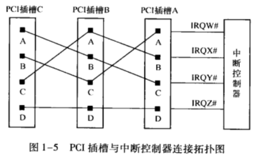
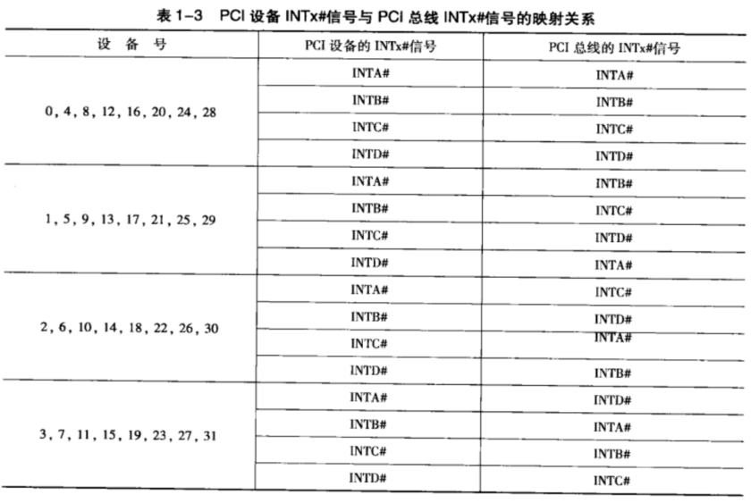

# 1. 中断概述

**PCI 总线**使用 `INTA#`,`INTB#`,`INTC#` 和 `INTD#` 信号向**处理器**发出中断请求. 这些中断请求信号为**低电平有效**, 并与处理器的**中断控制器**连接. 在 PCI 体系结构中, 这些中断信号属于**边带信号** (Sideband Signals), PCI 总线规范并没有明确规定在一个处理器系统中如何使用这些信号, 因为这些信号对于 PCI 总线是可选信号.

PCI 设备还可以使用 **MSI** 机制向处理器提交中断请求, 而**不使用这组中断信号**. 有关 MSI 机制的详细说明见第 10 章.

# 2. 中断信号与中断控制器的连接关系

**不同的处理器**使用的**中断控制器不同**, 如 x86 处理器使用 APIC (Advanced Programmable Interrupt Controller) 中断控制器, 而 PowerPC 处理器使用 MPIC (Multiprocessor Interrupt Controller) 中断控制器. 这些**中断控制器**都提供了一些**外部中断请求引脚** `IRQ_PINx#`. 外部设备, 包括 PCI 设备可以使用这些引脚向处理器提交中断请求.

但是 PCI 总线规范没有规定 **PCI 设备**的 `INTx` 信号如何与**中断控制器**的 `IRQ_PINx#` 信号相连, 这为系统软件的设计带来了一定的困难, 为此系统软件使用中断路由表存放 PCI 设备的 INTx 信号与中断控制器的连接关系. 在 **x86** 处理器系统中, **BIOS** 可以提供这个**中断路由表**, 而在 PowerPC 处理器中 Firmware 也可以提供这个中断路由表.

在一些简单的嵌入式处理器系统中, Firmware 并没有提供中断路由表, 系统软件开发者需要事先了解 PCI 设备的 INTx 信号与中断控制器的连接关系. 此时外部设备与中断控制器的连接关系由硬件设计人员指定.

假设在一个处理器系统中, 共有 3 个 **PCI 插槽** (分别为 PCI 插槽 A, B 和 C), 这些 PCI 插槽与中断控制器的 `IRQ_PINx` 引脚 (分别为 `IROW#`, `IROX#`, `IROY#` 和 `IROZ#`) 可以按照图 1-5 所示的拓扑结构进行连接.

采用图 1-5 所示的拓扑结构时, PCI 插槽 A, B, C 的 `INTA#`, `INTB#` 和 `INTC#` 信号将分散连接到中断控制器的 `IRQW#`, `IRQX#` 和 `IRQY#` 信号, 而所有 `INTD#` 信号将共享一个 `IRQZ#` 信号. 采用这种连接方式时, 整个处理器系统使用的中断请求信号, 其负载较为均衡. 而且这种连接方式保证了**每一个插槽**的 `INTA#` 信号都与**一根独立的 IRQx# 信号对应**, 从而提高了 PCI 插槽中断请求的效率.

在一个处理器系统中, 多数 PCI 设备仅使用 `INTA#` 信号, 很少使用 INTB# 和 INTC# 信号, 而 INTD# 信号更是极少使用. 在 PCI 总线中, PCI 设备**配置空间**的 **Interrupt Pin 寄存器**记录该设备究竟使用**哪个 INTx 信号**, 该寄存器的详细介绍见第 2.3.2 节.

# 3. 中断信号与 PCI 总线的连接关系

在 PCI 总线中, **INTx** 信号属于**边带信号**.

所谓边带信号是指这些信号在 PCI 总线中是**可选信号**, 而且只能在一个处理器系统的**内部使用**, 并不能离开这个处理器环境. **PCI 桥**也**不会处理**这些边带信号.

这给 PCI 设备将中断请求发向处理器带来了一些闲难, 特别是给挂接在 **PCI 桥之下的 PCI 设备**进行中断请求带来了一些麻烦.

## 3.1. 嵌入式系统

在一些嵌人式处理器系统中, 这个问题较易解决. 因为嵌人式处理器系统很清楚在当前系统中存在多少个 PCI 设备, 这些 PCI 设备使用了哪些中断资源. 在多数嵌入式处理器系统中, **PCI 设备**的数量**小于**中断控制器提供的**外部中断请求引脚数**, 而且在嵌入式系统中, 多数 PCI 设备仅使用 `INTA#` 信号提交中断请求.

在这类处理器系统中, 可能并**不含有 PCI 桥**, 因而 PCI 设备的中断请求信号与中断控制器的连接关系较易确定. 即便**存在 PCI 桥**, 来自 PCI 桥之下的 PCI 设备的中断请求也较易处理.

在多数情况下, 嵌入式处理器系统使用的 PCI 设备仅使用 `INTA#` 信号进行中断请求, 所以只要将这些 INTA# 信号挂接到中断控制器的独立 IRO_PIN# 引脚上即可. 这样每一个 PCI 设备都可以独占一个单独的中断引脚.

## 3.2. x86 系统

而在 x86 处理器系统中, 这个问题需要 BIOS 参与来解决. 在 x86 处理器系统中, 有**许多 PCI 插槽**, 处理器系统并不知道在这些插槽上将要挂接哪些 PCI 设备, 也并不知道这些 PCI 设备是否需要使用所有的 `INTx#` 信号线. 因此 x86 处理器系统必须对各种情况进行处理.

x86 处理器系统还经常使用 PCI 桥进行 PCI 总线扩展, 扩展出来的 PCI 总线还可能挂接一些 PCI 插槽, 这些插槽上的 `INTx#` 信号仍然需要处理. **PCI 桥规范**并**没有要求**桥片**传递**其下 PCI 设备的**中断**请求. 事实上多数 PCI 桥也没有为下游 PCI 总线提供中断引脚 `INTx#`, 管理其下游总线的 PCI 设备.

但是 **PCI 桥规范**推荐使用下表 建立下游 PCI 设备的 `INTx` 信号与上游 PCI 总线 `INTx` 信号之间的映射关系.

下面举例说明该表的含义. 在 **PCI 桥下游**总线上的 PCI 设备

* 如果其设备号为 0, 那么这个设备的 `INTA#` 引脚将和 PCI 总线的 `INTA#` 引脚相连;

* 如果其设备号为 1, 其 INTA# 引脚将和 PCI 总线的 INTB# 引脚相连;

* 如果其设备号为 2, 其 INTA# 引脚将和 PCI 总线的 INTC# 引脚相连;

* 如果其设备号为 3, 其 INTA# 引脚将和 PCI 总线的 INTD# 引脚相连.

在 x86 处理器系统中, 由 **BIOS** 或者 **APCI** 表记录 PCI 总线的 `INTA~D#` 信号与**中断控制器**之间的映射关系, 保存这个映射关系的数据结构也被称为**中断路由表**. 大多数 BIOS 使用表 1-3 中的映射关系, 这也是绝大多数 BIOS 支持的方式. 如果在一个 x86 处理器系统中 PCI 桥下游总线的 PCI 设备使用的中断映射关系**与此不同**, 那么**系统软件**程序员需要**改动 BIOS 中**的**中断路由表**.

**BIOS 初始化代码**根据中断路由表中的信息, 可以将 PCI 设备使用的中断向量号写人到该 **PCI 设备配置空间**的 **Interrupt Line** register 寄存器中, 该寄存器将在第 2.3.2 节中介绍.

# 4. 中断请求的同步

在 PCI 总线中, INTx 信号是一个异步信号. 所谓异步是指 INTx 信号的传递并不与 PCI 总线的数据传送同步, 即 INTx 信号的传递与 PCI 设备使用的 `CLK#` 信号无关. 这个 "异步" 信号给系统软件的设计带来了一定的麻烦.

系统软件程序员需要注意 "异步" 这种事件, 因为几乎所有 "异步" 事件都会带来系统的 "同步" 问题. 以图 1-1 为例, 当 PCI 设备 11 使用 DMA 写方式, 将一组数据写人存储器, 该设备在最后一个数据离开 PCI 设备 11 的发送 FIFO 时, 会认为 DMA 写操作已经完成. 此时这个设备将通过 INTx 信号, 通知处理器 DMA 写操作完成.

此时处理器 (驱动程序的中断服务例程) 需要注意, 因为 INT 信号是一个异步信号, 当处理器收到 INTx 信号时, 并不意味着 PCI 设备 11 已经将数据写入存储器中, 因为 PCI 设备 11 的数据传递需要通过 PCI 桥 1 和 HOST 主桥, 最终才能到达存储器控制器.

而 INTx 信号是 "异步" 发送给处理器的, PCI 总线并不知道这个 "异步" 事件何时被处理. 很有可能处理器已经接收到 INTx 信号, 开始执行中断处理程序时, 该 PCI 设备还没有完全将数据写人存储器.

因为 "PCI 设备向处理器提交中断请求" 与 "将数据写入存储器" 分别使用了两个不同的路径, 处理器系统无法保证哪个信息率先到达. 从而在处理器系统中存在 " 中断同步的问题, PCI 总线提供了以下两种方法解决这个同步问题.

(1) PCI 设备保证在数据到达目的地之后, 再提交中断请求.

显然这种方法不仅加大了硬件的开销, 而且也不容易实现. 如果 PCI 设备采用 Posted 写总线事务, PCI 设备无法单纯通过硬件逻辑判断数据什么时候写入到存储器. 此时为了保证数据到达目的地后, PCI 设备才能提交中断请求, PCI 设备需要使用 "读刷新" 的方法保证数据可以到达目的地, 其方法如下.

PCI 设备在提交中断请求之前, 向 DMA 写的数据区域发出一个读请求, 这个读请求总线事务将被 PCI 设备转换为读完成总线事务, 当 PCI 设备收到这个读完成总线事务后, 再向处理器提交中断请求. PCI 总线的 "序" 机制保证这个存储器读请求, 会将 DMA 数据最终写人存储器, 有关 PCI 序的详细说明见第 11.3 节.

PCI 总线规范要求 HOST 主桥和 PCI 桥必须保证这种读操作可以刷新写操作. 但问题是, 没有多少芯片设计者愿意提供这种机制, 因为这将极大地增加他们的设计难度. 除此之
外, 使用这种方法也将增加中断请求的延时.

(2)中断服务例程使用 "读刷新" 方法.

中断服务例程在使用 "PCI 设备写人存储器" 的这些数据之前, 需要对这个 PCI 设备进行读操作. 这个读操作也可以强制将数据最终写人存储器, 实际上是将数据写到存储器控制器中. 这种方法利用了 PCI 总线的传送序规则, 与第 1 种方法基本相同, 只是这种方法使用软件方式, 而第 1 种方式使用硬件方式. 第 11.3 节将详细介绍这个读操作如何将数据刷新到存储器中.

第 2 种方法也是绝大多数处理器系统采用的方法. 程序员在编写中断服务例程时, 往往都是先读取 PCI 设备的中断状态寄存器, 判断中断产生原因之后, 才对 PCI 设备写人的数据进行操作. 这个读取中断状态寄存器的过程, 一方面可以获得设备的中断状态, 另一方面可以保证 DMA 写的数据最终到达存储器. 如果驱动程序不这样做, 就可能产生数据完整性问题. 产生这种数据完整性问题的原因是 INTx 这个异步信号.

这里也再次提醒系统程序员注意 PCI 总线的 "异步" 中断所带来的数据完整性问题. 在一个操作系统中, 即便中断处理程序没有首先读取 PCI 设备的寄存器, 也多半不会出现问题, 因为在操作系统中, 一个 PCI 设备从提交中断到处理器开始执行设备的中断服务例程所需要的时间较长, 处理器系统基本上可以保证此时数据已经写入存储器.

但是如果系统程序员不这样做, 这个驱动程序依然有 Bug, 尽管这些 Bug 因为各种机缘巧合, 始终不能够暴露出来, 而一旦这些 Bug 被暴露出来将难以定位. 为此系统程序员务必重视设计中的每一个实现细节, 当然仅凭小心谨慎是远远不够的, 因为重视细节的前提是充分理解这些细节.

PCI 总线 V2.2 规范还定义了一种新的中断机制, 即 MSI 中断机制. MSI 中断机制采用**存储器写总线事务**向处理器系统提交中断请求, 其实现机制是向 HOST 处理器指定的一个**存储器地址写指定的数据**. 这个存储器地址一般是**中断控制器**规定的**某段存储器地址范围**, 而且**数据**也是事先安排好的数据, 通常含有**中断向量号**.

HOST 主桥会将 MSI 这个特殊的**存储器写总线事务**进一步翻译为中断请求, 提交给处理器. 目前 PCIe 和 PCI-X 设备必须支持 MSI 中断机制, 但是 PCI 设备并不一定都支持 MSI 中断机制.

目前 MSI 中断机制虽然在 PCIe 总线上已经成为主流, 但是在 PCI 设备中并不常用. 即便是支持 MSI 中断机制的 PCI 设备, 在设备驱动程序的实现中也很少使用这种机制. 首先 PCI 设备具有 INTX# 信号可以传递中断, 而且这种中断传送方式在 PCI 总线中根深蒂固. 其次 PCI 总线是一个共享总线, 传递 MSI 中断需要占用 PCI 总线的带宽, 需要进行总线仲裁等一系列过程, 远没有使用 INTx# 信号线直接.

但是使用 MSI 中断机制可以取消 PCI 总线这个 INTx# 边带信号, 可以解决使用 INTx 中断机制所带来的数据完整性问题. 而更为重要的是, PCI 设备使用 MSI 中断机制, 向处理器系统提交中断请求时, 还可以通知处理器系统产生该中断的原因, 即通过不同中断向量号表示中断请求的来源. 当处理器系统执行中断服务例程时, 不需要读取 PCI 设备的中断状态寄存器, 获得中断请求的来源, 从而在一定程度上提高了中断处理的效率. 本书将在第 10 章详细介绍 MSI 中断机制.
