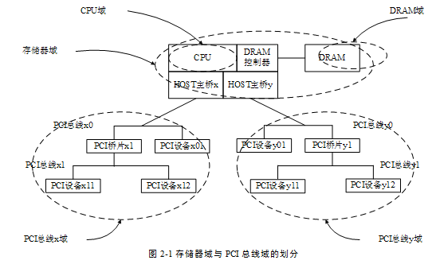

<!-- @import "[TOC]" {cmd="toc" depthFrom=1 depthTo=6 orderedList=false} -->

<!-- code_chunk_output -->

- [1. 概述](#1-概述)
- [2. CPU 域、DRAM 域与存储器域](#2-cpu-域-dram-域与存储器域)
  - [2.1. CPU 域](#21-cpu-域)
  - [2.2. DRAM 域](#22-dram-域)
  - [2.3. 存储器域](#23-存储器域)
- [3. PCI 总线域](#3-pci-总线域)
- [4. 处理器域](#4-处理器域)

<!-- /code_chunk_output -->

# 1. 概述

**HOST 主桥**的实现**因处理器系统而异(！！！**). PowerPC 处理器和 x86 处理器的 HOST 主桥除了**集成方式不同**之外其**实现机制也有较大差异**.

但是**这些 HOST 主桥**所完成的**最基本功能**依然是**分离存储器域与 PCI 总线域(！！！**)完成 **PCI 总线域**到**存储器域**, **存储器域**到**PCI 总线域**之间的**数据传递(！！！**)并**管理 PCI 设备的配置空间(！！！**).

上文曾经多次提到在**一个处理器系统**中存在**PCI 总线域**与**存储器域**. 深入理解这**两个域的区别**是**理解 HOST 主桥的关键**所在. 在一个处理器系统中**存储器域**、**PCI 总线域**与 **HOST 主桥**的关系如图 2‑1 所示.

上图所示的**处理器系统**由**一个 CPU**, **一个 DRAM 控制器**和**两个 HOST 主桥**组成. 在这个处理器系统中包含 **CPU 域**、**DRAM 域**、**存储器域**和 **PCI 总线域地址空间**. 其中 **HOST 主桥 x** 和**HOST 主桥 y** 分别管理 **PCI 总线 x 域**与**PCI 总线 y 域**.

**PCI 设备**访问**存储器域(！！！**)时也需要**通过 HOST 主桥**并由 **HOST 主桥(！！！**)进行 **PCI 总线域**到**存储器域的地址转换**; **CPU 访问 PCI 设备时(！！！**)同样需要通过 **HOST 主桥**进行**存储器域**到**PCI 总线域的地址转换(！！！**).

**如果 HOST 主桥(！！！**)支持 **Peer\-to\-Peer 传送**机制, **PCI 总线 x 域**上的**设备**可以与**PCI 总线 y 域**上的**设备直接通信(！！！**)如 PCI 设备 x11 可以直接与 PCI 设备 y11 通信. 为简化模型在本书中 PCI 总线仅使用 32 位地址空间.

# 2. CPU 域、DRAM 域与存储器域

## 2.1. CPU 域

**CPU 域地址空间**指 **CPU 所能直接访问的地址空间集合(！！！**). 在本书中, **CPU**、**处理器**与**处理器系统**的**概念不同(！！！**). 如 MPC8548 处理器的内核是 `E500 V25`, 本书将这个**处理器内核称为 CPU**; **处理器**由**一个或者多个 CPU**、**外部 Cache**、**中断控制器**和 **DRAM 控制器**组成; 而**处理器系统**由**一个或者多个处理器**和**外部设备**组成.

在 CPU 域中有一个重要概念, 即 **CPU 域边界**. 所谓 CPU 域边界即 **CPU 所能控制的数据完整性边界**. **CPU 域的边界**由 **Memory Fence 指令**(`x86` 处理器的 Memory Fence 指令为 MFENCE, LFENCE 和 SFENCE, 而 PowerPC 处理器的 Memory Fence 指令为 msync 和 mbar) 的**作用范围确定**, CPU 域边界的划分对数据完整性(Data Consistency)非常重要. 与 CPU 域相关的数据完整性知识较为复杂可以独立出书因此本篇对**数据完整性**不做进一步介绍. 笔者有计划再更新完 PCIe 总线部分的资料后书体系结构的两方面内容一个是 Cache 层次结构一个是以 Weakly Ordered Memory Modle 为基础书写数据完整性.

严格的讲, **CPU 域仅在 CPU 内核中有效(！！！**). **CPU** 访问**主存储器**时, 首先将**读写命令**放入**读写指令缓冲(！！！**)中, 然后将这个命令发送到 **DRAM 控制器(！！！**)或者 **HOST 主桥(！！！**). **DRAM 控制器**或者 **HOST 主桥**将 **CPU 地址**转换为 **DRAM**或者 **PCI 总线地址(！！！**), 分别进入 **DRAM 域(！！！**)或者 **PCI 总线域(！！！**)后, 再访问**相应的地址空间**.

## 2.2. DRAM 域

**DRAM 域地址空间**指 **DRAM 控制器**所能访问的**地址空间集合(！！！**). 目前处理器系统的 **DRAM** 一般由 **DDR\-SDRAM** 组成, 有的书籍也将**这部分内存**称为**主存储器**. 在**有些处理器系统**中, **DRAM 控制器**能够访问的**地址空间**, 并**不能被处理器访问**, 因此在这类处理器系统中, CPU 域与 DRAM 域地址空间并不等同.

比如**有些 CPU** 可以支持**36 位的物理地址**, 而**有些 DRAM 控制器**仅支持**32 位的物理地址**, 此时 CPU 域包含的地址空间大于 DRAM 域地址空间. 但是这并不意味着 DRAM 域一定包含在 CPU 域中, 在某些处理器系统中, CPU 并不能访问在 DRAM 域中的某些数据区域. 而**CPU 域**中除了**包含 DRAM 域**外, 还**包含外部设备空间(！！！**).

在**多数处理器系统**中, **DRAM 域空间**是 **CPU 域空间**的**一部分**但是**也有例外**. 比如**显卡控制器**可能会借用**一部分主存储器空间**, 这些**被借用的空间不能被 CPU 访问**, 而**只能被 DRAM 控制器**, 更为准确地说是**显卡通过 DRAM 控制器访问(！！！**), 因此**这段空间不属于 CPU 域(！！！**), 严格地讲, **这段空间属于外部设备域(！！！**).

## 2.3. 存储器域

本书使用**存储器域**统称 **CPU 域与 DRAM 域(！！！**). **存储器域**包括 **CPU 内部的通用寄存器**, **存储器映像寻址的寄存器**, **主存储器空间**和**外部设备空间**. 在 Intel 的 x86 处理器系统中**外部设备空间与 PCI 总线域地址空间等效(！！！**), 因为在 **x86 处理器系统**中使用 **PCI 总线统一管理全部外部设备(！！！**). 为简化起见本书使用 **PCI 总线域替代外部设备域(！！！**).

值得注意的是**存储器域的外部设备空间(！！！**)在 **PCI 总线域**中还有一个**地址映射**. 当**处理器**访问**PCI 设备**时**首先访问**的是**这个设备**在**存储器域**上的**PCI 设备空间**之后**HOST 主桥**将这个存储器域的 PCI 总线地址转换为 PCI 总线域的物理地址, 然后再通过 PCI 总线事务访问 PCI 总线域的地址空间.

> PCI 总线域只含有物理地址, 因此下文将直接使用 PCI 总线地址, 而不适用 PCI 总线物理地址.

# 3. PCI 总线域

在 x86 处理器系统中 **PCI 总线域**是**外部设备域**的重要组成部分. 实际上在 Intel 的 x86 处理器系统中, **所有的外部设备**都使用 **PCI 总线**管理. 而 AMD 的 x86 处理器系统中还存在一条 HT(HyperTransport)总线在 AMD 的 x86 处理器系统中还存在 HT 总线域. 本书对 HT 总线不做进一步介绍.

**PCI 总线域(PCI Segment**)由 PCI 设备所能直接访问的地址空间组成. 在一个处理器系统中, 可能存在**多个 HOST 主桥**, 因此也存在**多个 PCI 总线域**. 如在图 2‑1 所示的处理器系统中, 具有两个 HOST 主桥, 因而在这个处理器系统中存在 **PCI 总线 x 域和 y 域**.

在多数处理器系统中, 分属于**两个 PCI 总线域**的 PCI 设备并**不能直接进行数据交换**而需要通过 FSB 进行数据交换. 值得注意的是, 如果某些处理器的 **HOST 主桥**支持 `Peer-to-Peer` 数据传送那么这个 HOST 主桥可以支持不同 PCI 总线域间的数据传送.

PowerPC 处理器使用了 OCeaN 技术连接**两个 HOST 主桥**, OCeaN 可以将属于 x 域的 PCI 数据请求转发到 y 域, OCeaN 支持 PCI 总线的 `Peer-to-Pee`r 数据传送. 有关 OCeaN 技术的详细说明见第 2.2 节.

# 4. 处理器域

处理器域是指一个处理器系统能够访问的地址空间集合. 处理器系统能够访问的地址空间由存储器域和外部设备域组成. 其中存储器域地址空间较为简单, 而在不同的处理器系统中, 外部设备域的组成结构并不相同. 如在 **x86** 处理器系统中, **外部设备域**主要由 **PCI 总线域组成**, 因为大多数外部设备都是挂接在 PCI 总线上的, 而在 PowerPC 处理器和其他处理器系统中, 有相当多的设备与 FSB 直接相连, 而不与 PCI 总线相连.

> AMD 的 x86 处理器中的某些外部设备, 可能是基于 HT 总线, 而不使用 PCI 总线.

本书仅介绍 PCI 总线域而不对其他外部设备域进行说明. 其中存储器域与 PCI 总线域之间由 HOST 主桥联系在一起. 深入理解这些域的关系是深入理解 PCI 体系结构的关键所在, 实际上这也是理解处理器体系结构的基础.

通过 HOST 主桥, 处理器系统可以将处理器域划分为存储器域与 PCI 总线域. 其中存储器域与 PCI 总线域彼此独立, 并通过 HOST 主桥进行数据交换. **HOST 主桥**是联系存储器域与 PCI 总线域的桥梁, 是 **PCI 总线域实际的管理者**.

有些书籍认为 HOST 处理器是 PCI 总线域的管理者, 这种说法并不精确. 假设在一个 SMP(symmetric multiprocessing)处理器系统中, 存在 4 个 CPU 而只有一个 HOST 主桥, 这 4 个 CPU 将无法判断究竟谁是 HOST 处理器. 不过究竟是哪个处理器作为 HOST 处理器并不重要, 因为在一个处理器系统中, 是 HOST 主桥管理 PCI 总线域而不是 HOST 处理器. 当一个处理器系统中含有多个 CPU 时, 如果这些 CPU 都可以访问 HOST 主桥, 那么这些 CPU 都可以作为这个 HOST 主桥所管理 PCI 总线树的 HOST 处理器.

在一个处理器系统中, CPU 所能访问的PCI总线地址一定在存储器域中具有地址映射;而PCI设备能访问的存储器域的地址也一定在PCI总线域中具有地址映射. 当 CPU 访问PC域地址空间时, 首先访问存储器域的地址空间, 然后经过HOST主桥转换为PCI总线域的地址, 再通过PCI总线事务进行数据访问. 而当PCI设备访问主存储器时, 首先通过PCI总线事务访问PCI总线域的地址空间, 然后经过HOST主桥转换为存储器域的地址后, 再对这些空间进行数据访问.

由此可见, 存储器域与PCI总线域的转换关系由HOST主桥统一进行管理. 有些处理器提供了一些寄存器进行这种地址映射, 如PowerPC处理器使用Inbound 和 Outbound 寄存器组保存存储器域与PCI总线域的地址映射关系; 而有些处理器并没有提供这些寄存器, 但是存储器域到PCI总线域的转换关系依然存在.

HOST主桥进行不同地址域间的数据交换时, 需要遵循以下规则. 为区别存储器域到PCI总线域的地址映射, 下面将PCI总线域到存储器域的地址映射称为反向映射.

(1) 处理器访问PCI总线域地址空间时, 首先需要访问存储器域的地址空间, 再通过HOST主桥将存储器地址转换为PCI总线地址, 之后才能进入PCI总线域进行数据交换. PCI设备使用的地址空间保存在各自的PCI配置寄存器中, 即BAR寄存器中. 这些PCI总线地址空间需要在初始化时映射成为存储器域的存储器地址空间, 之后处理器才能访问这些地址空间. 在有些处理器的HOST主桥中, 具有独立的寄存器保存这个地址映射规则, 如PowerPC处理器的0utbound寄存器组;而有些处理器, 如在x86处理器中, 虽然没有这样的寄存器组, 但是在HOST主桥的硬件逻辑中仍然存在这个地址转换的概念.

(2) PCI设备访问存储器域时, 首先需要访问PCI总线域的地址空间, 再通过HOST主桥将PCI总线地址转换为存储器地址, 才能穿越 HOST 主桥进行数据交换. 为此处理器需要通过HOST主桥将这个PCI总线地址反向映射为存储器地址. PCI设备不能访问在PCI总线域中没有进行这种反向映射的存储器域地址空间. PowerPC处理器使用Inbound寄存器组存放PCI设备所能访问的存储器空间, 而在x86处理器中并没有这样的存器组, 但是依然存在这个地址转换的概念.

(3) 如果HOST 主桥不支持Peer-to-Peer传送方式, 那么分属不同PCI总线域的PCI设
备间不能直接进行数据交换. 在32位的PCI总线中, 每一个PCI总线域的地址范围都是`0x0000-0000 ~ 0xFFFF-FFFF`, 但是这些地址没有直接联系. PCI 总线 x 域上的PCI总线地址 `0x0000-0000` 与PCI总线y域上的PCI总线地址 `0x0000-0000` 并不相同, 而且这两个PCI总线地址经过 HOST 主桥反向映射后, 得到的存储器地址也不相同.

在第2.2节中, 将主要以PowerPC处理器为例说明HOST主桥的实现机制, 并在第2.2.4节简要说明x86处理器中的南北桥构架. 尽管部分读者对PowerPC处理器并不感兴趣, 笔者仍然强烈建议读者仔细阅读第2.2节的全部内容.

在PowerPC处理器中, HOST主桥的实现比较完整, 尤其是PCI总线域与存储器域的映射关系比较明晰, 便于读者准确掌握这个重要的概念. 而x86处理器由于考虑向前兼容, 设计中包含了太多的不得已. x86处理器有时不得不保留原设计中的不完美, 向前兼容是 Intel的重要成就, 也是一个沉重的十字架.