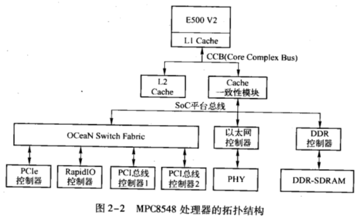
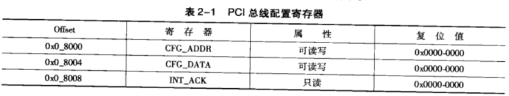
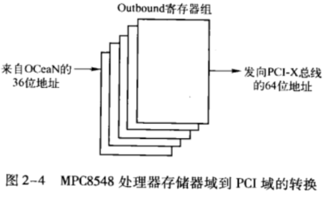
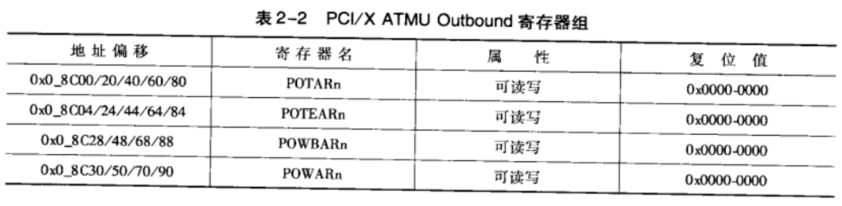
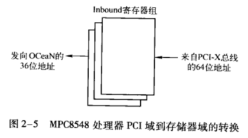
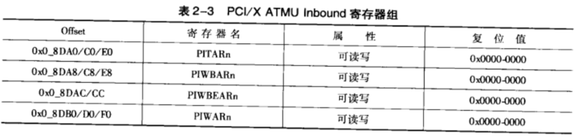
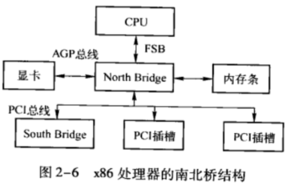
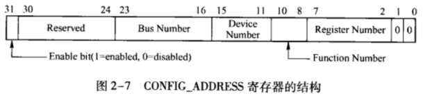

<!-- @import "[TOC]" {cmd="toc" depthFrom=1 depthTo=6 orderedList=false} -->

<!-- code_chunk_output -->

- [Power PC 的 host 主桥](#power-pc-的-host-主桥)
- [PCI 设备配置空间的访问机制](#pci-设备配置空间的访问机制)
- [存储器域地址空间到 PCI 总线域地址空间的转换](#存储器域地址空间到-pci-总线域地址空间的转换)
- [PCI 总线域地址空间到存储器域地址空间的转换](#pci-总线域地址空间到存储器域地址空间的转换)
- [x86 的 host 主桥](#x86-的-host-主桥)

<!-- /code_chunk_output -->

本节以 MPC8548 处理器为例说明 HOST 桥在 PowerPC 处理器中的实现机制, 并简要介绍 x86 处理器系统使用的 HOST 主桥.

# Power PC 的 host 主桥

MPC8548 处理器是 Freescale 基于 E500 V2 内核的一个 PowerPC 处理器. 该处理器中集成了 DDR 控制器、多个 eTSEC (Enhanced Three-Speed Ethernet Controller)、PCI/PCI-X 和 PCIe 总线控制器等一系列接口. MPC8548 处理器的拓扑结构如图2-2 所示.



图中, MPC8548 处理器的 L1 Cache 在 E500 V2 内核中, 而 L2 Cache 与 FSB 直接相连, 不属于 E500 内核. 值得注意的是有些高端 PowerPC 处理器的 L2 Cache 也在 CPU 中, 而 L3 Cache 与 CCB 总线直接相连.

> MPC8548 将 FSB 称为 CCB (Core Complex Bus)

在 MPC8548 处理器中, 所有外部设备, 如以太网控制器、DDR 控制器和 0CeaN 连接的总线控制器都与 SoC 平台总线直接连接. 而 SoC 平台总线通过 Cache 共享一致性模块与 FSB 连接.

> PowerPC 处理器并没有公开其 SoC 平台总线的设计规范. ARM 提出的AMBA 总线是一条典型的 SoC 平台总线.

在 MPC8548 处理器中, 具有一个 32 位的 PCI 总线控制器, 一个 64 位的 PCI/PCI-X 总线控制器, 还有多个 PCIe 总线控制器. MPC8548 处理器使用 0CeaN 连接这些 PCI、PCI-X 和 PCIe 总线控制器. 在 MPC8548 处理器系统中, PCI 设备进行 DMA 操作时, 首先通过 0CeaN, 之后经过 SoC 平台总线到达 DDR 控制器.

0CeaN 是 MPC8548 处理器中连接快速外设使用的交叉连总线, 不仅可以连接 PCI、PCI-X 和 PCIe 总线控制器, 而且可以连接 RapidIO 总线控制器. 使用 0CeaN 进行互连的总线控制器可以直接通信, 而不需要通过 SOC 平台总线.

> RapidI0 总线是由 Mercury Computer System 和 Motorola Semiconductar (目前的 Frescale) 共同提出用于解决背板互连的一条外部总线.


# PCI 设备配置空间的访问机制

**PCI 总线规定**访问配置空间的总线事务, 即**配置读写总线事务**, 使用 ID 号进行寻址. PCI设备的ID号由总线号 (Bus Number)、设备号 (Device Number)和功能号 (Function Number)组成.

其中**总线号**在 **HOST 主桥遍历 PCI 总线树**时**确定**. PCI 总线可以使用 PCI 桥扩展 PCI 总线, 并形成一棵 PCI 总线树. 在一 PCI 总线树上, 有几个 PCI 桥 (包括 HOST 主桥), 就有几条 PCI 总线. 在一 PCI 总线树中, 总线号由系统软件决定, 通常与 HOST 主桥直接相连的 PCI 总线编号为 0, 系统软件使用 **DFS** (Depth-First Search) 算法描 PCI 总线树上的所有 PCI 总线, 并依次进行编号.

一条 PCI 总线的**设备号**由 **PCI 设备**的 IDSEL 信号与 PCI 总线地址线的**连接关系**确定, 而**功能号**与 **PCI 设备的具体设计**相关. 在一个 PCI 设备中最多有 8 个功能设备, 而且**每一个功能设备**都有**各自的 PCI 配置空间**, 而在绝大多数 PCI 设备中只有一个功能设备. **HOST 主桥**使用**寄存器号**, 访问 PCI 设备**配置空间**的**某个寄存器**.

在 MPC8548 处理器的 HOST 桥中, 与 PCI 设备配置空间相关的寄存器 `CFG_ADDR`、`CFG_DATA` 和 `INT_ACK` 寄存器组成. **系统软件**使用 `CFG_ADDR` 和 `CFG_DATA` 寄存器访问 **PCI 设备的配置空间**, 而使用 `INT_ACK` 寄存器访问挂接在 PCI 总线上的**中断控制器的中断向量**, HOST 主桥这 3 个寄存器的地址偏移和属性如表 2-1 所示.



在 MPC8548 处理器中, 所有内部存器都使用**存储器映射方式**进行寻址, 并存放在以 `BASE_ADDR` 变量为起始地址的 "1 MB 连续的物理地址空间" 中. PowerPC处理器可以通过 `BASE_ADDR` + Offset 的方式访问表2-1中的寄存器.

> 在 MPC8548 处理器中, BASE_ADDR 存放在 CCSRBAR 寄存器中.

MPC8548 处理器使用 `CFG_ADDR` 寄存器和 `CFG_DATA` 存器访问 PCI 设备的配置空间, 其中用 `CFG_ADDR` 寄存器保存 PCI 设备的 ID 号和寄存器号, 该寄存器的各个字段的详细说明如下所示.

* Enable 位. 当该位为1 时, HOST 主桥使能对 PCI 设备配置空间的访问, 当 HOST 处理器对 `CFG_DATA` 寄存器进行访问时, HOST 桥将对这个寄存器的访问转换为 PCI 配置读写总线事务并发送到 PCI 总线上.

* Bus Number 字段记录 PCI 设备所在的总线号.

* Device Number字段记录 PCI 设备的设备号.

* Function Number字段记录 PCI 设备的功能号.

* Register Number字段记录 PCI 设备的配置寄存器号.

MPC8548 处理器访问 PCI 设备的配置空间时,

* 首先需要在 CFG_ADDR 寄存器中设置这个 PCI 设备对应的总线号、设备号、功能号和寄存器号, 然后**使能 Enable 位**;

* 之后当 MPC8548 处理器对 `CFG_DATA` 寄存器进行**读写访问**时, **HOST 主桥**将这个存储器读写访问转换为 **PCI 配置读写请求**, 并发送到 **PCI 总线**上.

* 如果 Enable 位没有使能, 处理器对 `CFG_DATA` 的访问不过是一个普通的 I0 访问, **HOST 桥**并**不能**将其转换为 **PCI 配置读写请求**.

* **HOST 主桥**根据 `CFG_ADDR` 寄存器中的 ID 号生成 **PCI 配置读写总线事务**, 并将这个读写总线事务, 通过 ID 译码方式发送到指定的 PCI 设备.

* PCI 设备将接收来自配置写总线事务的数据, 或者为配置读总线事务提供数据.

值得注意的是, 在 PowerPC 处理器中, 在 `CFG_DATA` 存器中保存的数据采用大端方式进行编址, 而 PCI设备的配置寄存器采用小端编址, 因此 HOST 主桥需要进行端模式转换. 下面以源代码2-1为例说明 PowerPC 处理器如何访问 PCI配置空间.

```assembly
stw r0, 0(r1) // 将 r0 寄存器的值写入 r1 地址
ld r3, 0(r2) // 将 r2 地址的值读入 r3 寄存器
```

首先假设寄存器 **r1** 的初始值为 `BASE_ADDR + 0x0_8000` (即 `CFG_ADDR` 存器的地址), 寄存器 **r0** 的初始值为 `0x8000-0008`, 寄存器 **r2** 的初始值为 `BASE_ADDR + 0x0_8004` (即 `CFG_DATA` 寄存器的地址), 而指定 PCI 设备 (总线号, 设备号, 功能号都为 0)的配置寄存器的 `0x0B ~ 0x08` 中的值为 `0x9988-7766`.

这段源代码的执行步骤如下.

(1) 将 r0 寄存器赋值到 r1 寄存器所指向的地址空间中, 即初始化 `CFG_ADDR` 寄存器为 `0x8000-0008`

(2) 从 r2 寄存器所指向的地址空间中读取数据到 r3 存器中, 即从 `CFG_DATA` 寄存器中读取数据到 r3 存器.

在MPC8548处理器中, 源代码 2-1 执行完毕后, 寄存器3 保存的值为 0x6677-8899而不是0x99886677. 系统程序员在使用这个返回值时, 一定要注意大小端模式的转换. 值得注意的是, 源代码 2-1 可以使用 wbrx 指进行优化, 该指可以在读取数据的同时, 进行大小端模式的转换.

处理器**读取** `INT_ACK` 寄存器时, **HOST 主桥**将这个**读操作**转换为 **PCI 总线中断响应事务**. PCI 总线中断响应事务的作用是通过 **PCI 总线**读取**中断控制器**的**中断向量号**, 这样做的前提是**中断控制器**需要连接在 **PCI 总线**上.

PowerPC 处理器使用的 MPIC **中断控制器不是挂接在 PCI 总线**上, 而是接在 SoC 平台总线上, 因此 PCI 总线提供的中断应答事务在这个处理器系统中并没有太大用途. 但是并不排除某些 PowerPC 处理器系统使用了挂接在 PCI 总线上的中断控制器, 如 PCI 南桥芯片此时 PowerPC 处理器系统需要使用中断应答事务读取 PCI 南桥中的中断控制器, 以获取中断向量号.

# 存储器域地址空间到 PCI 总线域地址空间的转换

MPC8548处理器使用ATMU(Address Translation and Mapping Unit) 寄存器组进行**存储器域**到 **PCI 总线域**, 以及 PCI 总线域到存储器域的**地址映射**. ATMU 寄存器组由两大组寄存器组成, 分别为 Outbound 和Inbound 寄存器组.

* Outbound 寄存器组将**存储器域的地址**转换为 **PCI 总线域**的地址;

* Inbound 寄存器组 PCI总线域的地址转换为存储器域的地址.

在MPC8548处理器中, 只有当CPU读写访问的**地址范围**在 Outbound 寄存器组管理的**地址空间之内**时, **HOST 主桥**才能接收 CPU 的读写访问, 并将 **CPU** 在**存储器域**上的读写访问**转换**为 **PCI 总线域**上的读写访问, 然后才能对 PCI 设备进行读写操作.

如图2-2 所示, **CPU** 对**存储器域**的**地址访问**, 首先使用 CCB 总事务, 如果所访问的地址在 Cache 中命中, 则从 Cache 中直接获得数据, 否则将从**存储器域**中获取数据. 而在绝大多数情况下, **外部设备**使用的**地址空间**是**不可 Cache** 的, 所以发向 PCI 设备的 CCB 总线事务通常不会与 Cache 进行数据交换.

> PCI 设备使用的 ROM 空间可以是 "可 Cache" 的地址空间.

如果 CCB 总线事务使用的地址在 HOST 桥的 Outbound 寄存器窗口中命中, **HOST 主桥**将接收这个 **CCB 总线事务**, 并将其**转换**为 **PCI 总线事务**之后, 再发送到 PCI 总线上. MPC8548 处理器的**每一个 HOST 主桥**都提供了 **5 个0utbound 寄存器窗口**来实现存储器域地址到 PCI总线域地址的映射, 其映射过程如图 2-4 所示.



在介绍MPC8548处理器如何使用 0utbound 寄存器组进行存储器城地址空间到 PCI总线域地址空间的转换之前, 本节将首先介绍 Outbound 寄存器组中的相应寄存器. Outbound 寄存器组的地址偏移、属性和复位值如表 2-2 所示.




# PCI 总线域地址空间到存储器域地址空间的转换

MPC8548 处理器使用 Inbound 寄存器组将 **PCI 总线域地址**转换为**存储器域**的地址. **PCI 设备**进行 **DMA 读写**时, 只有访问的地址在 Inbound 窗口中时, **HOST 主桥**才能接收这些读写请求, 并将其**转发**到**存储器控制器**. MPC8548 处理器提供了 3 组 Inbound 寄存器, 即提供3个Inbound 寄存器窗口, 实现 PCI 总线地址到存储器地址的反向映射.

* 从 **PCI 设备的角度**来看, PCI 设备访问存储器域的地址空间时, 首先需要通过 Inbound 窗口将 **PCI 总线地址**转换为**存储器域的地址**;

* 从**处理器的角度**来看, 处理器必须将存储器地址通过 Inbound 寄存器组反向映射为 PCI总线地址空间, 才能被 PCI设备访问.

> Outbound?

PCI设备只能使用 PCI总线地址访 PCI总线域的地空间. HOST 桥将这段地址空间通过 Inbound 窗口转换为存储器域的地址之后, PCI设备才能访问存储器域地址空间. 这个地址转换过程如图 2-5 所示.



在介绍MPC8548处理器如何使用Inbound 寄存器组进行PCI总线域地址空间到存储器域地址空间的转换之前, 我们首先简要介绍 Inbound 寄存器组中的相应寄存器. 该组寄存器的地址偏移、属性和复位值如表 2-3 所示.



值得注意的是, Inbound 寄存器组除了可以进行 **PCI 总线地址空间**到**存储器域地址空间**的转换之外, 还可以转换分属**不同 PCI 总线域的地址空间**, 以支持 PCI 总线的 `Peer-to-Peer` 数据传送方式.


# x86 的 host 主桥

x86 处理器使用南北桥结构连接 CPU 和 PCI 设备. 其中北桥 (North Bridge) 连接快速设备, 如显卡和内存条, 并推出 PCI 总线, **HOST 主桥**包含在**北桥**中. 而南桥 (South Bridge) 连接慢速设备. x86 处理器使用的南北桥结构如图2-6 所示.



Intel 使用南北桥概念统一 PC 架构. 但是从体系结构的角度上看, **南桥**架构并**不重要**, **北桥**中存放的主要部件不过是**存储器控制器**、**显卡控制器**和 **HOST 主桥**而已, 而**南桥**存放的是一些慢速设备, 如 **ISA 总线**和**中断控制器**等.

不同的处理器系统集成这些组成部件的方式并不相同, 如 PowerPC、MIPS 和 ARM 处理器系统通常将 **CPU** 和**主要外部设备**都集成到**一颗芯片**中, 组成一颗基于 SoC 架构的处理器系统. 这些集成方式并不重要, 每一个处理器系统都有其针对的应用领域, 不同应用领域的需求对处理器系统的集成方式有较大的影响. **Intel** 采用的**南北桥架构**针对 86 处理器的应用领域而设计, 并不能说采用这种结构一定比 MPC8548 处理器中即含有 `HOST-to-PCI` 主桥也含有 `HOST-to-PCIe` 主桥更为合理.

在许多嵌人式处理器系统中, 既含有 PCI 设备也含有 PCIe 设备, 为此 MPC8548 处理器**同时提供**了 **PCI 总线**和 **PCle 总线**接口, 在这个处理器系统中, PCI 设备可以与 PCI 总线直接相连, 而 PCIe 设备可以与 PCIe 总线直接相连, 因此并**不需要**使用 **PCIe 桥扩展 PCI 总线**, 从而在一定程度上简化了嵌入式系统的设计.

嵌人式系统所面对的应用千变万化, 进行芯片设计时所要考虑的因素相对较多, 因而在某种程度上为设计带来了一些难度. 而 x86 处理器系统所面对的应用领域针对个人 PC 和服务器, 向前兼容和通用性显得更加重要. 在多数情况下, 一个通用处理器系统的设计难度超过专用处理器系统的设计, Intel 为此付出了极大的代价.

在一些相对较老的北桥中, 如 Intel 440 系列芯片组中包含了 HOST 主桥, 从系统软件的角度上看 HOST-to-PCI 主桥实现的功能与 HOST-to-PCIe 主桥实现的功能相近. 本节仅简单介绍 Intel 的 `HOST-to-PCI` 主桥如何产生 PCI 的配置周期, 有关 Intel `HOST-to-PCIe` 主桥的详细信息参见第 5 章.

> 这个 HOST-to-PCIe 主桥也是 RC (Root Complex) 的一部分.

x86 处理器定义了**两个 I/O 端口寄存器**, 分别为 `CONFIG_ADDRESS` 和 `CONFIG_DATA` 寄存器, 其地址为 `0xCF8` 和 `0xCFC`. x86 处理器使用这两个 I/O 端口访问 PCI 设备的**配置空间**. PCI 总线规范也以这两个寄存器为例, 说明处理器如何访问 PCI 设备的配置空间. 其中 `CONFIG_ADDRESS` 寄存器存放 **PCI 设备的 ID 号**, 而 `CONFIG_DATA` 寄存器存放进行**配置读写的数据**.

`CONFIG_ADDRESS` 寄存器与 PowerPC 处理器中的 `CFG_ADDR` 寄存器的使用方法类似, 而 `CONFIG_DATA` 寄存器与 PowerPC 处理器中的 `CFG_DATA` 寄存器的使用方法类似.

`CONFIG_ADDRESS` 寄存器的结构如图 2-7 所示.



`CONFIG_ADDRESS` 寄存器的各个字段和位的说明如下所示.

* Enable 位, 第 31 位. 该位为 1 时, 对 `CONFIG_DATA` 寄存器进行读写时将引发 PCI 总线的配置周期.

* Bus Number 字段, 第 23~16 位, 记录 PCI 设备的总线号.

* Device Number 字段, 第 15~11 位, 记录 PCI 设备的设备号.

* Function Number 字段, 第 10~8 位, 记录 PCI 设备的功能号.

* Register Number 字段, 第 7~2 位, 记录 PCI 设备的**寄存器号**.

当 x86 处理器对 `CONFIG_DATA` 寄存器进行 **I/O 读写访问**, 且 `CONFIG_ADDR` 寄存器的 **Enable** 位为 **1** 时, **HOST 主桥**将这个 **I/O 读写访问**转换为 **PCI 配置读写总线事务**, 然后发送到 PCI 总线上, PCI 总线根据保存在 `CONFIG_ADDR` 寄存器中的 ID 号, 将 PCI 配置读写请求发送到指定 PCI 设备的**指定配置寄存器**中.

x86 处理器使用小端地址模式, 因此从 `CONFIG_DATA` 寄存器中读出的数据不需要进行模式转换, 这点和 PowerPC 处理器不同, 此外 **x86** 处理器的 **HOST 桥**也实现了**存储器域**到 PCI **总线域**的地址转换, 但是这个概念在 x86 处理器中并不明晰.

本书将在第 5 章以 HOST-to-PCIe 主桥为例, 详细介绍 Intel 处理器的存储器地址与 PCI 总线地址的转换关系, 而在本节不对 x86 处理器的 HOST 桥做进一步说明. x86 处理器系统的升级速度较快, 目前在 x86 的处理器体系结构中, 已很难发现 HOST 桥的身影.

目前 Intel 对南北桥架构进行了升级, 其中北桥被升级为 MCH (Memory Controller Hub), 而南桥被升级为 ICH (I/O Controller Hub). x86 处理器系统在 MCH 中集成了存储器控制器、显卡芯片和 HOST-to-PCIe 主桥, 并通过 Hub Link 与 ICH 相连; 而在 ICH 中集成了一些对低速总线接口, 如 AC'97、LPC (Low Pin Count)、IDE 和 USB 总线, 当然也包括一些低带宽的 PCIe 总线接口.

在 Intel 最新的 Nehalem 处理器系统中, MCH 被一分为二, 存储器控制器和图形控制器已经与 CPU 内核集成在一个 DIE 中, 而 MCH 剩余的部分与 ICH 合并成为 PCH (Peripheral Controller Hub). 但是从体系结构的角度上看, 这些升级与整合并不重要.

目前 Intel 在 Menlow 平台基础上, 计划推出基于 SoC 架构的 x86 处理器, 以进军手持设备市场. 在基于 SoC 架的 x86 处理器中将逐渐淡化 Chipset 的概念, 其架构与典型的 SoC 处理器, 如 ARM 和 PowerPC 处理器, 较为类似.

