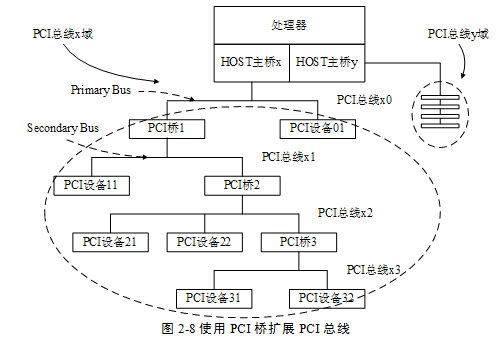
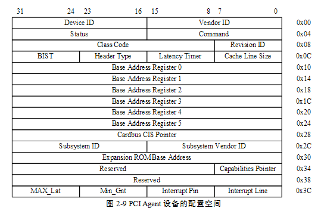
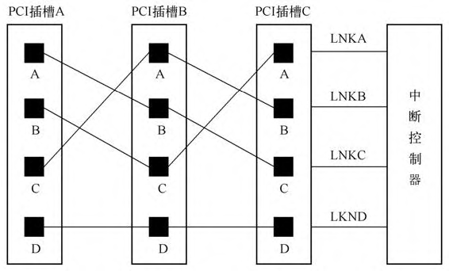
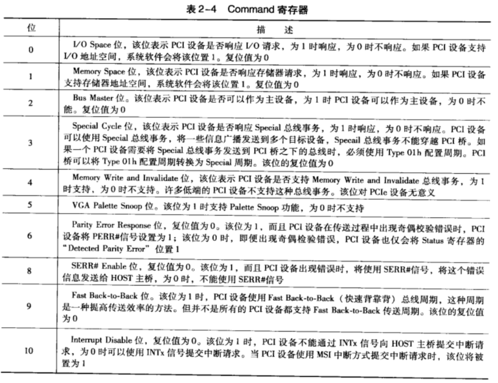
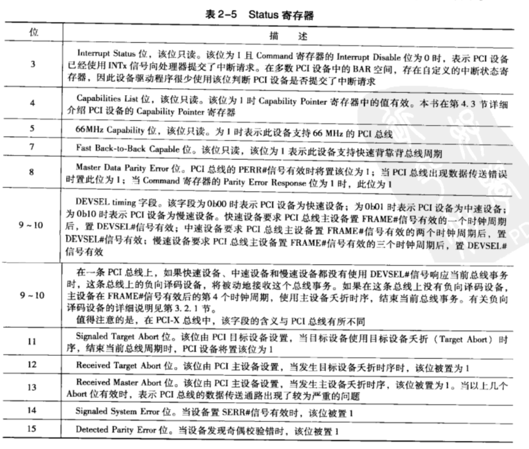
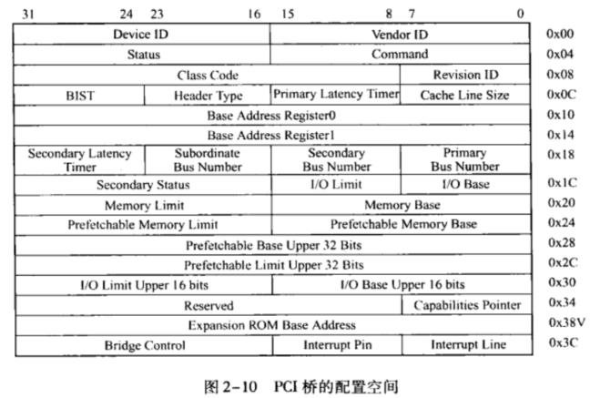

<!-- @import "[TOC]" {cmd="toc" depthFrom=1 depthTo=6 orderedList=false} -->

<!-- code_chunk_output -->

- [概述](#概述)
- [PCI 桥](#pci-桥)
- [PCI Agent 设备的配置空间](#pci-agent-设备的配置空间)
- [PCI 桥的配置空间](#pci-桥的配置空间)

<!-- /code_chunk_output -->

# 概述

PCI 设备都有独立的配置空间 HOST 主桥通过配置读写总线事务访问这段空间. PCI 总线规定了**三种类型**的 PCI 配置空间, 分别是:

* PCI Agent 设备使用的配置空间

* PCI 桥使用的配置空间

* Cardbus 桥片使用的配置空间

本节重点介绍 PCI Agent 和 PCI 桥使用的配置空间, 而并不介绍 Cardbus 桥片使用的配置空间. 值得注意的是, 在 PCI 设备配置空间中出现的地址都是 PCI 总线地址, 属于 PCI 总线域地址空间.

# PCI 桥

PCI 桥的引入使 PCI 总线极具扩展性也极大地增加了 PCI 总线的复杂度. PCI 总线的电气特性决定了在一条 PCI 总线上挂接的负载有限, 当 PCI 总线需要连接多个 PCI 设备时, 需要使用 PCI 桥进行总线扩展, 扩展出的 PCI 总线可以连接其他 PCI 设备, 包括 PCI 桥. 在一颗 PCI 总线树上, 最多可以挂接 256 个 PCI 设备, 包括 PCI 桥. PCI 桥在 PCI 总线树中的位置如图 2‑8 所示.



PCI 桥作为一个特殊的 PCI 设备, 具有独立的配置空间. 但是 PCI 桥配置空间的定义与 PCI Agent 设备有所不同. PCI 桥的配置空间可以管理其下 PCI 总线子树的 PCI 设备, 并可以优化这些 PCI 设备通过 PCI 桥的数据访问. PCI 桥的配置空间在系统软件遍历 PCI 总线树时配置, 系统软件不需要专门的驱动程序设置 PCI 桥的使用方法, 这也是 PCI 桥被称为透明桥的主要原因.

在某些处理器系统中, 还有一类 PCI 桥, 叫做非透明桥. 非透明桥不是 PCI 总线定义的标准桥片, 但是在使用 PCI 总线挂接另外一个处理器系统时非常有用, 非透明桥片的主要作用是连接两个不同的 PCI 总线域, 进而连接两个处理器系统, 本章将在第 2.5 节中详细介绍 PCI 非透明桥.

使用 PCI 桥可以扩展出新的 PCI 总线, 在这条 PCI 总线上还可以继续挂接多个 PCI 设备. PCI 桥跨接在两个 PCI 总线之间, 其中距离 HOST 主桥较近的 PCI 总线被称为该桥片上游总线(Primary Bus), 距离 HOST 主桥较远的 PCI 总线被称为该桥片的下游总线(Secondary Bus). 如图 2‑8 所示, PCI 桥 1 的上游总线为 PCI 总线 x0, 而 PCI 桥 1 的下游总线为 PCI 总线 x1. 这两条总线间的数据通信需要通过 PCI 桥 1.

通过 PCI 桥连接的 PCI 总线属于同一个 PCI 总线域, 在图 2-8 中, PCI 桥 1、2 和 3 连接的 PCI 总线都属于 PCI 总线 x 域. 在这些 PCI 总线域上的设备可以通过 PCI 桥直接进行数据交换而不需要进行地址转换; 而分属不同 PCI 总线域的设备间的通信需要进行地址转换, 如与 PCI 非透明桥两端连接的设备之间的通信. 如图 2-8 所示, 每一个 PCI 总线的下方都可以挂接一个到多个 PCI 桥, 每一个 PCI 桥都可以推出一条新的 PCI 总线. 在同一条 PCI 总线上的设备之间的数据交换不会影响其他 PCI 总线. 如 PCI 设备 21 与 PCI 设备 22 之间的数据通信仅占用 PCI 总线 x2 的带宽, 而不会影响 PCI 总线 x0、x1 与 x3, 这也是引人 PCI 桥的一个重要原因.

由图 2-8 还可以发现 PCI 总线可以通过 PCI 桥组成一个胖树结构, 其中每一个桥片都是父节点, 而 PCI Agent 设备只能是子节点. 当 PCI 桥出现故障时, 其下的设备不能将数据传递给上游总线, 但是并不影响 PCI 桥下游设备间的通信. 当 PCI 桥 1 出现故障时, PCI 设备 11、PCI 设备 21 和 PCI 设备 22 将不能与 PCI 设备 01 和存储器进行通信, 但是 PCI 设备 21 和 PCI 设备 22 之间的通信可以正常进行.

使用 PCI 桥可以扩展一条新的 PCI 总线, 但是不能扩展新的 PCI 总线域. 如果当前系统使用 32 位的 PCI 总线地址, 那么这个系统的 PCI 总线域的地址空间为 4GB 大小, 在这个总线域上的所有设备将共享这个 4GB 大小的空间. 如在 PCI 总线 x 域上的 PCI 桥 1、PCI 设备 01、PCI 设备 11、PCI 桥 2、PCI 设备 21 和 PCI 设备 22 等都将共享一个 4GB 大小的空间. 再次强调这个 4GB 空间是 PCI 总线 x 域的 "PCI 总线地址空间", 和存储器域地址空间和 PCI 总线 y 域没有直接联系.

处理器系统可以通过 HOST 主桥扩展出新的 PCI 总线域, 如 MPC8548 处理器的 HOST 主桥 x 和 y 可以扩展出两个 PCI 总线域 x 和 y. 这两个 PCI 总线域 x 和 y 之间的 PCI 空间在正常情况下不能直接进行数据交换, 但是 PowerPC 处理器可以通过设置 PIWARn 寄存器的 TGI 字段使得不同 PCI 总线域的设备直接通信, 详见第 2.2.3 节.

许多处理器系统使用的 PCI 设备较少, 因而并不需要使用 PCI 桥. 因此在这些处理器系统中, PCI 设备都是直接挂接在 HOST 主桥上, 而不需要使用 PCI 桥扩展新的 PCI 总线. 即便如此读者也需要深入理解 PCI 桥的知识.

PCI 桥对于理解 PCI 和 PCIe 总线都非常重要. 在 PCIe 总线中, 虽然在物理结构上并不含有 PCI 桥, 但是与 PCI 桥相关的知识在 PCIe 总线中无处不在, 比如在 PCIe 总线的 Switch 中, 每一个端口都与一个虚拟 PCI 桥对应, Switch 使用这个虚拟 PCI 桥管理其下 PCI 总线子树的地址空间.

# PCI Agent 设备的配置空间

在一个具体的处理器应用中**PCI 设备**通常将**PCI 配置信息存放在 E2PROM**中. **PCI 设备**进行**上电初始化**时将**E2PROM**中的**信息读到 PCI 设备的配置空间**中作为**初始值**. 这个过程由**硬件逻辑完成**绝大多数 PCI 设备使用这种方式初始化其配置空间.

读者可能会对这种机制产生一个疑问如果**系统软件**在**PCI 设备**将**E2PROM**中的信息**读到配置空间之前**就开始**操作配置空间**会不会带来问题?因为此时 PCI 设备的初始值并不"正确"仅仅是 PCI 设备使用的复位值.

读者的这种担心是多余的因为 PCI 设备在配置寄存器**没有初始化完毕之前**即**E2PROM 中的内容没有导入 PCI 设备的配置空间之前**可以使用**PCI 总线规定**的"**Retry**"周期使**HOST 主桥**在**合适的时机**重新发起配置读写请求.

在 x86 处理器中**系统软件**使用 **CONFIG_ADDR！！！** 和 **CONFIG_DATA 寄存器！！！**读取**PCI 设备配置空间**的这些**初始化信息**然后根据处理器系统的实际情况**使用 DFS 算法初始化**处理器系统中**所有 PCI 设备的配置空间！！！**.

在 **PCI Agent 设备**的配置空间中包含了许多寄存器这些寄存器决定了该设备在 PCI 总线中的使用方法本节不会全部介绍这些寄存器因为系统软件只对部分配置寄存器感兴趣. PCI Agent 设备使用的配置空间如图 2‑9 所示.



在 PCI Agent 设备配置空间中包含的寄存器如下所示.

(1) Device ID 和 Vendor ID 寄存器

这两个寄存器的值由 **PCISIG** 分配, **只读**. 其中 **Vendor ID** 代表 PCI 设备的**生产厂商**而 **Device ID** 代表**这个厂商**所生产的**具体设备**.

如 Intel 公司的基于 **82571EB 芯片的系列网卡**其 **Vendor ID** 为 `0x8086[1]` 而 **Device ID** 为 `0x105E[2]`.

**PCI 设备驱动**就是通过 **Device ID** 和 **Vendor ID** 来**匹配设备**的.

(2) Revision ID 和 Class Code 寄存器

这两个寄存器**只读**. 其中 **Revision ID** 寄存器记载 **PCI 设备的版本号**. 该寄存器可以被认为是 **Device ID 寄存器的扩展**.

(3) Header Type 寄存器

该寄存器**只读**, 由**8 位**组成.

第 7 位为 1 表示当前 PCI 设备是**多功能设备**为 0 表示为**单功能设备**.

第 `6~0` 位表示**当前配置空间的类型**为**0**表示该设备使用 PCI Agent 设备的配置空间**普通 PCI 设备**都使用这种配置头; 为**1**表示使用**PCI 桥**的配置空间 PCI 桥使用这种配置头; 为**2**表示使用**Cardbus 桥片**的配置空间 Card Bus 桥片使用这种配置头本篇对这类配置头不感兴趣.

**系统软件**需要使用该寄存器**区分不同类型的 PCI 配置空间**该寄存器的初始化必须与 PCI 设备的实际情况对应而且必须为一个合法值.

(4) Cache Line Size 寄存器

该寄存器记录**HOST 处理器**使用的**Cache 行长度**. 在 PCI 总线中和 Cache 相关的总线事务如存储器写并无效和 Cache 多行读等总线事务需要使用这个寄存器. 值得注意的是该寄存器由系统软件设置但是在 PCI 设备的运行过程中只有其硬件逻辑才会使用该寄存器比如 PCI 设备的硬件逻辑需要得知处理器系统 Cache 行的大小才能进行存储器写并无效总线事务单行读和多行读总线事务.

如果 PCI 设备不支持与 Cache 相关的总线事务系统软件可以不设置该寄存器此时该寄存器为初始值 0x00. 对于 PCIe 设备该寄存器的值无意义因为 PCIe 设备在进行数据传送时在其报文中含有一次数据传送的大小 PCIe 总线控制器可以使用这个"大小"判断数据区域与 Cache 行的对应关系.

(5) Subsystem ID 和 Subsystem Vendor ID 寄存器

这两个寄存器和 Device ID 和 Vendor ID 类似也是记录 PCI 设备的生产厂商和设备名称. 但是这两个寄存器和 Device ID 与 Vendor ID 寄存器略有不同. 下文以一个实例说明 Subsystem ID 和 Subsystem Vendor ID 的用途.

Xilinx 公司在 FGPA 中集成了一个 PCIe 总线接口的 IP 核即 LogiCORE. 用户可以使用 LogiCORE 设计各种各样基于 PCIe 总线的设备. 但是这些设备的 Device ID 都是 0x10EE 而 Vendor ID 为 `0x0007[3]`.

(6) Expansion ROM base address 寄存器

有些 PCI 设备在处理器还没有运行操作系统之前就需要完成基本的初始化设置比如显卡、键盘和硬盘等设备. 为了实现这个"预先执行"功能 PCI 设备需要提供一段 **ROM 程序**而处理器在初始化过程中将运行这段 ROM 程序初始化这些 PCI 设备. Expansion ROM base address 记载这段 ROM 程序的基地址.

(7) Capabilities Pointer 寄存器

在 PCI 设备中该寄存器是**可选的**. 但是在 `PCI-X` 和 PCIe 设备中必须支持这个寄存器 Capabilities Pointer 寄存器存放 Capabilities 寄存器组的基地址 PCI 设备使用 Capabilities 寄存器组存放一些与 PCI 设备相关的扩展配置信息. 该组寄存器的详细说明见第 4.3 节.

(8) Interrupt Line 寄存器

> 中断向量号

这个寄存器是**系统软件！！！** 对 PCI 设备进行**配置时写入**的. 该寄存器记录**当前 PCI 设备**使用的**中断向量号**, **设备驱动程序**可以**通过这个寄存器**, 判断**当前 PCI 设备**使用处理器系统中的**哪个中断向量号**, 并将驱动程序的**中断服务例程注册到操作系统**中(Linux 中使用 `request_irq()` 函数注册一个设备的中断服务例程).

> 所以这个是 IRQ 

该寄存器由**系统软件**初始化, 其保存的值与 8259A 中断控制器相关. 该寄存器的值也是由 PCI 设备与 8259A 中断控制器的**连接关系**决定的. 如果在一个处理器系统中, **没有使用 8259A 中断控制器！！！**管理 PCI 设备的中断, 则**该寄存器中的数据并没有意义**.

> 传统的中断控制器由两个 8259A 芯片级联而成, 有 0 到 15 号 Line, IRQ Line 表示的是用哪一根线

在多数 PowerPC 处理器系统中, 并**不使用 8259A 中断控制器**管理 PCI 设备的中断请求, 因此**该寄存器没有意义**. 即使在 **x86** 处理器系统中, 如果使用 **I/O APIC 中断控制器**, 该寄存器保存的**内容仍然无效**.

目前在**绝大多数处理器系统**中, 并**没有使用该寄存器**存放 PCI 设备使用的中断向量号.

> 但是 Linux 无论如何都填充了该子段值, 从而 driver 知道该设备使用的真实 irq 值, 设备本身不会使用.

(9) Interrupt Pin 寄存器

> PCI 设备使用哪一条引脚信号连接中断控制器, 该寄存器**只读**, 由**8 位**组成.

这个寄存器保存 PCI 设备使用的**中断引脚**. PCI 总线提供了**四个中断引脚** `INTA#`、`INTB#`、`INTC#` 和 `INTD#` **向中断控制器提交中断请求**. 这4个信号会与**中断控制器**的 `IRQ_PIN` 引脚相连.

Interrupt Pin 寄存器

* 为 1 时表示使用 `INTA#` 引脚;

* 为 2 表示使用 `INTB#`;

* 为 3 表示使用 `INTC#`;

* 为 4 表示使用 `INTD#`.

**大部分设备**使用中断线 **INTA** 引脚, 如果设备**不支持中断**, 则该域为 0.

如果 PCI 设备**只有一个子设备**时, 该设备只能使用 `INTA#`; 如果有多个子设备时可以使用 `INTB# ~ D#` 信号. 如果 PCI 设备不使用这些中断引脚向处理器提交中断请求时该寄存器的值必须为 0. 值得注意的是虽然在 **PCIe 设备**中并**不含有** `INTA~D#` **信号**, 但是依然可以使用该寄存器, 因为 PCIe 设备可以使用 **INTx 中断消息模拟** PCI 设备的 `INTA~D#` 信号详见第 6.3.4 节.

PCI 总线能够发送对应的 `INTA# ~ INTD#` 4个信号, 这 4 个信号会与**中断控制器**的 **IRQ_PIN 引脚**相连. PCI 总线规范中并没有规定 **PCI 设备的 INTx 信号**与**中断控制引脚**的相连关系, 因此**系统软件**需要使用**中断路由表**存放 PCI 设备的 **INTx 信号**与**中断控制器**的连接关系, **中断路由表**通常是由 **BIOS** 等系统软件建立的.

为了均衡 PCI 总线上的负载, 通常 PCI 信号与终端信号线的连接都是错开的. 如下图所示, **插槽 A 上的设备**与**插槽 B、C 上的设备**使用**不同的信号线**与连接中断控制器的IRQY引脚, 其他类似. 这种连接方式也让**每个插槽的中断信号 INTA** 连接到**不同的中断设备引脚**.



(10) `Base Address Register 0~5` 寄存器

该组寄存器简称为**BAR 寄存器**, 在 **BAR 寄存器**中存放的是该 PCI 设备使用的 "**PCI 总线域**" 的**物理地址**, 而**不是** "**存储器域**" 的**物理地址**. 其中**每一个设备**最多可以有**6 个基址空间！！！**, 但多数设备不会使用这么多组地址空间.

在 PCI **设备复位**之后, 该**寄存器**将**存放** PCI 设备需要使用的**基址空间大小**, 这段空间是 **I/O 空间**还是**存储器空间**, 如果是存储器空间该空间**是否可预取**, 有关 PCI 总线预读机制的详细说明见第 3.4.5 节.

**系统软件**对**PCI 总线进行配置**时, 首先获得 BAR 寄存器中的**初始化信息**, 之后根据处理器系统的配置, 将**合理的基地址**写入相应的**BAR 寄存器**中. 系统软件还可以使用该寄存器, 获得 PCI 设备使用的 BAR 空间的长度, 其方法是向 BAR 寄存器写入 `0xFFFF-FFFF` 之后再读取该寄存器. Linux 系统使用 `__pci_read_base` 函数获取 BAR 寄存器的长度, 详细见 14.3.2.

处理器访问 PCI 设备的 BAR 空间时, 需要使用 **BAR** 寄存器提供的**基地址**. 值得注意的是, 处理器使用**存储器域的地址**, 而 **BAR** 寄存器存放 **PCI 总线域的地址**. 因此**处理器系统**并**不能**直接使用 "`BAR 寄存器 + 偏移`" 的方式访问 PCI 设备的寄存器空间, 而需要**将 PCI 总线域的地址转换为存储器域的地址**.

Linux 中, 一个处理器系统使用 BAR 空间的正确方式如下:

```cpp

	pciaddr = pci_resource_start(pdev, 1);
	if (!pciaddr) {
		rc = -EIO;
		dev_err(&pdev->dev, "no MMIO resource\n");
		goto err_out_res;
	}
    ...
	regs = ioremap(pciaddr, CP_REGS_SIZE);
    ...
```

在 Linux 系统中, 使用 `pci_dev->resource[bar].start` 参数保存 BAR 寄存器在**存储器域的地址**. 在编写Linux设备驱动程序时, 必须使用 `pci_resource_start` 函数获得 BAR 空间对应的**存储器域的物理地址**, 而不能使用从 BAR 寄存器中读出的地址.

当驱动程序获得 BAR 空间在存储器域的物理地址后, 再使用 ioremap 函数将这个物理地址转换为虚拟地址.

Linux 系统直接使用 BAR 空间的方法是不正确的, 如下所示.

```cpp
    ret = pci_read_config_dword(pdev, 1, &pciaddr);
    if (!pciaddr) {
		rc = -EIO;
		dev_err(&pdev->dev, "no MMIO resource\n");
		goto err_out_res;
	}
    ...
    regs = ioremap(pciaddr, BAR_SIZE);
```

在 Linux 系统中, 使用 `pci_read_confg_dword` 函数获得的是 **PCI 总线域的物理地址**, 在许多处理器系统中, 如 Alpha 和 PowerPC 处理器系统, **PCI 总线域的物理地址**与**存储器域的物理地址**并不相等.

如果 **x86** 处理器系统使能了 **IOMMU** 后, 这两个地址也并**不一定相等**, 因此处理器系统直接使用这个 PCI 总线域的物理地址, 并不能确保访问 PCI 设备的 BAR 空间的正确性. 除此之外在 Linux 系统中, **ioremap** 函数的输入参数为**存储器域的物理地址**, 而不能使用 PCI 总线域的物理地址.

而在 `pci_dev->resource[bar].start` 参数中保存的地址已经经过 PCI 总线域到**存储器域的地址**转换, 因此在编写 Linux 系统的设备驱动程序时, 需要使用 `pci_dev->resource[bar].start` 参数中的**存储器域物理地址**, 然后再经过 ioremap 函数将物理地址转换为 "存储器域" 的**虚拟地址**.

(11) Command 寄存器

该寄存器为PCI设备的命令寄存器.

* 在**初始化**时, 其值为 **0**, 此时这个PCI设备除了能够接收**配置请求总线事务**之外, **不能接收**任何**存储器或者 I/O 请求**.

* 系统软件需要合理设置该寄存器之后, 才能访问该设备的存储器或者 I/O 空间.

* 在 Linux 系统中, 设备驱动程序调用 `pci_enable_device` 函数, **使能**该寄存器的 **I/O 和Memory Space 位**之后, 才能访问该设备的存储器或者 I/O 地址空间.

> `pci_enable_device` 函数详细说明在 12.3.2.

Command寄存器的各位的含义如表2-4所示.



(12) Status 寄存器

该寄存器的绝大多数位都是只读位, 保存 PCI 设备的状态.

含义如下表.



(13) Latency Timer 寄存器

在 PCI 总线中, 多个设备共享同一条总线带宽. 该寄存器用来控制 PCI 设备占用 PCI 总线的时间, 当 PCI 设备获得总线使用权, 并使能 `Frame#` 信号后, Latency Timer 寄存器将递减, 当该寄存器归零后, 该设备将使用超时机制停止(此时GNT#信号为无效. 为提高仲裁效率, PCI设备在进行数据传送时, GNT#信号可能已经无效) 对当前总线的使用.

如果当前总线事务为 Memeory Write and Invalidate 时, 需要保证对一个完整 Cache 行的操作结束后才能停止当前总线事务. 对于多数 PCI 设备而言, 该寄存器的值为 32 或者 64 以保证一次突发传送的基本单位为一个 Cache 行.

PCIe 设备不需要使用该寄存器, 该寄存器的值必须为 0. 因为 PCIe 总线的仲裁方法与 PCI 总线不同, 使用的连接方法也与 PCI 总线不同.

# PCI 桥的配置空间

PCI桥使用的配置空间的寄存器如图2-10所示. PCI桥作为一个 PCI 设备, 使用的许多配置寄存器与 PCI Agent 的寄存器是类似的, 如 Device ID、Vendor ID、Status、Command、Interrupt Pin、Interrupt Line 寄存器等, 本节不再重复介绍这些寄存器. 下面将重点介绍在 PCI 桥中与 PCI Agent 的配置空间不相同的寄存器.

与 PCI Agent 设备不同, 在 PCI 桥中只含有两组 BAR 寄存器, 即 Base Address Register 0~1 寄存器. 这两组寄存器与 PCI Agent 设备配置空间的对应寄存器的含义一致. 但是在 PCI 桥中, 这两组寄存器是可选的. 如果在 PCI 桥中不存在私有寄存器, 那么可以不使用这两组寄存器设置 BAR 空间.

在大多数 PCI 桥中都不存在私有寄存器, 操作系统也不需要为 PCI 桥提供专门的驱动程序, 这也是这类桥被称为透明桥的原因. 如果在 PCI 桥中不存在私有空间时, PCI 桥将这两个 BAR 寄存器初始化为 0. 在 PCI 桥的配置空间中使用两个 BAR 寄存器的原因是这两个 32 位的寄存器可以组成一个 64 位地址空间.

在 PCI 桥的配置空间中, 有许多寄存器是 PCI 桥所特有的. PCI 桥除了作为 PCI 设备之外, 还需要管理其下连接的 PCI 总线子树使用的各类资源, 即 Secondary Bus 所连接 PCI 总线子树使用的资源. 这些资源包括存储器、I/O 地址空间和总线号.



在 PCI 桥中, 与 Secondary bus 相关的寄存器包括两大类. 一类寄存器管理 Secondary Bus 之下 PCI 子树的总线号, 如 Secondary 和 Subordinate Bus Number 寄存器;另一类寄存器管理下游 PCI 总线的 I/O 和存储器地址空间, 如 I/O 和 Memory Limit、I/O 和 Memory Base 寄存器. 在 PCI 桥中还使用 Primary Bus 存器保存上游的 PCI 总线号.

其中存储器地址空间还分为可预读空间和不可预读空间, Prefetchable Memory Limit 和 Prefetchable Memory Base 寄存器管理可预读空间, 而 Memory Limit、Memory Base 管理不可预读空间. 在 PCI 体系结构中, 除了 ROM 地址空间之外, PCI 设备使用的地址空间大多都是不可预读的.

(1) Subordinate Bus Number、Secondary Bus Number 和 Primary Bus Number 寄存器

PCI 桥可以管理其下的 PCI 总线子树. 其中 Subordinate Bus Number 寄存器存放当前 PCI 子树中, 编号最大的 PCI 总线号. 而 Secondary Bus Number 寄存器存放**当前 PCI 桥 Secondary Bus 使用的总线号**, 这个 PCI 总线号也是该 PCI 桥管理的 **PCI 子树中编号最小的 PCI 总线号**, 因此一个 PCI 桥能够管理的 PCI 总线号在 Secondary Bus Number~Subordinate Bus Number 之间. 这两个寄存器的值由系统软件遍历 PCI 总线树时设置.

Primary Bus Number 寄存器存放**该 PCI 桥上游的 PCI 总线号**, 该寄存器可读写. Primary Bus Number、Subordinate Bus Number 和 Secondary Bus Number 寄存器在初始化时必须为 0, 系统软件将根据这几个寄存器是否为 0, 判断 PCI 桥是否被配置过.

不同的操作系统使用不同的 Bootloader 引导, 有的 Bootloader 可能会对 PCI 总线树进行遍历, 此时操作系统不必重新遍历 PCI 总线树. 在 x86 处理器系统中, BIOS 会遍历处理器系统中的所有 PCI 总线树, 操作系统可以直接使用 BIOS 的结果, 也可以重新遍历 PCI 总线树. 而 PowerPC 处理器系统中的 Bootloader, 如 U-Boot 并没有完全遍历 PCI 总线树, 此时操作系统必须重新遍历 PCI 总线树. 本书将在第 14 章以 Linux 系统为例说明 PCI 总线树的遍历过程.

(2) Secondary Status 寄存器

该寄存器的含义与 PCI Agent 配置空间的 Status 寄存器的含义相近, PCI 桥的 Secondary Status 寄存器记录 Secondary Bus 的状态, 而不是 PCI 桥作为 PCI 设备时使用的状态. 在 PCI 桥配置空间中还存在一个 Status 寄存器, 该寄存器保存 PCI 桥作为 PCI 设备时的状态.

(3) Secondary Latency Timer 寄存器

该寄存器的含义与 PCI Agent 配置空间的 Latency Timer 寄存器的含义相近, PCI 桥的 Secondary Latency Timer 寄存器管理 Secondary Bus 的超时机制, 即 PCI 桥发向下游的总线事务;在 PCI 桥配置空间中还存在一个 Latency Timer 寄存器, 该寄存器管理 PCI 桥发向上游的总线事务.

(4) I/O Limit 和 I/O Base 寄存器

在 PCI 桥管理的 PCI 子树中包含许多 PCI 设备, 而这些 PCI 设备可能会使用 I/O 地址空间. PCI 桥使用这两个寄存器, 存放 PCI 子树中所有设备使用的 I/O 地址空间集合的基地址和大小.

(5) Memory Limit 和 Memory Base 寄存器

在 PCI 桥管理的 PCI 子树中有许多 PCI 设备, 这些 PCI 设备可能会使用存储器地址空间. 这两个寄存器存放所有这些 PCI 设备使用的存储器地址空间集合的基地址和大小, PCI 桥规定这个空间的大小至少为 1MB.

(6) Prefetchable Memory Limit 和 Prefetchable Memory Base 寄存器

在 PCI 桥管理的 PCI 子树中有许多 PCI 设备, 如果这些 PCI 设备支持预读, 则需要从 PCI 桥的可预读空间中获取地址空间. PCI 桥的这两个寄存器存放这些 PCI 设备使用的可预取存储器空间的基地址和大小.

如果 PCI 桥不支持预读, 则其下支持预读的 PCI 设备需要从 Memory Base 寄存器为基地址的存储器空间中获取地址空间. 如果 PCI 桥支持预读, 其下的 PCI 设备需要根据情况, 决定使用可预读空间还是不可预读空间. PCI 总线建议 PCI 设备支持预读, 但是支持预读的 PCI 设备并不多见.

(7) I/O Base Upper 16 Bits and I/O Limit Upper 16 寄存器

如果 PCI 桥仅支持 16 位的 I/O 端口, 这组寄存器只读, 且其值为 0. 如果 PCI 桥支持 32 位 I/O 端口, 这组寄存器可以提供 I/O 端口的高 16 位地址.

(8) Bridge Control Register

该寄存器用来管理 PCI 桥的 Secondary Bus, 其主要位的描述如下.

- Secondary Bus Reset 位, 第 6 位, 可读写. 当该位为 1 时, 将使用下游总线提供的 RST# 信号复位与 PCI 桥的下游总线连接的 PCI 设备. 通常情况下与 PCI 桥下游总线连接的 PCI 设备, 其复位信号需要与 PCI 桥提供的 RST# 信号连接, 而不能与 HOST 主桥提供的 RST# 信号连接.

- Primary Discard Timer 位, 第 8 位, 可读写. PCI 桥支持 Delayed 传送方式, 当 PCI 桥的 Primary 总线上的主设备使用 Delayed 方式进行数据传递时, PCI 桥使用 Retry 周期结束 Primary 总线的 Non-Posted 数据请求, 并将这个 Non-Posted 数据请求转换为 Delayed 数据请求, 之后主设备需要择时重试相同的 Non-Posted 数据请求. 当该位为 1 时, 表示在 Primary Bus 上的主设备需要在 2 个时钟周期之内重试这个数据请求, 为 0 时, 表示主设备需要在 2 个时钟周期之内重试这个数据请求, 否则 PCI 桥将丢弃 Delayed 数据请求.

- Secondary Discard Timer 位, 第 9 位, 可读写. 当该位为 1 时, 表示在 Secondary Bus 上的主设备需要在 2 个时钟周期之内重试这个数据请求, 为 0 时, 表示主设备需要在 2 个时钟周期之内重试这个数据请求, 如果主设备在规定的时间内没有进行重试时, PCI 桥将丢弃 Delayed 数据请求.

