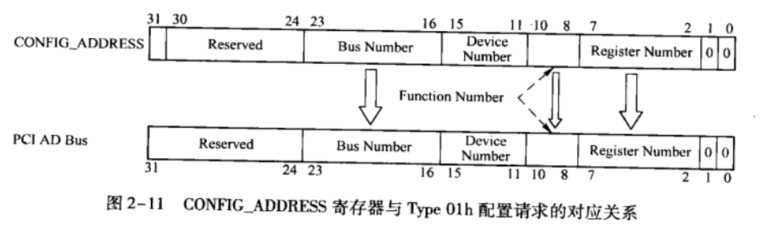
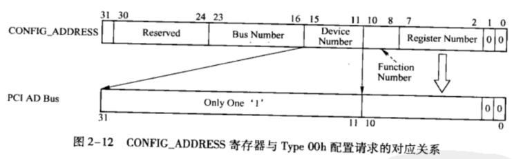
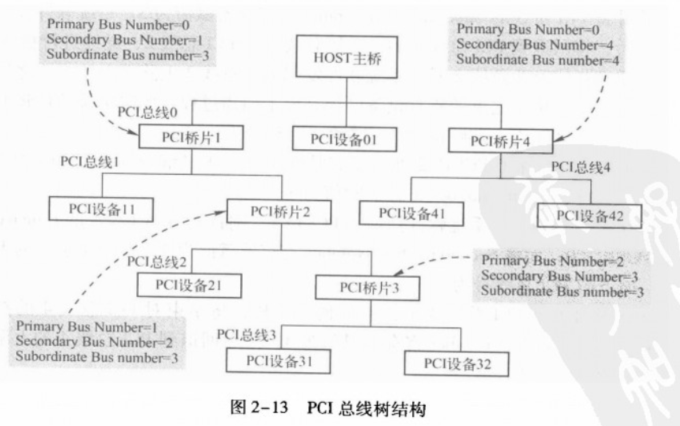
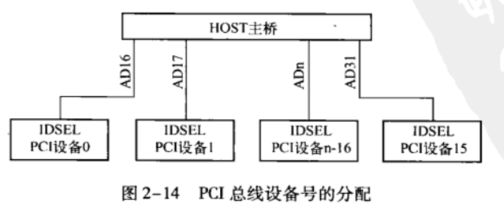

PCI总线定义了两类配置请求, 一类是 Type 00h 配置请求, 另一类是 Type 01h 配置请求. PCI总线使用这些配置请求访问 PCI 总线树上的设备配置空间, 包括 PCI 桥和 PCIAgent 设备的配置空间.

其中 HOST 主桥或者 PCI 桥使用 Type 00h 配置请求, 访问与 HOST 主桥或者 PCI 桥直接相连的 PCIAgent 设备或者 PCI 桥(此时 PCI 桥作为一个 PCI 设备, 接收访问其配置空间的读写请求);而 HOST 主桥或者 PCI 桥使用 Type 01h 配置请求, 需要至少穿越一个 PCI 桥, 访问没有与其直接相连的 PCIAgent 设备或者 PCI 桥. 如图 2-8 所示, HOST 主桥可以使用 Type 00h 配置请求访问 PCI 设备 01, 而使用 Type 01h 配置请求通过 PCI 桥 1、2 或者 3 转换为 Type 00h 配置请求之后, 访问 PCI 总线树上的 PCI 设备 11、21、22、31 和 32.

> 最终 Type 01h 配置请求将会被转换为 Type 00h 配置请求, 然后访问 PCIAgent 设备.

当 x86 处理器对 CONFIGDATA 寄存器进行读写操作时, HOST 主桥将决定向 PCI 总线发送 Type 00h 配置请求还是 Type 01h 配置请求. 在 PCI 总线事务的地址周期中, 这两种配置请求总线事务的不同反映在 PCI 总线的 AD[31:0] 信号线上.

值得注意的是, PCle 总线还可以使用 ECAM (Enhanced Configuration Access Mechanism) 机制访问 PCe 设备的扩展配置空间, 使用这种方式可以访问 PCIe 设备 256B~4KB 之间的扩展配置空间. 但是本节仅介绍如何使用 CONFIGADDRESS 和 CONFIG_FATA 存器产生 Type 00h 和 Type 01h 配置请求. 有关 ECAM 机制的详细说明见第 5.3.2 节.

处理器首先将目标 PCI 设备的 ID 号保存在 CONFIG_ADDRESS 寄存器中, 之后 HOST 主桥根据该寄存器的 Bus Number 字段, 决定是产生 Type 00h 配置请求, 还是 Type 01h 配置请求. 当 BusNumber 字段为 0 时, 将产生 Type 00h 配置请求, 因为与 HOST 主桥直接相连的总线号为 0;大于 0 时, 将产生 Type 01h 配置请求.

# Type 01h 和 Type 00h 配置请求

本节首先介绍 Type 01h 配置请求, 并从 PCI 总线使用的信号线的角度上, 讲述 HOST 主桥如何生成 Type 01 配置请求. 在 PCI 总线中, 只有 PCI 桥能够接收 Type 01h 配置请求, Type 01h 配置请求不能直接发向最终的 PCIAgent 设备, 而只能由 PCI 桥将其转换为 Type 01h 继续发向其他 PCI 桥, 或者转换为 Type 00h 配置请求发向 PCIAgent 设备. PCI 桥还可以将 Type 01h 配置请求转换为 SpecialCycle 总线事务 (HOST 主桥也可以实现该功能), 本节对这种情况不做介绍.

在地址周期中, HOST 主桥使用配置读写总线事务, 将 CONFIGADDRESS 寄存器的内容复制到 PCI 总线的 AD[31:0] 信号线中. CONFIG_ADDRESS 寄存器与 Type 01h 配置请求的对应关系如图 2-11 所示.

从图 2-11 中可以发现, CONFIG_ADDRESS 寄存器的内容基本上是原封不动地复制到 PCI 总线的 AD[31:0] 信号线上的 9. 其中 CONFIC_ADDRESS 的 Enable 位不被复制, 而 AD 总线的第 0 位必须为 1, 表示当前配置请求是 Type 01h.

当 PCI 总线接收到 Type 01 配置请求时, 将寻找合适的 PCI 桥. 接收这个配置信息. 如果这个配置请求是直接发向 PCI 桥下的 PCI 设备时, PCI 桥将接收这个 Type 01 配置请求, 并将其转换为 Type 00h 配置请求;否则 PCI 桥将当前 Type 01h 配置请求原封不动地传递给下一级 PCI 总线.

如果 HOST 主桥或者 PCI 桥发起的是 Type 00h 配置请求, CONFIG_ADDRESS 寄存器与 AD[31:0] 的转换如图 2-12 所示.

此时处理器对 CONFIG_DATA 寄存器进行读写时, 处理器将 CONFIG_ADDRESS 寄存器
中的 Function Number 和 Register Number 字段复制到 PCI 的 AD 总线的第 10~2 位;将 AD 总线的第 1~0 位赋值为 0b00. PCI 总线在配置请求总线事务的地址周期根据 AD[1:0] 判断当前配置请求是 Type 00h 还是 Type 01h, 如果 AD[1:0] 等于 0b00 表示是 Type 00h 配置请求, 如果 AD[1:0] 等于 0b01 表示是 Type 01h 配置请求.

而 AD[31:11] 与 CONFIG_ADDRESS 的 Device Number 字段有关, 在 Type 00h 配置请求的地址周期中, AD[31:11] 位有且只有一位为 1, 其中 AD[31:11] 的每一位选通一个 PCI 设备的配置空间. 如第 1.2.2 节所述, PCI 设备配置空间的片选信号是 IDSEL, 因此 AD[31:11] 将与 PCI 设备的 IDSEL 信号对应相连.

当以下两种请求之一满足时, HOST 主桥或者 PCI 桥将生成 Type 00h 配置头, 并将其发送到指定的 PCI 总线上.

(1) CONFIG_ADDRESS 寄存器的 BusNumber 字段为 0 时, 处理器访问 CONFIG_DATA 寄存器时, HOST 主桥将直接向 PCI 总线 0 发出 Type 00h 配置请求. 因为与 HOST 主桥直接相连的 PCI 总线号为 0, 此时表示 HOST 主桥需要访问与其直接相连的 PCI 设备.

(2) 当 PCI 桥收到 Type 01h 配置头时, 将检查 Type 01 配置头的 Bus Number 字段, 如果这个 Bus Number 与 PCI 桥的 Secondary BusNumber 相同, 则将这个 Type 01 配置头转换为 Type 00h 配置头, 并发送到该 PCI 桥的 Secondary 总线上.

# PCI 总线配置请求的转换原则

当 CONFIGADDRESS 寄存器的 Enable 位为 1, 系统软件访问 CONFIGDATA 寄存器时 HOST 主桥可以产生两类 PCI 总线配置读写总线事务, 分别为 Type 00h 和 Type 01h 配置读写总线事务. 在配置读写总线事务的地址周期和数据周期中, CONFIGADDRESS 和 CONFIGDATA 寄存器中的数据将被放置到 PCI 总线的 AD 总线上. 其中 Type 00h 和 Type 01h 配置读写总线事务映射到 AD 总线的数据并不相同.

其中 Type 00h 配置请求可以直接读取 PCIAgent 设备的配置空间, 而 Type 01h 配置请求在通过 PCI 桥时, 最终将被转换为 Type 00h 配置请求, 并读取 PCIAgent 设备的配置寄存器. 本节重点讲述 PCI 桥如何将 Type 01h 配置请求转换为 Type 00h 配置请求.

首先 Type 00h 配置请求不会被转换成 Type 01h 配置请求, 因为 Type 00h 配置请求是发向最终 PCIAgent 设备, 这些 PCIAgent 设备不会转发这些配置请求.

当 CONFIGADDRESS 寄存器的 BusNumber 字段为 0 时, 处理器对 CONFIG_DATA 寄存器操作时, HOST 主桥将直接产生 Type 00h 配置请求, 挂接在 PCI 总线 0 上的某个设备将通过 ID 译码接收这个 Type 00h 配置请求, 并对配置寄存器进行读写操作. 如果 PCI 总线上没有设备接收这个 Type 00h 配置请求, 将引发 MasterAbort, 详情见 PCI 总线规范, 本节对此不做进一步说明.

如果 CONFIG_ADDRESS 寄存器的 BusNumber 字段为 n (n≠0), 即访问的 PCI 设备不是直接挂接在 PCI 总线 0 上的, 此时 HOST 主桥对 CONFIGDATA 寄存器操作时, 将产生 Type 01h 配置请求, PCI 总线 0 将遍历所有在这条总线上的 PCI 桥, 确定由哪个 PCI 桥接收这个 Type 01h 配置请求.

如果 n 大于或等于某个 PCI 桥的 Secondary Bus Number 寄存器, 而且小于或等于 Subordinate Bus number 寄存器, 那么这个 PCI 桥将接收在当前 PCI 总线上的 Type 01 配置请求并采用以下规则进行递归处理.

(1) 开始.

(2) 遍历当前 PCI 总线的所有 PCI 桥.

(3) 如果 n 等于某个 PCI 桥的 Secondary Bus Number 寄存器, 说明这个 Type 01 配置请求的目标设备直接连接在该 PCI 桥的 Secondarybus 上. 此时 PCI 桥将 Type 01 配置请求转换为 Type 00h 配置请求, 并将这个配置请求发送到 PCI 桥的 SecondaryBus 上, SecondaryBus 上的某个设备将响应这个 Type 00h 配置请求, 并与 HOST 主桥进行配置信息的交换转 (5).

(4) 如果 n 大于 PCI 桥的 Secondary Bus Number 寄存器, 而且小于或等于 PCI 桥的 Subordinate Bus number 寄存器, 说明这个 Type 01 配置请求的目标设备不与该 PCI 桥的 SecondaryBus 直接相连, 但是由这个 PCI 桥下游总线上的某个 PCI 桥管理. 此时 PCI 桥将首先认领这个 Type 01 配置请求, 并将其转发到 SecondaryBus, 转 (2).

(5) 结束.

下面将举例说明 PCI 总线配置请求的转换原则, 并以图 2-8 为例说明处理器如何访问 PCI 设备 01 和 PCI 设备 31 的配置空间. PCI 设备 01 直接与 HOST 主桥相连, 因此 HOST 主桥可以使用 Type 00h 配置请求访问该设备.

而 HOST 主桥需要经过多级 PCI 桥才能访问 PCI 设备 31, 因此 HOST 主桥需要首先使用 Type 01h 配置请求, 之后通过 PCI 桥 1、2 和 3 将 Type 01h 配置请求转换为 Type 00h 配置请求, 最终访问 PCI 设备 31.

1) PCI 设备 01

这种情况较易处理, 当 HOST 处理器访问 PCI 设备 01 的配置空间时, 发现 PCI 设备 01 与 HOST 主桥直接相连, 所以将直接使用 Type 00h 配置请求访问该设备的配置空间, 具体步骤如下.

首先 HOST 处理器将 CONFIG_ADDRESS 寄存器的 Enabled 位置 1, Bus Number 号置为 0, 并对该寄存器的 Device、Function 和 Register Number 字段赋值. 当处理器对 CONFIG_DA-TA 寄存器访问时, HOST 主桥将存放在 CONFIG_ADDRESS 寄存器中的数值, 转换为 Type 00h 配置请求, 并发送到 PCI 总线 0 上, PCI 设备 01 将接收这个 Type 00h 配置请求, 并与处理器进行配置信息交换.

2) PCI 设备 31

HOST 处理器对 PCI 设备 31 进行配置读写时, 需要通过 HOST 主桥、PCI 桥1、2 和 3 最终到达 PCI 设备31.

当处理器访问 PCI 设备 31 时, 首先将 CONFIG_ADDRESS 寄存器的 Enabled 位置 1, Bus Number 字段置为 3, 并对 Device、Function 和 Register Number 字段赋值. 之后当处理器对 CONFIG_DATA 寄存器进行读写访问时, HOST 主桥、PCI 桥 1、2 和 3 将按照以下步骤进行处理, 最后 PCI 设备 31 将接收这个配置请求.

(1) HOST 主桥发现 Bus Number 字段的值为 3, 该总线号并不是与 HOST 主桥直接相连的 PCI 总线的 Bus Number, 所以 HOST 主桥将处理器对 CONFIG_DATA 寄存器的读写访问直接转换为 Type 01h 配置请求, 并将这个配置请求发送到 PCI 总线 0 上. PCI 总线规定 Type 01h 配置请求只能由 PCI 桥负责处理.

(2) 在 PC 总线 0 上, PCI 桥 1 的 Secondary Bus Number 为 1 而 Subordinate Bus Number 为 3. 而 `1 < BusNumber <= 3`, 所以 PCI 桥 1 将接收来自 PCI 总线 0 的 Type 01h 配置请求, 并将这个配置请求直接下推到 PCI 总线 1.

(3) 在 PC 总线 1 上, PCI 桥 2 的 Secondary Bus Number 为 2 而 Subordinate Bus Number 为 3. 而 `1 < BusNumber <= 3`, 所以 PCI 桥 2 将接收来自 PCI 总线 0 的 Type 01h 配置请求, 并将这个配置请求直接下推到 PCI 总线 2.

(4) 在 PCI 总线 2 上, PCI 桥 3 的 Secondary Bus Number 为 3, 因此 PCI 桥 3 将"来自 PCI 总线 2 的 Type 01h 配置请求"转换为 Type 00h 配置请求, 并将其下推到 PCI 总线 3. PCI 总线规定, 如果 PCI 桥的 Secondary Bus Number 与 Type 01h 配置请求中包含的 Bus Number 相同时, 该 PCI 桥将接收的 Type 01h 配置请求转换为 Type 00h 配置请求, 然后再发向其 Secondary Bus.

(5) 在 PCI 总线 3 上, 有两个设备: PCI 设备 31 和 PCI 设备 32. 在这两个设备中, 必然有一个设备将要响应这个 Type 00h 配置请求, 从而完成整个配置请求周期. 在第 2.4.1 节中, 讨论了究竟是 PCI 设备 31 还是 PCI 设备 32 接收这个配置请求, 这个问题涉及 PCI 总线如何分配 PCI 设备使用的设备号.

# PCI 总线树 Bus 号的初始化

在一个处理器系统中, 每一个 HOST 主桥都推出一棵 PCI 总线树. 在一棵 PCI 总线树中有多少个 PCI 桥(包括 HOST 主桥), 就含有多少条 PCI 总线. 系统软件在遍历当前 PCI 总线树时, 需要首先对这些 PCI 总线进行编号, 即初始化 PCI 桥的 Primary、Secondary 和 Subordinate Bus Number 寄存器.

在一个处理器系统中, 一般将与 HOST 主桥直接相连的 PCI 总线命名为 PCI 总线 0. 然后系统软件使用 DFS (Depth First Search) 算法, 依次对其他 PCI 总线进行编号. 值得注意的是, 与 HOST 主桥直接相连的 PCI 总线, 其编号都为 0, 因此当处理器系统中存在多个 HOST 主桥时, 将有多个编号为 0 的 PCI 总线, 但是这些编号为 0 的 PCI 总线分属不同的 PCI 总线域, 其含义并不相同.

在一个处理器系统中, PCI 总线树的结构如图 2-13 所示. 当然在一个实际的处理器系统中, 很少会出现这样复杂的 PCI 总线树结构, 本节采用这个结构的目的是便于说明 PCI 总线号的分配过程.

在 PCI 总线中, 系统软件使用深度优先 DFS 算法对 PCI 总线树进行遍历, DFS 算法和广度优先 BFS (Breadth First Search) 算法是遍历树型结构的常用算法. 与 BFS 算法相比, DFS 算法的空间复杂度较低, 因此绝大多数系统在遍历 PCI 总线树时, 都使用 DFS 算法而不是 BFS 算法.

DFS 是搜索算法的一种, 其实现机制是沿着一棵树的深度遍历各个节点, 并尽可能深地搜索树的分支, DFS 的算法为线性时间复杂度, 适合对拓扑结构未知的树进行遍历. 在一个处理器系统的初始化阶段, PCI 总线树的拓扑结构是未知的, 适合使用 DFS 算法进行遍历. 下面以图 2-13 为例, 说明系统软件如何使用 DFS 算法, 分配 PCI 总线号, 并初始化 PCI 桥中的 Primary Bus Number、Secondary Bus Number 和 Subordinate Bus Number 寄存器. 所谓 DFS 算法是指按照深度优先的原则遍历 PCI 总线树, 其步骤如下.

(1) HOST 主桥扫描 PCI 总线 0 上的设备. 系统软件首先忽略这条总线上的所有 PCIAgent 设备, 因为在这些设备之下不会挂接新的 PCI 总线. 例如 PCI 设备 01 下不可能挂接新的 PCI 总线.

(2) HOST 主桥首先发现 PCI 桥 1, 并将 PCI 桥 1 的 Secondary Bus 命名为 PCI 总线 1. 系统软件将初始化 PCI 桥 1 的配置空间, 将 PCI 桥 1 的 Primary Bus Number 寄存器赋值为 0 而将 Secondary Bus Number 寄存器赋值为 1, 即 PCI 桥 1 的上游 PCI 总线号为 0, 而下游 PCI 总线号为 1.

(3) 扫描 PCI 总线 1, 发现 PCI 桥 2, 并将 PCI 桥 2 的 Secondary Bus 命名为 PCI 总线 2. 系统软件将初始化 PCI 桥 2 的配置空间, 将 PCI 桥 2 的 Primary Bus Number 寄存器赋值为 1 而将 Secondary Bus Number 寄存器赋值为 2.

(4) 扫描 PCI 总线 2, 发现 PCI 桥 3, 并将 PCI 桥 3 的 Secondary Bus 命名为 PCI 总线 3. 系统软件将初始化 PCI 桥 3 的配置空间, 将 PCI 桥 3 的 Primary Bus Number 寄存器赋值为 2 而将 Secondary Bus Number 寄存器赋值为 3.

(5) 扫描 PCI 总线 3, 没有发现任何 PCI 桥, 这表示 PCI 总线 3 下不可能有新的总线. 此时系统软件将 PCI 桥 3 的 Subordinate Bus Number 寄存器赋值为 3. 系统软件在完成 PCI 总线 3 的扫描后, 将回退到 PCI 总线 3 的上一级总线, 即 PCI 总线 2, 继续进行扫描.

(6) 在重新扫描 PCI 总线 2 时, 系统软件发现 PCI 总线 2 上除了 PCI 桥 3 之外没有发现新的 PCI 桥, 而 PCI 桥 3 之下的所有设备已经完成了扫描过程, 此时系统软件将 PCI 桥 2 的 Subordinate Bus Number 寄存器赋值为 3. 继续回退到 PCI 总线 1.

(7) PCI 总线 1 上除了 PCI 桥 2 外, 没有其他桥片, 于是继续回退到 PCI 总线 0, 并将 PCI 桥 1 的 Subordinate Bus Number 寄存器赋值为 3.

(8) 在 PCI 总线 0 上, 系统软件扫描到 PCI 桥 4, 则首先将 PCI 桥 4 的 Primary Bus Number 寄存器赋值为 0, 而将 Secondary Bus Number 寄存器赋值为 4, 即 PCI 桥 1 的上游 PCI 总线号为 0, 而下游 PCI 总线号为 4.

(9) 系统软件发现 PCI 总线 4 上没有任何 PCI 桥, 将结束对 PCI 总线 4 的扫描, 并将 PCI 桥 4 的 Subordinate Bus Number 寄存器赋值为 4, 之后回退到 PCI 总线 4 的上游总线, 即 PCI 总线 0 继续进行扫描.

(10) 系统软件发现在 PCI 总线 0 上的两个桥片 PCI 总线 0 和 PCI 总线 4 都已完成扫描后, 将结束对 PCI 总线的 DFS 遍历全过程.

从以上算法可以看出, PCI 桥的 Primary Bus 和 Secondary Bus 号的分配在遍历 PCI 总线树的过程中从上向下分配, 而 Subordinate Bus 号是从下向上分配的, 因为只有确定了一个 PCI 桥之下究竟有多少条 PCI 总线后, 才能初始化该 PCI 桥的 Subordinate Bus 号.

# PCI 总线 Device 号的分配

一条 PCI 总线会挂接各种各样的 PCI 设备, 而每一个 PCI 设备在 PCI 总线下具有唯一的设备号. 系统软件通过总线号和设备号定位一个 PCI 设备之后, 才能访问这个 PCI 设备的配置寄存器. 值得注意的是, 系统软件使用"地址寻址方式"访问 PCI 设备的存储器和 I/O 地址空间, 这与访问配置空间使用的"ID 寻址方式"不同.

PCI 设备的 IDSEL 信号与 PCI 总线的 AD[31:0] 信号的连接关系决定了该设备在这条 PCI 总线的设备号. 如上文所述, 每一个 PCI 设备都使用独立的 IDSEL 信号, 该信号将与 PCI 总线的 AD[31:0] 信号连接, IDSEL 信号的含义见第 1.2.2 节.

在此我们简要回顾 PCI 的配置读写事务使用的时序. 如图 1-3 所示, PCI 总线事务由一个地址周期加若干个数据周期组成. 在进行配置读写请求总线事务时, C/BE# 信号线的值在地址周期中为 0x1010 或者为 0x1011, 表示当前总线事务为配置读或者配置写请求. 此时出现在 AD[31:0] 总线上的值并不是目标设备的 PCI 总线地址, 而是目标设备的 ID 号, 这与 PCI 总线进行 I/O 或者存储器请求时不同, 因为 PCI 总线使用 ID 号而不是 PCI 总线地址对配置空间进行访问.

如图 2-12 所示, 在配置读写总线事务的地址周期中, AD[10:0] 信号已经被 FunctionNumber 和 Register Number 使用, 因此 PCI 设备的 IDSEL 只能与 AD[31:11] 信号连接.

认真的读者一定可以发现在 CONFIG_ADDRESS 寄存器中 DeviceNumber 字段一共有 5 位可以表示 32 个设备, 而 AD[31:11] 只有 21 位, 显然在这两者之间无法建立一一对应的映射关系. 因此在一条 PCI 总线上如果有 21 个以上的 PCI 设备, 那么总是有几个设备无法与 AD[31:11] 信号线连接, 从而 PCI 总线无法访问这些设备. 因为 PCI 总线在配置请求的地址周期中, 只能使用第 31~11 这些 AD 信号, 所以在一条总线上最多也只能挂接 21 个 PCI 设备. 这 21 个设备可能是从 0 到 20, 也可能是从 11 到 31 排列. 从而系统软件在遍历 PCI 总线时, 还是需要从 0 到 31 遍历整条 PCI 总线.

在实际的应用中, 一条 PCI 总线能够挂接 21 个设备已经足够了, 实际上由于 PCI 总线的负载能力有限, 即便在总线频率为 33MHz 的情况下, 在一条 PCI 总线中最多也只能挂接 10 个负载, 一条 PCI 总线所能挂接的负载详见表 1-1. AD 信号线与 PCI 设备 IDSEL 线的连接关系如图 2-14 所示.

PCI总线推荐了一种 DeviceNumber 字段与 AD[31:16] 之间的映射关系. 其中 PCI 设备 0 与 DeviceNumber 字段的 0b00000 对应; PCI 设备 1 与 DeviceNumber 字段的 0b00001 对应, 并以此类推, PCI 设备 15 与 DeviceNumber 字段的 0b01111 对应.

在这种映射关系之下, 一条 PCI 总线中, 与信号线 AD16 相连的 PCI 设备的设备号为 0; 与信号线 AD17 相连的 PCI 设备的设备号为 1; 以此类推, 与信号线 AD31 相连的 PCI 设备的设备号为 15. 在 Type 00h 配置请求中, 设备号并没有像 FunctionNumber 和 Register Number 那样以编码的形式出现在 AD 总线上, 而是与 AD 信号一一对应, 如图 2-12 所示.

这里有一个原则需要读者注意, 就是对 PCI 设备的配置寄存器进行访问时, 一定要有确定的 Bus Number、Device Number、Function Number 和 Register Number, 这"四元组"缺不可. 在 Type 00h 配置请求中, Device Number 由 AD[31:11] 信号线与 PCI 设备 IDSEL 信号的连接关系确定: Function Number 保存在 AD[10:8] 字段中;而 Register Number 保存在 AD[7:0] 字段中;在 Type 01h 配置请求中, 也有完整的四元组信息.

在一个处理器系统的设计中, 如果在一条 PCI 总线上使用的 PCI 插槽少于 4 个时, 笔者建议优先使用 AD[17:20] 信号与 PCI 设备的 IDSEL 信号连接. 因为 PCI-X 总线规范建议使用 AD17 连接 PCI 设备 1、AD18 连接 PCI 设备 2、AD19 连接 PCI 设备 3、AD20 连接 PCI 设备 4, 采用这种方法便于实现 PCI 总线与 PCI-X 总线的兼容.