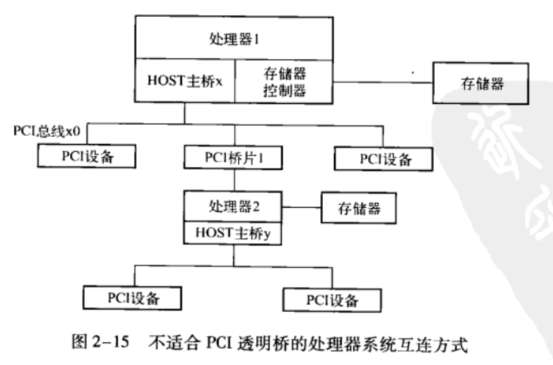
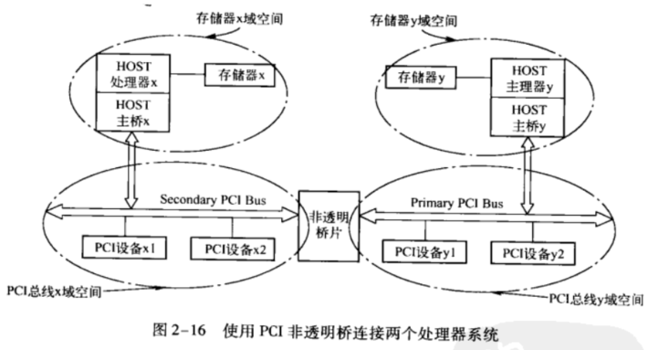

PCI桥规范定义了透明桥的实现规则, 在第2.3.1节中详细介绍了这种桥片. 通过透明桥, 处理器系统可以以HOST主桥为根节点, 建立一颗PCI总线树, 在这个树上的PCI设备共享同一个PCI总线域上的地址空间.

但是在某些场合下PCI透明桥并不适用. 在图2-15所示的处理器系统中存在两个处理器, 此时使用PCI桥1连接处理器2并不利于整个处理器系统的配置与管理. 假定PCI总线使用32位地址空间, 而处理器1和处理器2所使用的存储器大小都为2GB, 同时假定处理器1和处理器2使用的存储器都可以被PCI设备访问.

此时处理器1和2使用的存储器空间必须映射到PCI总线的地址空间中, 而32位的PCI总线只能提供4GB地址空间, 此时PCI总线0的地址空间将全部被处理器1和2的存储器空间占用, 而没有额外的空间分配给 PCI设备.

此外有些处理器不能作为PCIAgent设备, 因此不能直接连接到PCI桥上, 比如x86处理器就无法作为PCIAgent 设备, 因此使用PCI透明桥无法将两个x86处理器直接相连. 如果处理器2有两个以上的PCI接口, 其中一个可以与PCI桥1相连(此时处理器2将作为PCIAgent设备), 而另一个作为HOST主桥y连接PCI设备. 此时HOST主桥y挂接的PCI设备将无法被处理器1直接访问.

使用透明桥也不便于解决处理器1与处理器2间的地址冲突. 对于图2-15所示的处理器系统, 如果处理器1和2都将各自的存储器映射到PCI总线地址空间中, 有可能出现地址冲突. 虽然PowerPC处理器可以使用Inbound寄存器, 将存储器地址空间映射到不同的PCI总线地址空间中, 但并非所有的处理器都具有这种映射机制. 许多处理器的存储器地址与PCI总线地址使用了"简单相等"这种映射方法, 如果PCI总线连接了两个这样的处理器将不可避免地出现 PCI总线地址的映射冲突.

采用非透明桥将有效解决以上这些问题, 非透明桥并不是PCI总线定义的标准桥片, 但是这类桥片在连接两个处理器系统中得到了广泛的应用. 一个使用非透明桥连接两个处理器系统的实例如图 2-16 所示.

使用非透明PCI桥可以方便地连接两个处理器系统. 从图2-16中我们可以发现非透明桥可以将PCI总线x域与PCI总线y域进行隔离. 值得注意的是, 非透明PCI桥的作用是对不同PCI总线域地址空间进行隔离, 而不是隔离存储器域地址空间. 而HOST主桥的作用才是将存储器域与 PCI总线域进行隔离.

非透明PCI桥可以连接两条独立的PCI总线, 一条被称为SecondaryPCI总线, 另一条被称为 PrimaryPCI总线, 但是这两条总线没有从属关系, 两边是对等的(有些非透明桥, 如DEC21554的两边并不是完全对等的, 尤其是在处理64位地址空间时). 从处理器x的角度来看, 与非透明PCI桥右边连接的总线叫SecondaryPCI总线;而从处理器y的角度来看, 非透明PCI桥左边连接的总线叫Secondary PCl总线.

HOST处理器x和PCI设备可以通过非透明PCI桥直接访问PCI总线y域的地址空并通过HOST主桥y访问存储器y;HOST处理器y和PCI设备也可以通过非透明PCI桥, 直接访问PCI总线x域的地址空间, 并通过HOST主桥x访问存储器x. 为此非透明PCI桥需要对分属不同 PCI总线域的地址空间进行转换.

目前有许多厂商可以提供非透明PCI桥的芯片, 在具体实现上各有差异, 但是其基本原理类似, 下面以Intel21555为例说明非透明PCI桥. 值得注意的是, 在PCe体系结构中也存在非透明PCI桥的概念.

