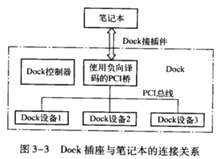
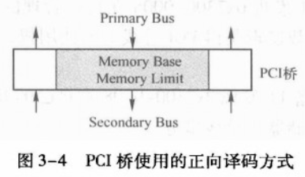

PCI设备的数据传递使用地址译码方式, 当一个存储器读写总线事务到达PCI总线时在这条总线上的所有PCI设备将进行地址译码, 如果当前总线事务使用的地址在某个PCI设备的 BAR空间中时, 该PCI设备将使能DEVSEL#信号, 认领这个总线事务.

如果PCI总线上的所有设备都不能通过地址译码, 认领这个总线事务时, 这条总线的"负向译码"设备将认领这个总线事务, 如果在这条PCI总线上没有"负向译码"设备, 该总线事务的发起者将使用 Master Abort 总线周期结束当前 PCI 总线事务.

# PCI 设备的正向译码与负向译码

如上文所述, PCI设备使用"地址译码"方式接收存储器读写总线请求. 在PCI总线中定义了两种"地址译码"方式, 一种是正向译码, 另一种是负向译码.

下面仍以图3-2所示的处理器系统为例, 说明数据传送使用的寻址方法. 当HOST主桥通过存储器或者I/O读写总线事务访问其下所有PCI设备时, PCI总线0下的所有PCI设备都将对出现在地址周期中的PCI总线地址进行译码. 如果这个地址在某个PCI设备的BAR空间中命中时, 这个PCI设备将接收这个PCI总线请求. 这个过程也被称为PCI总线的正向译码, 这种方式也是大多数PCI设备所采用的译码方式.

但是在PCI总线上的某些设备, 如PCI-0-(E)ISA桥并不使用正向译码接收来自PCI总线的请求, PCI-t0-ISA桥在处理器系统中的位置如图1-1所示. PCI总线0上的总线事务在三个时钟周期后, 没有得到任何PCI设备响应时(即总线请求的PCI总线地址不在这些设备的BAR空间中), PCI-to-ISA桥将被动地接收这个数据请求. 这个过程被称为PCI总线的负向译码. 可以进行负向译码的设备也被称为负向译码设备.

在PCI总线中, 除了PCI-10-(E)ISA桥可以作为负向译码设备, PCI桥也可以作为负向译码设备, 但是PCI桥并不是在任何时候都可以作为负向译码设备. 在绝大多数情况下PCI桥无论是处理"来自上游总线", 还是处理"来自下游总线"的总线事务时, 都使用正向译码方式, 但是在某些特殊应用中, PCI桥也可以作为负向译码设备.

笔记本在连接 Dock 插座时, 也使用了PCI桥. 因为在大多数情况下, 笔记本与 Dock 插座是分离使用的, 而且Dock插座上连接的设备多为慢速设备, 此时用于连接Dock插座的PCI桥使用负向译码. Dock插座在笔记本系统中的位置如图3-3所示.

当笔记本与Dock建立连接之后, 如果处理器需要访问Dock中的外部设备时, Dock中的PCI桥将首先使用负向译码方式接收PCI总线事务, 之后将这个PCI总线事务转发到Dock的PCI总线中, 再访问相应的PCI设备.

在Dock中使用负向译码PCI桥的优点是, 该桥管理的设备并不参与处理器系统对PCI总线的枚举过程. 当笔记本插入到Dock之后, 系统软件并不需要重新枚举Dock中的设备并为这些设备分配系统资源, 而仅需要使用负向译码PCI桥管理好其下的设备即可, 从而极大降低了 Dock 对系统软件的影响.

当HOST处理器访问Dock中的设备时, 负向译码PCI桥将首先接管这些存储器读写总线事务, 然后发送到Dock设备中. 值得注意的是, 在许多笔记本的Dock实现中, 并没有使用负向译码 PCI桥, 而使用PCI-to-ISA 桥.

PCI总线规定使用负向译码的PCI桥, 其BaseClass Code寄存器为0x06, Sub Class Code寄存器为0x04, 而Interface 寄存器为0x01; 使用正向译码方式的PCI桥的Inerface 寄存器为0x00. 系统软件(E’PROM)在初始化Interace寄存器时务必注意这个细节.

综上所述, 在PCI总线中有两种负向译码设备, PCI-t0-E(ISA)桥和PCI桥. 但PCI桥并非在任何时候都是负向译码设备, 只有PCI桥连接Dock插座时, PCI桥的PrimaryBus才使用负向译码方式. 而这个 PCI桥的 Secondary Bus 在接收 Dock 设备的请求时仍然使用正向译码方式.

PCI桥使用的正向译码方式与PCI设备使用的正向译码方式有所不同. 如图3-4所示, 当一个总线事务是从PCI桥的PrimaryBus到SecondaryBus时, PCI桥使用的正向译码方式与PCI设备使用的方式类似. 如果该总线事务使用的地址在PCI桥任意一个MemoryBase窗口(PCI桥除了具有Memory Base窗口外, 还有/0 Base 窗口和 Prefetchable Memory Base 窗口)命中时, 该PCI桥将使用正向译码方式接收该总线事务, 并根据实际情况决定是否将这个总线事务转发到 Secondary Bus.

当一个总线事务是从PCI桥的SecondaryBus到PrimaryBus时, 如果该总线事务使用的地址没有在PCI桥所有的MemoryBase窗口命中, 表明当前总线事务不是访问该PCI桥管理的PCI子树中的设备, 因此PCI桥将接收当前总线事务, 并根据实际情况决定是否将这个总
线事务转发到Primary Bus.

以图3-2为例, 当PCI设备11访问主存储器空间时, 首先将存储器读写总线事务发送到PCI总线1上, 而这个存储器地址显然不会在PCI总线1的任何PCI设备的 BAR 空间中, 此时PCI桥1将认领这个PCI总线的数据请求, 并将这个总线事务转发到PCI总线0上. 最后HOST主桥将接收这个总线事务, 并将PCI总线地址转换为存储器域的地址, 与主存储器进行读写操作.

值得注意的是, PCI总线并没有规定HOST主桥使用正向还是负向译码方式接收这个存储器读写总线事务, 但是绝大多数HOST主桥使用正向译码方式接收来自下游的存储器读写总线事务. 在PowerPC处理器中, 如果当前存储器读写总线事务使用的地址在Inbound窗口内, HOST主桥将接收这个总线事务, 并将其转换为存储器域的读写总线事务, 与主存储器进行数据交换.

# 处理器到 PCI 设备的数据传送

下面以图3-2所示的处理器系统为例, 说明处理器向PCI设备11进行存储器写的数据传送过程. 处理器向PCI设备进行读过程与写过程略有区别, 因为存储器写使用Posted方式, 而存储器读使用Non-Posted方式, 但是存储器读使用的地址译码方式与存储器写类似, 因此本节对处理器向PCI设备进行存储器读的过程不做进一步介绍.

PCI设备11在PCI总线域的地址范围是0x7300-0000~0x73FF-FFFF. 这段空间在存储器域中对应的地址范围是0xF300-0000~0xF3FF-FFFF. 下面假设处理器使用存储器写指令访问0xF300-0008 这个存储器地址, 其步骤如下.

(1) 存储器域将0xF300-0008这个地址发向HOST主桥, 0xF000-0000~0xF7FF-FFFF 这段地址已经由HOST主桥映射到PCI总线域地址空间, 所以HOST主桥认为这是一个对PCI设备的访问. 因此HOST主桥将首先接管这个存储器写请求.

(2) HOST主桥将存储器域的地址0xF300-0008转换为PCI总线域的地址 0x7300-0008并通过总线仲裁获得PCI总线0的使用权, 启动PCI存储器写周期, 并将这个存储器写总线事务发送到PCI总线0上. 值得注意的是, 这个存储器读写总线事务使用的地址为0x7300-
0008, 而不是0xF300-0008.

(3) PCI总线0的PCI桥1发现0x7300-0008在自己管理的地址范围内, 于是接管这个存储器写请求, 并通过总线仲裁逻辑获得PCI总线1的使用权, 并将这个请求转发到PCI总线1上.

(4) PCI总线1的PCI设备11发现0x7300-0008在自己的BARO寄存器中命中, 于是接收这个PCI写请求, 并完成存储器写总线事务.

# PCI 设备的 DMA 操作

下面以图3-2所示的处理器系统为例, 说明PCI设备11向存储器进行DMA写的数据传
送过程. PCI设备的DMA写使用Posted方式而DMA读使用Non-Posted方式. 本节不介绍PCI设备进行 DMA 读的过程, 而将这部分内容留给读者分析.

假定PCI设备11需要将一组数据发送到0x1000-0000~0x1000-FFFF这段存储器域的地址空间中. 由上文所述, 存储器域的0x0000-0000~0x7FFF-FFFF这段存储器空间与PCI总线域的0x8000-0000~0xFFFF-FFFF这段PCI总线地址空间对应.

PCI设备11并不能直接操作0x1000-0000~0x1000-FFFF这段存储器域的地址空间, PCI设备11需要对 PCI总线域的地址空间0x9000-0000~0x9000-FFFF进行写操作, 因为PCI总线地址空间0x9000-0000~0x9000-FFFF已经被HOST主桥映射到0x1000-0000~0x1000-FFFF这段存储器域. 这个DMA写具体的操作流程如下.

(1) 首先PCI设备11通过总线仲裁逻辑获得PCI总线1的使用权, 之后将存储器写总线事务发送到PCI总线1上. 值得注意的是, 这个存储器写总线事务的目的地址是PCI总线域的地址空间0x9000-0000~0x9000-FFFF, 这个地址是主存储器在PCI总线域的地址映像.

(2) PCI总线1上的设备将进行地址译码, 确定这个写请求是不是发送到自己的BAR空间, 在PCI总线1上的设备除了PCI设备11之外, 还有PCI桥2和PCI桥1.

(3) 首先PCI桥1、2和PCI设备11对这个地址同时进行正向译码. PCI桥1发现这个PCI地址并不在自己管理的PCI总线地址范围之内, 因为PCI桥片1所管理的PCI总线地址空间为0x7000-0000~0x73FF-FFFF. 此时PCI桥1将接收这个存储器写总线事务, 因为PCI桥1所管理的PCI总线地址范围并不包含当前存储器写总线事务的地址, 所以其下所有PCI设备都不可能接收这个存储器写总线事务.

(4) PCI桥1发现自己并不能处理当前这个存储器写总线事务, 则将这个存储器写总线事务转发到上游总线. PCI桥1首先通过总线仲裁逻辑获得PCI总线0的使用权后, 然后将这个总线事务转发到PCI总线0.

(5) HOST主桥发现0x9000-0000~0x9000-FFFF这段PCI总线地址空间与存储器域的存储器地址空间0x1000-0000~0x1000-FFFF对应, 于是将这段PCI总线地址空间转换成为存储器域的存储器地址空间, 并完成对这段存储器的写操作.

(6) 存储器控制器将从 HOST 主桥接收数据, 并将其写人到主存储器.

PCI设备间的数据传递与PCI设备到存储器的数据传送大体类似. 我们以PCI设备11将数据传递到PCI设备42为例说明这个转递过程. 我们假定PCI设备11将一组数据发送到PCI设备42的PCI总线地址0x7500-0000~0x7500-FFFF这段地址空间中. 这个过程与PCI设备11将数据发送到存储器的第1~5步基本类似, 只是第5、6步不同. PCI设备11将数据发送到 PCI设备42的第5、6步如下所示.

(5) PCI总线0发现其下的设备PCI桥4能够处理来自PCI总线0的数据请求, 则PCI桥4将接管这个PCI写请求, 并通过总线仲裁逻辑获得PCI总线4的使用权, 之后将这个存储器写请求发向PCI总线4. 此时HOST主桥不会接收当前存储器写总线事务, 因为0x7500-0000~0x7500-FFFF这段地址空间并不是HOST主桥管理的地址范围.

(6) PCI总线4的PCI设备42将接收这个存储器写请求, 并完成这个PCI存储器写请求总线事务.

PCI总线树内的数据传送始终都在PCI总线域中进行, 不存在不同域之间的地址转换因此PCI设备11向PCI设备42进行数据传递时, 并不会进行PCI总线地址空间到存储器地址空间的转换.

# PCI 桥的 Combining、Merging 和 Collapsing