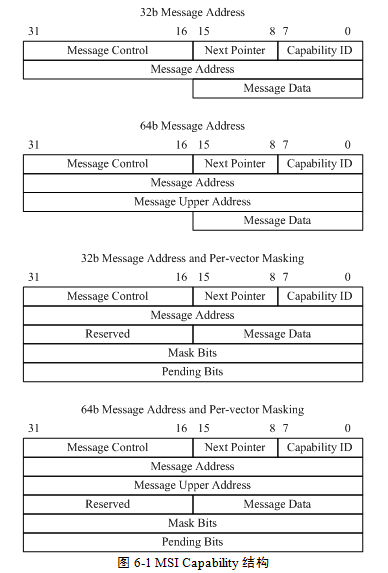
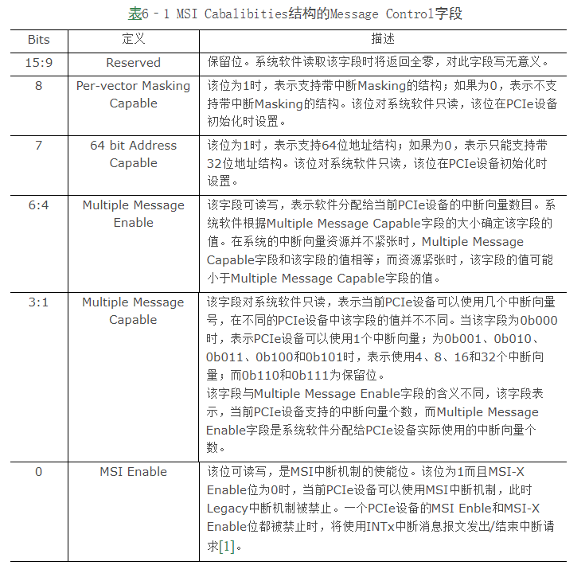
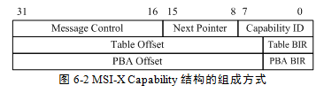
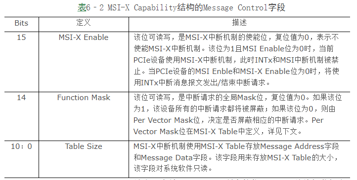
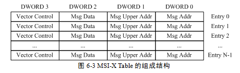
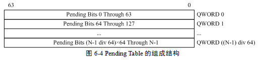

<!-- @import "[TOC]" {cmd="toc" depthFrom=1 depthTo=6 orderedList=false} -->

<!-- code_chunk_output -->

- [1. MSI Capability 结构](#1-msi-capability-结构)
- [2. MSI-X Capability 结构](#2-msi-x-capability-结构)
  - [2.1. MSI-X Capability 结构](#21-msi-x-capability-结构)
  - [2.2. MSI-X Table](#22-msi-x-table)
  - [2.3. Pending Table](#23-pending-table)

<!-- /code_chunk_output -->

**PCIe 设备**可以使用 **MSI 或者 MSI-X 报文**向处理器提交**中断请求**, 但是对于**某个具体的 PCIe 设备**可能仅支持**一种报文**.

在 PCIe 设备中含有两个 Capability 结构, 一个是 MSI Capability 结构, 另一个是 MSI-X Capability 结构. 通常情况下, **一个 PCIe 设备仅包含一种结构**.

# 1. MSI Capability 结构

**MSI Capability** 结构共有**四种组成方式**: 分别是 32 和 64 位的 Message 结构; 32 位和 64 位**带中断 Masking** 的结构.

**MSI 报文**可以使用 **32 位地址**或者 **64 位地址**, 而且可以使用 **Masking 机制**使能或者禁止**某个中断源**.

MSI Capability 寄存器的结构如下图所示.

- `Capability ID` 字段. 记载 MSI Capability 结构的 ID 号, 其值为 **0x05**. 在 PCIe 设备中, 每一个 Capability 结构都有唯一的 ID 号.

- `Next Pointer` 字段, 存放下一个 Capability 结构的地址.

- `Message Control` 字段. 该字段存放当前 PCIe 设备使用 MSI 机制进行中断请求的**状态与控制信息**, 如下表所示.

注: [1] 此时 PCI 设备配置空间 Command 寄存器的 "`Interrupt Disable`" 位为 1

- **Message Address** 字段. 当 `MSI Enable` 位**有效**时, 该字段存放 MSI 存储器写事务的**目的地址**的**低 32 位**. 该字段的 `31:2` 字段有效系统软件可以对该字段进行读写操作; 该字段的第 1~0 位为 0.

- **Message Upper Address** 字段. 如果 64 bit Address Capable 位有效, 该字段存放 MSI 存储器写事务的目的地址的**高 32 位**.

- **Message Data** 字段. 该字段可读写. 当 MSI Enable 位有效时, 该字段存放 MSI 报文使用的**数据**. 该字段保存的数值**与处理器系统相关**, 在 PCIe **设备进行初始化**时, **处理器**将**初始化该字段**, 而且不同的处理器填写该字段的规则并不相同. 如果 Multiple Message Enable 字段不为 0b000 时(即该设备**支持多个中断请求**时), PCIe 设备可以通过改变 Message Data 字段的低位数据发送不同的中断请求.

- **Mask Bits** 字段. **可读可写**. PCIe 总线规定当一个设备使用 **MSI** 中断机制时, 最多可以使用 **32 个中断向量**, 从而**一个设备**最多可以发送 32 种中断请求. Mask Bits 字段由 32 位组成, 其中**每一位对应一种中断请求**. 当相应位为 **1** 时表示对应的**中断请求被屏蔽**, 为 0 时表示允许该中断请求. **系统软件**可读写该字段, 系统**初始化**时该字段为**全 0**, 表示**允许所有中断请求**. 该字段和 `Pending Bits` 字段对于 MSI 中断机制是可选字段, 但是 PCIe 总线规范强烈建议**所有 PCIe 设备**支持这两个字段.

- **Pending Bits** 字段. 该字段对于**系统软件**是**只读位**, PCIe 设备内部逻辑可以改变该字段的值. 该字段由 32 位组成, 并与 PCIe 设备使用的 MSI 中断一一对应. 该字段需要与 Mask Bits 字段联合使用.

当 Mask Bits 字段的相应位为 1 时, 如果 PCIe 设备**需要发送对应的中断请求**, `Pending Bits` 字段的对应位将被 **PCIe 设备**的内部逻辑置 1, 此时 PCIe 设备并不会使用 MSI 报文向中断控制器提交中断请求; 当**系统软件**将 Mask Bits 字段的相应位从 1 改写为 0 时, PCIe 设备将发送 MSI 报文向处理器提交中断请求, 同时将 Pending Bit 字段的对应位清零. 在设备驱动程序的开发中, 有时需要联合使用 Mask Bits 和 Pending Bits 字段防止处理器丢弃中断请求(MSI 机制提交中断请求的方式类似于边界触发方式, 而使用边界触发方式时处理器可能会丢失某些中断请求, 因此在设备驱动程序的开发过程中可能需要使用这两个字段).

# 2. MSI-X Capability 结构

MSI-X Capability 中断机制与 MSI Capability 的中断机制类似. PCIe 总线引出 MSI-X 机制的主要目的是为了**扩展 PCIe 设备**使用**中断向量的个数**, 同时解决 MSI 中断机制**要求使用中断向量号连续**所带来的问题.

MSI 中断机制最多只能使用 32 个中断向量, 而 MSI-X 可以使用更多的中断向量. 目前 Intel 的许多 PCIe 设备支持 MSI-X 中断机制. 与 MSI 中断机制相比, MSI-X 机制更为合理. 首先 MSI-X 可以支持更多的中断请求, 但是这并不是引入 MSI-X 中断机制最重要的原因. 因为对于多数 PCIe 设备, 32 种中断请求已经足够了. 而引入 MSI-X 中断机制的**主要原因**是, 使用该机制不需要**中断控制器**分配给该设备的**中断向量号连续**.

如果一个 PCIe 设备需要使用 **8 个中断请求**并且**使用 MSI 机制**时, Message Data 的 `[2:0]` 字段可以为 `0b000 ~ 0b111`, 因此可以发送 8 种中断请求, 但是这 8 种中断请求的 Message Data 字段**必须连续**. 在许多中断控制器中, Message Data 字段连续也意味着中断控制器需要为这个 PCIe 设备分配 8 个连续的中断向量号.

有时在一个中断控制器中, 虽然具有 8 个以上的中断向量号, 但是很难保证这些中断向量号是连续的. 因此中断控制器将无法为这些 PCIe 设备分配足够的中断请求, 此时该设备的 "`Multiple Message Enable`" 字段将小于 "`Multiple Message Capable`".

而使用 MSI-X 机制可以合理解决该问题. 在 MSI-X Capability 结构中, **每一个中断请求**都使用**独立的 Message Address 字段和 Message Data 字段**从而中断控制器可以更加合理地为该设备分配中断资源.

与 MSI Capability 寄存器相比, MSI-X Capability 寄存器使用一个数组存放 Message Address 字段和 Message Data 字段, 而不是将这两个字段放入 Capability 寄存器中. 本篇将这个数组称为 MSI-X Table. 从而当 PCIe 设备使用 MSI-X 机制时, 每一个中断请求可以使用**独立的 Message Address 字段**和 Message Data 字段.

除此之外 MSI-X 中断机制还使用了**独立的 Pending Table 表**, 该表用来存放与每一个中断向量对应的 Pending 位. 这个 Pending 位的定义与 MSI Capability 寄存器的 Pending 位类似. MSI-X Table 和 Pending Table 存放在 PCIe 设备的 BAR 空间中. MSI-X 机制必须支持这个 Pending Table, 而 MSI 机制的 Pending Bits 字段是可选的.

## 2.1. MSI-X Capability 结构

MSI-X Capability 结构比 MSI Capability 结构略微复杂一些. 在该结构中使用 `MSI-X Table` 存放该**设备使用的所有** Message Address 和 Message Data 字段, **这个表格**存放在该设备的 **BAR** 空间中, 从而 PCIe 设备可以使用 MSI-X 机制时, **中断向量号**可以并**不连续**, 也可以申请更多的中断向量号.

MSI-X Capability 结构的组成方式如图 6‑2 所示.

- **Capability ID** 字段. 记载 MSI-X Capability 结构的 ID 号, 其值为 **0x11**. 在 PCIe 设备中, 每一个 Capability 都有唯一的一个 ID 号.

- **Next Pointer** 字段. 存放下一个 Capability 结构的地址.

- **Message Control** 字段, 该字段存放当前 PCIe 设备使用 MSI-X 机制进行中断请求的状态与控制信息. 如表 6‑2 所示.

- **Table BIR**(`BAR Indicator Register`). 该字段存放 `MSI-X Table` 所在的位置, PCIe 总线规范规定 `MSI-X Table` 存放在设备的 BAR 空间中. 该字段表示设备使用 `BAR0 ~ 5` 寄存器中的**哪个空间**存放 MSI\-X table. 该字段由三位组成其中 `0b000 ~ 0b101` 与 `BAR0 ~ 5` 空间一一对应.

- **Table Offset** 字段. 该字段存放 `MSI-X Table` 在相应 BAR 空间中的**偏移**.

- **PBA**(Pending Bit Array) **BIR** 字段. 该字段存放 Pending Table 在 PCIe 设备的哪个 **BAR** 空间中. 在通常情况下 Pending Table 和 MSI\-X Table 存放在 PCIe 设备的**同一个 BAR 空间**中.

- **PBA Offset** 字段. 该字段存放 `Pending Table` 在相应 BAR 空间中的偏移.

## 2.2. MSI-X Table

MSI-X Table 的组成结构如图 6‑3 所示.

由上图可见 MSI\-X Table 由多个 Entry 组成其中每个 Entry 与一个中断请求对应. 其中每一个 Entry 中有四个参数其含义如下所示.

- Msg Addr. 当 MSI\-X Enable 位有效时该字段存放 MSI\-X 存储器写事务的目的地址的低 32 位. 该双字的 31:2 字段有效系统软件可读写; 1:0 字段复位时为 0PCIe 设备可以根据需要将这个字段设为只读或者可读写. 不同的处理器填入该寄存器的数据并不相同.
- Msg Upper Addr 该字段可读写存放 MSI\-X 存储器写事务的目的地址的高 32 位.
- Msg Data 该字段可读写存放 MSI\-X 报文使用的数据. 其定义与处理器系统使用的中断控制器和 PCIe 设备相关.
- Vector Control 该字段可读写. 该字段**只有第 0 位**(即 `Per Vector Mask` 位)**有效**其他位保留. 当该位为 1 时 PCIe 设备**不能使用该 Entry 提交中断请求**; 为 0 时可以提交中断请求. 该位在复位时为 0. Per Vector Mask 位的使用方法与 MSI 机制的 Mask 位类似.

## 2.3. Pending Table

Pending Table 的组成结构如图 6‑4 所示.

如上图所示, 在 Pending Table 中, 一个 Entry 由 **64** 位组成, 其中**每一位**与 **MSI-X Table** 中的一个 Entry 对应, 即 Pending Table 中的每一个 Entry 与 MSI-X Table 的 64 个 Entry 对应. 与 MSI 机制类似, **Pending** 位需要与 **Per Vector Mask** 位配置使用.

当 Per Vector Mask 位为 **1** 时, PCIe 设备**不能**立即发送 MSI-X 中断请求, 而是将对应的 Pending 位置 1; 当系统软件将 Per Vector Mask 位清零时, PCIe 设备需要提交 MSI-X 中断请求, 同时将 Pending 位清零.

