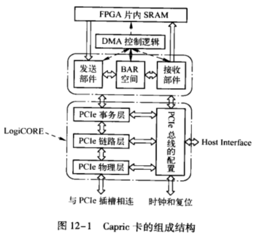
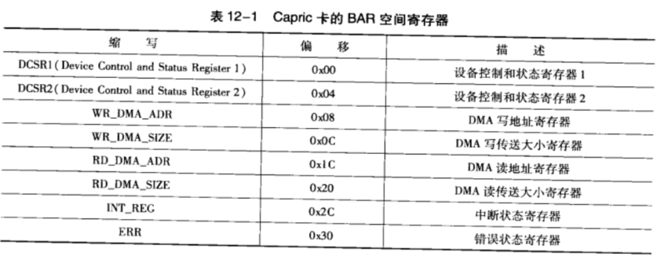

# 组成结构

Capric 卡的组成结构如图.

Capric 卡基于 PCle 总线, 主要功能是通过 **DMA** 读写方式与 HOST 处理器进行数据交换. Capric 卡由 LogiCORE、发送部件、接收部件、BAR 空间、DMA 控制逻辑和 FPGA 片内 SRAM 组成, 其工作原理较为简单.

Capric 卡首先使用 **DMA 读**方式, 将**主存储器中的数据**搬移到 FPGA 的**片内 SRAM** 中, 然后使用 **DMA 写**方式, 将 FPGA 的片内 SRAM 中的数据写人主存储器中. 在 Capric 卡中一次 DMA 操作可以传送的数据区域的最大值为 0x7FFB(0x2047B).

Capric 卡的各个组成模块的功能描述如下所示.

* LogiCORE. 其主要功能是处理 PCIe 设备的物理层、链路层与部分事务层的逻辑, 并向外提供必要的接口. PCle 设备配置空间的初始化, 以及与配置和中断请求相关的总线事务也由 LogiCORE 完成. LogiCORE 是 PCIe 总线的接管者, 其他部件通过 LogiCORE 与 PCe 链路进行通信. LogiCORE 通过"Host Interface"实现 PCle 设备的初始化配置.

* Capric 卡的发送部件负责发送 TP 报文, 包括"存储器读请求"和"存储器写请求 TLP"但是并不包含配置和消息报文的发送. MSI 报文由发送部件通过 LogiCORE 发送.

* 接收部件负责接收"存储器读完成 TLP". Capric 卡不支持 I/O 读写 TLP.

* DMA 控制逻辑协调发送与接收部件, 以完成 DMA 写与 DMA 读操作, 该逻辑的实现是 Capric 卡的设计重点.

* **BAR 空间**中存放了一组**操纵 DMA 控制逻辑的寄存器**, 这组寄存器由 HOST 处理器和 Capric 卡共同读写, 从而完成相应的 DMA 操作. Capric 卡仅使用了 BARO 空间, 处理器使用**存储器映射寻址方式**, 而不是 I/O 映射寻址方式访问 BAR0 空间.

# BAR 空间

Capric 卡仅使用 BARO 空间, 其大小为 256B, 在该空间中包含以下寄存器, 这些寄存器使用小端编码方式, 如表 12-1 所示.

# Capric 卡的初始化

Capric 卡在初始化时需要进行配置寄存器空间和 Capric 卡硬件逻辑的初始化. 其中配置寄存器空间的初始化由软硬件联合完成.

Capric 卡的设计基于 Xilinx 公司的 LogiCORE. 因此 Capric 卡需要使用 Xilinx 公司提供的"CORE GeneratorGU"对 LogiCORE 进行基本的初始化, 并设置一些必要的参数, 包括 Vendor ID、Device ID、Revision ID、Subsystem Vendor ID 和 Subsystem ID 等参数. 有关该工具的使用见 [LogiCORE(tm) Endpoint PIPE v1.7], 本节对此不做进一步描述. Capric 卡的配置寄存器空间的初始值如下所示.

* Vendor ID 为 0x10EE, Xilinx 使用的 Vendor ID.

* Device ID 为 0x0007, LgiCORE 使用的 Device ID.

* eRevision ID 为 0x00.

* eSubsystem ID 为 0x10EE.

* eDevice ID 为 0x0007.

* Base Class 为 0x05, 表示 Capric 卡为"类存储器控制器".

* Sub Class 和 Interface 为 0x00, 进一步描述 Capric 卡为 RAM 控制器.

* Card CIS Pointer 为 0x00, 表示不支持 Card Bus 接口.

* BARO 为 OxFFFFFF00. Capric 卡仅支持 BARO 空间, 该空间采用 32 位存储器映像寻址, 其大小为 256B, 而且不支持预读. 在初始化时, BARO 寄存器存放该空间所需要的存储器空间大小, 该寄存器由系统软件读取后, 再写人一个新的数值. 这个数值为 BAR0 空间使用的基地址.

* Max_Payload_Size Supported 参数为 0b010, 即 Max_Payload_Size Supported 参数的最大值为 512 B. 多数 RC 支持的 Max_Payload_Size Supported 参数仅为 128B 或者 256B. 因此 LogiCORE 支持 512B 已经足够了. 在 Capric 卡的初始化阶段, 需要与对端设备进行协商, 确认 Max_Payload_Size 参数的值, 如果 Capric 卡与 Intel 的 Chipset 直接相连, 该参数为 128B 或者 256 B. Capric 卡需要根据协商后的 Max_Payload_Size 参数, 而不是 MaxPayload_Size Supported 参数, 确定存储器写 TLP 有效负载的大小. 当 DMA 写的数据区域超过 Max_Payload_Size 参数时, 需要进行拆包处理, 详见第 12.2.1 节.

* Capric 卡不支持 Phantom 功能. 即不能使用 Function 号, 进一步扩展 Tag 字段. Phantom 功能的详细说明见第 4.3.2 节. .

* Multiple Message Capable 参数为 0b000, 即支持一个中断向量.

* Max_Read_Request_Size 参数为 0b010, 即存储器读请求 TLP 一次最多能够从目标设备中读取 512B 大小的数据. 如果 DMA 读的数据区域超过 512B 时, 需要进行拆包处理, 详见第 12.2.2 节.

系统软件在 Capric 卡初始化时, 将分析 Capric 卡的配置空间, 并填写 Capric 卡的配置寄存器空间. 值得注意的是, 系统软件对 Capric 卡进行配置时, Capric 卡将保留该设备在 PCI 总线树中的 `Bus Number`、`Device Number` 和 `Function Number`, LogiCORE 使用寄存器 `cfgbus_number[7:0]`、`cfg_device_number[4:0]` 和 `cfg_function_number[2:0]` 存放这组数值, 当 LogiCORE 发起存储器读请求 TP 时, 需要使用这组数值.

在设备驱动程序中, Capric 卡需要执行以下步骤完成硬件初始化.

(1) 向 DCSR1 寄存器的 init_rst_o 位写 1.

(2) 延时 5 μs.

(3) 向 DCSR1 寄存器的 init_rst_o 位写 0.

(4) 向 DCSR1 寄存器的 int_rd_enb 和 int_wr_enb 位写 1, 使能 DMA 读写中断请求

# DMA 写

Capric 卡使用 DMA 写过程将 Capric 卡 SRAM 中的数据发送到 HOST 处理器. 在设备驱动程序中, DMA 写过程如下所示.

(1) 填写 WR_DMA_ADR 寄存器, 注意填写的是 PCI 总线域的地址.

(2) 填写 WR_DMA_SIZE 寄存器, 以字节为单位.

(3) 填写 DCSR2 寄存器的 mwr_start 位, 启动 DMA 写.

(4) 等待 DMA 写完成中断后, 结束 DMA 写. 如果系统软件屏蔽了 DMA 写完成中断可以通过查询 INT_REG 寄存器的 wr_done_cr 位判断 DMA 写是否已经完成. 在 Capric 卡中上一次 DMA 写操作没有完成之前, 不能启动下一次 DMA 写操作.

(5) 最后将 wr_done_clr 位清零.

从硬件设计的角度来看, DMA 写过程较为复杂. Capric 卡需要通过 DMA 控制逻辑, 组织一个或者多个存储器写 TLP, 将 SRAM 中的数据进行封装然后传递给发送部件, 再由发送部件将数据传送到 LogiCORE, 最后由 LogiCORE 将存储器写 TLP 传递给 RC.

如果一次 DMA 写所传递的数据超过了 512B, 那么 DMA 控制逻辑需要传递多个存储器写 TLP 给发送部件, 才能完成一次完整的 DMA 写操作. 而且在 DMA 操作中需要进行数据对齐. 其详细实现过程见第 12.2.1 节.

# DMA 读

