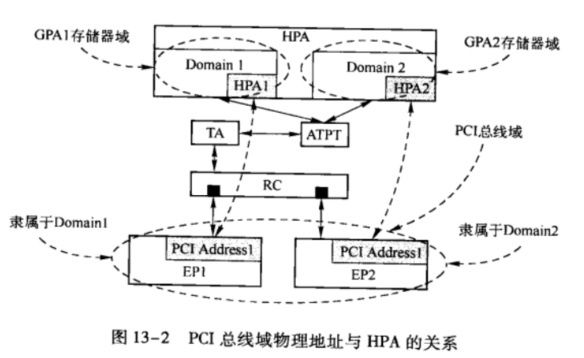

在**多进程环境**下, **处理器**使用 **MMU** 机制,  使得**每一个进程**都有**独立的虚拟地址空间**, 从而各个进程运行在独立的地址空间中, 互不干扰. MMU 具有两大功能:

* 一是进行**地址转换**, 将分属**不同进程的虚拟地址**转换为**物理地址**;

* 二是**对物理地址的访问**进行**权限检查**, 判断虚实地址转换的合理性.

在多数操作系统中, **每一个进程**都具有**独立的页表**存放**虚拟地址**到**物理地址**的**映射关系和属性**. 但是如果进程每次访问物理内存时, 都需要访问页表时, 将严重影响进程的执行效率. 为此处理器设置了 **TLB**(`Translation Lookaside Buffer`) 作为**页表的 Cache**. 如果进程的虚拟地址在 TLB 中命中时,  则从 TLB 中直接获得物理地址,  而不需要使用页表进行虚实地址转换, 从而极大提高了访问存储器的效率.

从地址转换的角度来看, IOMMU 与 MMU 较为类似. 只是 **IOMMU** 完成的是**外部设备地址**到**存储器地址**的转换. 我们可以将一个 **PCI 设备**模拟成为处理器系统的一个特殊进程, 当这个进程**访问存储器**时使用特殊的 MMU, 即**IOMMU**, 进行**虚实地址转换**, 然后再**访问存储器**. 在这个 I0MMU 中, 同样存在 **IO 页表**存放虚实地址转换关系和访问权限, 而且处理器为了加速这种虚实地址的转换, 还设置了 **IOTLB** 作为 **IO 页表**的 Cache. 单纯从这个角度来看, 许多 **HOST 主桥**和 **RC** 也具备同样的功能, 如 PowerPC 处理器的 Inbound 窗口和 Out-bound 窗口, 也可以完成这种特殊的地址转换. 但是这些窗口仅能完成 **PCI 总线域**到**一个存储器域**的地址转换, 无法实现 PCI 总线域到多个存储器域的转换.

目前设置 IOMMU 的主要作用是**支持虚拟化技术**, 当然使用 IOMMU 也可以实现其他功能, 如使 "仅支持 32 位地址的 PCI 设备" 访问 4GB 以上的存储器空间. IA 处理器和 AMD 处理器分别使用 "`VT-d`" 和 "`I0MMU`", 实现外部设备的地址转换. 这两种技术都可以将 PCI 总线域地址空间转换为不同的存储器域地址空间, 便于虚拟化技术的设计与实现.

# IOMMU 的工作原理

根据虚拟化的理论, 假设在一个处理器系统中存在两个 Domain, 其中一个为 Domain1, 而另一个为 Domain2. 这**两个 Domain** 分别对应**不同的虚拟机**, 并使用独立的**虚拟机物理地址空间**, 分别为 **GPA1**(Guest Physical Address) 和 **GPA2** 空间, 其中在 Domain1 上运行的所有进程使用 GPA1 空间, 而在 Domain2 上运行的所有进程使用 GPA2 空间.

GPA1 和 GPA2 采用独立的编码格式, 其地址都可以从各自 GPA 空间的 `0x0000-0000` 地址开始, 只是 GPA1 和 GPA2 空间在 System Memory 中占用的**实际物理地址** HPA(Host Physi-cal Address) 并不相同, HPA 也被称为 **MPA**(Machine Physical Address), 是处理器系统中真实的物理地址. 而 **PCI 设备**依然使用 **PCI 总线域地址空间**, PCI 总线地址需要通过 `DMA-Remapping` 逻辑转换为 HPA 地址后, 才能访问存储器. DMA-Remapping 逻辑的组成结构如图 13-1 所示.

在以上处理器模型中, 假设存在**两个外部设备** DeviceA 和 DeviceB. 这**两个外部设备**分属于**不同的 Domain**, 其中 **Device A** 属于 **Domain1**, 而 Device B 属于 Domain 2. 在同一段时间内, **Device A** 只能访问 **Domain1** 的 **GPA1** 空间, 也**只能**被 **Domain1** 操作; 而 Device B 只能访问 GPA2 空间, 也只能被 Domain2 操作. Device A 和 Device B 通过 DMA-Remmaping 机制最终访问不同 Domain 的存储器.

使用这种方法可以保证 Device A/B 访问的空间彼此独立, 而且只能被指定的 Domain 访问, 从而满足了虚拟化技术要求的空间隔离. 这一模型远非完美, 如果每个 Domain 都可以自由访问所有外部设备当然更加合理, 但是单纯使用 VT-d 机制还不能实现这种访问机制.

在这种模型之下, **Device A/B** 进行 **DMA** 操作时使用的**物理地址**仍然属于 **PCI 总线域的物理地址**, Device A/B 仍然使用地址路由或者 ID 路由进行存储器读写 TLP 的传递. 值得注意的是虽然在 **x86** 处理器系统中, 这个 **PCI 总线地址**与 **GPA 地址**一一对应且**相等**, 但是这两个地址所代表的含义仍然完全不同.

GPA 地址为存储器域的地址, 隶属于不同的 Domain, 而 **PCI 设备**使用的地址依然是 **PCI 总线域的物理地址**, 只是在虚拟化环境下, PCI 设备与 Domain 间有明确的对应关系. 当这个 PCI 设备进行 DMA 读写时, **TLP** 首先到达**地址转换部件** TA (`Translation Agent`), 并通过 **ATPT** (Address Translation and Protection Table, 相当于 I/O 页表, 每个 Domain 都有独立的 I/O 页表) 后将 **PCI 总线域的物理地址**转换为与 GPA 地址对应的 **HPA** 地址, 然后对**主存储器**进行读写操作. 其转换关系如图 13-2 所示.

在上图所示的处理器系统中, 存在**两个虚拟机**, 其使用的地址空间分别为 GPA Domain1 和 GPA Domain2. 假设**每个 GPA Domain** 使用 1GB 大小的物理地址空间, 而且 Domain 间使用的地址空间独立, 其地址范围都为`0x0000-0000 ~ 0x4000-0000`. 其中

* Domain1 使用的 GPA 地址空间对应的 **HPA** 地址范围为 `0x0000-0000 ~ 0x3FFF-FFFF`;

* Domain2 使用的 GPA 地址空间对应的 **HPA** 地址范围为 `0x4000-0000 ~ 0x7FFF-FFFF`.

在一个处理器系统中, **不同的虚拟机**使用的物理空间是隔离的.

在这个处理器系统中存在两个 PCIe 设备, 分别为 EP1 和 EP2, 其中 EP1 隶属于 Domain1, 而 EP2 隶属于 Domain2, 即 EP1 和 EP2 进行 DMA 操作时只能访问 Domain1 和 Domain2 对应的 HPA 空间, 但是 EP1 和 EP2 作为一个 PCIe 设备, 并不知道处理器系统进行的这种绑定操作, EP1 和 EP2 依然使用 PCI 总线域的地址进行正常的数据传送. 因为处理器系统的这种绑定操作由 **TA** 和 **ATPT** 决定, 而**对 PCIe 设备透明**. 在 EP1 和 EP2 进行 DMA 操作时, 当 TLP 到达 TA 和 ATPT, 经过地址转换后, 才能访问实际的存储器空间.

下面以 EP1 和 EP2 进行 DMA 写操作为例, 说明在这种虚拟化环境下, 不同种类地址的转换关系, 其步骤如下所示.

(1) Domain1 和 Domain2 填写 EP1 和 EP2 的 DMA **写地址和长度寄存器**启动 DMA 操作.

其中 **EP1** 最终将数据写入到 **GPA1** 的 `0x1000-0000 ~ 0x1000-007F` 这段数据区域, 而 **EP2** 最终将数据写入到 **GPA2** 的 `0x1000-0000 ~ 0x1000-007F` 这段数据区域. 然而 **EP1** 和 **EP2** 仅能识别 **PCI 总线域的地址**. Domain1 和 Domain2 填写 EP1 和 EP2 的 **DMA 写地址**为 **0x1000-0000**, 而长度为 0x80, 这些地址都是 **PCI 总线地址**.

在 **x86** 处理器系统中, 这个地址与 GPA1 和 GPA2 **存储器域的地址**恰好**相等**, 但是这个地址仍然是 **PCI 总线域的地址**, 只是由于 **IOMMU** 的存在, **相同**的 **PCI 总线地址**, 可能被映射到**相同的 GPA 地址空间**, 然而这些 GPA 地址空间对应的 **HPA 地址空间不同**. 这个 **PCI 总线地址**仍然在 **RC** 中被转换为**存储器域地址**, 并由 **TA** 转换为合适的 **HPA 地址**.

(2) EP1 和 EP2 的存储器写 TLP 到达 RC.

来自 EP1 和 EP2 **存储器写 TLP** 经过地址路由最终到达 **RC**, 并由 RC 将 TLP 的地址字段转发到 **TA** 和 **ATPT**, 进行地址翻译.

EP1 和 EP2 使用的 **I/O 页表**已经事先被 **VMM** 设置完毕, **TA** 将使用 Domain1 或者 Domain2 的 **I/O 页表**, 进行**地址翻译**. EP1 隶属于 Domain1, 其地址 `0x1000-0000` (PCI 总线地址) 被翻译为 0x1000-0000 (HPA): 而 EP2 隶属于 Domain2, 其地址 0x1000-0000 (PCI 总线地址) 被翻译为 0x5000-0000 (HPA). 值得注意的是在 TA 中设置了 IOTLB, 以加速 I/O 页表的翻译效率, 因此 TA 并不会每次都从存储器中查找 0 页表.

(3) 来自 EP1 和 EP2 存储器写 TLP 的数据将被分别写入到 `0x1000-0000 ~ 0x1000-007F` 和 0x5000-0000 ~ 0x5000-007F 这两段数据区域.

(4) Domain1 和 Domain2 都使用 `0x1000-0000 ~ 0x1000-007F` 这段 GPA 地址访问来自 EP1 和 EP2 的数据, 这个 GPA 地址将转换为 HPA 地址, 然后发送给存储器控制器. 在 IA 处理器系统中, 使用 EPT 和 VPID 技术进行 GPA 地址到 HPA 地址的转换. IA 处理器和 AMD 处理器使用不同的技术, 实现 TA 和 ATPT. 其中 IA 处理器使用 VT-d 技术, 而 AMD 使用 IOMMU. 从工作原理上看, 这两种技术类似, 但是在实现细节上, 两者有较大区别.

# IA 处理器的 VT-d

IA (Intel Architecture) 处理器使用 VT-d 技术将 PCI 总线域的物理地址转换为 HPA 地址. 这个映射过程也被称为 **DMA Remapping**. IA 处理器系统使用 DMA Remapping 机制可以辅助虚拟化技术对外部设备进行管理.

在 IA 处理器系统中, 所有的外部设备都是 PCI 设备. 每一个设备都唯一对应一个 Bus Number、Device Number 和 Function Number, 为此 IA 处理器设置了一个专门的结构, 即 **Root Entry Table** (如果处理器系统有多个 PCI 总线树 `<Segment>`, 则需要设备多个 Root Entry Table), 管理**每一棵 PCI 总线树**. 在这种结构下, 每一个 PCI 设备根据其 Bus、Device 和 Function 号唯一确定一个 Context Entry. VT-d 将这个结构称为"`Device to Domain Mapping`"结构, 如图 13-3 所示.

VT-d 一共设置了两种结构描述 PCI 总线树结构, 分别为 Root Entry 和 Context Entry. 其中 Root Entry 描述 PCI 总线, 一棵 PCI 总线树最多有 256 条 PCI 总线, 其中每一条 PCI 总线对应一个 Root Entry;每条 PCI 总线中最多有 32 个设备, 而每个设备最多有 8 个 Function, 其中每一个 Function 对应一个 Context Entry, 因此每个 Context Entry 表中共有 256 表项.

在一个处理器系统中, 一个指定的 PCI Function 唯一对应一个 Context Entry, 这个 Context Entry 指向这个 PCI Function 使用的地址转换结构 (Address Translation Structures). 当一个 PCI Function 隶属于不同的 Domain 时, 将使用不同的地址转换结构, 但是在一个时间段里, PCI Function 只能使用一个地址转换结构, 即 Context Entry 只能指向一个 Domain 的地址转换结构. 这个地址转换结构的主要功能是完成 PCI 总线域到 HPA 存储器域的地址转换.

如图 13-1 所示, 当一个设备进行 DMA 操作时, Domain 使用 PCI 总线域的地址填写这个设备和与 DMA 转送相关的寄存器. 当这个设备启动 DMA 操作时, 将使用 PCI 总线地址, 之后通过 DMA Remapping 机制将 PCI 总线地址转换为 HPA 存储器域地址, 然后将数据传送到实际的物理地址空间中. 而 Domain 通过处理器的 MMU 机制将 GPA 转换为 HPA, 访问物理地址空间.

从图 13-3 中可以发现, 每一个 Function 在每一个 Domain 中都可能有一个地址转换结构, 以完成 GPA 到 HPA 的转换, 因此在每一个 Domain 中最多有 256 个地址转换结构. 这些结构无疑将占用部分内存, 但是并不会产生较大的浪费. 因为在实际设计中, 同一个 Domain 下的所有 PCI 设备使用的总线地址到 HPA 地址的转换结构可以相同. 因此在实现中每个 Domain 仅使用一个地址转换结构即可.

IA 处理器使能 VT-d 机制后, PCI 设备进行 DMA 操作需要根据 Bus、Device 和 Function 号确定 Context Entry, 之后使用图 13-4 所示的方法完成 PCI 总线地址到 HPA 地址的转换.

在上图中, 4KB Page Table 中的每个 Entry 的大小为 8B, 因此在计算偏移时, 需要左移 3 位, PCI 总线地址通过 3 级目录, 最终找到与 HPA 所对应的 4KB 大小的页面, 从而完成 PCI 总线地址到 HPA 的转换. 值得注意的是, IA 处理器还支持 2MB (SP=1)、1GB (SP=2)、512GB (SP=3) 和 1TB (SP=4) 大小的 Super Page, 而本节仅使用了 4KB 大小的页面.

为了加快 PCI 总线地址到 HPA 地址的转换速度, IA 处理器分别为 Root Entry 和 Context Entry 设置了 Context Cache 以加快 Context Entry 的获取速度, 同时还设置了 IOTLB 加速 PCI 总线地址到 HPA 地址的转换速度.

IOTLB 相当于 0 页表的 Cache, 当一个 PCI 设备进行 DMA 操作时, 首先在 IOTLB 中查找 PCI 总线地址与 HPA 地址的映射关系, 如果在 IOTLB 命中时, PCI 设备直接获得 HPA 地址进行 DMA 操作;如果没有在 IOTLB 命中, 则需要使用图 13-4 中所示的算法进行 PCI 总线地址到 HPA 地址的转换.

Intel 并没有公开"没有在 IOTB 命中"的实现细节, 当出现这种情况时, IA 处理器可能使用内部的 Microcode 完成图 13-4 所示的算法. 使用 VT-d 除了可以有效地支持虚拟化技术之外, 还可以支持一些只能访问 32 位地址空间的 PCI 设备访问 4GB 之上的物理地址空间.

# AMD 处理器的 IOMMU

AMD 处理器的 IOMMU 技术与 Intel 的 VT-d 技术类似, 其完成的主要功能也类似. AMD 率先提出了 IOMMU 的概念, 并发布了 IOMMU 的技术手册, 但是 Intel 首先将这一技术在芯片中实现. 由于 AMD 和 Intel 使用的 x86 体系结构略有不同, 因此 AMD 的 IOMMU 技术在细节上与 Intel 的 VT-d 并不完全一致.

AMD 处理器使用 HT (Hyper Transport) 总线连接 0Hub, 其中每一个 /O Hub 都含有一个 IOMMU, 其结构如图 13-5 所示.

其中每一个 IOMMU 都使用一个 Device Table. AMD 处理器使用 Device Table 存放图 13-3 中的结构, Device Table 最多由 `2^16` 个 Entry 组成, 其中每个 Entry 的大小为 256b, 因此 Device Table 最大将占用 2MB 内存空间, 与 Intel 使用的 Root/Context Entry 结构相比 AMD 使用的这种方法容易造成内存的浪费.

在 I/O Hub 中的设备使用 16 位的 Device ID 在 Device Table 查找该设备所对应的 Entry, 并使用这个 Entry, 根据 I/O Page Table 结构最终找到 IOPTE 表, 并完成 CPA 到 HPA 的转换. 在 AMD 处理器中, GPA 到 HPA 的转换与图 13-4 中所示的方法有类似之处, 但实现细节不同. IOMMU 使用一个新型的页表结构完成 GPA 到 HPA 的转换, 这个页表结构基于 AMD64 使用的虚拟地址到物理地址的页表结构, 但是做出了一些改动.

> 其中 PCI 设备使用 Bus Number、Device Number 和 Function Number 组成 16 位的 Device ID, 而 HT 设备使用 HT Bus Number 和 Unit ID 组成 16 位的 Device ID.

AMD64 进行虚拟地址到物理地址的转换时使用 4 级页表结构, 如图 13-6 所示.

与 Intel 处理器的结构类似, 一个进程首先从 CR3 寄存器中获得页表的基地址指针寄存器 "Page Map Level-4 Base Address", 之后通过 4 级索引最终获得 4KB 大小的物理页面, 完成虚拟地址到物理地址的转换. AMD 处理器也支持大页面方式, 如果使用三级索引, 可以获得 2MB 大小的物理页面; 使用二级索引, 可以获得 1GB 大小的页面.

IOMMU 使用的 I/O 页表结构基于以上结构, 但是做出了一定的改动. 在 IOMMU 中, 4 级页表指针可以直接指向 2 级页表指针, 从而越过第 3 级页表, 使用这种方法可以节省 Page Table 的空间. 如图 13-7 所示.

当设备进行 DMA 操作时, 首先需要从相应的 Device Table 的 Entry 中获得 "Level4 Page Table Address" 指针, 并定位设备使用的页表, 最后使用多级页表结构, 最终完成 PCI 总线地址到 HPA 地址的转换. Page Table 的 Entry 由 64 位组成, 其主要字段如下所示.

* 第 51 ~ 12 位为 Next Table Address/Page Address 字段, 该字段存放下一级页表或者物理页面的地址, 该地址为系统物理地址, 属于 HPA 空间.

* 第 11 ~ 9 位为 Next Level 字段, 表示下一级页表的级数, 其中在 Device Table 中存放的级数一般为 4, Level-N 级页表中存放的 Next Level 字段为 N-1~1.

如图 13-7 所示, 在第 4 级页表的 Entry 中的 Next Level 字段为 2, 表示第 4 级页表直接指向第 2 级页表, 而忽略第 3 级页表. 当该字段为 0b000 或者 0b111 时, 表示下一级指针指向物理页面而不是页表. Next Level 字段为 0b000 时, 表示所指向的物理页面的大小是固定的, AMD64 支持 4KB、2MB、1GB、512GB 和 1TB (SP=4) 大小固定页面; 如果 Next Level 字段为 0b111 时, 表示所指向的物理页面大小是浮动的. 如果 Level2 Page Table 的 Entry 中的 Next Level 字段为 0b111, 表示该 Entry 指向的物理页面大小浮动, 其中物理页面大小和 GPA 的第 29~21 位相关, 如表 13-1 所示.

AMD64 处理器使用这种 I/O 页表方式, 可以方便地支持 4KB、8KB、…、4GB 大小的浮动物理页面. 除了页表外, IOMMU 也设置了 IOTLB 以加快 GPA 到 HPA 地址的转换这部分内容与 IA 处理器的实现方式类似, 本章不对此继续进行描述. 对 IOMMU 感兴趣的读者可以参考 AMD I/O Virtualization Technology Specification.
