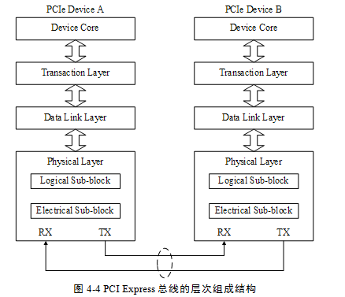

<!-- @import "[TOC]" {cmd="toc" depthFrom=1 depthTo=6 orderedList=false} -->

<!-- code_chunk_output -->

- [2. PCIe 总线使用的信号](#2-pcie-总线使用的信号)
  - [2.1. PERST# 信号](#21-perst-信号)
  - [2.2. REFCLK+ 和 REFCLK- 信号](#22-refclk-和-refclk--信号)
  - [2.3. WAKE# 信号](#23-wake-信号)
  - [2.4. SMCLK 和 SMDAT 信号](#24-smclk-和-smdat-信号)
  - [2.5. JTAG 信号](#25-jtag-信号)
  - [2.6. PRSNT1# 和 PRSNT2# 信号](#26-prsnt1-和-prsnt2-信号)
- [3. PCIe 总线的层次结构](#3-pcie-总线的层次结构)
  - [3.1. 事务层](#31-事务层)
  - [3.2. 数据链路层](#32-数据链路层)
  - [3.3. 物理层](#33-物理层)
- [4. PCIe 链路的扩展](#4-pcie-链路的扩展)

<!-- /code_chunk_output -->

# 2. PCIe 总线使用的信号

PCIe 设备使用**两种电源信号供电**分别是 Vcc 与 Vaux(大写 V, 右下角 cc 和 aux)其额定**电压为 3.3V**. 其中**Vcc 为主电源**PCIe 设备使用的**主要逻辑模块**均使用**Vcc 供电**而一些**与电源管理相关的逻辑**使用**Vaux 供电**. 在 PCIe 设备中**一些特殊的寄存器**通常使用**Vaux 供电**如 Sticky Register 此时即使 PCIe 设备的 Vcc 被移除这些与电源管理相关的逻辑状态和这些特殊寄存器的内容也不会发生改变.

在 PCIe 总线中使用 Vaux 的主要原因是为了**降低功耗**和**缩短系统恢复时间**. 因为 Vaux 在多数情况下并不会被移除因此当 PCIe 设备的 Vcc 恢复后该设备不用重新恢复使用 Vaux 供电的逻辑从而设备可以很快地恢复到正常工作状状态.

**PCIe 链路**的**最大宽度为×32**但是在实际应用中×32 的链路宽度极少使用. 在一个处理器系统中一般提供**×16 的 PCIe 插槽(！！！**)并使用 PETp0\~15、PETn0\~15 和 PERp0\~15、PERn0\~15 共**64 根信号线(！！！**)组成**32 对差分信号(！！！**)其中**16 对 PETxx 信号**用于**发送链路**另外 16 对 PERxx 信号用于接收链路. 除此之外 PCIe 总线还使用了下列**辅助信号**.

## 2.1. PERST# 信号

该信号为全局复位信号由处理器系统提供处理器系统需要为 PCIe 插槽和 PCIe 设备提供该复位信号. PCIe 设备使用该信号复位内部逻辑. 当该信号有效时 PCIe 设备将进行复位操作. PCIe 总线定义了多种复位方式其中 Cold Reset 和 Warm Reset 这两种复位方式的实现与该信号有关详见第 4.1.5 节.

## 2.2. REFCLK+ 和 REFCLK- 信号

在一个处理器系统中可能含有许多 PCIe 设备这些设备可以作为 Add-In 卡与 PCIe 插槽连接也可以作为内置模块与处理器系统提供的 PCIe 链路直接相连而不需要经过 PCIe 插槽. PCIe 设备与 PCIe 插槽都具有 REFCLK+和 REFCLK-信号其中 PCIe 插槽使用这组信号与处理器系统同步.

在一个处理器系统中通常采用专用逻辑向 PCIe 插槽提供 RE FCLK+和 RE FCLK-信号如图 4‑2 所示. 其中 100Mhz 的时钟源由晶振提供并经过一个"一推多"的差分时钟驱动器生成多个同相位的时钟源与 PCIe 插槽一一对应连接.

PCIe 插槽需要使用参考时钟其频率范围为 100MHz±300ppm. 处理器系统需要为每一个 PCIe 插槽、MCH、ICH 和 Switch 提供参考时钟. 而且要求在一个处理器系统中时钟驱动器产生的参考时钟信号到每一个 PCIe 插槽(MCH、ICH 和 Swith)的距离差在 15 英寸之内. 通常信号的传播速度接近光速约为 6 英寸/ns 由此可见不同 PCIe 插槽间 REFCLK+和 REFCLK-信号的传送延时差约为 2.5ns.

当 PCIe 设备作为 Add-In 卡连接在 PCIe 插槽时可以直接使用 PCIe 插槽提供的 REFCLK+和 REFCLK-信号也可以使用独立的参考时钟只要这个参考时钟在 100MHz±300ppm 范围内即可. 内置的 PCIe 设备与 Add-In 卡在处理 REFCLK+和 REFCLK-信号时使用的方法类似但是 PCIe 设备可以使用独立的参考时钟而不使用 REFCLK+和 REFCLK-信号.

在 PCIe 设备配置空间的 Link Control Register 中含有一个 "Common Clock Configuration"位. 当该位为 1 时表示该设备与 PCIe 链路的对端设备使用"同相位"的参考时钟; 如果为 0 表示该设备与 PCIe 链路的对端设备使用的参考时钟是异步的.

在 PCIe 设备中"Common Clock Configuration"位的缺省值为 0 此时 PCIe 设备使用的参考时钟与对端设备没有任何联系 PCIe 链路两端设备使用的参考时钟可以异步设置. 这个异步时钟设置方法对于使用 PCIe 链路进行远程连接时尤为重要.

在一个处理器系统中如果使用 PCIe 链路进行机箱到机箱间的互连因为参考时钟可以异步设置机箱到机箱之间进行数据传送时仅需要差分信号线即可而不需要参考时钟从而极大降低了连接难度.

## 2.3. WAKE# 信号

当 PCIe 设备进入休眠状态主电源已经停止供电时 PCIe 设备使用该信号向处理器系统提交唤醒请求使处理器系统重新为该 PCIe 设备提供主电源 Vcc. 在 PCIe 总线中 WAKE#信号是可选的因此使用 WAKE#信号唤醒 PCIe 设备的机制也是可选的. 值得注意的是产生该信号的硬件逻辑必须使用辅助电源 Vaux 供电.

WAKE#是一个 Open Drain 信号一个处理器的所有 PCIe 设备可以将 WAKE#信号进行线与后统一发送给处理器系统的电源控制器. 当某个 PCIe 设备需要被唤醒时该设备首先置 WAKE#信号有效然后在经过一段延时之后处理器系统开始为该设备提供主电源 Vcc 并使用 PERST#信号对该设备进行复位操作. 此时 WAKE#信号需要始终保持为低当主电源 Vcc 上电完成之后 PERST#信号也将置为无效并结束复位 WAKE#信号也将随之置为无效结束整个唤醒过程.

PCIe 设备除了可以使用 WAKE#信号实现唤醒功能外还可以使用 Beacon 信号实现唤醒功能. 与 WAKE#信号实现唤醒功能不同 Beacon 使用 In-band 信号即差分信号 D+和 D-实现唤醒功能. Beacon 信号 DC 平衡由一组通过 D+和 D-信号生成的脉冲信号组成. 这些脉冲信号宽度的最小值为 2ns 最大值为 16us. 当 PCIe 设备准备退出 L2 状态(该状态为 PCIe 设备使用的一种低功耗状态)时可以使用 Beacon 信号提交唤醒请求.

## 2.4. SMCLK 和 SMDAT 信号

SMCLK 和 SMDAT 信号与 x86 处理器的 SMBus(System Mangement Bus)相关. SMBus 于 1995 年由 Intel 提出 SMBus 由 SMCLK 和 SMDAT 信号组成. SMBus 源于 I2C 总线但是与 I2C 总线存在一些差异.

SMBus 的最高总线频率为 100KHz 而 I2C 总线可以支持 400KHz 和 2MHz 的总线频率. 此外 SMBus 上的从设备具有超时功能当从设备发现主设备发出的时钟信号保持低电平超过 35ms 时将引发从设备的超时复位. 在正常情况下 SMBus 的主设备使用的总线频率最低为 10KHz 以避免从设备在正常使用过程中出现超时.

在 SMbus 中如果主设备需要复位从设备时可以使用这种超时机制. 而 I2C 总线只能使用硬件信号才能实现这种复位操作在 I2C 总线中如果从设备出现错误时单纯通过主设备是无法复位从设备的.

SMBus 还支持 Alert Response 机制. 当从设备产生一个中断时并不会立即清除该中断直到主设备向 0b0001100 地址发出命令.

上文所述的 SMBus 和 I2C 总线的区别还是局限于物理层和链路层上实际上 SMBus 还含有网络层. SMBus 还在网络层上定义了 11 种总线协议用来实现报文传递.

SMBus 在 x86 处理器系统中得到了大规模普及其主要作用是管理处理器系统的外部设备并收集外设的运行信息特别是一些与智能电源管理相关的信息. PCI 和 PCIe 插槽也为 SMBus 预留了接口以便于 PCI/PCIe 设备与处理器系统进行交互.

在 Linux 系统中 SMBus 得到了广泛的应用 ACPI 也为 SMBus 定义了一系列命令用于智能电池、电池充电器与处理器系统之间的通信. 在 Windows 操作系统中有关外部设备的描述信息也是通过 SMBus 获得的.

## 2.5. JTAG 信号

JTAG(Joint Test Action Group)是一种国际标准测试协议与 IEEE 1149.1 兼容主要用于芯片内部测试. 目前绝大多数器件都支持 JTAG 测试标准. JTAG 信号由 TRST#、TCK、TDI、TDO 和 TMS 信号组成. 其中 TRST#为复位信号; TCK 为时钟信号; TDI 和 TDO 分别与数据输入和数据输出对应; 而 TMS 信号为模式选择.

JTAG 允许多个器件通过 JTAG 接口串联在一起并形成一个 JTAG 链. 目前 FPGA 和 EPLD 可以借用 JTAG 接口实现在线编程 ISP(In-System Programming)功能. 处理器也可以使用 JTAG 接口进行系统级调试工作如设置断点、读取内部寄存器和存储器等一系列操作. 除此之外 JTAG 接口也可用作"逆向工程"分析一个产品的实现细节因此在正式产品中一般不保留 JTAG 接口.

## 2.6. PRSNT1# 和 PRSNT2# 信号

PRSNT1\#和 PRSNT2\#信号与 PCIe 设备的热插拔相关. 在基于 PCIe 总线的 Add\-in 卡中 PRSNT1\#和 PRSNT2#信号直接相连而在处理器主板中 PRSNT1\#信号接地而 PRSNT2#信号通过上拉电阻接为高. PCIe 设备的热插拔结构如图 4‑3 所示.

如上图所示当 Add\-In 卡没有插入时处理器主板的 PRSNT2\#信号由上拉电阻接为高而当 Add\-In 卡插入时主板的 PRSNT2\#信号将与 PRSNT1\#信号通过 Add\-In 卡连通此时 PRSNT2\#信号为低. 处理器主板的热插拔控制逻辑将捕获这个"低电平"得知 Add\-In 卡已经插入从而触发系统软件进行相应地处理.

Add-In 卡拔出的工作机制与插入类似. 当 Add\-in 卡连接在处理器主板时处理器主板的 PRSNT2\#信号为低当 Add\-In 卡拔出后处理器主板的 PRSNT2\#信号为高. 处理器主板的热插拔控制逻辑将捕获这个"高电平"得知 Add\-In 卡已经被拔出从而触发系统软件进行相应地处理.

不同的处理器系统处理 PCIe 设备热拔插的过程并不相同在一个实际的处理器系统中热拔插设备的实现也远比图 4‑3 中的示例复杂得多. 值得注意的是在实现热拔插功能时 Add\-in Card 需要使用"长短针"结构.

如图 4\‑3 所示 PRSNT1#和 PRSNT2\#信号使用的金手指长度是其他信号的一半. 因此当 PCIe 设备插入插槽时 PRSNT1\#和 PRSNT2\#信号在其他金手指与 PCIe 插槽完全接触并经过一段延时后才能与插槽完全接触; 当 PCIe 设备从 PCIe 插槽中拔出时这两个信号首先与 PCIe 插槽断连再经过一段延时后其他信号才能与插槽断连. 系统软件可以使用这段延时进行一些热拔插处理.

# 3. PCIe 总线的层次结构

PCIe 总线采用了**串行连接方式**, 并**使用数据包(Packet)进行数据传输**, 采用这种结构有效**去除了在 PCI 总线中存在的一些边带信号**, 如 `INTx` 和 `PME#` 等信号. 在 PCIe 总线中, 数据报文在接收和发送过程中, 需要通过多个层次, 包括**事务层**(`Transaction Layer`)、**数据链路层**(`Data Link Layer`)和**物理层**(`Physical Layer`, 包括**逻辑子模块**和**电气子模块**).

每层职能是不同的, 但**下层总是为上层服务**的. 分层设计的一个好处是, 如果层次分得够好, **接口版本升级**时, 硬件设计可能只需要改动某一层, 其他层可以保持不动.

PCIe 总线的层次组成结构与网络中的层次结构有类似之处, 但是**PCIe 总线的各个层次都是使用硬件逻辑实现**的. 在 PCIe 体系结构中, 数据报文首先在设备的核心层(Device Core)中产生, 然后再经过该设备的事务层(Transaction Layer)、数据链路层(Data Link Layer)和物理层(Physical Layer)最终发送出去. 而接收端的数据也需要通过物理层、数据链路和事务层, 并最终到达 Device Core.

## 3.1. 事务层

事务层定义了 PCIe 总线使用总线事务其中**多数总线事务与 PCI 总线兼容**. 这些总线事务可以**通过 Switch 等设备传送到其他 PCIe 设备或者 RC**. RC 也可以使用这些总线事务访问 PCIe 设备.

事务层接收来自**PCIe 设备核心层**的数据并将其封装为 TLP(Transaction Layer Packet)后发向数据链路层. 此外事务层还可以从数据链路层中接收数据报文然后转发至 PCIe 设备的核心层.

事务层的一个重要工作是处理 PCIe 总线的"序". 在 PCIe 总线中"序"的概念非常重要也较难理解. 在 PCIe 总线中事务层传递报文时可以乱序这为 PCIe 设备的设计制造了不小的麻烦. 事务层还使用流量控制机制保证 PCIe 链路的使用效率. 有关事务层的详细说明见第 6 章.

## 3.2. 数据链路层

数据链路层保证来自发送端事务层的报文可以可靠、完整地发送到接收端的数据链路层. 来自事务层的报文在通过数据链路层时将被**添加 Sequence Number 前缀和 CRC 后缀**. 数据链路层使用 ACK/NAK 协议保证报文的可靠传递.

PCIe 总线的数据链路层还定义了多种 DLLP(Data Link Layer Packet)DLLP 产生于数据链路层终止于数据链路层. 值得注意的是 TLP 与 DLLP 并不相同**DLLP 并不是由 TLP 加上 Sequence Number 前缀和 CRC 后缀组成的**.

## 3.3. 物理层

**物理层是 PCIe 总线的最底层将 PCIe 设备连接在一起**. PCIe 总线的物理电气特性决定了 PCIe 链路只能使用端到端的连接方式. **PCIe 总线的物理层为 PCIe 设备间的数据通信提供传送介质**为数据传送提供可靠的物理环境.

物理层是 PCIe 体系结构最重要也是最难以实现的组成部分. PCIe 总线的物理层定义了 LTSSM(Link Training and Status State Machine)状态机 PCIe 链路使用该状态机管理链路状态并进行链路训练、链路恢复和电源管理.

PCIe 总线的物理层还定义了一些专门的"序列"有的书籍将物理层这些"序列"称为 PLP(Phsical Layer Packer)这些序列用于同步 PCIe 链路并进行链路管理. 值得注意的是 PCIe 设备发送 PLP 与发送 TLP 的过程有所不同. 对于系统软件而言物理层几乎不可见但是系统程序员仍有必要较为深入地理解物理层的工作原理.

# 4. PCIe 链路的扩展

PCIe 链路使用端到端的数据传送方式. 在一条 PCIe 链路中这两个端口是完全对等的分别连接发送与接收设备而且一个 PCIe 链路的一端只能连接一个发送设备或者接收设备. 因此**PCIe 链路必须使用 Switch 扩展 PCIe 链路后才能连接多个设备**. 使用 Switch 进行链路扩展的实例如图 4‑5 所示.

在 PCIe 总线中 Switch(这里的 Switch 指传统 Switch 在 MR-IOV 中的不同)是一个特殊的设备该设备由 1 个上游端口和 2~n 个下游端口组成. PCIe 总线规定**在一个 Switch 中可以与 RC 直接或者间接相连(也就是指通过其他 Switch 再与 RC 相连)的端口为上游端口**在 PCIe 总线中 RC 的位置一般在上方这也是上游端口这个称呼的由来. 在 Switch 中除了上游端口外其他所有端口都被称为下游端口. 下游端口一般与 EP 相连或者连接下一级 Switch 继续扩展 PCIe 链路. 其中与上游端口相连的 PCIe 链路被称为上游链路与下游端口相连的 PCIe 链路被称为下游链路.

上游链路和下游链路是一个相对的概念. 如上图所示**Switch 与 EP2 连接的 PCIe 链路对于 EP2 而言是上游链路而对 Switch 而言是下游链路**.

在上图所示的 Switch 中含有 3 个端口其中一个是上游端口(Upstream Port)而其他两个为下游端口(Downstream Port). 其中上游端口与 RC 或者其他 Switch 的下游端口相连而下游端口与 EP 或者其他 Switch 的上游端口相连.

在 Switch 中还有两个与端口相关的概念分别是 Egress 端口和 Ingress 端口. 这两个端口与通过 Switch 的数据流向有关. 其中**Egress 端口指发送端口即数据离开 Switch 使用的端口; Ingress 端口指接收端口即数据进入 Switch 使用的端口**.

Egress 端口和 Ingress 端口与上下游端口没有对应关系. 在 Switch 中上下游端口可以作为 Egress 端口也可以作为 Ingress 端口. 如图 4‑5 所示 RC 对 EP3 的内部寄存器进行写操作时 Switch 的上游端口为 Ingress 端口而下游端口为 Egress 端口; 当 EP3 对主存储器进行 DMA 写操作时该 Switch 的上游端口为 Egress 端口而下游端口为 Ingress 端口.

PCIe 总线还规定了一种**特殊的 Switch 连接方式**即**Crosslink 连接模式**. 支持这种模式的 Switch 其上游端口可以与其他 Switch 的上游端口连接其下游端口可以与其他 Switch 的下游端口连接.

PCIe 总线提供 CrossLink 连接模式的主要目的是为了解决**不同处理器系统之间的互连**如图 4\‑6 所示. 使用 CrossLink 连接模式时虽然从物理结构上看一个 Switch 的上/下游端口与另一个 Switch 的上/下游端口直接相连但是这个 PCIe 链路经过训练后仍然是一个端口作为上游端口而另一个作为下游端口.

处理器系统 1 与处理器系统 2 间的数据交换可以通过 Crosslink 进行. 当处理器系统 1(2)访问的 PCI 总线域的地址空间或者 Requester ID 不在处理器系统 1(2)内时这些数据将被 Crosslink 端口接收并传递到对端处理器系统中. Crosslink 对端接口的 P2P 桥将接收来自另一个处理器域的数据请求并将其转换为本处理器域的数据请求.

使用 Crosslink 方式连接两个拓扑结构完全相同的处理器系统时仍然有不足之处. 假设图 4‑6 中的处理器系统 1 和 2 的 RC 使用的 ID 号都为 0 而主存储器都是从 0x0000-0000 开始编址时. 当处理器 1 读取 EP2 的某段 PCI 总线空间时 EP2 将使用 ID 路由方式将完成报文传送给 ID 号为 0 的 PCI 设备此时是处理器 2 的 RC 而不是处理器 1 的 RC 收到 EP2 的数据. 因为处理器 1 和 2 的 RC 使用的 ID 号都为 0EP2 不能区分这两个 RC.

由上所述使用 Crosslink 方式并**不能完全解决两个处理器系统的互连**问题因此在有些 Switch 中支持非透明桥结构. 这种结构与 PCI 总线非透明桥的实现机制类似本章对此不做进一步说明.

使用非透明桥仅解决了两个处理器间数据通路问题但是不便于 NUMA 结构对外部设备的统一管理. PCIe 总线对此问题的最终解决方法是使用 MR-IOV 技术该技术要求 Switch 具有多个上游端口分别与不同的 RC 互连. 目前 PLX 公司已经可以提供具有多个上游端口的 Switch 但是尚未实现 MR-IOV 技术涉及的一些与虚拟化相关的技术.

即便 MR\-IOV 技术可以合理解决多个处理器间的数据访问和对 PCIe 设备的配置管理使用 PCIe 总线进行两个或者多个处理器系统间的数据传递仍然是一个不小问题. 因为 PCIe 总线的传送延时仍然是制约其在大规模处理器系统互连中应用的重要因素.