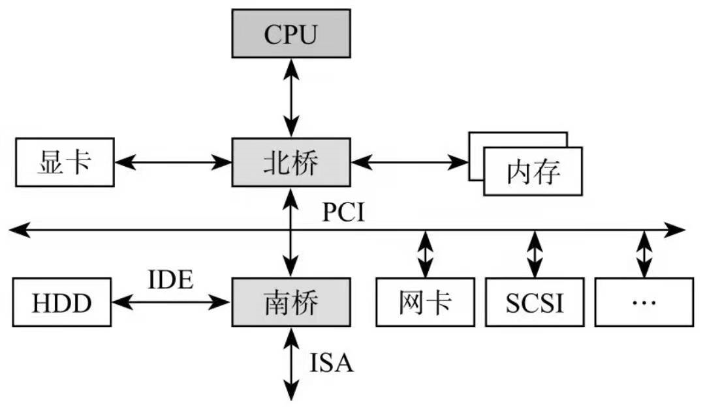

<!-- @import "[TOC]" {cmd="toc" depthFrom=1 depthTo=6 orderedList=false} -->

<!-- code_chunk_output -->

- [1. 计算机拓扑](#1-计算机拓扑)
  - [1.1. PCI 总线型拓扑](#11-pci-总线型拓扑)
  - [1.2. PCIe 树形拓扑](#12-pcie-树形拓扑)
- [2. 基于 PCIe 架构的处理器系统](#2-基于-pcie-架构的处理器系统)
  - [2.1. 处理器系统 A](#21-处理器系统-a)
  - [2.2. PowerPC 处理器](#22-powerpc-处理器)
  - [2.3. 基于 PCIe 总线的通用处理器结构](#23-基于-pcie-总线的通用处理器结构)
- [3. RC 的组成结构](#3-rc-的组成结构)
  - [3.1. 内部构成](#31-内部构成)
  - [3.2. Host bridge](#32-host-bridge)
  - [3.3. Root Port](#33-root-port)
  - [3.4. PCI bridge](#34-pci-bridge)
- [4. Switch](#4-switch)
    - [4.0.1. 内部构成](#401-内部构成)
- [5. VC 和端口仲裁](#5-vc-和端口仲裁)
- [6. PCIe-to-PCI/PCI-X 桥片](#6-pcie-to-pcipci-x-桥片)
- [7. Endpoint](#7-endpoint)
- [8. 小结](#8-小结)

<!-- /code_chunk_output -->

# 1. 计算机拓扑

计算机网络主要的拓扑结构有**总线型拓扑**、**环形拓扑**、**树形拓扑**、**星形拓扑**、**混合型拓扑**以及**网状拓扑**.

## 1.1. PCI 总线型拓扑

PCI 采用的是**总线型拓扑结构**, 一条 PCI 总线上挂着若干个 PCI 终端设备或者 PCI 桥设备, 大家共享该条 PCI 总线, 哪个人想说话, 必须获得总线使用权, 然后才能发言. **基于 PCI 的传统计算机系统**:



北桥下面的那根 PCI 总线, 挂载了以太网设备、SCSI 设备、南桥以及其他设备, 它们**共享那条总线**, 某个设备只有获得总线使用权才能进行数据传输.

> 仔细理解 **总线** 以及 **共享总线** 的意思

在传统的 PCI 总线模型中, 一个设备通过在 Bus 上判断 DEVSEL(设备选择)来认领一个请求. 如果在一段时钟周期后没有设备认领一个请求, 这个请求就被放弃.

## 1.2. PCIe 树形拓扑

PCIe 采用树形拓扑结构, 如下图. **基于 PCIe 的计算机系统**:


PCIe 总线作为处理器系统的局部总线, 其作用与 PCI 总线类似, 主要目的是为了**连接处理器系统中的外部设备**, 当然 PCIe 总线也可以连接其他处理器系统. 在不同的处理器系统中 PCIe 体系结构的实现方法略有不同. 但是在**大多数处理器系统**中都使用了**RC**、**Switch** 和 **PCIe\-to\-PCI 桥**这些基本模块**连接 PCIe 和 PCI 设备**. 在 PCIe 总线中**基于 PCIe 总线的设备**也被称为 **EP(Endpoint**).

PCIe 是一种**点对点**的传输模型, 不像 PCI 总线那样, 在总线上有平等认领请求的机制. **所有的传送**总是由**一个 Device** 发给 Link 上的**另外一个 Device**. 所以, 对于所有接收方来说, **接收方**将会**直接判断**这个请请求是否要被认领.

# 2. 基于 PCIe 架构的处理器系统

**在不同的处理器系统中 PCIe 体系结构的实现方式不尽相同**. 在 PCIe 总线规范中有许多内容是 x86 处理器独有的也仅在 x86 处理器的 Chipset 中存在. 在**PCIe 总线规范**中一些最新的功能也在**Intel 的 Chipset 中率先实现**.

本节将以一个虚拟的处理器系统 A 和 PowerPC 处理器为例简要介绍 RC 的实现并简单归纳 RC 的通用实现机制.

## 2.1. 处理器系统 A

在有些处理器系统中**没有直接提供 PCI 总线**此时需要使用**PCIe 桥(PCIe\-to\-PCI/PCI\-X 桥片**)将**PCIe 链路**转换为**PCI 总线**之后才能连接 PCI 设备. 在 PCIe 体系结构中也存在 PCI 总线号的概念其**编号方式与 PCI 总线兼容**. 一个基于 PCIe 架构的处理器系统 A 如图 4‑7 所示.


在上图的结构中处理器系统首先使用一个**虚拟的 PCI 桥分离**处理器系统的**存储器域(???处理器部分?)**与**PCI 总线域**. FSB 总线下的所有外部设备都属于 PCI 总线域. 与这个虚拟 PCI 桥直接相连的总线为 PCI 总线 0. 这种架构**与 Intel 的 x86 处理器系统较为类似**.

在这种结构中, **RC** 由**两个 FSB\-to\-PCIe 桥** 和 **存储器控制器** 组成. 值得注意的是在图 4‑7 中, **虚拟 PCI 桥** 的作用**只是分离存储器域与 PCI 总线域**, 但是并**不会改变信号的电气特性(RC 与处理器是 FSB！！！)**. RC 与处理器通过 FSB 连接, 而从电气特性上看, **PCI 总线 0 与 FSB 兼容(所以从处理器到桥上的还是 FSB 叫做 PCI 总线是因为到了 PCI 总线域的范围)**, 因此在 PCI 总线 0 上挂接的是 `FSB-to-PCIe` 桥, 而不是 `PCI-to-PCIe` 桥.

在 **PCI 总线 0** 上, 有**一个存储器控制器**和 **两个 FSB-to-PCIe 桥**.

* 这两个 `FSB-to-PCIe` 桥分别推出一个 ×16 和×8 的 PCIe 链路:

  * 其中 ×16 的 PCIe 链路连接显卡控制器(GFX)其编号为 **PCI 总线 1**;

  * **×8** 的 PCIe 链路连接一个 **Switch** 进行 PCIe 链路扩展.

* **存储器控制器**作为 **PCI 总线 0** 的一个 **Agent 设备**, 连接**DDR 插槽**或者**颗粒**.

此外在这个 PCI 总线上还可能连接了一些**使用"PCI 配置空间"管理的设备**这些设备的访问方法与 PCI 总线兼容在 x86 处理器的 Chipset 中集成了一些内嵌的设备. **这些内嵌的设备使用均使用"PCI 配置空间"进行管理包括存储器控制器**.

PCIe 总线使用端到端的连接方式, 因此**只有使用 Switch 才能对 PCIe 链路进行扩展**, 而每扩展一条 PCIe 链路将产生一个新的 PCI 总线号. 如图 4‑7 所示 Switch 可以将 1 个×8 的 PCIe 端口扩展为 4 个×2 的 PCIe 端口其中每一个 PCIe 端口都可以挂接 EP. 除此之外 PCIe 总线还可以**使用 PCIe 桥**, **将 PCIe 总线转换为 PCI 总线或者 PCI-X 总线**, **之后挂接 PCI/PCI-X 设备**. **多数 x86 处理器系统使用这种结构连接 PCIe 或者 PCI 设备(！！！**).

采用这种结构, 有利于处理器系统对外部设备进行统一管理, 因为所有外部设备都属于同一个 PCI 总线域, 系统软件可以使用 PCI 总线协议统一管理所有外部设备. 然而这种外部设备管理方法并非尽善尽美, 使用这种结构时, 需要注意存储器控制器使用的寄存器也被映射为 PCI 总线空间, 从而属于 PCI 总线域, 而主存储器 (如 DDR 内存空间) 仍然属于存储器域. 因此在这种结构中, 存储器域与 PCI 总线域的划分并不明晰. 

在**PCIe 总线规范**中**并没有明确提及 PCIe 主桥**而使用 RC 概括除了处理器之外的所有与 PCIe 总线相关的内容. 在 PCIe 体系结构中 RC 是一个很模糊也很混乱的概念. Intel 使用 PCI 总线的概念管理所有外部设备包括与这些外部设备相关的寄存器因此在 RC 中包含一些实际上与 PCIe 总线无关的寄存器. 使用这种方式有利于系统软件使用相同的平台管理所有外部设备也利于平台软件的一致性但是仍有其不足之处.

PCle总线在x86处理器中始终处于核心地位. Intel也借PCle总线统一管理所有外部设备, 并以此构建基于PCe总线的PC生态系统(Ecosystem). PCI/PCle总线在x86处理器系统中的地位超乎想象, 而且并不仅局限于硬件层面. 

## 2.2. PowerPC 处理器

PowerPC 处理器挂接外部设备使用的拓扑结构与 x86 处理器不同. 在 PowerPC 处理器中虽然也含有 PCI/PCIe 总线但是仍然有许多外部设备并不是连接在 PCI 总线上的. 在 PowerPC 处理器中 PCI/PCIe 总线并没有在 x86 处理器中的地位. 在 PowerPC 处理器中还含有许多内部设备如 TSEC(Three Speed Ethenet Controller)和一些内部集成的快速设备与 SoC 平台总线直接相连而不与 PCI/PCIe 总线相连. 在 PowerPC 处理器中 PCI/PCIe 总线控制器连接在 SoC 平台总线的下方.

Freescale 即将发布的 P4080 处理器采用的互连结构与之前的 PowerPC 处理器有较大的不同. P4080 处理器是 Freescale 第一颗基于 E500 mc 内核的处理器. E500 mc 内核与之前的 E500 V2 和 V1 相比从指令流水线结构、内存管理和中断处理上说并没有本质的不同. E500mc 内核内置了一个 128KB 大小的 L2 Cache 该 Cache 连接在 BSB 总线上; 而 E500 V1/V2 内核中并不含有 L2 Cache 而仅含有 L1 Cache 而且与 FSB 直接相连. 在 E500mc 内核中还引入了虚拟化的概念. 在 P4080 处理器中一些快速外部设备如 DDR 控制器、以太网控制器和 PCI/PCIe 总线接口控制器也是直接或者间接地连接到 CoreNet 中在 P4080 处理器 L3 Cache 也是连接到 CoreNet 中. P4080 处理器的拓扑结构如图 4‑8 所示.


目前 Freescale 并没有公开 P4080 处理器的 L1、L2 和 L3 Cache 如何进行 Cache 共享一致性. 多数采用 CoreNet 架构互连的处理器系统使用目录表法进行 Cache 共享一致性如 Intel 的 Nehelem EX 处理器. P4080 处理器并不是一个追求峰值运算的 SMP 处理器系统而针对 Data Plane 的应用因此 P4080 处理器可能并没有使用基于目录表的 Cache 一致性协议. 在基于全互连网络的处理器系统中如果使用"类总线监听法"进行 Cache 共享一致性将不利于多个 CPU 共享同一个存储器系统在 Cache 一致性的处理过程中容易形成瓶颈.

如图 4‑8 所示 P4080 处理器的设计重点并不是 E500mc 内核而是 CoreNet. CoreNet 内部由全互连网络组成其中任意两个端口间的通信并不会影响其他端口间的通信. 与 MPC8548 处理器相同 P4080 处理器也使用 OceaN[1]结构连接 PCIe 与 RapidIO 接口.

在 P4080 处理器中不存在 RC 的概念而仅存在 PCIe 总线控制器当然也可以认为在 P4080 处理器中 PCIe 总线控制器即为 RC. P4080 处理器内部含有 3 个 PCIe 总线控制器如果该处理器需要连接更多的 PCIe 设备时需要使用 Switch 扩展 PCIe 链路.

在 P4080 处理器中所有外部设备与处理器内核都连接在 CoreNet 中而不使用传统的 SoC 平台总线(这种方式也可以被认为是 SoC 平台总线从共享总线结构升级到 Switch 结构)进行连接从而在有效提高了处理器与外部设备间通信带宽的同时极大降低了访问延时. 此外 P4080 处理器系统使用 PAMU(Peripheral Access Management Unit)分隔外设地址空间与 CoreNet 地址空间. 在这种结构下 10GE/1GE 接口使用的地址空间与 PCI 总线空间独立.

P4080 处理器使用的 PAMU 是对 MPC8548 处理器 ATMU 的进一步升级. 使用这种结构时外部设备使用的地址空间、PCI 总线域地址空间和存储器域地址空间的划分更加明晰. 在 P4080 处理器中存储器控制器和存储器都属于一个地址空间即存储器域地址空间. 此外这种结构还使用 OCeaN 连接 SRIO[3]和 PCIe 总线控制器使得在 OCeaN 中的 PCIe 端口之间(PCIe 端口之间的直接通信过程也被称为 Peer-to-Peer 传送方式)可以直接通信而不需要通过 CoreNet 从而减轻了 CoreNet 的负载.

从内核互连和外部设备互连的结构上看这种结构具有较大的优势. 但是采用这种结构需要使用占用芯片更多的资源 CoreNet 的设计也十分复杂. 而最具挑战的问题是在这种结构之下 Cache 共享一致性模型的设计与实现. 在 Boxboro EX 处理器系统中可以使用 QPI 将多个处理器系统进行点到点连接也可以组成一个全互连的处理器系统. 这种结构与 P4080 处理器使用的结构类似但是 Boxboro EX 处理器系统包含的 CPU 更多.

## 2.3. 基于 PCIe 总线的通用处理器结构

在不同的处理器系统中 RC 的实现有较大差异. **PCIe 总线规范并没有规定 RC 的实现细则**. 在有些处理器系统中**RC 相当于 PCIe 主桥**也有的处理器系统也将**PCIe 主桥称为 PCIe 总线控制器**. 而在**x86 处理器系统**中**RC**除了包含**PCIe 总线控制器**之外还包含一些**其他组成部件**因此**RC 并不等同于 PCIe 总线控制器**.

如果**一个 RC**中可以提供**多个 PCIe 端口**这种 RC 也被称为**多端口 RC**. 如 MPC8572 处理器的 RC 可以直接提供 3 条 PCIe 链路因此可以直接连接 3 个 EP. 如果 MPC8572 处理器需要连接更多 EP 时需要使用 Switch 进行链路扩展.

而在**x86 处理器系统**中**RC**并**不是存在于一个芯片中(！！！**)如在**Montevina 平台**中**RC**由**MCH 和 ICH 两个芯片组成(！！！**). 本节并不对 x86 和 PowerPC 处理器使用的 PCIe 总线结构做进一步讨论而只介绍这两种结构的相同之处. 一个通用的基于 PCIe 总线的处理器系统如图 4‑9 所示.


上图所示的结构将**PCIe 总线端口(！！！**)、**存储器控制器(！！！**)等一系列与**外部设备有关的接口都集成在一起**并统称为**RC**. RC 具有一个或者多个 PCIe 端口可以连接各类 PCIe 设备. **PCIe 设备**包括**EP(如网卡、显卡等设备**)、**Switch(！！！**)和**PCIe 桥(！！！PCIe\-to\-PCI/PCI\-X 桥片简称为 PCIe 桥片, 上游是 PCIe 线, 所以是 PCIe 设备！！！**). PCIe 总线采用端到端的连接方式每一个 PCIe 端口只能连接一个 EP 当然 PCIe 端口也可以连接 Switch 进行链路扩展. 通过 Switch 扩展出的 PCIe 链路可以继续挂接 EP 或者其他 Switch.

# 3. RC 的组成结构

RC是PCe体系结构的一个重要组成部件, 也是一个较为混乱的概念. RC的提出与x86处理器系统密切相关. 事实上, 只有x86处理器才存在PCe总线规范定义的"标准RC", 而在多数处理器系统中, 并不含有在PCe总线规范中涉及的与RC相关的全部概念.

不同处理器系统的RC设计并不相同, 在图4-7中的处理器系统中, RC包括存储器控制器、两个FSB-t0-PCIe桥. 而在图4-8中的PowerPC处理器系统中, RC的概念并不明晰. 在PowerPC处理器中并不存在真正意义上的RC, 而仅包含PCe总线控制器.

在**x86 处理器系统**中, **RC 内部集成了一些 PCI 设备、RCRB(RC Register Block)和 Event Collector 等组成部件**. 其中**RCRB 由一系列"管理存储器系统"的寄存器组成**, 而仅存在于 x86 处理器中; 而**Event Collector 用来处理来自 PCIe 设备的错误消息报文和 PME 消息报文**. **RCRB 寄存器组**属于**PCI 总线域地址空间**, x86 处理器访问 RCRB 的方法与访问 PCI 设备的配置寄存器相同. 在有些 x86 处理器系统中 RCRB 在 PCI 总线 0 的设备 0 中.

RCRB 是 x86 处理器所独有的 PowerPC 处理器也含有一组"管理存储器系统"的寄存器这组寄存器与 RCRB 所实现的功能类似. 但是在 PowerPC 处理器中该组寄存器以 CCSRBAR 寄存器为基地址处理器采用存储器映像方式访问这组寄存器.

如果将 RC 中的 RCRB、内置的 PCI 设备和 Event Collector 去除该 RC 的主要功能与 PCI 总线中的 HOST 主桥类似其主要作用是完成存储器域到 PCI 总线域的地址转换. 但是随着虚拟化技术的引入尤其是引入 MR-IOV 技术之后 RC 的实现变得异常复杂.

但是 RC 与 HOST 主桥并不相同 RC 除了完成地址空间的转换之外还需要完成物理信号的转换. 在 PowerPC 处理器的 RC 中来自 OCeaN 或者 FSB 的信号协议与 PCIe 总线信号使用的电气特性并不兼容使用的总线事务也并不相同因此必须进行信号协议和总线事务的转换.

在 P4080 处理器中 RC 的下游端口可以挂接 Switch 扩展更多的 PCIe 端口也可以只挂接一个 EP. 在 P4080 处理器的 RC 中设置了一组 Inbound 和 Outbound 寄存器组用于存储器域与 PCI 总线域之间地址空间的转换; 而 P4080 处理器的 RC 还可以使用 Outbound 寄存器组将 PCI 设备的配置空间直接映射到存储器域中. PowerPC 处理器在处理 PCI/PCIe 接口时都使用这组 Inbound 和 Outbound 寄存器组.

在 P4080 处理器中 RC 可以使用 PEX\_CONFIG\_ADDR 与 PEX\_CONFIG\_DATA 寄存器对 EP 进行配置读写这两个寄存器与 MPC8548 处理器 HOST 主桥的 PCI\_CONFIG\_ADDR 和 PCI\_CONFIG\_DATA 寄存器类似本章不再详细介绍这组寄存器.

而 x86 处理器的 RC 设计与 PowerPC 处理器有较大的不同实际上和大多数处理器系统都不相同. x86 处理器赋予了 RC 新的含义 PCIe 总线规范中涉及的 RC 也以 x86 处理器为例进行说明而且一些在 PCIe 总线规范中出现的最新功能也在 Intel 的 x86 处理器系统中率先实现. 在 x86 处理器系统中的 RC 实现也比其他处理器系统复杂得多. 深入理解 x86 处理器系统的 RC 对于理解 PCIe 体系结构非常重要.


Root Complex, RC: A defined System Element that includes a Host Bridge, zero or more Root Complex Integrated Endpoints, zero or more Root Complex Event Collectors, and one or more Root Ports.

RC: 一个系统元素, 包含一个 Host Bridge, 0 个或多个集成 Endpoints 的 Root Complex, **0 个或多个** Root Complex **事件收集器**, **0 个多个 Root Ports**.

Root Complex Component: A logical aggregation of Root Ports, Root Complex Register Blocks, and Root Complex Integrated Endpoints.

整个 PCIe 拓扑结构是一个**树形结构**. **Root Complex**(`RC`)是树的根, **它为 CPU 代言**, 与整个计算机系统其他部分通信, **一般为通信的发起者**.

比如 **CPU** 通过它**访问内存**, **CPU** 通过它**访问** PCIe 系统中的**设备**.

> 也就是说 **CPU 与其他组件通信的都要先通过 RC**

## 3.1. 内部构成

PCIe Spec 并没有规定 RC 的组成. 只需了解: **它一般实现了一条内部 PCIe 总线**(`BUS 0`), 以及通过**若干个 PCIe bridge**, 扩展出**一些 PCIe Port**.

> 这里说的是 host bridge 下面是一条 PCIe 总线

Root Complex 内部总线:


> 注意各个部件的名字叫法

root complex 包括一个或多个 root port、内存 IO 子系统等等.

```
# lspci | grep "00:"
00:00.0 Host bridge: Intel Corporation Device 9b43 (rev 05)
00:01.0 PCI bridge: Intel Corporation 6th-10th Gen Core Processor PCIe Controller (x16) (rev 05)
00:02.0 Display controller: Intel Corporation CometLake-S GT2 [UHD Graphics 630] (rev 05)
00:08.0 System peripheral: Intel Corporation Xeon E3-1200 v5/v6 / E3-1500 v5 / 6th/7th/8th Gen Core Processor Gaussian Mixture Model
00:12.0 Signal processing controller: Intel Corporation Comet Lake PCH Thermal Controller
00:14.0 USB controller: Intel Corporation Comet Lake USB 3.1 xHCI Host Controller
00:14.2 RAM memory: Intel Corporation Comet Lake PCH Shared SRAM
00:15.0 Serial bus controller [0c80]: Intel Corporation Comet Lake PCH Serial IO I2C Controller #0
00:16.0 Communication controller: Intel Corporation Comet Lake HECI Controller
00:17.0 SATA controller: Intel Corporation Device 06d2
00:1b.0 PCI bridge: Intel Corporation Comet Lake PCI Express Root Port #21 (rev f0)
00:1c.0 PCI bridge: Intel Corporation Device 06bd (rev f0)
00:1f.0 ISA bridge: Intel Corporation Device 0687
00:1f.3 Audio device: Intel Corporation Comet Lake PCH cAVS
00:1f.4 SMBus: Intel Corporation Comet Lake PCH SMBus Controller
00:1f.5 Serial bus controller [0c80]: Intel Corporation Comet Lake PCH SPI Controller
00:1f.6 Ethernet controller: Intel Corporation Ethernet Connection (11) I219-LM
```

## 3.2. Host bridge

Host bridge: The part of a Root Complex that connects a host CPU or CPUs to a Hierarchy.

Host bridge: 作为连接 CPU 和拓扑层次结构的桥梁.

Host Bridge 从 CPU 出来, 是整个系统的第一个设备. RC 是 Bus 0; Host Bridge 是 `00:00.0`;

```
# lspci | grep -i "host bridge"
00:00.0 Host bridge: Intel Corporation Device 9b43 (rev 05)

# lspci -vvv -s 00:00.0
00:00.0 Host bridge: Intel Corporation Device 9b43 (rev 05)
        DeviceName: Onboard - Other
        Subsystem: Dell Device 09a4
        Control: I/O- Mem+ BusMaster+ SpecCycle- MemWINV- VGASnoop- ParErr- Stepping- SERR+ FastB2B- DisINTx-
        Status: Cap+ 66MHz- UDF- FastB2B+ ParErr- DEVSEL=fast >TAbort- <TAbort+ <MAbort+ >SERR- <PERR- INTx-
        Latency: 0
        IOMMU group: 0
        Capabilities: [e0] Vendor Specific Information: Len=10 <?>
        Kernel driver in use: skl_uncore
```

> 在有些系统中, Host Bridge 可能不会产生真正的 pci 总线, 而是 UPI/QPI/FSB 总线, 这种情况下 Bus 0 其实并不具备 pci 电气, 因而连接真正的 PCI/PCIe 设备需要先有 Host-PCI Bridge(即上面的 PCI-PCI Bridge), 而 Bridge 就会产生新的 Bus number.

## 3.3. Root Port

Root Port: A PCI Express Port on a Root Complex that maps a portion of the Hierarchy through an associated virtual PCI-PCI Bridge.

Root Port: 一个位于 **Root Complex** 中通过相关联的虚拟 PCI-PCI Bridge 映射一个层次结构整体部分的的 PCIe Port.

root complex 会包括**一个或多个** root port. root port 只是提供给 switch 或者 endpoint 连接的端口. 二者之间的关系如下:


root port 与 endpoint 也有许多不同点. root port 使用 Type 1 配置头空间. endpoint 使用 Type 0 配置头空间. 两者主要的区别如下:


查看系统中的 Root Port(也是一个 PCI bridge):

```
# lspci | grep -i Root
00:1b.0 PCI bridge: Intel Corporation Comet Lake PCI Express Root Port #21 (rev f0)

# lspci -v -s 00:1b.0
00:1b.0 PCI bridge: Intel Corporation Comet Lake PCI Express Root Port #21 (rev f0) (prog-if 00 [Normal decode])
        Flags: bus master, fast devsel, latency 0, IRQ 123, IOMMU group 9
        Bus: primary=00, secondary=02, subordinate=02, sec-latency=0
        I/O behind bridge: [disabled]
        Memory behind bridge: 9c200000-9c2fffff [size=1M]
        Prefetchable memory behind bridge: [disabled]
        Capabilities: [40] Express Root Port (Slot+), MSI 00
        Capabilities: [80] MSI: Enable+ Count=1/1 Maskable- 64bit-
        Capabilities: [90] Subsystem: Intel Corporation Comet Lake PCI Express Root Port
        Capabilities: [a0] Power Management version 3
        Capabilities: [100] Advanced Error Reporting
        Capabilities: [140] Access Control Services
        Capabilities: [150] Precision Time Measurement
        Capabilities: [200] L1 PM Substates
        Capabilities: [220] Secondary PCI Express
        Capabilities: [250] Downstream Port Containment
        Kernel driver in use: pcieport

# lspci -vt
-[0000:00]-+-00.0  Intel Corporation Device 9b43
           +-1b.0-[02]----00.0  Samsung Electronics Co Ltd Device a809
```

## 3.4. PCI bridge

**Bus 0** 上的 PCI Bridge 分为两种: 一种是 Root Port; 一种是下面直接连接 Endpoint 的.

```
# lspci | grep "00:" | grep -i "PCI bridge"
00:01.0 PCI bridge: Intel Corporation 6th-10th Gen Core Processor PCIe Controller (x16) (rev 05)
00:1b.0 PCI bridge: Intel Corporation Comet Lake PCI Express Root Port #21 (rev f0)
00:1c.0 PCI bridge: Intel Corporation Device 06bd (rev f0)

# lspci -vt
-[0000:00]-+-00.0  Intel Corporation Device 9b43
           +-01.0-[01]--+-00.0  NVIDIA Corporation GK208B [GeForce GT 730]
           |            \-00.1  NVIDIA Corporation GK208 HDMI/DP Audio Controller
           +-1b.0-[02]----00.0  Samsung Electronics Co Ltd Device a809
           +-1c.0-[03-04]----00.0-[04]--
```

PCI bridge 见下面

# 4. Switch

本篇在第 4.1.4 节简单介绍了在 PCIe 总线中如何使用 Switch 进行链路扩展本节主要介绍 Switch(PCIe 总线中的 Switch 与网络应用的 Switch 的功能并不相同而与网络应用中的 Route 功能接近)的内部结构. 从系统软件的角度上看每一个 PCIe 链路都占用一个 PCI 总线号但是一条 PCIe 链路只能连接一个 PCI 设备 Switch、EP 或者 PCIe 桥片. PCIe 总线使用端到端的连接方式, 一条 PCIe 链路只能连接一个设备.

一个 PCIe 链路需要挂接多个 EP 时需要使用 Switch 进行链路扩展. 一个标准 Switch 具有一个上游端口和多个下游端口. 上游端口与 RC 或者其他 Switch 的下游端口相连而下游端口可以与 EP、PCIe-to-PCI-X/PCI 桥或者下游 Switch 的上游端口相连.

PCIe 总线规范还支持一种特殊的连接方式即 Crosslink 连接方式. 使用这种方式时 Switch 的下游端口可以与其他 Switch 的下游端口直接连接上游端口也可以其他 Switch 的上游端口直接连接. 在 PCIe 总线规范中 Crosslink 连接方式是可选的并不要求 PCIe 设备一定支持这种连接方式.

在 PCIe 体系结构中 Switch 的设计难度仅次于 RC, Switch 也是 PCIe 体系结构的核心所在. 而从系统软件的角度上看 Switch 内部由**多个 PCI-to-PCI 桥**组成, 其中**每一个**上游和下游端口都对应**一个虚拟 PCI 桥**. 在一个 Switch 中有多个端口在其内部就有多少个虚拟 PCI 桥就有多少个 PCI 桥配置空间. 值得注意的是在 Switch 内部还具有一条虚拟的 PCI 总线用于连接各个虚拟 PCI 桥系统软件在初始化 Switch 时需要为这条虚拟 PCI 总线编号. Switch 的组成结构如图 4‑10 所示.


Switch(在 PCIe 体系结构中 RC 和 EP 也需要处理 QoS)需要处理 PCIe 总线传输过程中的 QoS 问题. PCIe 总线的 QoS 要求 PCIe 总线区别对待优先权不同的数据报文而且无论 PCIe 总线的某一个链路多么拥塞优先级高的报文如等时报文(Isochronous Packet)都可以获得额定的数据带宽. 而且 PCIe 总线需要保证优先级较高的报文优先到达. PCIe 总线采用虚拟多通路 VC 技术[7]并在这些数据报文设定一个 TC(Traffic Class)标签该标签由 3 位组成将数据报文根据优先权分为 8 类这 8 类数据报文可以根据需要选择不同的 VC 进行传递.

在 PCIe 总线中每一条数据链路上最多可以支持 8 个独立的 VC. 每个 VC 可以设置独立的缓冲用来接收和发送数据报文. 在 PCIe 体系结构中 TC 和 VC 紧密相连 TC 与 VC 之间的关系是"多对一".

TC 可以由软件设置系统软件可以选择某类 TC 由哪个 VC 进行传递. 其中一个 VC 可以传递 TC 不相同的数据报文而 TC 相同的数据报文在指定一个 VC 传递之后不能再使用其他 VC. 在许多处理器系统中 Switch 和 RC 仅支持一个 VC 而 x86 处理器系统和 PLX 的 Switch 中可以支持两个 VC.

下文将以一个简单的例子说明如何使用 TC 标签和多个 VC 以保证数据传送的服务质量. 我们将 PCIe 总线的端到端数据传递过程模拟为使用汽车将一批货物从 A 点运送到 B 点. 如果我们不考虑服务质量可以采用一辆汽车运送所有这些货物经过多次往返就可以将所有货物从 A 点运到 B 点. 但是这样做会耽误一些需要在指定时间内到达 B 点的货物. 有些货物如一些急救物资、EMS 等其他优先级别较高的货物必须要及时地从 A 点运送到 B 点. 这些急救物资的运送应该有别于其他普通物资的运送.

为此我们首先将不同种类的货物进行分类将急救物资定义为 TC3 类货物 EMS 定义为 TC2 类货物平信定义为 TC1 类货物一般包裹定义为 TC0 类货物我们最多可以提供 8 种 TC 类标签进行货物分类.

之后我们使用 8 辆汽车分别是 VC0~7 运送这些货物其中 VC7 的速度最快而 VC0 的速度最慢. 当发生堵车事件时 VC7 优先行驶 VC0 最后行驶. 然后我们使用 VC3 运送急救物资 VC2 运送 EMSVC1 运送平信 VC0 运送包裹当然使用 VC0 同时运送平信和包裹也是可以的但是平信或者包裹不能使用一种以上的汽车运送如平信如果使用了 VC1 运输就不能使用 VC0. 因为 TC 与 VC 的对应关系是"多对一"的关系.

采用这种分类运输的方法我们可以做到在 A 点到 B 点带宽有限的情况下仍然可以保证急救物资和 EMS 可以及时到达 B 点从而提高了服务质量.

PCIe 总线除了解决数据传送的 QoS 问题之外还进一步考虑如何在链路传递过程中使用流量控制机制防止拥塞.

在 PCIe 体系结构中 Switch 处于核心地位. PCIe 总线使用 Switch 进行链路扩展在 Switch 中每一个端口对应一个虚拟 PCI 桥. 深入理解 PCI 桥是理解 Switch 软件组成结构的基础. 目前 PCIe 总线提出了 MRA-Switch 的概念这种 Switch 与传统 Switch 有较大的区别.


Switch: A defined System Element that connects two or more Ports to allow Packets to be routed from one Port to another. To configuration software, a Switch appears as a collection of virtual PCI-to-PCI Bridges.

Switch: 一个定义好的用来连接两个或多个 Ports 且允许数据包在不同 Ports 之间被路由转发的一个系统元素. 通过配置软件, 一个 Switch 也被配置为一组虚拟 PCI-to-PCI Bridge 的集合.

Switch 扩展了 PCIe 端口, **靠近 RC 的那个端口**, 我们称为**上游端口**(`Upstream Port`), 而分出来的其他端口, 我们称为**下游端口**(`Downstream Port`).

> 下面会讲到, 端口是有 bdf 信息的, 所以一个端口算一个 lspci device 吗? 一个 Switch 有多个 device(一个 port 算一个) 吗?

**一个 Switch 只有一个上游端口**, 可以扩展出**若干个下游端口**. **下游端口**可以**直接连接 Endpoint**, 也可以**连接 Switch**, 扩展出更多的 PCIe 端口, **如图**.

PCIe Switch:


**对每个 Switch 来说, 它下面的 Endpoint 或者 Switch, 都是归它管的**.
* **上游**下来的**数据**, 它需要甄别数据是传给**它下面哪个设备**的, 然后**进行转发**;
* **下面设备向 RC 传数据**, 也要**通过 Switch 代为转发**.

因此, Switch 的**作用**就是**扩展 PCIe 端口**, 并为挂在它上面的设备(Endpoint 或者 Switch)提供**路由和转发服务**.

### 4.0.1. 内部构成

**每个 Switch 内部**, 也是**有一根内部 PCIe 总线**的, 然后通过**若干个 Bridge**, **扩展出若干个下游端口**, 如图.

> 所以会生成新的 bus number?

Switch 内部总线结构:


# 5. VC 和端口仲裁

# 6. PCIe-to-PCI/PCI-X 桥片

本篇将 PCIe-to-PCI/PCI-X 桥片简称为 PCIe 桥片. 该桥片有两个作用.

- 将**PCIe 总线转换为 PCI 总线以连接 PCI 设备**. 在一个没有提供 PCI 总线接口的处理器中需要使用这类桥片连接 PCI 总线的外设. 许多 PowerPC 处理器在提供 PCIe 总线的同时也提供了 PCI 总线因此 PCIe-to-PCI 桥片对基于 PowerPC 处理器系统并不是必须的.

- **将 PCI 总线转换为 PCIe 总线(这也被称为 Reverse Bridge)连接 PCIe 设备**. 一些低端的处理器并没有提供 PCIe 总线, 此时需要使用 PCIe 桥将 PCI 总线转换为 PCIe 总线, 才能与其他 PCIe 设备互连. 这种用法初看比较奇怪, 但是在实际应用中确实有使用这一功能的可能. 本节主要讲解 PCIe 桥的第一个作用.

PCIe 桥的一端与 PCIe 总线相连而另一端可以与一条或者多条 PCI 总线连接. 其中可以连接多个 PCI 总线的 PCIe 桥也被称为多端口 PCIe 桥.

PCIe 总线规范提供了两种多端口 PCIe 桥片的扩展方法. 多端口 PCIe 桥片指具有一个上游端口和多个下游端口的桥片. 其中上游端口连接 PCIe 链路而下游端口推出 PCI 总线连接 PCI 设备.

...................

目前虽然 PCIe 总线非常普及但是仍然有许多基于 PCI 总线的设计这些基于 PCI 总线的设计可以通过 PCIe 桥方便地接入到 PCIe 体系结构中. 目前有多家半导体厂商可以提供 PCIe 桥片如 PLX、NXP、Tundra 和 Intel. 就功能的完善和性能而言 Intel 的 PCIe 桥无疑是最佳选择而 PLX 和 Tundra 的 PCIe 桥在嵌入式系统中得到了广泛的应用.

# 7. Endpoint

Port: 1. Logically, an interface between a component and a PCI Express Link. 2. Physically, a group of Transmitters and Receivers located on the same chip that define a Link.

Port: 1. 逻辑上, 位于部件和一个 PCIe 链接之间的接口. 2. 物理上, 位于同一个芯片上用来定义一个链路的一组发射器和接收器.

Receiver: The componenet that receives Packet information across a Link.

Receiving Port: In the context of a specific TLP or DLLP, the Port that receives the Packet on a given Link.

PCIe Endpoint, 就是 **PCIe 终端设备**, 比如 PCIe SSD、PCIe 网卡等, 这些 Endpoint 可以直接连在 RC 上, 也可以通过 Switch 连到 PCIe 总线上.

Switch 用于扩展链路, 提供更多的端口用以连接 Endpoint. 拿 USB 打比方, 计算机主板上提供的 USB 口有限, 如果你要连接很多 USB 设备, 比如无线网卡、无线鼠标、USB 摄像头、USB 打印机、U 盘等, USB 口不够用, 我会上网买个 USB HUB 用以扩展接口.

# 8. 小结

PCIe 采用的是树形拓扑结构.

**RC 是树的根或主干, 它为 CPU 代言**, 与 PCIe 系统其他部分通信, **一般为通信的发起者**.

Switch 是树枝, 树枝上有叶子(Endpoint), 也可节外生枝, Switch 上连 Switch, 归根结底, 是为了连接更多的 Endpoint. **Switch 为它下面的 Endpoint 或 Switch 提供路由转发服务**.

Endpoint 是树叶, 诸如 SSD、网卡、显卡等, 实现某些特定功能(Function).

我们还看到有所谓的 **Bridge**, 用以**将 PCIe 总线转换成 PCI 总线**, 或者反过来, 不是我们要讲的重点, 忽略之.

PCIe 与采用**总线共享式通信方式**的 **PCI** 不同, PCIe 采用**点到点**(`Endpoint to Endpoint`)的通信方式, **每个设备独享通道带宽**, 速度和效率都比 PCI 好.

> PCIe 的总线并不共享

需要指出的是, 虽然 PCIe 采用点到点通信, 即**理论上任何两个 Endpoint 都可以直接通信**, 但实际中很少这样做, 因为**两个不同设备的数据格式不一样**, 除非这两个设备是同一个厂商的. 通常都是 **Endpoint 与 RC 通信**, 或者 **Endpoint 通过 RC 与另外一个 Endpoint 通信**.


---

整体情况


系统中 PCI Bridge 有三种: 一种是 Root Port; 一种是下面连接 Endpoint 的; 还有 Switch 中的.


1. 但是 UPI 总线可以直接连接 memory/Display controller, 从而连接 内存/图形.

2.

 `00:01.0` PCI bridge 会生成新的 PCIe 总线.

---


lspci 命令详解: https://www.cnblogs.com/machangwei-8/p/10403495.html

```
# lspci
00:00.0 Host bridge: Intel Corporation Device 9b43 (rev 05)
00:01.0 PCI bridge: Intel Corporation 6th-10th Gen Core Processor PCIe Controller (x16) (rev 05)
00:02.0 Display controller: Intel Corporation CometLake-S GT2 [UHD Graphics 630] (rev 05)
00:08.0 System peripheral: Intel Corporation Xeon E3-1200 v5/v6 / E3-1500 v5 / 6th/7th/8th Gen Core Processor Gaussian Mixture Model
00:12.0 Signal processing controller: Intel Corporation Comet Lake PCH Thermal Controller
00:14.0 USB controller: Intel Corporation Comet Lake USB 3.1 xHCI Host Controller
00:14.2 RAM memory: Intel Corporation Comet Lake PCH Shared SRAM
00:15.0 Serial bus controller [0c80]: Intel Corporation Comet Lake PCH Serial IO I2C Controller #0
00:16.0 Communication controller: Intel Corporation Comet Lake HECI Controller
00:17.0 SATA controller: Intel Corporation Device 06d2
00:1b.0 PCI bridge: Intel Corporation Comet Lake PCI Express Root Port #21 (rev f0)
00:1c.0 PCI bridge: Intel Corporation Device 06bd (rev f0)
00:1f.0 ISA bridge: Intel Corporation Device 0687
00:1f.3 Audio device: Intel Corporation Comet Lake PCH cAVS
00:1f.4 SMBus: Intel Corporation Comet Lake PCH SMBus Controller
00:1f.5 Serial bus controller [0c80]: Intel Corporation Comet Lake PCH SPI Controller
00:1f.6 Ethernet controller: Intel Corporation Ethernet Connection (11) I219-LM
01:00.0 VGA compatible controller: NVIDIA Corporation GK208B [GeForce GT 730] (rev a1)
01:00.1 Audio device: NVIDIA Corporation GK208 HDMI/DP Audio Controller (rev a1)
02:00.0 Non-Volatile memory controller: Samsung Electronics Co Ltd Device a809
03:00.0 PCI bridge: Texas Instruments XIO2001 PCI Express-to-PCI Bridge

# lspci -vt
-[0000:00]-+-00.0  Intel Corporation Device 9b43
           +-01.0-[01]--+-00.0  NVIDIA Corporation GK208B [GeForce GT 730]
           |            \-00.1  NVIDIA Corporation GK208 HDMI/DP Audio Controller
           +-02.0  Intel Corporation CometLake-S GT2 [UHD Graphics 630]
           +-08.0  Intel Corporation Xeon E3-1200 v5/v6 / E3-1500 v5 / 6th/7th/8th Gen Core Processor Gaussian Mixture Model
           +-12.0  Intel Corporation Comet Lake PCH Thermal Controller
           +-14.0  Intel Corporation Comet Lake USB 3.1 xHCI Host Controller
           +-14.2  Intel Corporation Comet Lake PCH Shared SRAM
           +-15.0  Intel Corporation Comet Lake PCH Serial IO I2C Controller #0
           +-16.0  Intel Corporation Comet Lake HECI Controller
           +-17.0  Intel Corporation Device 06d2
           +-1b.0-[02]----00.0  Samsung Electronics Co Ltd Device a809
           +-1c.0-[03-04]----00.0-[04]--
           +-1f.0  Intel Corporation Device 0687
           +-1f.3  Intel Corporation Comet Lake PCH cAVS
           +-1f.4  Intel Corporation Comet Lake PCH SMBus Controller
           +-1f.5  Intel Corporation Comet Lake PCH SPI Controller
           \-1f.6  Intel Corporation Ethernet Connection (11) I219-LM

# lspci | grep -i bridge
00:00.0 Host bridge: Intel Corporation Device 9b43 (rev 05)
00:01.0 PCI bridge: Intel Corporation 6th-10th Gen Core Processor PCIe Controller (x16) (rev 05)
00:1b.0 PCI bridge: Intel Corporation Comet Lake PCI Express Root Port #21 (rev f0)
00:1c.0 PCI bridge: Intel Corporation Device 06bd (rev f0)
00:1f.0 ISA bridge: Intel Corporation Device 0687
03:00.0 PCI bridge: Texas Instruments XIO2001 PCI Express-to-PCI Bridge
```

`01.0-[01]` 意思是通过 `00:01.0` 生成新的总线 01, 下面有两个 device, 分别是 `01:00.0` 和 `01:00.1`


RC 本身并不表现为一个 device

`00:00.0` 是 RC 中的 Host bridge

```
# lspci -s 00:00.0
00:00.0 Host bridge: Intel Corporation Device 9b43 (rev 05)
```

`00.01.0` 是 RC 中的 PCI bridge

```
# lspci -s 00:01.0
00:01.0 PCI bridge: Intel Corporation 6th-10th Gen Core Processor PCIe Controller (x16) (rev 05)
```

bus 相同, device 不同的多个 `PCI bridge` 可能就是一个 Switch.


