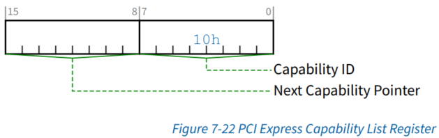

<!-- @import "[TOC]" {cmd="toc" depthFrom=1 depthTo=6 orderedList=false} -->

<!-- code_chunk_output -->

- [1. 配置空间概述](#1-配置空间概述)
  - [1.1. 配置空间分类](#11-配置空间分类)
    - [1.1.1. 配置空间 Header](#111-配置空间-header)
    - [1.1.2. Capability 结构](#112-capability-结构)
    - [1.1.3. 扩展 Capability 空间](#113-扩展-capability-空间)
  - [1.2. 配置空间的访问](#12-配置空间的访问)
  - [1.3. Capability 结构链表](#13-capability-结构链表)
  - [1.4. 多个 Capability 结构](#14-多个-capability-结构)
- [2. Power Management Capability 结构](#2-power-management-capability-结构)
  - [2.1. PMCR 寄存器](#21-pmcr-寄存器)
  - [2.2. PMCSR 寄存器](#22-pmcsr-寄存器)
- [3. PCI Express Capability 结构](#3-pci-express-capability-结构)
  - [3.1. PCI Express Capability List 寄存器(Offset 00h)](#31-pci-express-capability-list-寄存器offset-00h)
  - [3.2. PCI Express Capability 寄存器(offset 02h)](#32-pci-express-capability-寄存器offset-02h)
  - [3.3. Device Capability 寄存器(offset 04h)](#33-device-capability-寄存器offset-04h)
  - [3.4. Device Control 寄存器(offset 08h)](#34-device-control-寄存器offset-08h)
  - [3.5. Device Status 寄存器(Offset 0Ah)](#35-device-status-寄存器offset-0ah)
  - [3.6. Link Capability 寄存器(Offset 0Ch)](#36-link-capability-寄存器offset-0ch)
  - [3.7. Link Control 寄存器(Offset 10h)](#37-link-control-寄存器offset-10h)
  - [3.8. Link Status 寄存器(Offset 12h)](#38-link-status-寄存器offset-12h)
  - [3.9. Slot Capabilities 寄存器(Offset 14h)](#39-slot-capabilities-寄存器offset-14h)
  - [3.10. Slot Control 寄存器(Offset 18h)](#310-slot-control-寄存器offset-18h)
  - [3.11. Slot Status 寄存器(Offset 1Ah)](#311-slot-status-寄存器offset-1ah)
  - [3.12. Root Control 寄存器(Offset 1Ch)](#312-root-control-寄存器offset-1ch)
  - [3.13. Root Capabilities 寄存器(Offset 1Eh)](#313-root-capabilities-寄存器offset-1eh)
  - [3.14. Root Status 寄存器(Offset 20h)](#314-root-status-寄存器offset-20h)
  - [3.15. Device Capabilities 2 寄存器(Offset 24h)](#315-device-capabilities-2-寄存器offset-24h)
  - [3.16. Device Control 2 寄存器(Offset 28h)](#316-device-control-2-寄存器offset-28h)
  - [3.17. Device Status 2 寄存器(Offset 2Ah)](#317-device-status-2-寄存器offset-2ah)
  - [3.18. Link Capabilities 2 寄存器(Offset 2Ch)](#318-link-capabilities-2-寄存器offset-2ch)
  - [3.19. Link Control 2 寄存器(Offset 30h)](#319-link-control-2-寄存器offset-30h)
  - [3.20. Link Status 2 寄存器(Offset 32h)](#320-link-status-2-寄存器offset-32h)
  - [3.21. Slot Capabilities 2 寄存器(Offset 34h)](#321-slot-capabilities-2-寄存器offset-34h)
  - [3.22. Slot Control 2 寄存器(Offset 38h)](#322-slot-control-2-寄存器offset-38h)
  - [3.23. Slot Status 2 寄存器(Offset 3Ah)](#323-slot-status-2-寄存器offset-3ah)
- [4. PCI Express Extended Capability 结构](#4-pci-express-extended-capability-结构)
- [5. 示例](#5-示例)
  - [5.1. lspci](#51-lspci)

<!-- /code_chunk_output -->

# 1. 配置空间概述

## 1.1. 配置空间分类


一共有 4K 空间:

* **配置空间 Header**(`Configuration Space Header`), `0x00 ~ 0x3F`, 有 64 字节空间

* **Capability 结构**(`Capability Structure`), `0x40 ~ 0xFF`, 从第 64 字节开始, 有 192 字节空间, 前面两个统称 **PCI Configuration Space**

* **扩展 Capability 空间**(`PCI Express Extended Configuration Space`), `0x100~0xFFF`, 从第 256 字节开始, 有 3840 字节空间

系统初始化时, **BIOS**(或者 **UEFI**)将把 PCI 设备的**配置空间映射到处理器**的 **I/O 地址空间**, **操作系统**通过 I/O 端口访问配置空间中的寄存器. 后来的 PCI Exepress 标准约定配置空间从 256 字节扩展到了 4096 字节, 处理器需要通过 **MMIO** 方式访问配置空间, 当然**前 256 字节**仍然可以通过 **I/O 端口方式**访问.

### 1.1.1. 配置空间 Header

前面讲述了**PCI 设备**使用的基本配置空间, 叫做 **配置空间 Header**(`Configuration Space Header`).

这个基本配置空间共由**64 个字节**组成其地址范围为`0x00 ~ 0x3F`这**64 个字节**是**所有 PCI 设备必须支持(!!!PCI 设备**)的. 事实上**许多 PCI 设备**也**仅支持**这 64 字节 配置寄存器.

### 1.1.2. Capability 结构

此外 `PCI/PCI-X` 和 `PCIe` 设备还有 `0x40 ~ 0xFF`!!!这段共 **192 个字节**的**配置空间**, 叫做 **Capability 数据结构**(`Capability Structure`).

在这段空间**主要存放**一些与 **MSI 或者 MSI-X 中断机制**和**电源管理相关的 Capability 结构**等等.

> 不是 PCIe 设备独有的, PCI 设备也可以有.

> 其中**所有能够提交中断请求**的 PCIe 设备**必须支持 MSI 或者 MSI-X Capability 结构(!!!**).

### 1.1.3. 扩展 Capability 空间

**PCIe 设备**还支持 `0x100~0xFFF`(!!!, 3840 字节) 这段**扩展配置空间**, 叫做**扩展配置空间**(`Extended Configuration Space`). 这是 **PCIe 设备独有空间**.

> 即 PCIe Extended Capabilities 结构, 与上面说的 中断/PM Capability 的地址空间地址是分开的. 这是为了兼容, 因为 中断/PM capability 在 PCI 中也可能存在.

PCIe 设备使用的**配置空间最大为 4KB**, 在 PCIe 总线的**扩展配置空间**中存放**PCIe 设备所独有**的一些**Capability 结构**, 而**PCI 设备不能使用**这段空间.

## 1.2. 配置空间的访问

* 在 **x86** 处理器中使用 **PCI Host Bridge** 的 `CONFIG_ADDRESS` **寄存器**与 `CONFIG_DATA` **寄存器**访问 PCIe 配置空间的 `0x00~0xFF`, 而使用 **ECAM(PCI Express Enhanced Configuration Access Mechanism)方式**访问 `0x000~0xFFF` 这段空间;

* 在 **PowerPC** 处理器中可以使用 `CFG_ADDR` 和 `CFG_DATA` 寄存器访问 `0x000~0xFFF` 详见 `2.2` 节.

## 1.3. Capability 结构链表

`PCI-X` 和 `PCIe` 总线规范要求其**设备必须支持 Capabilities 结构**. 在 **PCI 总线**的**基本配置空间**(64 字节的配置空间 header)中包含一个 **Capabilities Pointer 寄存器(!!!**), 该寄存器存放 Capabilities 结构**链表的头指针**. 在一个 PCIe 设备中可能含有**多个 Capability 结构**, 这些寄存器**组成一个链表**, 其结构如图 4‑14 所示.

> 在 `PCI` 设备中 Capabilities Pointer 寄存器是**可选**的. 而 `PCI-X/PCIe` 设备**必须支持**.


> 注意, 这个链表中元素仅仅包括了 192(`0x40 ~ 0xFF`) 字节的设备 Capability 结构, 不包含 3840 字节的扩展 Capability 空间, 扩展 Capability 空间的指针起始 offset 地址恒定是 0x100.

其中**每一个 Capability** 结构都有**唯一的 ID 号!!!**, 每一个 Capability 寄存器都有**一个指针**, 这个指针指向下一个 Capability 结构, 从而组成一个**单向链表结构**, 这个链表的**最后一个 Capability** 结构的**指针为 0**.

## 1.4. 多个 Capability 结构

**一个 PCIe 设备**可以包含**多个 Capability 结构(!!!**), 包括:

* 与**电源管理相关**的结构;
* 与**PCIe 总线相关**的结构(就是 PCIe Capability?);
* 与**中断请求相关**的结构;
* **PCIe Capability**结构;
* **PCIe Extended Capability**结构;
* **Single Root I/O Virtualization Extended Capability**结构;
* 等等

在第 6 章详细将讨论 `MSI/MSI-X Capability` 结构. 在**PCIe 总线规范**中定义了**较多的 Capability 结构**这些结构适用于不同的应用场合. 在一个指定的 PCIe 设备中并不一定支持本篇中涉及的所有 Capability 结构.

下面简单介绍几种 capability 结构

# 2. Power Management Capability 结构

> 这种结构 ID 是 `0x01`, 电源管理相关.它属于上面的 Capability 空间, PCI/PCI-X/PCIe 设备都可能有, 在 `0x40~0xFF` 范围.

PCIe 总线使用的软件电源管理机制与 PCI PM(Power Management) **兼容**. 而 **PCI 总线**(!!!)的**电源管理机制**需要使用 **Power Management Capability 结构**, 该结构由一些和 PCI/PCI-X 和 PCIe 总线的电源管理相关的寄存器组成, 包括 **PMCR**(Power Management Capability Registers) 和 **PMCSR**(Power Management Control and Status Register), 其结构如下图.


Capability ID 字段记载 Power Management Capability 结构的 ID 号, 其值为 0x01. 在 PCIe 设备中, 每个 Capability 都有唯一的一个 ID 号, 而 Next Capability Pointer 字段存放下一个 Capability 结构的地址.

## 2.1. PMCR 寄存器

## 2.2. PMCSR 寄存器

# 3. PCI Express Capability 结构

> 结构 ID 是 0x10, 存放 PCIe 总线相关信息. 它还是属于上面的 Capability 空间, 不是 PCIe Extended Capability 空间, 在 `0x40~0xFF` 范围.
>
> 可以用来判断是否是 PCIe 设备

存放和 **PCIe 总线相关的信息**, 包括 **PCIe 链路**和**插槽**的信息. 有些 **PCIe** 设备**不一定**实现结构中所有寄存器, 或者并没有提供这些配置寄存器供系统软件访问.

PCI Express Capability 结构如下图. (**与 PCIe Extended Capability 不同**)


PCI Express Capability 结构的部分寄存器及其相应字段**与硬件的具体实现细节相关**.

## 3.1. PCI Express Capability List 寄存器(Offset 00h)



* `Cap ID` 字段为 **PCI Express Capability 结构**使用的 ID 号, 其值为 `0x10`;

* `Next Capability` 字段存放**下一个 Capability 寄存器的地址**;

* 其他一系列寄存器

## 3.2. PCI Express Capability 寄存器(offset 02h)

**PCI Express Capability 寄存器**存放与 PCIe 设备相关的一些参数,  包括**版本号信息**,**端口描述**, 当前 PCIe 链路是与 PCIe 插槽直接连接还是作为内置的 PCIe 设备等-系列信息.


这些参数的详细定义如表 4-3 所示.

<table style="width:100%">
<caption>PCI Express Capability 寄存器</caption>
  <tr>
    <th>Bits</th>
    <th>定义</th>
    <th>描述</th>
  </tr>
  <tr>
    <td>3: 0</td>
    <td>Capability Version</td>
    <td>
    存放 PCIe 设备的<b>版本号</b>.<br>
    如果该设备基于 PCIe 总线规范 2.x. 该字段的只为 0x2; 如果该设备基于 PCIe 总线规范 1.x, 该字段的值为 0x1. 该字段<b>只读</b>.
    </td>
  </tr>
  <tr>
    <td>7:4</td>
    <td>Device/Port Type</td>
    <td>
    存放 PCIe 设备的<b>类型</b>. <br>
    <li><b>0b0000</b> 对应 PCle 总线的<b>EP</b>;</li>
    <li><b>0b0001</b> 对应 Legacy PCle 总线的<b>EP</b>;</li>
    <li><b>0b0100</b> 对应 RC 的<b>Root port</b>;</li>
    <li><b>0b0101</b> 对应 Switch 的<b>上游端口</b>;</li>
    <li><b>0b0110</b> 对应 Switch 的<b>下游端口</b>;</li>
    <li><b>0b0111</b> 对应 PCle <b>桥片</b>;</li>
    <li><b>0b1000</b> 对应 PCI/PCI-X-to-PCle <b>桥片</b>;</li>
    <li><b>0b1001</b> 对应 RC 中集成的 <b>EP</b>;</li>
    <li><b>0b1010</b> 对应 RC 中的 <b>Event Collector</b>;</li>
    该字段只读.
    </td>
  </tr>
  <tr>
    <td>8</td>
    <td>Slot Implemented</td>
    <td>
    当该位为 1 时, 表示和当前端口相连的是一个 PCle 插槽, 而不是 PCle 设备
    </td>
  </tr>
  <tr>
    <td>13:9</td>
    <td>Interrupt Message Number</td>
    <td>
    当 PCI Express Capability 结构的 Slot Status 寄存器或者 Root Status 寄存器的状态发生变化时, 该 PCle 设备可以通过 MSI/MSI-X 中断机制向处理器提交中断请求. <br>
    该字段存放 MSI/MSI-X 中断机制需要的 Message Data 字段
    </td>
  </tr>
</table>

> Slot Implemented: 插槽表明可以用来做热插拔, 不是设备本身

> Event Collector 是 RC 集成的一个功能部件,进行错误检查和处理 PME 消息,该部件可选

> 有关 MSI 中断机制的详细描述见第 10 章

## 3.3. Device Capability 寄存器(offset 04h)


## 3.4. Device Control 寄存器(offset 08h)


## 3.5. Device Status 寄存器(Offset 0Ah)


## 3.6. Link Capability 寄存器(Offset 0Ch)


Link Capabilities寄存器描述 PCIe链路的属性, 其主要字段的含义如下

* Supported Link Speeds字段. 为0b0001表示PCle链路支持2.5GT(gigatransfers)/s;为0b0010表示PCIe链路支持5GT/s;为0b0100表示PCIe链路支持8CT/s. 

* **Maximum Link Width** 字段. 该字段存放该PCle设备支持的**最大链路宽度**. 该字段

  * 为0b000001表示最大支持x1的PCe链路;
  * 为0b000010表示最大支持x2的PCe链路;
  * 为0b000100表示最大支持x4的PCIe链路;
  * 为0b001000表示最大支持x8的PCIe链路;
  * 为0b001100表示最大支持x12的PCe链路;
  * 为0b010000 表示最大支持x16的PCe链路;
  * 为0b100000表示最大支持x32的PCle链路. 

* ASPM(Active State Power Management)Support字段, 该字段只读. 0b00和0b10 为系统保留字段. 当该字段为0b01时, 表示ASPM支持0s状态;当该字段为0b11时, 表示 ASPM 支持L0s和L1状态. PCIe设备除了支持PCIPM电源管理方式之外, 还支持ASPM 机制进行电源管理. ASPM机制是PCIe设备进行的主动电源管理方式, 与系统软件没有直接联系. 有关ASPM的详细描述见第8.3节. 

* L0s Exit Latency 和 L1 Exit Latency 字段. 这两个字段定义了 PCIe 设备从 L0s 和 L1 状态退出的最小延时. 

* Port Number 字段. 如果多端口RC和Switch支持多个下游端口, 则使用该字段对这些端口进行编号. PCIe设备进行链路训练时, 需要使用这个端口号. 

## 3.7. Link Control 寄存器(Offset 10h)


## 3.8. Link Status 寄存器(Offset 12h)


## 3.9. Slot Capabilities 寄存器(Offset 14h)


## 3.10. Slot Control 寄存器(Offset 18h)


## 3.11. Slot Status 寄存器(Offset 1Ah)


## 3.12. Root Control 寄存器(Offset 1Ch)


## 3.13. Root Capabilities 寄存器(Offset 1Eh)


## 3.14. Root Status 寄存器(Offset 20h)


## 3.15. Device Capabilities 2 寄存器(Offset 24h)


## 3.16. Device Control 2 寄存器(Offset 28h)


## 3.17. Device Status 2 寄存器(Offset 2Ah)


## 3.18. Link Capabilities 2 寄存器(Offset 2Ch)


## 3.19. Link Control 2 寄存器(Offset 30h)


## 3.20. Link Status 2 寄存器(Offset 32h)


## 3.21. Slot Capabilities 2 寄存器(Offset 34h)


## 3.22. Slot Control 2 寄存器(Offset 38h)


## 3.23. Slot Status 2 寄存器(Offset 3Ah)


# 4. PCI Express Extended Capability 结构

> PCIe 扩展 Capability 结构, 即上面讲到的 PCIe Extended Capability 空间(扩展 Capability 空间), PCIe 设备独有, 从 0x100 开始.

PCI Express Extended Capabilities 结构存放在 PCI 配置空间 `0x100` **之后的位置**, 该结构是 **PCIe 设备独有**的, PCI 设备并不支持该结构. 实际上**绝大多数 PCIe 设备**也并**不支持**该结构.

在一个 PCle 设备中可能含有**多个 PCI Express Extended Capabilities 结构**, 并形成一个**单向链表**, 其中**第一个** Capability 结构的**基地址**为 **0x100**, 其结构如图 4-19 所示.

> 这个链表不同于前面的 `设备 capability 结构`

* 在这个**单向链表的尾部**, 其 `Next Capability Offset`,`Capability ID` 和 `Capbility Version` 字段的值都为 **O**.
* **PCIe 设备**中**不含有** PCI Express Extended Capabilities 结构, 则 0x100 指针所指向的结构, 其 Capability ID 字段为 `0x0000`, Capability Version 字段是 0x0, Next Capability Offset 字段为 0x0.
* Extended Capabilities in a Root Complex Register Block always begin at offset 000h with a PCI Express Extended Capability header (Section 7.6.3). Absence of any Extended Capabilities is required to be indicated by an Extended Capability header with a Capability ID of FFFFh and a Next Capability Offset of 000h.


一个 PCI Express Extended Capabilities 结构由以下参数组成.

* `PCI Express Capability ID` 字段存放 Extended Capability 结构的 ID 号.
* `Capability Version` 字段存放 Extended Capability 结构的版本号.
* `Next Capability Offset` 字段存放**下一个 Extended Capability 结构**的**偏移**. 低 2 位是保留位且必须是 00b

PCle 总线定义了一系列 PCIExpress Extended Capabilities 结构, 如下所示.

* AER Capability 结构. 该结构定义了所有 PCIe 设备可能遇到的错误, 包括 Uncorect-able Eror(不可恢复错误)和 Cormectable Ermor(可恢复错误). 当 PCle 设备发现这些错误时, 可以根据该寄存器的设置使用 Eror Mesage 将错误状态发送给 Event Col.
lector, 并由 Event Collector 统一处理这些错误. 系统软件必须认真处理每一个 Ermor Message,并进行恢复. 对一个实际的工程项目, 错误处理是保证整个项目可靠性的重要一环, 不可忽视. AER 机制与 Eror Mesage 报文的处理相关, 第 6.3.4 节将进一步介绍 AER 机制.
* Device Serial Number Capability 结构. 该结构记载 PCle 设备使用的序列号. IEEE 定义了一个 64 位宽度的 PCle 序列号, 其中前 24 位作为 PCle 设备提供商使用的序列号, 而后 40 位由厂商选择使用.
* PCle RC Link Declaration Capability 结构. 在 RC,RC 内部集成的设备或者 RCRB 中可以包含该结构. 该结构存放 RC 的拓扑结构, 如 RC 使用的 PCI 链路宽度. 如果 RC 支持多个 PCIe 链路, 该结构还包含每一个链路的描述和端口命名.
* PCle RC Intemal lLink Control Capability 结构. 该结构的主要作用是描述 RC 内部互连使用的 PCIe 链路. 该结构由 Root Complex Link Status 和 Root Complex Link Control 寄存器组成.
* Power Budget Carpability 结构. 当处理器系统为一些动态加入的 PCle 设备分配电源配额时, 将使用该设备的 Power Budget Capability 结构.
* ACS(Access Control Services)Capability 结构. 该结构对 PCle 设备进行访问控制管理.


# 5. 示例

以一个网卡设备为例

```
# lspci -s 16:00.1 -v
16:00.1 Ethernet controller: Intel Corporation Ethernet Controller X710 for 10GBASE-T (rev 02)
        Subsystem: Intel Corporation Ethernet Network Adapter X710-TL
        Physical Slot: 1
        Flags: bus master, fast devsel, latency 0, IRQ 16, NUMA node 0
        Memory at a7ffd000000 (64-bit, prefetchable) [size=16M]
        Memory at a7fff800000 (64-bit, prefetchable) [size=32K]
        Expansion ROM at 9f600000 [disabled] [size=512K]
        Capabilities: [40] Power Management version 3
        Capabilities: [50] MSI: Enable- Count=1/1 Maskable+ 64bit+
        Capabilities: [70] MSI-X: Enable+ Count=129 Masked-
        Capabilities: [a0] Express Endpoint, MSI 00
        Capabilities: [e0] Vital Product Data
        Capabilities: [100] Advanced Error Reporting
        Capabilities: [140] Device Serial Number ae-5e-a7-ff-ff-91-96-b4
        Capabilities: [150] Alternative Routing-ID Interpretation (ARI)
        Capabilities: [160] Single Root I/O Virtualization (SR-IOV)
        Capabilities: [1a0] Transaction Processing Hints
        Capabilities: [1b0] Access Control Services
        Kernel driver in use: i40e
        Kernel modules: i40e
```

查看 config 信息

```
# cd /sys/bus/pci/devices/0000\:16\:00.1
# xxd -e config
00000000: 15ff8086 00100546 02000002 00800008  ....F...........
00000010: fd00000c 00000a7f 00000000 ff80000c  ................
00000020: 00000a7f 00000000 00000000 00008086  ................
00000030: 9f600000 00000040 00000000 0000010b  ..`.@...........
00000040: c8235001 00002008 00000000 00000000  .P#.. ..........
00000050: 01807005 00000000 00000000 00000000  .p..............
00000060: 00000000 00000000 00000000 00000000  ................
00000070: 8080a011 00000003 00001003 00000000  ................
00000080: 00000000 00000000 00000000 00000000  ................
00000090: 00000000 00000000 00000000 00000000  ................
000000a0: 0002e010 10008ce4 00095157 00425883  ........WQ...XB.
000000b0: 10830040 00000000 00000000 00000000  @...............
000000c0: 00000000 0000001f 00000009 0000000e  ................
000000d0: 00000000 00000000 00000000 00000000  ................
000000e0: 80840003 0000784c 00000000 00000000  ....Lx..........
000000f0: 00000000 00000000 00000000 00000000  ................
00000100: 14020001 00000000 00188000 00063030  ............00..
00000110: 00002000 00003000 000000a0 00000000  . ...0..........
00000120: 00000000 00000000 00000000 00000000  ................
00000130: 00000000 00000000 00000000 00000000  ................
00000140: 15010003 ff9196b4 ae5ea7ff 00000000  ..........^.....
00000150: 1601000e 00000000 00000000 00000000  ................
00000160: 1a010010 00000000 00000009 00400040  ............@.@.
00000170: 00010005 0001004f 154c0000 00000553  ....O.....L.S...
00000180: 00000001 ff00000c 00000a7f 00000000  ................
00000190: ff81000c 00000a7f 00000000 00000000  ................
000001a0: 1b010017 00000005 00000000 00000000  ................
000001b0: 0001000d 00000000 00000000 00000000  ................
000001c0: 00000000 00000000 00000000 00000000  ................
000001d0: 00000000 00000000 00000000 00000000  ................
......
```

每行有 16 字节, 即 128 位; 每行分为了 4 块, 每块是 32 位(4 字节); 每块分为 2 个 16 位(2 字节), 先是显示高 16 位, 再显示低 16 位.


0x00 起始地址 是 PCIe 的 Vendor ID 和 Device ID:

* Vendor ID: 8086
* Device ID: 15f2

 是 class code:

* class code:

整个配置空间大小是 4K, Header 中的 Capabilities Pointer 在第 (13) 个 double word 处, 即

```

```

PCI Express Extended Capabilities 地址范围是 `0x100 ~ 0xFFF`, 所以如果只看 PCI Express Extended Capabilities 的话可以只从 0x100 开始看

```
00000100: 14020001 00000000 00188000 00063030  ............00..
```

`14020001` 就是前 32 位(十六进制), Intel 是小端字节序:

* `0x140` 是 `31:20`, 代表了 next capability offset;
* `0x2` 是 `19:16`, 代表了 Capability Version;
* `0x0001` 是 `15:0`, 代表了 PCIe Cap ID, 这里表示是 `AER(Advanced Error Reporting)`.

>ID code 可以见 `PCI_Code-ID_r_1_11__v24_Jan_2019.pdf`

next offset 是 140

```
00000140: 15010003 ff9196b4 ae5ea7ff 00000000  ..........^.....
```

这个 capability ID 是 `0003`, 称作 `Device Serial Number`; next offset 是 0x150

```
00000150: 1601000e 00000000 00000000 00000000  ................
```

这个 capability ID 是 `000e`, 称作 `Alternative Routing-ID Interpretation (ARI)`; next offset 是 0x160

```
00000160: 1a010010 00000000 00000009 00400040  ............@.@.
```

这个 capability ID 是 `0010`, 就是 `Single Root I/O Virtualization (SR-IOV)`; next offset 是 0x1a0

```
000001a0: 1b010017 00000005 00000000 00000000  ................
```

这个 capability ID 是 `0017`, 称作 `Transaction Processing Hints (TPH Requester)`; next offset 是 0x1b0

```
000001b0: 0001000d 00000000 00000000 00000000  ................
```

这个 capability ID 是 `000d`, 称作 `Access Control Services (ACS)`; next offset 是 0x000, 即这就是最后一个 pcie extended capability structure.

## 5.1. lspci

可以通过 "`lspci –xxx –s 04:00.0`" 命令来列出该设备的 PCIe 详细信息. 这些内容存储在 PCIe 设备**配置空间**, 它们描述的是 PCIe 本身的特性.

如下图所示, 可以看到


* 这是一个**非易失性存储控制器**, Non-Volatile memory controller

* 0x00 起始地址是 PCIe 的 Vendor ID 和 Device ID.

  * Vendor ID: 15b7

  * Device ID: 5011

* Class code **0x010802** 表示这是一个 **NVMe 存储设备**.

* **0x80** 是**第一个 capability 的指针**, 如果你需要查看 PCIe 的 capability, 就需要从这个位置开始去查询, 在每组特征的头字段都会给出下一组特性的起始地址.

* **数据链路状态**(`LnkSta`, 属于 Express Endpoint Capability)中的一个 **0x23** 字段, 表示该设备是一个 **x2 lane** 的物理链路, 支持 PCIe Gen3 速率(单 Lane 的峰值带宽是 `8GT/s`).

查看 vendor ID 和 device ID


当然也可以使用 `lspci -vvv -s 04:00.0` 命令来查看设备特性.


