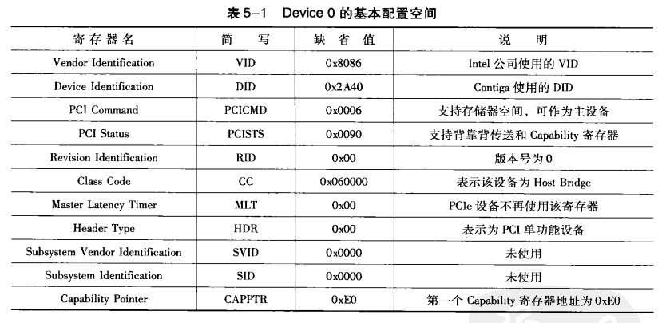
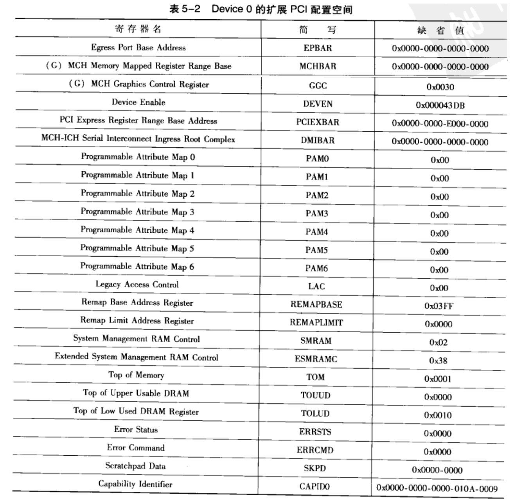

<!-- @import "[TOC]" {cmd="toc" depthFrom=1 depthTo=6 orderedList=false} -->

<!-- code_chunk_output -->

- [概述](#概述)
- [EPBAR 寄存器](#epbar-寄存器)
- [MCHBAR 寄存器](#mchbar-寄存器)
- [其他寄存器](#其他寄存器)

<!-- /code_chunk_output -->

# 概述

**PCI 总线 0** 上**存储器控制器**(`Device 0`)是一个比较**特殊的 PCI 设备**, 这个设备除了需要**管理 DDR SDRAM** 之外, 还**管理整个存储器域的地址空间(！！！**), 包括 **PCI 总线域地址空间(！！！**). 在 x86 处理器系统中, 该设备是管理存储器域空间的重要设备, 其中含有许多**与存储器空间相关的寄存器**.

这些**寄存器**对于系统程序员理解 x86 处理器的存储器拓扑结构非常重要, 底层编程需要掌握这些寄存器. 但是在 x86 处理器系统中, 由于 BIOS 的存在, 多数程序员没有机会使用这些寄存器.

从底层开发角度, x86 处理器系统不如 PowerPC, MIPS 和 ARM 处理器透明. x86 处理器首先使用 BIOS 屏蔽处理器的硬件实现细节,其次在处理器内核中使用了 microcode 进一步屏蔽了 CPU 的实现细节. 使得底层程序员在没有得到充分的资源时, 几乎无法开发 x86 处理器的底层代码.

但不可否认的是 x86 处理器底层开发的复杂程度超过 PowerPC, MIPS 和 ARM 处理器, 因为 x86 处理器系统作为通用 CPU 需要与各类操作系统兼容, 而向前兼容对于任何一种处理器都是一个巨大的包袱. x86 处理器系统使用 BIOS 和 Microcode 屏蔽硬件细节基于技术和商业考虑.

从传统外部设备的角度看, PCI 总线 0 的 Device 0 并不是一个设备, 仅存放与处理器系统密切相关的一组参数. 而除了 x86 处理器外, 几乎所有处理器都使用存储器映射寻址的寄存器保存这些参数.

在 Montevina 平台, **系统软件**使用**Type 00h**配置**请求访问存储器控制器**, 该**存储器控制器**除了具有一个**标准的 PCI Agent 设备**的**64B 的配置空间**之外, 还使用了**PCI 设备的扩展配置空间**, 其包含的主要寄存器如表.

注: 上图是基本配置空间！！！

Device 0 使用的**基本配置空间(所有 PCI 设备都有！！！**)与**其他 PCI 设备兼容**.

注意, **Device 0**在**PCIe 体系结构**中, 被认为是**HOST 主桥(！！！**). 而**Device 0**使用的**PCI 扩展配置空间**也被称为**RCRB(！！！**), RCRB 主要**作用**是描述**当前处理器**的**存储器地址拓扑结构(！！！**), 包括**主存储器地址(！！！**)和**PCI 总线地址(！！！**). 其简写和复位值如图.

注: 上图是扩展 PCI 配置空间！！！

系统软件**首先**检查**Capability Identifier**寄存器, 该**寄存器地址偏移为 0xE0**, 即**CAPPTR 寄存器(第一个 Capability 寄存器地址！！！**)指向的地址为**0xE0**. 该**Capability 结构**使用的**PCI Express Extended Capability ID 字段**(该字段在**CAPID0 寄存器**中)为**0x0A(！！！ID 是这个的说明是 RCRB！！！**), 因此表 5-2 中寄存器组为 RCRB Capability 结构, 关于 Capability 结构见 4.3.

在 x86 处理器系统中, **RCRB** 存放一些与**处理器系统相关的寄存器**. 而在许多处理器中, 如 PowerPC 中并不含有 RCRB.

在 **x86 处理器**中, 使用 **PCI 总线管理所有外部设备(！！！**), 这些"**与处理器系统相关的寄存器**"被保存在 **RCRB(！！！**)中, 处理器使用**PCI 总线**配置**周期访问这些寄存器(！！！**). 实际上在**RCRB 中包含的寄存器**与 PCIe 体系结构并**没有直接关系**, **这些寄存器应该属于存储器域的地址区域(！！！**). x86 处理器的这种做法并非完全合理, 在某种程度上容易**使人混淆存储器域**与**PCI 总线域**的区别.

RCRB 主要寄存器的含义如下.

# EPBAR 寄存器

大小为 **8B**, 指向一个**4KB 大小**的**存储器区域**. **处理器**使用**存储器映像**寻址访问这段存储器区域, 并通过这段存储器区域访问 RCRB 的扩展配置空间, 在表 5-2 中存放的仅是 RCRB 的部分扩展配置空间.

这段存储器区域描述 RC 的 Egress 端口属性, 包括 RC 使用的 VC0 和 VC1 两个虚通路的具体信息. 当 EPBAR 寄存器的"EPBAR Enable"位为 1 时, 这段空间有效. 这段寄存器区域被称为 "Egress Port RCRB" 空间, 系统软件可以使用这段空间定义的寄存器, 完成对 VC1 和 VC0 通路的设置, 包括端口仲裁, VC 仲裁等一些列内容.

# MCHBAR 寄存器

大小 8B, 指向一个 16KB 大小的存储器区域. 处理器使用存储器映像寻址访问这段存储器区域. 这段存储器区域描述 GMCH 内部使用的一些寄存器. 当 MCHBAR 寄存器的 "MCHBAR Enable" 位为 1 时, 这段存储区域有效.

这段区域包含多组寄存器.

# 其他寄存器

在 Device 0 中还包含以下寄存器.

- GGC 寄存器.
- DEVEN 寄存器.
- PCIEXBAR 寄存器. 大小 8B, 指向一个 **256MB 大小**的存储器区域. **PCIe 总线**可以使用 **ECAM 方式**访问 PCI 设备的**扩展配置空间**, **PCIEXBAR**寄存器存放**PCI 配置空间的基地址**, 有关 ECAM 机制详细信息见 5.3.2 节.
- DMIBAR 寄存器. 大小 8B, 指向一个 4KB 大小的存储器区域, 处理器使用存储器映像寻址访问这段存储器区域. 该寄存器描述**RC 中的 DMI 接口**.
- PAM0~PAM6 寄存器. 描述 Shadow BIOS 的属性.
-
.............