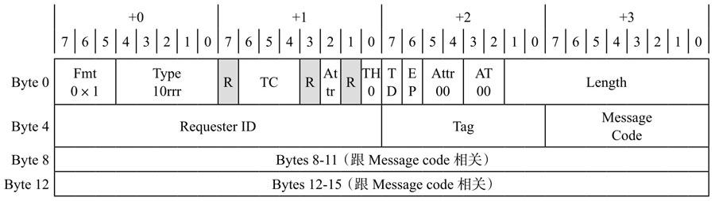
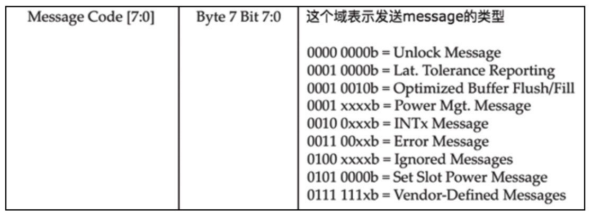
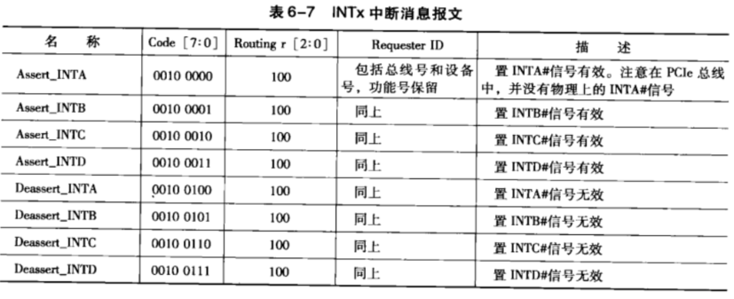

本节讲述 PCIe 总线定义的各类 TLP, 并详细介绍这些 TP 的格式. 在这些 TP 中, 有些格式对于初学者来说较难理解. 为此本书将在第 12 章中结合一个设计实例, 进一步描述这些 TP 格式.

但是在阅读第 12 章的内容之前, 读者需要建立 PCIe 总线中与 TLP 相关的一些基本概念, 特别是存储器读写相关的报文格式. 在 PCe 总线中, 存储器读写, O 读写和配置读写请求 TLP 由以下几类报文组成.

(1) 存储器读请求 TLP 和读完成 TLP

当 PCIe 主设备, RC 或者 EP, 访问目标设备的存储器空间时, 使用 Non-Posted 总线事务向目标设备发出存储器读请求 TLP, 目标设备收到这个存储器读请求 TLP 后, 使用存储器读完成 TLP, 主动向主设备传递数据. 当主设备收到目标设备的存储器读完成 TLP 后, 将完成一次存储器读操作.

(2) 存储器写请求 TLP

在 PCe 总线中, 存储器写使用 Posted 总线事务. PCe 主设备仅使用存储器写请求 TLP 即可完成存储器写操作, 主设备不需要目标设备的回应报文.(3) 原子操作请求和完成报文
原子操作由 PCIeV2.1 总线规范引人, 一个完整的原子操作由原子操作请求和原子操作完成报文组成. 原子操作的使用方法与其他 Non-Posted 总线事务类似, 首先 PCe 主设备向目标设备发送原子操作请求, 之后目标设备向主设备发送原子操作完成报文, 结束一次原子操作. 有关原子操作的详细说明见第 6.3.5 节.

(4)1/0 读写请求 TLP 和读写完成 TLP 在 PCIe 总线中, 0 读写操作使用 Non-Posted 总线事务, I/0 读写 TLP 都需要完成报文做为回应. 只是在 0 写请求的完成报文中不需要 "带数据", 而仅含有 VO 写请求是否成功的状态信息.

(5) 配置读写请求 TLP 和配置读写完成 TP 从总线事务的角度上看, 配置读写请求操作的过程与 0 读写操作的过程类似. 配置读写请求 TLP 都需要配置读写完成作为应答, 从而完成一个完成的配置读写操作.

(6) 消息报文

与 PCI 总线相比, PCIe 总线增加了消息请求事务. PCIe 总线使用基于报文的数据传送模式, 所有总线事务都是通过报文实现的, PCe 总线取消了一些在 PCI 总线中存在的边带信号. 在 PCe 总线中, 一些由 PCI 总线的边带信号完成的工作, 如中断请求和电源管理等在 PCe 总线中由消息请求报文实现.

# 存储器读写请求 TLP

# 完成报文

# 配置读写请求 TLP

# 消息请求报文

> Message TLP

Message TLP 用于传输中断, 错误, 电源管理等信息, 取代 PCI 时代的边带信号传输.

Message TLP 的 Header 大小总是 4DW, 在 PCIe 总线中, 多数消息报文使用隐式路由方式, 其格式如下图所示. 其中 Byte0 字段为通用 TP 头, 而 Byte4 的第 3 字节中存放 MessageCode 字段.

Message Code 指定该 Message 的类型, 具体如下图.

* INTx 中断消息报文 (INTx Interrupt Signaling).

* 电源管理消息报文 (Power Management).

* 错误消息报文 (Error Signaling).

* 锁定事务消息报文 (Locked Transaction Support).

* 插槽电源限制消息报文 (SlotPower Limit Support).

* Vendor-Defined Messages.

不同的 Message Code, 最后两个 DW 的意义也不同, 这里不再展开.

本节将重点讲述 INTx 中断和错误信息相关的消息报文, 请读者阅读 PCIe 总线规范了解其他消息报文.

## INTx 中断消息报文

> INTx Interrupt Signaling

PCIe 总线推荐设备使用 MSI 或者 MSI-X 机制提交中断请求, 但是 MSI 中断机制并不是由 PCIe 总线首先提出的, 在 PCI 总线中就已经存在这种中断请求机制.

在 PCI 总线中, 虽然提出了 MSI 中断机制, 但是几乎没有 PCI 设备使用这种机制进行中断请求. MSI 中断机制是一种基于存储器写(Memory Write TLP)的中断请求机制, 而 PCI 设备提交 MSI 中断请求, 将占用 PCI 总线的带宽, 因此多数 PCI 设备使用 INTx 信号进行中断请求.

在 PCIe 总线中, PCIe 设备可以使用 Legacy 中断方式提交中断请求, 此时需要使用 INTx 中断消息报文向 RC 通知中断事件. 除此之外, 在 PCIe 体系结构中仍然存在 PCI 设备, 这些设备可能使用 INTx 信号提交中断请求.

例如在 **PCIe 桥片**上挂接的 **PCI 设备**可能并不支持 MSI 中断机制, 因此需要使用 INTx 中断信号提交中断请求, 此时 **PCIe 桥**需要将 INTx 信号转换为 INTx 中断消息报文, 并向 RC 提交中断请求. 在 PCIe 总线中, 共有 8 种 INTx 中断消息报文, 见表 6-7.

当 PCIe 设备不使用 MSI 报文向 RC 提交中断请求时, 可以首先使用 `Assert_INTx` **报文**向处理器系统提交中断请求, 当中断处理完毕, 再使用 `Deasser_INTx` 报文. 这些 INTx 中断消息报文的 `r[2:0]` 字段为 0b100, 即为 Local 消息报文. 设备收到该消息报文后, 将结束收到的 INTx 中断消息报文, 然后产生一个新的 INTx 中断消息报文.

在一个处理器系统中, PCI 设备首先需要通过 PCIe 桥, 之后可能通过多级 Switch, 最终到达 RC. 假设 PCI 设备使用 `INTA#` 信号进行中断请求, 但是由于**中断路由表**的存在, **PCIe 桥**可能将 `INTA#` **信号**转换为 **INTB** 中断消息, 而这个 **INTB** 中断消息通过 Switch 时, 可能又被 Switch 的中断路由表转换为 INTC 中断消息. 因此 PCIe 设备收到 INTx 中断消息后, 首先需要结束当前中断消息, 之后根据中断路由表产生一个新的 INTx 中断消息, 直到这个中断消息传递到 RC.

# PCIe 总线的原子操作

# TLP Processing Hint

