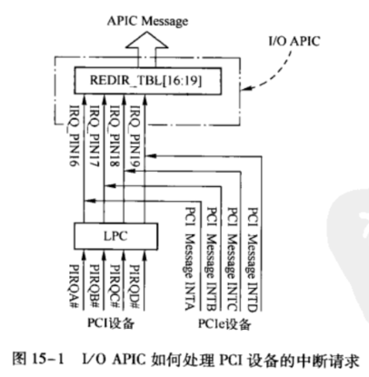
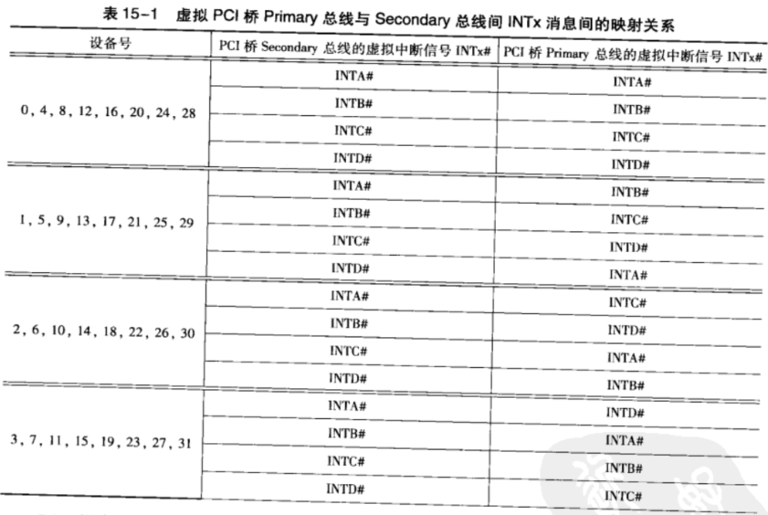
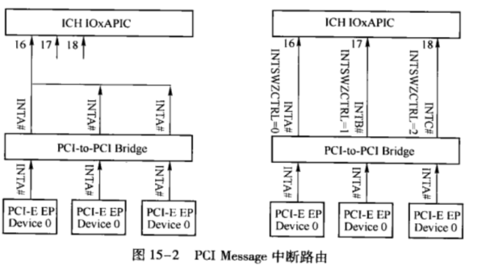
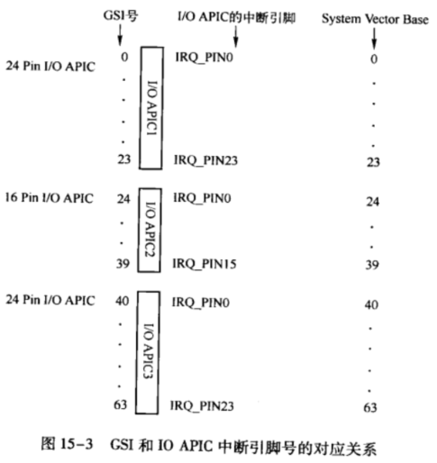
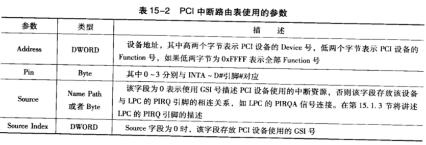

<!-- @import "[TOC]" {cmd="toc" depthFrom=1 depthTo=6 orderedList=false} -->

<!-- code_chunk_output -->

- [1. 硬件架构](#1-硬件架构)
  - [1.1. APIC 体系](#11-apic-体系)
  - [1.2. 设备和 I/O APIC 的连接](#12-设备和-io-apic-的连接)
    - [1.2.1. PCI 设备](#121-pci-设备)
    - [1.2.2. PCIe 设备](#122-pcie-设备)
    - [1.2.3. 小结](#123-小结)
  - [1.3. PCI 的中断路由表](#13-pci-的中断路由表)
    - [1.3.1. PCI 桥的中断路由表](#131-pci-桥的中断路由表)
    - [1.3.2. 问题](#132-问题)
    - [1.3.3. Interrupt Swizzling 技术](#133-interrupt-swizzling-技术)
    - [1.3.4. ACPI 表](#134-acpi-表)
- [2. PCI 设备如何获取 irq 号](#2-pci-设备如何获取-irq-号)
  - [2.1. 查找中断路由表](#21-查找中断路由表)
  - [2.2. GSI 转换成 IRQ](#22-gsi-转换成-irq)
    - [2.2.1. 多个概念](#221-多个概念)
      - [2.2.1.1. GSI](#2211-gsi)
      - [2.2.1.2. IOAPIC 的 IRQ_PIN 引脚](#2212-ioapic-的-irq_pin-引脚)
      - [2.2.1.3. I/O APIC 的 RT](#2213-io-apic-的-rt)
    - [2.2.2. 注册 gsi 到 IOAPIC](#222-注册-gsi-到-ioapic)
      - [2.2.2.1. 获取 GSI 对应的 IOAPIC 和 IOAPIC pin](#2221-获取-gsi-对应的-ioapic-和-ioapic-pin)
      - [2.2.2.2. 设置 IOAPIC 寄存器](#2222-设置-ioapic-寄存器)
        - [2.2.2.2.1. IRQ](#22221-irq)
        - [2.2.2.2.2. GSI/IRQ 和 Vector 关联](#22222-gsiirq-和-vector-关联)
        - [2.2.2.2.3. 更新 IOAPIC](#22223-更新-ioapic)
  - [2.3. 小结](#23-小结)
  - [2.4. 中断处理](#24-中断处理)
- [3. PCI 中断路由表](#3-pci-中断路由表)
  - [3.1. DSDT 表](#31-dsdt-表)
  - [3.2. 系统构建 acpi_prt_list 链表](#32-系统构建-acpi_prt_list-链表)
- [4. PCI 插槽使用的 irq 号](#4-pci-插槽使用的-irq-号)

<!-- /code_chunk_output -->

# 1. 硬件架构

## 1.1. APIC 体系

I/O APIC 位于 LPC 控制器中(`Architecture\0. 基本架构\x86\0. Learning\2. x86_64编程体系探索及编程\第4篇 中断体系\第17章 8259中断控制器\0. LPC控制器.md`)

## 1.2. 设备和 I/O APIC 的连接

PCI/PCIe 设备的**中断引脚信号**(`INTA~D#`) 信息在 PCI 配置空间的 Interrupt Pin 寄存器(只读).

### 1.2.1. PCI 设备

> PCI 设备(`INTA~D#`) -> LPC(`PIRQA~D#`) -> I/O APIC(`IRQ_PIN16~19#`)

在多数 x86 处理器系统中, 

* **PCI 设备**的 `INTA~D#` **四个中断请求信号**与 **LPC** 接口提供的**外部引脚** `PIRQA~D#` 相连; 连接关系不固定

* 之后 **LPC** 的 `PIRQA~D#` 再与 **I/O APIC** 的中断请求信号 `IRQ_PIN16~19#` 相连. 连接关系固定

### 1.2.2. PCIe 设备

> PCIe 设备(`INTA~D#`) -> I/O APIC(`IRQ_PIN16~19#`), 连接关系不固定.

如果 **PCIe 设备**没有使用 MSI 中断请求机制, 而是使用了 `Legacy INTx` 方式, **I/O APIC** 将这种方式称为 **PCI Messege**.

PCIe 设备通过 `INTx` **中断消息报文**, 向 I/O APIC 提交中断请求, 详见第 6.3.4 节.) **模拟** `INTA~D#` 信号(**不是物理信号**)时, 这些 `Assert INTx` 和 `Deassert INTx` 消息也由 **Chipset** 处理, 并由 Chipset 将这些消息转换为**一根硬件引脚**, 然后将这个**硬件引脚**与 `I/O APIC` 的**中断输入引脚**相连.

### 1.2.3. 小结

其连接关系如图所示.



无论 PCI 设备, 还是 PCIe 设备都最终到 `I/O APIC`, 而 `I/O APIC` 最终使用 `REDIR_TBL` 表, 将来自输入引脚的**中断请求**发送至 **Local APIC**, 并由 CPU 进一步处理这个中断请求.

这里不关心 I/O APIC 如何使用 APIC Message 将中断消息传递给 LocaL APIC, 重点关注 **PCI** 和 **PCIe** 设备使用的**中断信号**与 **I/O APIC 输入引脚** `IRQ_PIN16~19#` 的连接关系.

如前图 15-1 所示, **LPC** 的 `PIRQA~D#` 分别与 **I/O APIC** 的 `IRQ_PIN16~19#` 对应; 这是固定的.

> 现代 I/O APIC 的 `IRQ_PIN16~23#` 可以用来连接 8 个 PCI 设备甚至更多. I/O APIC 在 LPC 中, 所以 

但是 **PCI 设备**的 `INTA~D#` 与 **LPC** 的 `PIRQA~D#` 的连接关系并**不是唯一**的, 图 15-1 所示的 PCI 设备与中断控制器连接方法只是其中一种连接方法.

> PCIe 设备也是一样的.

## 1.3. PCI 的中断路由表

而无论硬件采用何种连接结构, **系统软件**都需要能够正确识别是**哪个 PCI 设备**发出的中断请求.

为此系统软件使用 **PCI 中断路由表** (PCI Interrupt Routing Table) 记录 **PCI 设备**使用的 `INTA~D#` 与 **LPC**(使用 PIC 的情况) 的 `PIRQA~D#` 或者与 **I/O APIC**(使用 APIC 的情况) 中断输人引脚 `IRQ16~19` 的对应关系.

### 1.3.1. PCI 桥的中断路由表

Switch 端口在 PCIe 系统存在, 在 PCI 系统中不存在, 可以在 Switch 的下游端口接一个 PCIe 桥, 从而连接 PCI 设备.

如果在 x86 处理器系统中存在 **Switch**, 而这个 Switch 的**每一个端口**都相当于**一个虚拟 PCI 桥**, 当 **Switch** 的**下游端口**收到 **PCI Message INTx 消息**后, 将通过虚拟 PCI 桥**向上传递**这个消息.

值得注意的是, **虚拟 PCI 桥**可能会**改变** PCI Message INTx 消息, 如将设备号为 1 的 `INTA#` 消息**转换**为 `INTB#` 消息.

在**虚拟 PCI 桥**中, **Primary** 总线和 **Secondary** 总线 PCI Message INTx 消息的对应关系如表 15-1 所示.



**PCIe 设备**发送的 **PCI Message INTx 消息**,

* 首先到达虚拟 PCI 桥的 **Secondany** 总线;

* 之后**虚拟 PCI 桥**根据 PCIe 设备的**设备号**将这些 PCI Message INTx 消息**转换**为 **Primany** 总线合适的**虚拟中断信号**.

如 **设备号为 1** 的 PCIe 设备使用 `PCI Message INTA` 消息进行中断请求时, 该消息在通过**虚拟 PCI 桥**后, 将被转换为 **PCI Message INTB** 消息, 然后**继续传递**该消息报文, 最终 PCI Message INTx 消息将到达 **RC**, 并由 **RC** 将该**消息报文**转换为**虚拟中断信号 INTx**, 并与 `I/O APIC` 的中断请求引脚 `IRQ_PIN16~19` 相连.

其实每一个 PCI 桥 都会有**中断路由表**.

### 1.3.2. 问题

然而**直接使用 PCIe 总线**提供的**标准方法**会带来一些问题.

因为**一条 PCe 链路**只能挂接**一个 EP**, 这个 EP 的**设备号通常为 0**(device number), 而**这些设备**使用的虚拟**中断信号**多为 `INTA#`.

因此这些 PCIe 设备通过 **Switch** 的虚拟 PCI-to-PCI 桥进行**中断路由**后, 将使用虚拟**中断信号** `INTA#` 并与 I/O APIC 的 `IRQ_PIN16` 引脚相连, 并不会使用其他 `IRQ_PIN` 引脚, 这造成了 `IRQPIN16` 的**负载过重**. 其连接拓扑结构如图 15-2 所示.



### 1.3.3. Interrupt Swizzling 技术

如上图所示, **PCIe 设备**使用的 **PCI Message INTx** 中断请求都最终使用 `I/O APIC` 的 **IRQ_PIN16 引脚**, 从而造成了这个引脚所申请的中断过于密集, 因此采用**这种中断路由方法并不合理**. 为此 Intel 在 **5000** 系列的 **Chipset** 中使用了 **Interrupt Swizzling** 技术将这些来自 **PCIe 设备**的中断请求**平均分配**到 I/O APIC 的 `IRQ_PIN16~19` 引脚中.

在图 15-2 中, **Chipset** 设置了一个 **INTSWZCTRL** 寄存器, 通过这些寄存器可以将 PCIe 设备提交的中断请求均衡地发送至 I/O APIC 中.

* 如果**一个 EP** 对应的 INISWZCTRL 位为 0, 则该设备的 `INTA#` 将与 **IRQPIN16** 相连;

* 如果为 1, 将与 **IRQPIN17** 相连, 并以此类推, 最终实现中断请求的负载均衡.

### 1.3.4. ACPI 表

上面的中断路由表信息需要让 OS 感知.

在一个 x86 处理器系统中, PCI 设备或者 PCIe 设备使用的中断信号 `INTA~D#` 与 `I/O APIC` 的 `IRQ_PIN16~19` 之间的**对应关系并不明确**, **各个厂商**完全可以按照需要**定制其映射关系**. 这为系统软件的设计带来了不小的麻烦. 为此 **BIOS** 为系统软件提供了一个 **PCI 中断路由表**, 存放这个映射关系, **ACPI** 规范将这个中断路由表存放在 **DSDT** 中.

值得注意的是, **每一个 HOST 主桥**和**每一条 PCI 总线**都含有一个**中断路由表**.

所以 DSDT 中可能有**多个中断路由表**.

在讲述 PCI 中断路由表之前, 我们简要回顾 Linux 系统如何为 PCI 设备分配中断向量.

# 2. PCI 设备如何获取 irq 号

在 Linux 系统中, PCI 设备使用的 **irq 号**存放在 `pdev->irq` 参数中, 该参数在 Linux **设备驱动**程序进行**初始化**时, 由 `pci_enable_device` 函数设置. 本书在第 12.3.2 节曾简要介绍过这个函数, 下文进一步说明.

`pci_enable_device` -> `__pci_enable_device_flags` -> `do_pci_enable_device` -> `pcibios_enable_device` -> `pcibios_enable_irq`, **设置 PCI 设备使用的 irq 号**.

如果处理器系统使能了 **ACPI** 机制, `pcibios_enable_irq` 就是 `acpi_pci_irq_enable`.

```cpp
// drivers/acpi/pci_irq.c
int acpi_pci_irq_enable(struct pci_dev *dev)
{
    int irq = 0;
    u8 pin = 0;
    int triggering = ACPI_LEVEL_SENSITIVE;
    int polarity = ACPI_ACTIVE_LOW;
    char *link = NULL;
    char link_desc[16];
    int rc;
    // 引脚, 配置空间的 Interrupt Pin 寄存器(只读)
    pin = dev->pin;
    ...
    // 查找 中断路由表 对应的 entry
    // entry 中存放了 GSI 号
    entry = acpi_pci_irq_lookup(dev, pin);
    if (!entry) {
        ...
    }

    if (entry) {
        // 非空, 表明是 8259A
        if (entry->link)
            // 分配了一个 GSI
            gsi = acpi_pci_link_allocate_irq(entry->link,
                             entry->index,
                             &triggering, &polarity,
                             &link);
        // I/O APIC
        else
            gsi = entry->index;
    }
    ...
    // 将 GSI 转换成 irq, 返回值是 irq
    rc = acpi_register_gsi(&dev->dev, gsi, triggering, polarity);
    ...
    // 设置设备的 irq
    dev->irq = rc;
    ...
    return 0;
}
```

## 2.1. 查找中断路由表

首先调用 `acpi_pci_irq_lookup` -> `acpi_pci_irq_find_prt_entry` 函数, 从 `acpi_prt_list` 链表中获得一个 `acpi_prt_entry` 结构的 **entry**.

在 `acpi_prt_list` **链表**中存放 PCI 总线的**中断路由表**, 在第 15.1.3 节进一步介绍该表.

每个 entry 中, 存放如下信息

```cpp
// include/acpi/actypes.h
struct acpi_pci_id {
    u16 segment;
    u16 bus;
    u16 device;
    u16 function;
};
// drivers/acpi/pci_irq.c
struct acpi_prt_entry {
    struct acpi_pci_id	id;
    // 中断请求信号
    u8			pin;
    // NULL 为 8259A
    // 非 NULL 为 I/O APIC
    acpi_handle		link;
    // GSI
    u32			index;		/* GSI, or link _CRS index */
};
```

* PCI **设备信息**, Segment, Bus, Device 和 Function 号;

* PCI 设备使用的**中断请求信号** (`INTA# ~ INTD#`), 这个信息在 PCI 配置空间的 Interrupt Pin 寄存器(只读);

* **GSI**(ClobalSystem Interrupt) 号.

根据 设备信息 和 pin (中断请求信号) 得到相应的 **中断路由表项**. 以此得到 **GSI** 号.

在获得 entry 后, 将判断 `entry->link` 是否为空, 如果为空, 表示当前 x86 处理器系统使用 **I/O APIC 管理外部中断**, 而不是使用 8259A.

在 Intel 的 **ICH9** 中集成了**两个中断控制器**, 一个是 **8259A**, 另一个是 **I/O APIC**. Linux x86 通过软件配置, 决定究竟使用哪个中断控制器, 在绝大多数情况下, Linux x86 使用 `I/O APIC` 而不是 8259A 管理外部中断请求 200.

本章不再关心 8259A 中断控制器, 因此也不再关心 `entry->link` 不为空的处理情况 (Linux IA 在引导时可以加入 "noapic" 参数关闭 I/O APIC, 此时处理器系统将使用 8259A 中断控制器).

## 2.2. GSI 转换成 IRQ

在获得 **GSI** 号之后, 将调用 `acpi_register_gsi` 函数, 将 **GSI** 号**转换**为系统软件使用的 **irq** 号. 最后将返回的 irq 赋值给 `dev->irq`.

```cpp
// arch/x86/kernel/acpi/boot.c
int acpi_register_gsi(u32 gsi, int triggering, int polarity)
{
    unsigned int irq;
    unsigned int plat_gsi = gsi;

#ifdef CONFIG_PCI
    /*
     * Make sure all (legacy) PCI IRQs are set as level-triggered.
     */
    // 第一, 传统 PIC
    if (acpi_irq_model == ACPI_IRQ_MODEL_PIC) {
        if (triggering == ACPI_LEVEL_SENSITIVE)
            eisa_set_level_irq(gsi);
    }
#endif

#ifdef CONFIG_X86_IO_APIC
    // 第二, IOAPIC
    if (acpi_irq_model == ACPI_IRQ_MODEL_IOAPIC) {
        plat_gsi = mp_register_gsi(gsi, triggering, polarity);
    }
#endif
    // 第三
    acpi_gsi_to_irq(plat_gsi, &irq);
    // 最终返回 irq
    return irq;
}

int acpi_gsi_to_irq(u32 gsi, unsigned int *irq)
{
    // irq 等于 gsi
    *irq = gsi;
    return 0;
}
```

函数使用三个入口参数, 分别为 **GSI 号**, **中断触发方式**和**采用电平触发时的极性**. PCI 设备使用**低电平触发**方式.

第一. PIC 流程

第二. 注册 gsi 到 IOAPIC. 下面详解.

第三. 让 gsi 等于 irq.

函数执行完毕:

* 该函数将**为 PCI 设备分配一个 irq 号**, 这个 irq 号是**系统软件使用**的.

> 之后 PCI 设备的驱动程序可以使用 `request_irq` 函数将**中断服务例程**与 **irq** 号建立**映射**关系;

* 该函数还将设置 **I/O APIC** 的 `REDIR_TBL` 表, 将 **GSI** 号与 `REDIR_TBL` 表中的**中断向量**建立**对应关系**, 同时**初始化**与**操作系统相关**的 **irq 结构** (在 Linux 系统中, 该结构为 `struct irq_desc`, 该结构记录与 irq 号相关的信息).

### 2.2.1. 多个概念

为了深入理解 `acpi_register_gsi` 函数, 需要理解下面几个的对应关系

* **GSI** 号;

* **I/O APIC** 的 **REDIR_TBL** 表;

* **I/O APIC** 的 **IRQ_PIN** 引脚;

* Linux 使用的 **irq 号**之间. 下面会介绍到.

#### 2.2.1.1. GSI

**GSI** 是 ACPI (Advanced Configuration and Power Interface, 高级配置和电源管理接口) 引入的概念, 全称是 Global System Interrupt, 它为系统中**每个中断控制器的输入引脚(！！！**)指定了一个**全局统一的唯一的编号**.

如果 x86 处理器系统使用 I/O APIC 管理外部中断请求, **GSI** 用于**记录 I/O APIC 的 IRQ_PIN 引脚号**的参数.

在这个处理器系统中具有**多个 I/O APIC 控制器**, 那么 **GSI** 号与 **I/O APIC 中断引脚号**的对应关系如图 15-1 所示.



系统中有多个 IO APIC, **每个 IO APIC** 都会被 **BIOS** 分配一个**基础 GSI** (`GSI Base`), 每个 IOAPIC 中断引脚对应的 GSI 为 **基础 GSI + Pin**.

假设在一个 x86 处理器系统中存在 3 个 I/O APIC, 其中有两个 I/O APIC 的**外部中断引脚数**为 **24** 根, 另外一个 I/O APIC 的**外部中断引脚数**为 **16** 根. 其中

* GSI 号的 `0 ~ 23` 与 I/O APIC1 的 `IRQ_PIN0 ~ 23` 对应;

* GSI 号的 `24 ~ 39` 与 I/O APIC2 的 `IRQ_PINO ~ 15` 对应;

* GSI 号的 `40 ~ 63` 与 I/O APIC3 的 `IRQ_PINO ~ 23` 对应.

ACPI 规范为统一起见, 使用 **GSI** 号描述**外部设备**与 **I/O APIC 中断引脚**的**连接关系**.

#### 2.2.1.2. IOAPIC 的 IRQ_PIN 引脚

**I/O APIC** 的 **IRQ_PIN 引脚** 与 **外部设备**的**中断请求引脚**相连, 如 I/O APIC1 的 `IRQ_PIN16` 与某个 PCI 设备的 `INTA#` 相连.

值得注意的是, **PCI 设备**的 `INTA#` 信号首先与 **LPC** 的 `PIRQA#` 信号相连, 而 `PIRQA#` 信号再与 **I/O APIC1** 的 `IRQ_PIN16` 相连.

PCIe 设备是通过 `INTx` **中断消息报文**, 由 Chipset 将这些消息转换为**一根硬件引脚**, 然后将这个**硬件引脚**与 `I/O APIC` 的**中断输入引脚**相连.

其中 **I/O APIC** 集成在 **ICH** 中, 因此 **I/O APIC** 的这些 `IRQ_PIN` 引脚并**没有**从 **ICH** 中引出.

#### 2.2.1.3. I/O APIC 的 RT

`REDIR_TBL` 表中存放**对 IRQ_PIN 引脚的描述**, 一个 I/O APIC 具有多少个 IRQ_PIN 引脚, `REDIR_TBL` 表就由多少项组成. 该表的每一个 Enty 由多个字段组成, **Vector** 字段是这个 entry 的第 `7 ~ 0` 位, 存放对应 **IRQ_PIN 引脚**使用的**中断向量**.

### 2.2.2. 注册 gsi 到 IOAPIC

在 Linux 系统中, 与 `IRQ_PIN` 引脚对应的**中断向量**由 `acpi_register_gsi` 函数设置.

当 x86 处理器系统使用 `I/O APIC` 管理外部中断时, `acpi_register_gsi` 函数将调用 `mp_register_gsi` 函数. 该函数返回最终的 gsi.

```cpp
//drivers/acpi/boot.c
int mp_register_gsi(u32 gsi, int triggering, int polarity)
{
    int ioapic;
    int ioapic_pin;
    ...
    // 确定包含该 GSI 的 ioapic 是哪个
    ioapic = mp_find_ioapic(gsi);

    // 根据 GSI 确定对应的 IOAPIC 的 IRQ_PIN 引脚
    ioapic_pin = mp_find_ioapic_pin(ioapic, gsi);

#ifdef CONFIG_X86_32
    // 这里忽略
    if (ioapic_renumber_irq)
        gsi = ioapic_renumber_irq(ioapic, gsi);
#endif

    if (enable_update_mptable)
        mp_config_acpi_gsi(dev, gsi, triggering, polarity);

    set_io_apic_irq_attr(&irq_attr, ioapic, ioapic_pin,
                triggering == ACPI_EDGE_SENSITIVE ? 0 : 1,
                polarity == ACPI_ACTIVE_HIGH ? 0 : 1);
    // 设置 IOAPIC 寄存器
    io_apic_set_pci_routing(dev, gsi, &irq_attr);
    return gsi;
}
```

#### 2.2.2.1. 获取 GSI 对应的 IOAPIC 和 IOAPIC pin

这段程序首先根据 **GSI** 号, 使用 `mp_find_ioapic` 和 `mp_find_ioapic_pin` 函数, 确定**当前 PCI 设备**与 **I/O APIC 中断控制器**的哪个 **IRQ_PIN** 引脚相连 (GSI 号与 I/O APIC 和 IRQ_PIN 引脚的对应关系如图 15-1 所示).

```cpp
int mp_find_ioapic(u32 gsi)
{
    int i = 0;

    // GSI 落在哪个 ioapic 范围内
    for (i = 0; i < nr_ioapics; i++) {
        // ioapic 的 gsi 信息
        if ((gsi >= mp_gsi_routing[i].gsi_base)
            && (gsi <= mp_gsi_routing[i].gsi_end))
            // 返回 ioapic 的 index
            return i;
    }
    return -1;
}

int mp_find_ioapic_pin(int ioapic, u32 gsi)
{
    // 使用的 ioapic 的 pin 引脚
    return gsi - mp_gsi_routing[ioapic].gsi_base;
}
```

在**系统初始化**阶段, I/O APIC 信息是从 **MADT** 表中解析出来的, 调用逻辑是 
`acpi_boot_init` -> `acpi_process_madt` -> `acpi_parse_madt_ioapic_entries`

```cpp
// arch/x86/kernel/acpi/boot.c
static int __init
acpi_parse_ioapic(struct acpi_subtable_header * header, const unsigned long end)
{
    struct acpi_madt_io_apic *ioapic = NULL;

    ioapic = (struct acpi_madt_io_apic *)header;

    mp_register_ioapic(ioapic->id,
               ioapic->address, ioapic->global_irq_base);

    return 0;
}

// arch/x86/include/asm/mpspec_def.h
struct mpc_ioapic {
    unsigned char type;
    unsigned char apicid;
    unsigned char apicver;
    unsigned char flags;
    unsigned int apicaddr;
};
// arch/x86/include/asm/io_apic.h
struct mp_ioapic_gsi{
    u32 gsi_base;
    u32 gsi_end;
};

// arch/x86/kernel/apic/io_apic.c
/* I/O APIC entries */
struct mpc_ioapic mp_ioapics[MAX_IO_APICS];
int nr_ioapics;

// IO APIC gsi 路由信息
struct mp_ioapic_gsi  mp_gsi_routing[MAX_IO_APICS];

void __init mp_register_ioapic(int id, u32 address, u32 gsi_base)
{
    int idx = 0;
    int entries;
    // 第 idx 个 I/O APIC
    idx = nr_ioapics;

    mp_ioapics[idx].type = MP_IOAPIC;
    mp_ioapics[idx].flags = MPC_APIC_USABLE;
    mp_ioapics[idx].apicaddr = address;

    set_fixmap_nocache(FIX_IO_APIC_BASE_0 + idx, address);
    mp_ioapics[idx].apicid = io_apic_unique_id(id);
    mp_ioapics[idx].apicver = io_apic_get_version(idx);

    // RTE 数目
    entries = io_apic_get_redir_entries(idx);
    mp_gsi_routing[idx].gsi_base = gsi_base;
    mp_gsi_routing[idx].gsi_end = gsi_base + entries - 1;

    /*
     * The number of IO-APIC IRQ registers (== #pins):
     */
    nr_ioapic_registers[idx] = entries;

    if (mp_gsi_routing[idx].gsi_end >= gsi_top)
        gsi_top = mp_gsi_routing[idx].gsi_end + 1;

    printk(KERN_INFO "IOAPIC[%d]: apic_id %d, version %d, address 0x%x, "
           "GSI %d-%d\n", idx, mp_ioapics[idx].apicid,
           mp_ioapics[idx].apicver, mp_ioapics[idx].apicaddr,
           mp_gsi_routing[idx].gsi_base, mp_gsi_routing[idx].gsi_end);
    // I/O APIC 数目加 1
    nr_ioapics++;
}
```

#### 2.2.2.2. 设置 IOAPIC 寄存器

然后调用 `io_apic_set_pci_routing` 函数设置 I/O APIC 中的寄存器.

在 Linux x86 的源代码中, `mp_register_gsi` 函数调用 `io_apic_set_pci_routing` 函数时, 有一个并不恰当的处理, 在 `mp_register_gsi` 函数中使用 GSI 号作为 `io_apic_set_pci_routing` 函数的第二个入口参数, 但函数要求的这个输人参数是 **irq 号**.

`io_apic_set_pci_routing` -> `__io_apic_set_pci_routing` -> `setup_IO_APIC_irq` 操作 I/O APIC 中的寄存器.

```cpp
// 
static void setup_IO_APIC_irq(int apic_id, int pin, unsigned int irq,
                  struct irq_desc *desc, int trigger, int polarity)
{
    struct irq_cfg *cfg;
    struct IO_APIC_route_entry entry;
    unsigned int dest;
    ...
    cfg = desc->chip_data;
    // GSI 和 irq 号相等
    // 设置 GSI 与 vector 的关系
    if (assign_irq_vector(irq, cfg, TARGET_CPUS))
        return;
    ...
    // 初始化 entry
    if (setup_ioapic_entry(mp_ioapics[apic_id].apicid, irq, &entry,
                        dest, trigger, polarity, cfg->vector, pin)) {
        ...
    }
    // 设置 irq 为 IOAPIC 中断
    ioapic_register_intr(irq, desc, trigger);
    // 16
    if (irq < NR_IRQS_LEGACY)
        disable_8259A_irq(irq);
    // 更新 IOAPIC 中 GSI 对应的 RTE
    ioapic_write_entry(apic, pin, entry);
}
```

##### 2.2.2.2.1. IRQ

IRQ 是 PIC (8259A) 时代的产物. 由于 **ISA 设备**通常连接到**固定的** PIC (8259A) **中断引脚**, 因此设备的 IRQ 号通常是指它所连接的固定的 8259A 引脚号. 而 APIC 时代, 在 Linux x86 系统中, **irq 号**是一个**纯软件**概念 (如果 Linux x86 并**没有**使用 8825A 作为中断控制器, **irq** 号和**中断向量**并**没有直接的对应关系**), 而这段代码的作用实际上是令 **GSI 号直接等于 irq 号**. 这种方法并不十分恰当, 因为 **GSI** 号用来描述 **I/O APIC** 的 **IRQPIN 输入引脚**, 而 **irq** 号是**设备驱动**程序用来**挂接中断服务例程**的.

本节在此强调这个问题, 主要为了读者辨明 GSI 号和 irq 号的关系, 目前在 Linux x86 系统中, PCI 设备使用的 GSI 号与 irq 号采用了 "直接相等"(如果在一个处理器系统中, **irq 号大于 16**, 那么 **irq 号等于 GSI 号**)的一一映射关系, 实际上, GSI 号并不等同于 irq 号. 在系统软件的实现中, 两者只要建立一一映射的对应关系即可, 并不一定要 "直接相等".

还有一点需要提醒读者注意, 就是**不同的 PCI 设备**可以**共享同一个 GSI 号**, 即**共享** I/O APIC 的一个 **IRQ_PIN 引脚**, 从而在 Linux 系统中共享**同一个 irq 号**.

##### 2.2.2.2.2. GSI/IRQ 和 Vector 关联

> assign_irq_vector

首先调用 `assign_irq_vector` -> `__assign_irq_vector` 函数将**外部设备**使用的 **GSI** 号与 **IOAPIC** 中 **REDIR_TBL** 表建立联系(指的是 RTE 中的 vector), 并将其**结果记录到** CPU 的 `vector_irq` 表中.

```cpp
// arch/x86/include/asm/irq_vectors.h
#define NR_VECTORS			 256
#define NR_IRQS_LEGACY			16
#define CPU_VECTOR_LIMIT		(64 * NR_CPUS)
#define IO_APIC_VECTOR_LIMIT		(32 * MAX_IO_APICS)

#if defined(CONFIG_X86_IO_APIC) && defined(CONFIG_PCI_MSI)
#define NR_IRQS						\
    (CPU_VECTOR_LIMIT > IO_APIC_VECTOR_LIMIT ?	\
        (NR_VECTORS + CPU_VECTOR_LIMIT)  :	\
        (NR_VECTORS + IO_APIC_VECTOR_LIMIT))
...
#endif

//arch/x86/kernel/io_apic_64.c
struct irq_cfg {
    cpumask_t domain;
    cpumask_t old_domain;
    unsigned move_cleanup_count;
    u8 vector;
    u8 move_in_progress : 1;
};

/* irq_cfg is indexed by the sum of all RTEs in all I/O APICs. */
// IOAPIC 的所有 RTEs, 前 16 个初始化好了
static struct irq_cfg irq_cfg[NR_IRQS] __read_mostly = {
    [0]  = { .domain = CPU_MASK_ALL, .vector = IRQ0_VECTOR,  },
    ...
    [15] = { .domain = CPU_MASK_ALL, .vector = IRQ15_VECTOR, },
};

// 254
int first_system_vector = 0xfe;

// arch/x86/include/asm/irq_vectors.h
// 给外部中断用的 IDT vector 从 0x20 开始
// 0x80 是 syscall vector, 0x30-0x3f 用于 ISA
#define FIRST_EXTERNAL_VECTOR		0x20

// 从 0x21 开始分配, 以便在优先级之间均匀分布矢量(0x80 是 syscall 向量)
#define VECTOR_OFFSET_START		1

static int
__assign_irq_vector(int irq, struct irq_cfg *cfg, const struct cpumask *mask)
{
    // 0x21
    static int current_vector = FIRST_EXTERNAL_VECTOR + VECTOR_OFFSET_START;
    // 1
    static int current_offset = VECTOR_OFFSET_START % 8;
    unsigned int old_vector;
    int cpu;

    /* Only try and allocate irqs on cpus that are present */
    cpus_and(mask, mask, cpu_online_map);

    old_vector = cfg->vector;
    // 第一次是前 16 个
    if (old_vector) {
        ...
        return 0;
    }
    // 遍历所有 online CPU
    for_each_cpu_and(cpu, mask, cpu_online_mask) {
        int new_cpu;
        int vector, offset;

        apic->vector_allocation_domain(cpu, tmp_mask);

        vector = current_vector;
        offset = current_offset;
next:
        // 查找可用的 vector, 每次加 8
        vector += 8;
        // 大于 254
        if (vector >= first_system_vector) {
            /* If out of vectors on large boxen, must share them. */
            offset = (offset + 1) % 8;
            vector = FIRST_EXTERNAL_VECTOR + offset;
        }
        ...
        for_each_cpu_and(new_cpu, tmp_mask, cpu_online_mask)
            if (per_cpu(vector_irq, new_cpu)[vector] != -1)
                goto next;
        // 找到了可用的 vector
        current_vector = vector;
        current_offset = offset;
        if (old_vector) {
            cfg->move_in_progress = 1;
            cpumask_copy(cfg->old_domain, cfg->domain);
        }
        // vector 和 irq/gsi 关联, per-cpu
        for_each_cpu_and(new_cpu, tmp_mask, cpu_online_mask)
            per_cpu(vector_irq, new_cpu)[vector] = irq;
        // vector 从函数内传出去了
        cfg->vector = vector;
        cpumask_copy(cfg->domain, tmp_mask);
        err = 0;
        break;
    }
    free_cpumask_var(tmp_mask);
    return err;
}
```

vector 是由 OS 自行分配的.

这个步骤非常重要, 在 Linux x86 系统中, 如果存在多个 CPU, 那么**每一个 CPU** 都有一个 `vector_irq` 表, 这张表中包含了 **vector** 号与 **irq** 号的**对应关系**. 这张表也是处理器硬件与系统软件联系的桥梁.

**处理器硬件**并**不知道 irq 号**的存在, 而仅仅知道 **vector** 号, 而 Linux x86 系统使用的是 **irq** 号.

在**处理外部中断请求**时, Linux 系统需要通过 `vector_irq` 表将 **vector** 号**转换**为 **irq** 号, 才能通过 irq_desc 表找到相关设备的中断服务例程.

##### 2.2.2.2.3. 更新 IOAPIC

`setup_ioapic_entry` 函数将初始化 entry 参数. 该参数是一个 `IO_APIC_route_entry` 类型的结构.

`ioapic_register_intr` -> `set_irq_chip_and_handler_name`, 设置 `irq_desc[irq]` 变量(**irq 对应的中断信息**), 并将这个变量的 **chip 参数**设置为 `ioapic_chip`, `handle_irq` 参数设置为 `handle_fasteoi_irq`, 这个步骤对于 Linux x86 中断处理系统非常重要.

```cpp
// kernel/irq/handle.c
// 所有的中断信息
struct irq_desc irq_desc[NR_IRQS] __cacheline_aligned_in_smp = {
    [0 ... NR_IRQS-1] = {
        .status = IRQ_DISABLED,
        .chip = &no_irq_chip,
        .handle_irq = handle_bad_irq,
        .depth = 1,
        .lock = __SPIN_LOCK_UNLOCKED(irq_desc->lock),
#ifdef CONFIG_SMP
        .affinity = CPU_MASK_ALL
#endif
    }
};

// include/linux/irq.h
extern struct irq_desc irq_desc[NR_IRQS];

// arch/x86/kernel/io_apic_64.c
static void ioapic_register_intr(int irq, unsigned long trigger)
{
    if (trigger) {
        irq_desc[irq].status |= IRQ_LEVEL;
        set_irq_chip_and_handler_name(irq, &ioapic_chip,
                          handle_fasteoi_irq, "fasteoi");
    } else {
        irq_desc[irq].status &= ~IRQ_LEVEL;
        set_irq_chip_and_handler_name(irq, &ioapic_chip,
                          handle_edge_irq, "edge");
    }
}
// kernel/irq/chip.c
void
set_irq_chip_and_handler_name(unsigned int irq, struct irq_chip *chip,
                  irq_flow_handler_t handle, const char *name)
{
    set_irq_chip(irq, chip);
    __set_irq_handler(irq, handle, 0, name);
}
int set_irq_chip(unsigned int irq, struct irq_chip *chip)
{
    struct irq_desc *desc;
    unsigned long flags;

    desc = irq_desc + irq;
    irq_chip_set_defaults(chip);
    // 设置为 ioapic_chip
    desc->chip = chip;

    return 0;
}
void
__set_irq_handler(unsigned int irq, irq_flow_handler_t handle, int is_chained,
          const char *name)
{
    struct irq_desc *desc;
    unsigned long flags;

    desc = irq_desc + irq;
    // 设置 handle_irq
    desc->handle_irq = handle;
    desc->name = name;
    ...
}
```

`ioapic_write_entry` 函数将保存在 entry 参数中的数据写入到与 GSI 号对应的 `REDIR_TBL` 表中, 该函数将直接操作 I/O APIC 的寄存器.

## 2.3. 小结

由以上描述, 我们可以发现当 `acpi_pci_irq_enable` 函数执行完毕后, Linux 系统将 **GSI** 号与 **irq** 号建立映射关系, 同时又将 **irq** 号与 **I/O APIC** 中的 **vector** 号进行映射, 并将这个**映射关系**记录到 `vector_irq` 表中, 这个映射表由**操作系统使用**.

之后该程序还设置了 **I/O APIC** 的 `REDIR_TBL` 表, 将 PCI 设备使用的 **GSI** 号与 **I/O APIC** 的 **vector** 号联系在一起.

## 2.4. 中断处理

在 x86 处理器系统中, **PCI 设备**的 **INTx 引脚**首先与 **LPC** 的 `PIRQA~H` **引脚直接相连**, 而 **LPC** 中的 `PIRQA~H` 引脚将与 **IOAPIC** 的 `IRQ_PIN16~23` 引脚相连.

当 PCI 设备通过 **INTx 引脚**提交中断请求时, 最终将传递到 `IRQ_PIN16~23` 引脚. 而 I/O APIC 接收到这个中断请求后, 将根据 `REDIR_TBL` 表与 "`IRQ_PIN16~23` 引脚" 对应的 entry 向 Local APIC 发送中断请求消息, **处理器**通过 Local APIC 收到这个中断请求后, 将执行中断处理程序进一步处理这个来自 PCI 设备的中断请求.

Linux x86 系统使用 `do_IRQ` 函数处理**外部中断请求**, 该函数在 `./arch/x86/kernel/irq.c` 文件中, 如源代码 15-4 所示.

```cpp
// arch/x86/kernel/irq.c
unsigned int __irq_entry do_IRQ(struct pt_regs *regs)
{
    struct pt_regs *old_regs = set_irq_regs(regs);

    /* high bit used in ret_from_ code */
    //获取 vector 号
    int vector = ~regs->orig_ax;
    unsigned irq;

    exit_idle();
    irq_enter();
    // vector 转换成 irq, 通过 vector_irq 表
    irq = __get_cpu_var(vector_irq)[vector];

    overflow = check_stack_overflow();
    // 处理这个 irq
    if (!handle_irq(irq, regs)) {
        ack_APIC_irq();

        if (printk_ratelimit())
            ...
    }

    irq_exit();

    set_irq_regs(old_regs);
    return 1;
}
```

`do_IRQ` 函数首先获得 **vector** 号, 这个 vector 号由 I/O APIC 传递给 Local APIC, 并**与 IO APIC 某个 IRQ_PIN 引脚对应**, 其描述在 I/O APIC 的 `REDIR_TBL` 表中. **vector** 号是一个**硬件概念**, x86 处理器系统在处理外部中断请求时, 仅仅知道 vector 号的存在, 而**不知道 irq 号**.

Linux x86 系统通过 `vector_irq` 表, 将 vector 号转换为 irq 号, 之后执行 `handle_irq` 函数进一步处理这个中断请求. 对于 **PCI 设备**, 这个 `handle_irq` 函数将调用 `handle_fasteoi_irq` 函数, 而 `handle_fasteoi_irq` 函数将最终执行 PCI 设备使用的**中断服务例程**. 本节对该函数不做进一步分析.

在 PCI 设备的 Linux 驱动程序中, 将使用 `request_irq` 函数将其**中断服务例程**挂接到系统中断服务处理程序中.

# 3. PCI 中断路由表

上节简要介绍了 PCI 设备如何获取中断向量. 由上文所述, PCI 设备在获取中断向量之前需要从 `acpi_prt_list` 链表获得 **GSI** 号, 在 `acpi_prt_list` 链表中存放 PCI 总线的**中断路由表**, 而这个中断路由表中存放 PCI 设备所使用的 **GSI** 号.

## 3.1. DSDT 表

这个 **PCI 中断路由表**由 **BIOS** 提供, 如果 x86 处理器系统支持 **ACPI** 机制, 这个中断路由表存在于 `DSDT.dsl` 文件中, 如源代码 15-5 所示. ACPI 规范使用 ASL 语言描述 PCI 中断路由表.

DSDT 表中的 PCI 中断路由表:

```dsl
Device (PCIO)
{
    ...
    Method (_PRT, 0, NotSerialized)
    {
        If (LEqual (GPIC, Zero))
        {
            Package (0x04){0x0001FFFF,0x00,\_SB.PCIO.LPC.LNKA,0x00},
            Package (0x04){0x0001FFFF,0x01,\_SB.PCIO.LPC.LNKB,0x00},
            Package (0x04){0x0001FFFF,0x02,\_SB.PCIO.LPC.LNKC,0x00},
            Package (0x04){0x0001FFFF,0x03,\_SB.PCIO.LPC.LNKD,0x00},
            ...
        }
        Else
        {
            Return (Package (0x47)
            {
                ...
                Package (0x04){0x001CFFFF,Zero,Zero,0x11},
                Package (0x04){0x001CFFFF,One,Zero,0x10},
                Package (0x04){0x001CFFFF,0x02,Zero,0x12},
                Package (0x04){0x001CFFFF,0x03,Zero,0x13},


                Package (0x04){0x001DFFFF,Zero,Zero,0x17},
                Package (0x04){0x001DFFFF,One,Zero,0x13},
                Package (0x04){0x001DFFFF,0x02,Zero,0x12},
                Package (0x04){0x001DFFFF,0x03,Zero,0x10},
                ...
            })
        }
    }
}
```

在 **x86** 处理器体系结构中, **每一条 PCI 总线**都有**一个中断路由表**, 因此在 DSDT 中, 将存在**多个中断路由表**.

在以上源代码中, `_PRT` 那一行表示存放 x86 处理器系统 **PCI 总线 0** 的**中断路由表**, 即 **RC** 使用的中断路由表, 在一个处理器系统中还可能有**其他中断路由表**, 如 **PCe 桥**使用的**中断路由表**等.

在以上源代码中, 首先判断 **GPIC** 是否为 0:

* 如果为 0 表示当前 x86 处理器系统使用 **PIC** 模式, 即使用 **8259A** 中断控制器管理外部中断, 在第 15.1.4 节将介绍这种情况;

* 如果为 1 表示当前 x86 处理器系统使用 **I/O APIC** 管理**外部中断**, 此时 "`Package(0x04)`"(对应 Else 之后的这段代码) 中含有四个参数, 这四个参数的定义如表 15-2 所示.



通过以上描述, 发现

* "`Package(0x04) {0x0001FFFF, 0x00, \_SB.PCIO.LPC.LNKA, 0x00}`"(使用 **8259A** 中断控制器的情况) 的含义为, PCI 总线 0 的某个设备,

  * 其 Device number 为 **0x01**(0x0001),

  * 这个设备的

    * `INTA#` 号**引脚**与 **LPC** 的 **PIRQA** 相连,
    * `INTB#` 引脚与 **PIRQB** 相连,
    * `INTC#` 引脚与 **PIRQC** 相连,
    * 而 `INTD#` 引脚与 **PIRQD** 相连.

* 而 "`Package(0x04) {0x001CFFFF,Zero,Zero,0x11 }...`"(使用 **APIC** 中断控制器的情况) 这段代码的含义为, PCI 总线 0 的某个 PCI 设备,

  * 其 **Device 号**为 **0x1C**(0x001C), 

  * 这个设备的 `INTA#` 引脚使用的 **GSI** 号为 **0x11**;

  * 这个 PCI 设备的 `INTB#` 引脚使用的 **GSI** 号为 **0x10**;

  * 这个 PCI 设备的 `INTC#` 使用的 **GSI** 号为 **0x12**;

  * 这个 PCI 设备的 `INTD#` 引脚使用的 **GSI** 号为 **0x13**.

也就是说, 设备的 每个 function 的 4 个 INTX 信号都会对应一个 GSI 号. 也就是说一个设备可能最多有 `8 * 4 = 32` 个 GSI 号.

## 3.2. 系统构建 acpi_prt_list 链表

Linux **x86** 系统进行**初始化**时, 将 `_PRT` 表加载到 `acpi_prt_list` 链表中, 操作系统首先执行 `acpi_pci_root_init` -> `acpi_device_probe` -> `acpi_bus_driver_init` -> `acpi_pci_root_add` -> `acpi_pci_irq_add_prt` -> `acpi_pci_irq_add_entry` 函数将 **_PRT 表**中的**中断路由表**的**每一个 entry** 加载到 `acpi_prt_list` 链表.

通过上文的分析, 可以发现在**每一个 PCI 桥**中, 包括 **Switch** 的**虚拟 PCI 桥**中都有**一个中断路由表**, 因此 `acpi_pci_root_add` 还会调用 `acpi_pci_bridge_scan` 函数分析并加载**每一个 PCI 桥**的**中断路由表**. 对 Linux x86 系统初始化 PCI 中断路由表感兴趣的读者可以自行分析这段代码.

在 Linux x86 系统中, PCI 设备在**获取 irq 号**时, 将从**这个链表**中获得 **GSI** 号, 从而最终获得 irq 号, 具体过程见第 15.1.2 节.

# 4. PCI 插槽使用的 irq 号

在 x86 处理器系统中, 还有一类特殊的 PCI 设备, 即 **PCI 插槽**. PCI 插槽无法确定其上的 PCI 设备如何使用 `INTA# ~ INTD#` 信号, 因此必须处理全部中断请求引脚, 而在其上的 PCI 设备有选择地使用这些信号.

**PCI 插槽**使用的**中断请求信号**将与 LPC 的 `PIRQA ~ F` 相连, 如果处理器系统使能了 I/O APIC, LPC 的这些中断请求引脚将与 `IRQPIN16 ~ 23` 相连, 否则**中断控制器 8259A** 将管理这些中断引脚.

在 **ACPI** 表中含有对这些 PCI 插槽中断请求信号的描述, 这些描述主要针对处理器系统**没有使用 I/O APIC** 的处理情况, 如下面源代码所示.

**PCI 插槽**使用**中断请求信号**:

```dsl
Device (LPC)
{
    ...
    Device (LNKA)
    {
        Name (_HID, EisaId ("PNP0C0F"))
        Name (_UID, 0x01)
        Method (_STA, 0, NotSerialized)
        {
            If (And (PIRA, 0x80))
            {
                Return (0x09)
            }
            Else
            {
                Return (0x08)
            }
        }
        Method (_DIS, 0, NotSerialized)
        {
            Or (PIRA, 0x80, PIRA)
        }
        Method (_CRS, 0, NotSerialized)
        {
            Name (BUF0, ResourceTemplate ()
            {
                IRQ (Level, ActiveLow, Shared, _Y02)
                {0}
            })
            CreateWordField (BUF0, \_SB.PCIO.LPC.LNKA._CRS._Y02._INT, IRQW)
            If (And (PIRA, 0x80))
            {
                Store (Zero, Local0)
            }
            Else
            {
                Store (One, Local0)
            }
            ShiftLeft (Local0, And (PIRA, 0x0F), IRQW)
            Return (BUF0)
        }
        Name (_PRS, ResourceTemplate ()
        {
            IRQ (Level, ActiveLow, Shared, )
            {3,4,5,7,9,10,11,12}
        })
        Method (_SRS, 1, NotSerialized)
        {
            CreateWordField (Arg0, 0x01, IRQW)
            FindSetRightBit (IRQW, Local0)
            If (LNotEqual (IRQW, Zero))
            {
                And (Local0, 0x7F, Local0)
                Decrement (Local0)
            }
            Else
            {
                Or (Local0, 0x80, Local0)
            }
                Store (Local0, PIRA)
            }
        }
    }
}
```

在 ACPI 规范中, **PCI 插槽**的**中断请求信号**的标识符 "**PNP0C0F**". 在这段源代码中 LNKA 与 LPC 的 PIRQA 引脚对应, 这段代码的作用是描述 LPC 的 PIRQA 引脚. 在 ICH 中, 使用 PIRQA ROUT 寄存器描述 PIRQA 引脚. 在以上这段源程序中,"_STA","_DIS""CRS","PRS"和"_SRS" 可以操作 PIRQA_ROUT 寄存器, 具体含义如下所示.

_STA 用来测试当前 PIRQA 引脚的状态, 这段代码判断 PIRQA_ROUT 寄存器的第 7 位是否为 1, 如果为 1 表示当前 PIRQ 引脚并没有与 8259A 相连, 此时 I/O APIC 将管理该引脚, STA 将返回 0x09 表示 PIRQA 没有与 8259A 相连; 否则返回 0xOB, 表示 PIRQA 与 8259A 相连._STA 的返回值在 ACPI 规范中具有明确的定义. DIS 用来关闭 PIRQA 引脚与 8259A 的联系, 即使用 I/O APIC 管理该引脚._DIS 的作用是将 PIRQA_ROUT 寄存器的第 7 位置 1.

_CRS 用来获得当前资源的描述, 对于 PIRQA 引脚而言, 这段描述表示 PIRQA 引脚使用 "低电平有效的共享中断请求", 随后通过 PIRQ[A]_ROUT 寄存器的最高位判断, 该中断信号是由 8259A 中断控制器还是 APIC 中断控制器接管, 最后将 IRQW 根据 PIRQ[A]_ROUT 寄存器的 IRQRouting 字段赋值, IRQRouting 字段可以使用的资源在 3,4,5,7,9,10,11,12} 集合中.

_PRS 描述 PCI 插槽的中断请求信号可能使用的中断资源, 对于 PIRQA 而言, 可能使用的 irq 号为 (3,4,5,7,9,10,11,12|. 这些 ig 号由 x86 处理器系统规定, 这些 irq 号与 ISA 总线兼容, 如果一个系统使用了 I/O APIC, 这些规定将不再有效.

在 Linux 系统中, `acpi_pci_link_init` 函数处理 PCI 插槽的中断请求, 该函数在 `./drivers/acpi/pci_link.c` 文件中, 其实现如源代码 15-7 所示.

```cpp
// drivers/acpi/pci_link.c
static int __init acpi_pci_link_init(void)
{
    ...
    if (acpi_bus_register_driver(&acpi_pci_link_driver) < 0)
        return -ENODEV;

    return 0;
}
subsys_initcall(acpi_pci_link_init);
```

acpi_pci_link_init 函数调用 acpi_bus_register_driver-...- acpi_pci_link_add 函数将 LPC 的 PIRQA~H 引脚与 irq 号对应在 - 起. acpi_pci_link_add 函数的执行过程较为简单, 首先该函数调用 acpi_pci_link_get_possible 函数, 运行_PRS 代码获得 (3,4,5,7,9,10,1112} 这个集合; 之后调用 acpi_pci_link_get_curent 函数, 运行_CRS 代码并从 {3,4,5,79,10,11,12} 集合中获得 irq 号. acpi_pci_link_init 函数执行完毕后, Linux 系统将显示以下信息.

```shell
ACPI: PCI Interrupt Link [LNKA](IRQs 3 4 5 7 9 10 * 11 12)
ACPI: PCI Interrupt Link [LNKB](IRQs 3 4 5 7 9 * 10 11 12)
ACPI: PCI Interrupt Link [LNKC](IRQs 3 4 5 7 9 10 * 11 12)
ACPI: PCI Interupt Link [LNKD](IRQs 3 4 5 79 10 * 11 12)
ACPI: PCI Interrupt Link [LNKE](IRQs 3 4 5 7 *9 10 11 12)
ACPI: PCI Interrupt Link [LNKF](IRQs 3 4 5 79 *10 11 12)
ACPI: PCI Interupt Link [LNKG](IRQs 3 4 5 7 *9 10 11 12)
ACPI: PCI Interrupt Link [LNKH](IRQs 3 4 5 79 10 * 11 12)
```

其中 LNKA 使用 IRQ11,LNKB 使用 IRQ10, 并以此类推. 如果一个处理器系统使能了 I/O APIC,acpi_pci_link_init 函数的执行结果并不重要, 因为 PCI 设备在执行 pci_enable_de-vice 函数后, 该设备使用的 irq 号, 还将发生变化.

目前 Linux x86 系统在大多数情况下, 都会使能 O APIC, 在这种情况下, 即便不执行 acpi_pci_link_add 函数对系统也没有什么影响, 也正是基于这个考虑, 本节对 acpi_pci_link_init 函数并不做深人研究.

