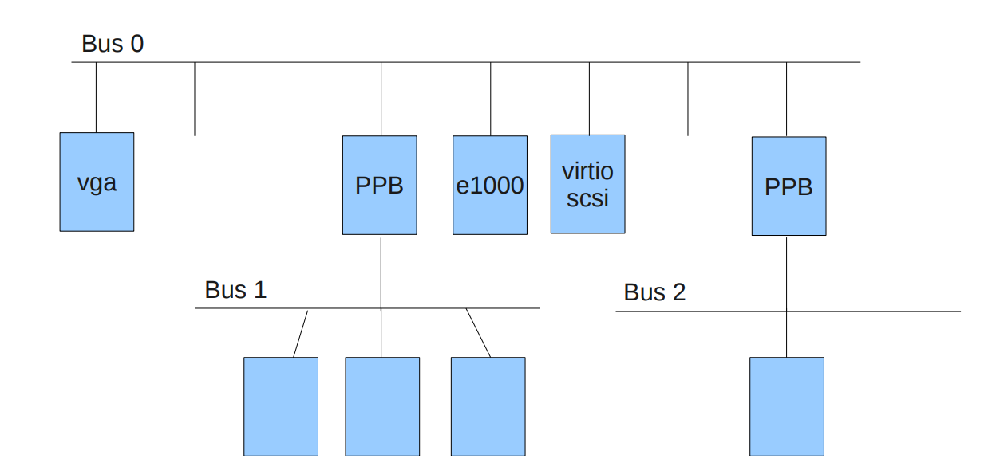
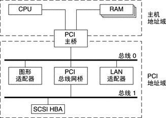
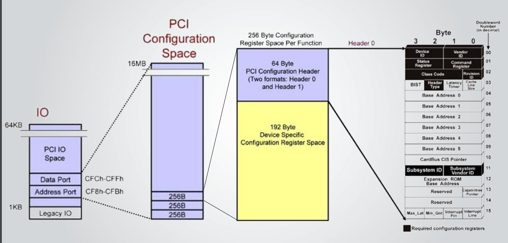
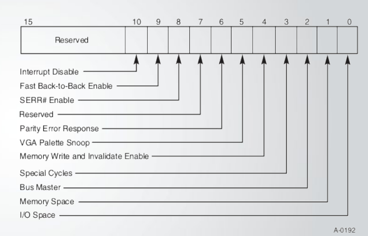
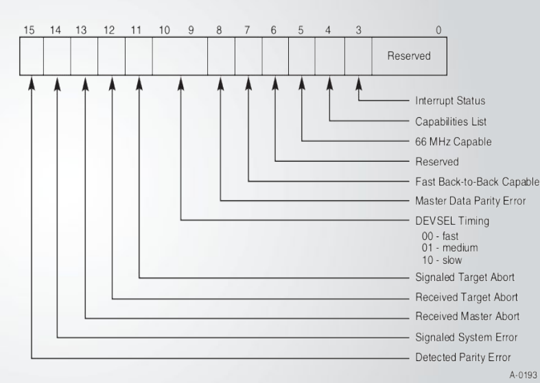
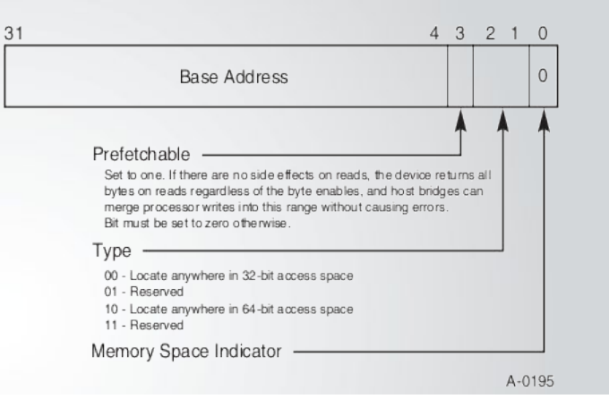
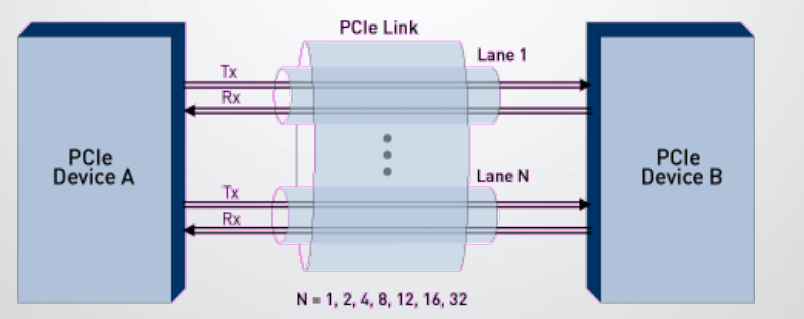
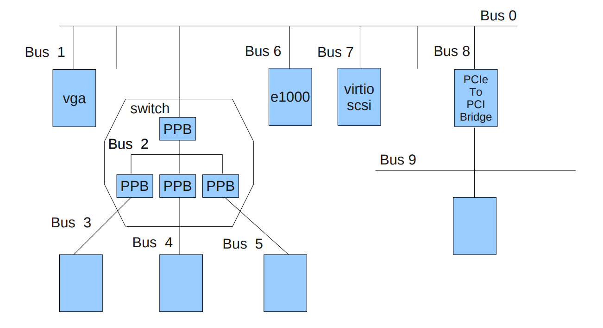
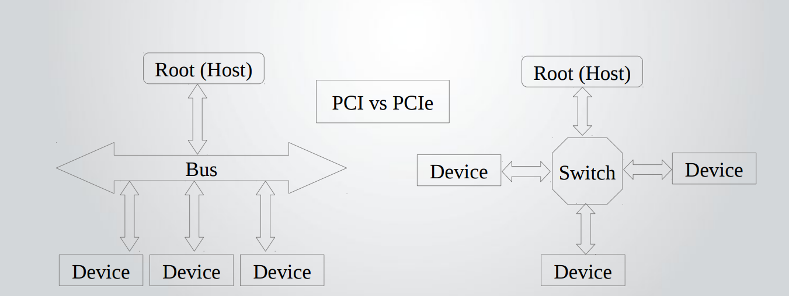
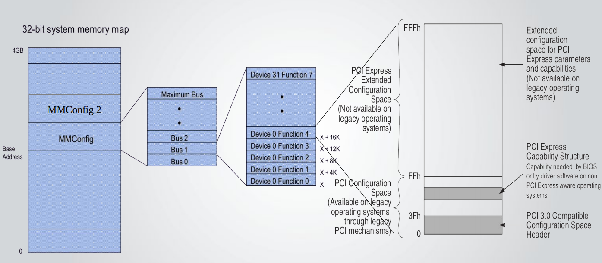

<!-- @import "[TOC]" {cmd="toc" depthFrom=1 depthTo=6 orderedList=false} -->

<!-- code_chunk_output -->

- [1. PCI(Peripheral Component Interconnect)](#1-pciperipheral-component-interconnect)
  - [1.1. 配置空间(configuration space)](#11-配置空间configuration-space)
  - [1.2. PCI 中断机制](#12-pci-中断机制)
- [2. PCIe(Peripheral Component Interconnect Express)](#2-pcieperipheral-component-interconnect-express)
  - [2.1. 配置空间](#21-配置空间)
  - [2.2. PCIe 中断机制](#22-pcie-中断机制)
- [3. reference](#3-reference)

<!-- /code_chunk_output -->

# 1. PCI(Peripheral Component Interconnect)

**PCI**(`Peripheral Component Interconnect`), 顾名思义就是**外部设备的互联总线**.

PCI 连接基于**总线控制**, **所有设备共享双向并行总线**, **总线仲裁规则**用于决定 PCI 挂载的外设什么时间可以访问总线. PCI 总线最多支持 32 个外设, 可以通过 `PCI-to-PCI bridge`(**PPB**)扩展 PCI 外设支持, 如图1, Bus1/Bus2 都是由 Bus0 通过 PPB 扩展的 PCI 总线.

PCI 设备与 CPU 和内存通过**主桥**(`host bridge`)进行通信, 如图 PCI 体系结构, 这种体系结构分隔了 **I/O 总线**与处理器的**主机总线**.

PCI 主桥(host bridge) 提供了 CPU, 内存和外围组件之间的互连, CPU 可以通过 PCI 主桥 (host bridge)直接访问独立于其他 PCI 总线主控器的主内存, PCI 设备也可以通过该主桥直接访问系统内存.

PCI 主桥(host bridge) 还可提供 CPU 和外围 I/O 设备之间的数据地址映射. 该桥会将每个外围设备映射到主机地址域, 以便处理器可以通过地址域访问此设备. 主桥(host bridge)也会将系统内存映射到 PCI 地址域, 以便 PCI设 备可以作为总线主控器访问主机内存.

X86 架构采用了独立的地址空间, x86 使用 16 位地址总线(也就是 64K i/o地址空间)对 io 设备进行寻址, 这个地址也称为 i/o 端口. 在 Linux 操作系统中, 可以通过 `/proc/ioports` 查看 系统的 io 端口. PCI 包含三种不同的地址空间: 配置、内存以及 I/O 空间. 通过 `/proc/ioports` 可以看到 `0cf8-0cff` : PCI conf1 为 PCI 设备的 io 端口. 这 8 个字节实际上构成两个 32 位的寄存器, 第一个是 "地址寄存器" 0cf8, 第二个是 "数据寄存器" 0cff, CPU 与 PCI 之间交互就是地址寄存器用于配置和控制外设, 数据寄存器用于数据传输.

## 1.1. 配置空间(configuration space)

PCI配置空间为256B, 是由PCI spec定义的, 如图所示, 配置空间对pci device是必须的.

PCI头64B是固定的PCI configuration header由两种类型header Type 0代表是PCI设备, Type 1表明是PCI桥.

**Device ID 和 Vendor ID**设备信息和厂商信息

**Command寄存器**, 存放了设备的配置信息, 比如是否允许 Memory/IO 方式的总线操作、是否为主设备等.

**Status 寄存器**存放了设备的状态信息, 比如中断状态、错误状态等.

**Header Type 寄存器**定义了设备类型, 比如 PCI 设备、PCI 桥.

**基址寄存器(BAR)**PCI设备的io地址空间和内存空间的基址, 是可选的, 当pci device需要配置时进行配置. 基址寄存器的位 0 包含的值用于标识类型. 位 0 中的值为 0 表示内存空间, 值为 1 表示 I/O 空间.

下图显示了两种基址寄存器: 一种表示内存类型, 另一种表示 I/O 类型. PCI 设备最多有6个基址寄存器,

而 PCI 桥最多有2个基址寄存器.

**Subordinate Bus Number, Secondary Bus Number 和 Primary Bus Number 寄存器**

这三个寄存器只在 PCI 桥配置空间中存在, 因为 PCI 桥会连接两条 PCI 总线, 上行的总线被称为 Primary Bus,
下行的总线被称为 Secondary Bus, Primary Bus Number 和 Secondary Bus Number 寄存器分别存储了上行和下行总线的编号, 而 Subordinate Bus Number 寄存器则是存储了当前桥所能直接或者间接访问到的总线的最大编号.

**Capabilities Pointer**

开启Capbility支持需要在status register中, 对应的bit设置为1. PCI设备capabilities是链表模式的.

那么何谓Capabilities呢? 它是PCI 2.2新加入的一个特性, 之所以加入是因为当初规定所有PCI SPEC相关的配置寄存器都要放在PCI header内, 到PCI2.2以后发现新加入的register在Configuration Header Space中放不下了, 所以引入了Capabilities List.

* PCI 内存地址空间(MMIO space)

对于不采用独立编址的系统架构, 对于I/O设备的访问是通过内存映射的方式进行, MMIO space类似于 X86系统的I/O port.

* PCI I/O 地址空间(IO space)

PCI支持32位 I/O 空间. 可以在不同的平台上以不同方式访问 I/O 空间. 带有特殊 I/O 指令的处理器, 如Intel处理器系列 使用in和out指令访问I/O 空间. 没有特殊I/O 指令的计算机将映射到对应于主机地址域中 PCI 主桥 (host bridge) 的地址位置. 处理器访问内存映射的地址时, 会向PCI主桥 (host bridge) 发送一个 I/O 请求, 该主桥 (host bridge) 随后会将地址转换为 I/O 周期并将其放置在 PCI 总线上. 内存映射的I/O通过处理器的本机装入/存储指令执行.

## 1.2. PCI 中断机制

在PCI协议中规定, 每个设备支持对多四个中断信号, INTA, INTB, INTC, INTD. 中断是电平触发的, 当信号线为低电平, 这引发中断. 一旦产生中断, 则该信号线则一直保持低电平, 直到驱动程序清除这个中断请求. 这些信号线可以连接在一起. 在设备的配置空间里(Configuration Space)有一组寄存器(Interrupt Pin)表明一个功能(Function)使用哪个中断信号.

所有的中断信号都与系统的可编程中断路由器(Programmable Interrupt Router)相连, 这个路由器有四个中断输入接口. 设备与这个路由器的中断输入接口怎么相连是系统的设计者在设计系统的时候就已经决定了, 用户是不能改变的.

# 2. PCIe(Peripheral Component Interconnect Express)

PCI Express (Peripheral Component Interconnect Express) 很明显就是高速的外部设备互联. PCIe 相对于 PCI 共享总线模式, 采用的是 Point-to-Point 总线拓扑, PCIe 中每个 device 都有自己的专属总线称为 link, lane 是一对差分信号组成, 分别负责收发数据(Rx/Tx), 也称作 x1通道. device 之间的通路称为 link, 是由一组 lane 组成的单双工通道, n 组 lane 组成的 link 提高了传输带宽. 通常看到的, PCIe x4 等类似的, 表明了通道数量为 4.

Root Complex 链接 CPU memory 和 PCIe 设备. 最多支持 256 bus, 每个 bus 最多支持 32 个PCIe设备, 每个设备最多 8 个 functions, 每个 function 对应 4KB 配置空间. PCIe 从硬件层面看与 PCI 由很大不同, 如图所示.

## 2.1. 配置空间

从软件层面看, PCIe配置空间从258B增加到了4KB, 为了保证与PCI协议的兼容性, PCIe即支持io port访问, 也支持mmio访问, 但是超过256B的配置空间访问则只能通过MMIO的方式.

**PCIe Extended Capabilities**

与 PCI 的 capabilities 类似采用链表结构, 只是起始的为100H

* **PCIe ARI Extended Capabilities**

PCIe链路采用端到端的通信方式, 每一个链路只能挂接一个设备, 因此在多数情况下, 使用3位描述Device Number是多余的, 因此PCIe V2.1总线规范提出了ARI (Alternative Routing-ID Interpretation)格式, ARI格式将ID号分为两个字段, 分别为Bus号和Function号, 而不使用Device号, ARI格式如图所示.

|---|---|
|7: 0|7: 0|
|---|---|
|Bus No. | Function No. |
|---|---|

PCIe总线引入ARI格式的依据是在一个PCIe链路上仅可能存在一个PCIe设备, 因而其Device号一定为0.

一个PCIe设备最多可以支持**256**个Function, 而传统的PCIe设备最多只能支持8个Function.

* **SR-IOV Extended Capability**

SR-IOV(single root I/O virtualization)

PCI-SIG定义的PCIe设备的I/O虚拟化标准, 主要目标就是将单个的PCIe设备可以虚拟化为多个, 包含两个概念PF & VF

- PF (Physical Function): 包含完整的PCIe功能, 包括SR-IOV的扩张能力, 该功能用于SR-IOV的配置和管理.
- VF (Virtual Function): 包含轻量级的PCIe功能. 每一个VF有它自己独享的PCI配置区域, 并且可能与其他VF共享着同一个物理资源

* **其他的capabilities**

- Function Level Reset (FLR)
- Advanced Error Reporting (AER)
- Access Control Services (ACS)
- etc...

## 2.2. PCIe 中断机制

在 PCI 总线中, 所有需要提交中断请求的设备, 必须能够通过 INTx 引脚提交中断请求, 而 MSI 机制是一个可选机制. 而在 PCIe 总线中, PCIe 设备必须支持MSI或者MSI-X中断请求机制, 而可以不支持 INTx 中断消息. PCIe 设备在提交 MSI 中断请求时, 是向 MSI/MSI-X Capability 结构中的 Message Address 的地址写 Message Data 数据, 从而组成一个存储器写 TLP, 向处理器提交中断请求.

MSI 和 MSI-X 机制的基本原理相同, 其中 MSI 中断机制最多只能支持32个中断请求, 而且要求中断向量连续, 而 MSI-X 中断机制可以支持更多的中断请求, 而并不要求中断向量连续. 与 MSI 中断机制相比, MSI-X 中断机制更为合理.

# 3. reference

浅谈 Linux 内核开发之 PCI 设备驱动: https://www.ibm.com/developerworks/cn/linux/l-cn-pci/index.html

PCI 设备地址空间: https://www.cnblogs.com/zszmhd/archive/2012/05/08/2490105.html

详解 io 端口与 io 内存: http://mcu.eetrend.com/content/2018/100012210.html

PCI Express® Basics &Background: https://pcisig.com/sites/default/files/files/PCI_Express_Basics_Background.pdf

sr-iov: https://github.com/feiskyer/sdn-handbook/blob/master/linux/sr-iov.md

Linux 设备驱动之 PCI 设备: http://www.deansys.com/doc/ldd3/ch12.html

PCI vs. PCIe: PCIvsPCIe.pdf

PCI/PCIE 总线概述(5) — PCIE 总线事务层: https://example61560.wordpress.com/2016/06/30/pcipcie-%e6%80%bb%e7%ba%bf%e6%a6%82%e8%bf%b05/

知乎 PCIe 专栏: https://zhuanlan.zhihu.com/PCI-Express

MSI 和 MSI-X 中断机制: https://example61560.wordpress.com/2016/06/30/pcipcie-%E6%80%BB%E7%BA%BF%E6%A6%82%E8%BF%B06/

Linux 中断机制: 硬件处理, 初始化和中断处理: http://www.10tiao.com/html/606/201808/2664605565/1.html