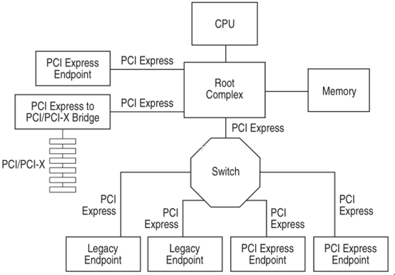
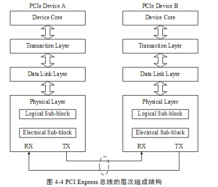
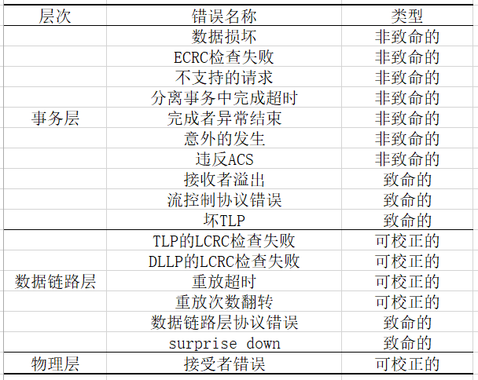
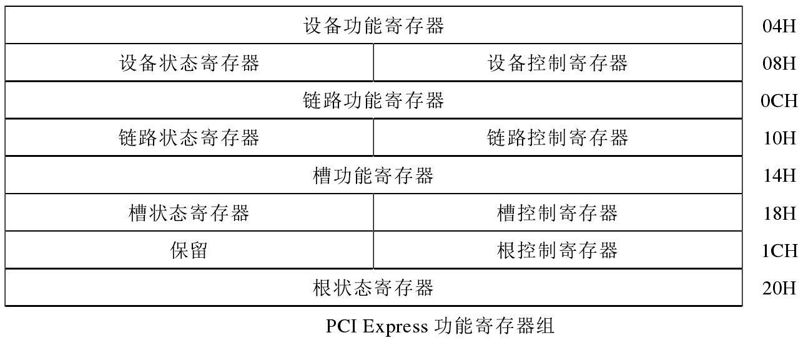
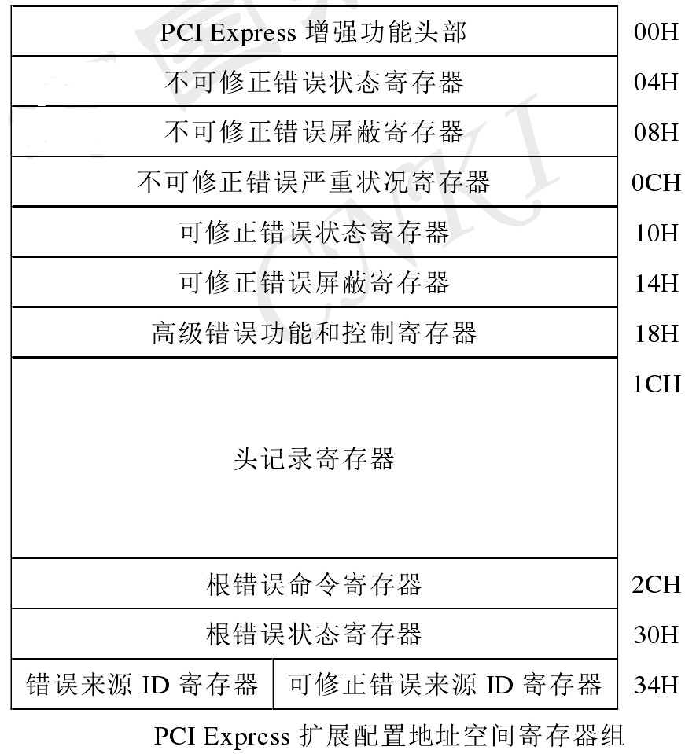
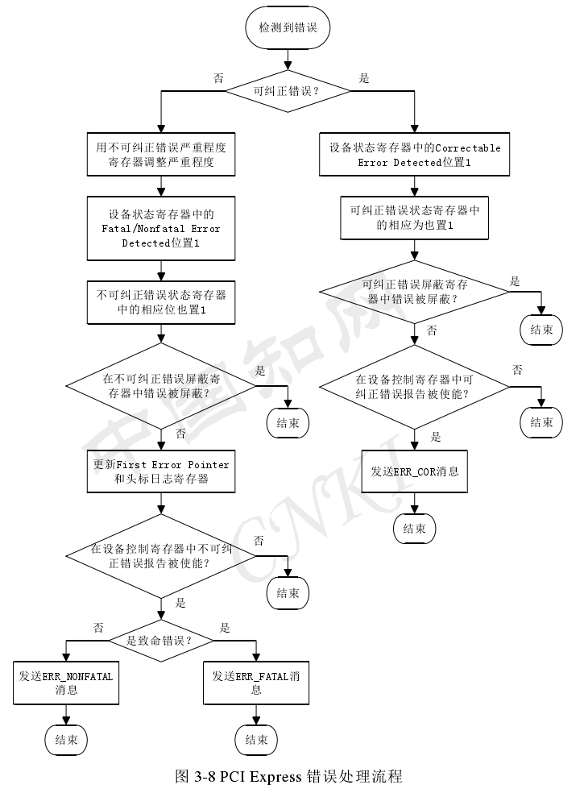

<!-- @import "[TOC]" {cmd="toc" depthFrom=1 depthTo=6 orderedList=false} -->

<!-- code_chunk_output -->

- [1. PCIe 总线的架构](#1-pcie-总线的架构)
- [2. PCie 总线的分层结构](#2-pcie-总线的分层结构)
  - [2.1 事务层](#21-事务层)
  - [2.2 数据链路层](#22-数据链路层)
  - [2.3 物理层](#23-物理层)
- [3. 错误报告机制](#3-错误报告机制)
  - [3.1 PCI 的错误报告机制](#31-pci-的错误报告机制)
  - [3.2 PCIe 的错误报告机制](#32-pcie-的错误报告机制)
    - [3.2.1 错误类型](#321-错误类型)
    - [3.2.2 错误报告机制](#322-错误报告机制)
      - [3.2.2.1 基本错误报告机制](#3221-基本错误报告机制)
      - [3.2.2.2 高级错误报告机制 (AER)](#3222-高级错误报告机制-aer)
- [4. 内核中实现 AER](#4-内核中实现-aer)
  - [4.1 AER 驱动研究](#41-aer-驱动研究)
  - [4.2 PCIe 端口服务程序](#42-pcie-端口服务程序)
  - [4.3 注册 IRQ 处理程序](#43-注册-irq-处理程序)
  - [4.4 创建 worker](#44-创建-worker)
  - [4.5 关闭 SERR# 报告功能](#45-关闭-serr-报告功能)
  - [4.6 检查并获取错误设备及其状态](#46-检查并获取错误设备及其状态)
  - [4.7 设备恢复处理](#47-设备恢复处理)

<!-- /code_chunk_output -->

PCI Express 是一项由英特尔提出、由 PCI-SIG 负责制定的一项高带宽的总线规范旨在代替 PCI、PCI-X 等第二代 I/O 总线.

## 1. PCIe 总线的架构

PCIe 总线的基本结构包括根组件(`Root Complex`)、交换器(Switch)和各种终端设备(Endpoint). 根组件可以集成在北桥芯片中用于处理器和内存子系统与 I/O 设备之间的连接而交换器的功能通常是以软件形式提供的它包括两个或更多的逻辑 PCI 到 PCI 的连接桥(PCI-PCI Bridge)以保持与现有 PCI 兼容. 下图即为 PCie 总线的拓扑结构图. 目前几乎除了与内存的连接之外其他的连接都是使用 PCie 总线的.



## 2. PCie 总线的分层结构

PCIe 总线的层次组成结构与网络中的层次结构有类似之处但是 PCIe 总线的各个层次都是使用硬件逻辑实现的. 在 PCIe 体系结构中数据报文首先在设备的核心层(Device Core)中产生然后再经过该设备的事务层(Transaction Layer)、数据链路层(Data Link Layer)和物理层(Physical Layer)最终发送出去. 而接收端的数据也需要通过物理层、数据链路和事务层并最终到达 Device Core.



### 2.1 事务层

事务层定义了 PCIe 总线使用总线事务其中多数总线事务与 PCI 总线兼容. 这些总线事务可以通过 Switch 等设备传送到其他 PCIe 设备或者 RC. RC 也可以使用这些总线事务访问 PCIe 设备.

事务层接收来自 PCIe 设备核心层的数据并将其封装为 TLP(Transaction Layer Packet)后发向数据链路层. 此外事务层还可以从数据链路层中接收数据报文然后转发至 PCIe 设备的核心层.

事务层的一个重要工作是处理 PCIe 总线的"序". 在 PCIe 总线中"序"的概念非常重要也较难理解. 在 PCIe 总线中事务层传递报文时可以乱序这为 PCIe 设备的设计制造了不小的麻烦. 事务层还使用流量控制机制保证 PCIe 链路的使用效率. 有关事务层的详细说明见第 6 章.

### 2.2 数据链路层

数据链路层保证来自发送端事务层的报文可以可靠、完整地发送到接收端的数据链路层. 来自事务层的报文在通过数据链路层时将被添加 Sequence Number 前缀和 CRC 后缀. 数据链路层使用 ACK/NAK 协议保证报文的可靠传递.

PCIe 总线的数据链路层还定义了多种 DLLP(Data Link Layer Packet)DLLP 产生于数据链路层终止于数据链路层. 值得注意的是 TLP 与 DLLP 并不相同 DLLP 并不是由 TLP 加上 Sequence Number 前缀和 CRC 后缀组成的.

### 2.3 物理层

物理层是 PCIe 总线的最底层将 PCIe 设备连接在一起. PCIe 总线的物理电气特性决定了 PCIe 链路只能使用端到端的连接方式. PCIe 总线的物理层为 PCIe 设备间的数据通信提供传送介质为数据传送提供可靠的物理环境.

物理层是 PCIe 体系结构最重要也是最难以实现的组成部分. PCIe 总线的物理层定义了 LTSSM(Link Training and Status State Machine)状态机 PCIe 链路使用该状态机管理链路状态并进行链路训练、链路恢复和电源管理.

PCIe 总线的物理层还定义了一些专门的"序列"有些将物理层这些"序列"称为 PLP(Phsical Layer Packer)这些序列用于同步 PCIe 链路并进行链路管理. 值得注意的是 PCIe 设备发送 PLP 与发送 TLP 的过程有所不同.

## 3. 错误报告机制

### 3.1 PCI 的错误报告机制

PCI 总线是一条共享总线在一条 PCI 总线上可以挂接多个 PCI 设备. PCI 设备是通过一系列信号与 PCI 总线相连. PCI 总线在进行数据传递过程时难免会出现各种各样的错误因此 PCI 总线提供了一些错误信号如 PERR#和 SERR#信号. 其中当 PERR#信号有效时表示数据传送过程中出现奇偶校验错(Special Cycle 周期除外); 而当 SERR#信号有效时表示当前处理器系统出现了三种错误可能分别为地址奇偶校验错在 Special Cycle 周期中出现数据奇偶校验错或者系统出现其他严重错误.

### 3.2 PCIe 的错误报告机制

PCI  Express 总线通信是通过数据包传输的当 PCI  Express 总线出现任何故障其中大部分通常都会在数据包的发送、接收和处理过程中表现出来. 所有错误也都是通过消息传递的.

#### 3.2.1 错误类型

PCI Express 组件需要报告和记录两种错误一种是设备相关的错误一种是设备不相关的错误.

设备相关的错误是指发生在 PCI Express 组件内部但与 PCI Express 组件上进行的事务无关的错误这类错误通常是由 PCI Express 设备厂商设计的因此称为设备相关错误. 这种错误的最好处理办法是由 PCI Express 组件采用设备相关的中断进行报告.

设备不相关的错误是指发生在 PCI  Express 总线接口上的错误或者在 PCI Express 总线上创建的事务行为所发生的错误. 这种错误由 PCI  Express 规范定义的错误报告机制进行报告和记录.

这些错误分为**可校正的错误**和**不可校正的错误**. 可校正错误是指硬件可以自动校正而不需要软件干预否则就是不可校正. 可校正的错误会影响性能(延迟和带宽)但不会导致信息丢失. 例如一个 TLP 的 LCRC 发生错误可以由数据链路层的重发得到恢复这种就是可校正错误. 事务层发生的错误也可能是可校正错误当 PCIe 事务的发起者(或完成者)在一个 TLP 中检测到了错误但该事务的另一端即事务的完成者(或发起者)负责在需要的时候采取恢复措施例如另外发起一个事务进行重试. 可以通过配置检测到错误的一方将该错误作为可修正错误进行报告因为该错误可以由事务的的发起者(或完成者)进行恢复.

**不可校正错误**又细分为**致命错误**和**非致命错误**. 致命错误会导致相关的 PCI Express 链接和相关硬件不可靠. 一般系统需要对相关硬件重新设置. 非致命错误不会导致 PCI Express 链接不可靠(不影响 PCIe 结构完整性)但会导致相关事务出错. 通常意味着一个事务已经损坏而 PCIe 结构却不能修正该错误. 但 PCIe 结构的功能仍然正常并对其他事务没有影响. 一般系统不需要对相关硬件重设.



#### 3.2.2 错误报告机制

PCIe 定义了两种错误报告功能基本错误报告功能和高级错误报告(Advanced Error ReportingAER)功能.

##### 3.2.2.1 基本错误报告机制

基本错误报告机制是 PCI Express 系统在报告 PCI Express 错误方面必须提供的支持该机制定义了对 PCI Express 设备的最小错误报告要求. 基本错误报告机制包括两方面的内容一个是 PCI 兼容的错误报告机制为不了解 PCI Express 操作环境的用户和软件提供错误报告的支持; 另一个是 PCI Express 错误报告机制可用于通晓 PCI Express 操作环境的用户和软件.

PCI 兼容的错误报告机制以 PCI 兼容配置空间为基础在 PCI 兼容配置空间头标区中有两个原 PCI 设备用来进行错误报告的寄存器: 设备控制寄存器和设备状态寄存器. 此处的 PCI 兼容的错误报告机制就是利用这两个寄存器来报告 PCI Express 系统中的错误以实现与现有的 PCI 软件兼容. 为此每个 PCI Express 设备都必须利用这两个寄存器中的错误状态位来反映 PCI Express 的错误利用其中的错误使能位来支持 PCI Express 的错误报告功能. 也就是说尽管用的是 PCI 寄存器的状态寄存器和控制寄存器但其中的位定义已经赋予新的意义反映的是与 PCI Express 相关的错误条件和报告机制. 被这两个 PCI 兼容寄存器跟踪的 PCI Express 错误如下:

1)  事务中毒/错误消息递送(可选的).

2)  由完成者检测的完成者夭折.

3)  由完成者检测的不可识别请求.

PCI  Express 错误报告使用下图中所示的**PCI  Express 功能寄存器组**中有关寄存器及有关字段它的错误分辨能力比 PCI 兼容的错误报告机制更细一些这些寄存器提供如下支持.

1)  使能/禁止对错误的报告(即是否产生错误消息).

2)  提供错误状态.

3)  提供表达链路训练错误的状态.



对于计算机平台、芯片如何通知到内核软件基本错误报告机制并未明确规定.

##### 3.2.2.2 高级错误报告机制 (AER)

高级错误报告机制(AER)为了支持更健壮的错误报告而定义的错误报告机制该功能**基于一个特殊的 PCI Express 功能结构而实现**通过该功能结构可以对 PCI Express 总线错误的报告和记录进行细致的控制.

高级错误报告机制依赖于**映射到扩展配置地址空间中的寄存器**扩展配置地址空间中的寄存器名称及分布如图所示.



其中两个**状态寄存器**的作用是分别记录检测到的可修正和不可修正错误通过修改其中的位即可**模拟 PCI Express 设备检测到相应的错误**; 两个屏蔽寄存器的作用是控制是否**使用 PCI Express 错误消息向根联合体报告相应的错误(仍可对状态寄存器相应状态进行设置)**; 不可修正错误严重状态寄存器的作用是决定是通过非致命错误消息还是致命错误消息将不可修正错误报告给根联合体; 高级错误功能和控制寄存器用来控制是否使能 ECRC 的产生或检测; 头记录寄存器会记录检测到错误的那个 TLP 的头部的 16 个字节; 根错误命令寄存器用来决定是否报告可修正错误、非致命错误和致命错误; 根错误状态寄存器用来记录是否收到错误报告.

当物理层、数据链路层或事务层中的任意层检测到错误该错误将以下图所示的错误处理流程进行处理通过**修改状态寄存器**并通过**错误屏蔽寄存器**自由地为个别错误启用错误报告可以模拟检测到 PCI Express 总线错误.



AER 一个重要功能是**提供利用中断向软件报告的机制**. 根端口设备可以提供根错误命令和状态寄存器内核可以对其进行设置和查看. 所有 PCI Express 设备都通过一定的路径链接到相应的根端口. 当一个 PCI Express 发生错误时会向上游的根端口发送错误报告消息根端口收到后设置相应的根错误状态寄存器标志位把出错设备的设备号记录在错误源标识寄存器然后向 CPU 发送中断以便内核实时处理错误.

当错误发生 AER 根端口设备可以发送中断通知内核所以内核应提供驱动程序响应中断处理出错的设备.

## 4. 内核中实现 AER

### 4.1 AER 驱动研究

PCI Express AER 驱动是绑定在 PCI Express 端口总线驱动上的根设备端口服务驱动.

提供相应机制使内核和应用程序判断所发生的的错误是否为致命错误协调并**通知所有相关设备的驱动程序**执行动态错误恢复操作保证系统正常运行.

PCI Express AER 驱动提供了支持 PCI Express 高级错误报告功能的基础设施. PCI Express AER 驱动提供了三个基本的功能:

- 错误发生后广泛收集错误信息
- 向用户报告错误
- 执行错误恢复

AER 驱动只工作在支持 PCI Express 高级错误报告功能的 PCI Express 根端口上.

Linux 中 AER 驱动的抽象为结构体 struct pcie\_port\_service\_driver aerdriver. 定义如下:

```cpp
//drivers/pci/pcie/aer/aerdrv.c
static struct pcie_port_service_driver aerdriver = {
    .name       = "aer",
    .port_type  = PCI_EXP_TYPE_ROOT_PORT,
    .service    = PCIE_PORT_SERVICE_AER,

    .probe      = aer_probe,
    .remove     = aer_remove,

    .err_handler    = &aer_error_handlers,

    .reset_link = aer_root_reset,
};
```

当 PCIe 总线加载 AER 服务驱动时执行函数 aer\_probe; 卸载 AER 服务驱动时执行成员函数 aer\_remove; aer\_error\_handlers 是一个结构体在执行错误恢复的过程中使用; 在需要重置链路时执行 aer\_root\_reset.

aer\_probe 主要初始化资源. 包括初始化设备分配数据结构申请中断号清楚 PCIe 功能数据结构中设备状态禁用对错误消息产生系统错误清除错误状态启用 PCIe 根端口设备和下游端口设备的错误报告启用根端口对错误消息的中断响应.

aer\_error\_handlers 结构体中有两个函数与错误恢复相关这两个函数分别是 aer\_error\_detected 和 aer\_error\_resume. 在检测到错误后执行错误恢复的过程中执行函数 aer\_error\_detected 在恢复非致命的不可纠正错误的过程中执行 aer\_error\_resume 它清除 PCI Express 根设备的设备状态清除 AER 根错误状态.

aer\_root\_reset 函数的功能是在 PCI Express 设备根端口执行链路重置它先禁用对错误消息的中断响应然后清除错误状态最后再启用对错误消息的中断响应.

当截获一个 PCI Express AER 错误 AER 驱动会向控制台输出一条错误消息. 如果这个错误是可纠正错误则输出为一个警告. 如果这个错误是不可纠正错误则输出一个错误. 这样用户可以通过选择不同的日志级别来过滤掉可纠正错误的消息.

下面是一条 PCI Express AER 错误消息:

```
0000:50:00.0:  PCIe  Bus Error:  severity=Uncorrected  (Fatal),  type=Transaction
Layer, id=0500(Requester ID)
0000:50:00.0:    device [8086:0329] error status/mask=00100000/00000000
0000:50:00.0:     [20] Unsupported Request     (First)
0000:50:00.0:    TLP Header: 04000001 00200a03 05010000 00050100
```

在这个错误消息中"Requester ID"指的是向根端口发送错误消息的那个设备的标志符.

### 4.2 PCIe 端口服务程序

内核提供端口服务程序. 当系统启动时如果一个 PCIe 根端口设备支持 AER 内核会创建相应的 PCI Express 虚拟设备. aerdriver 就是 AER 根端口服务程序会自动绑定所有的 PCIe AER 虚拟设备.

### 4.3 注册 IRQ 处理程序

系统会给根端口配置一个(或通过 MSI 提供多个)中断号. aerdriver 提供的 probe 函数会在内核申请注册 IRQ 处理函数. 每当根端口收到其来自下游的 PCIe 设备的错误报告时都会向 CPU 发送中断内核就会调用 AER IRQ 处理函数.

### 4.4 创建 worker

worker 是内核提供的一种中断处理机制以便在进程上下文中处理中断. aerdriver 为每个 AER 虚拟设备注册一个 worker. 当 AER 中断到达相应的 worker 就会被调度执行. 因为 aerdriver 进行错误恢复时有可能睡眠所以必须借助 worker 到进程上下文中处理中断

### 4.5 关闭 SERR# 报告功能

SERR#是为了与 PCI 的错误处理机制兼容并与 AER 并行. 若打开了 AER 就应关闭 SERR#. 根端口的根控制寄存器的起始三位控制这一功能直接清零即可.

### 4.6 检查并获取错误设备及其状态

根端口的错误源标识寄存器记录最初报告错误设备的设备号及错误的类型. aerdriver 根据错误设备号找到该设备. 如果是可校正错误 aerdriver 只是简单清理掉出错设备的可校正错误状态配置寄存器寄存器相应的错误标识位并打印输出错误信息.

### 4.7 设备恢复处理

如果是设备报告不可校正错误需要做设备恢复处理. 如果报错设备是桥接设备(BRIDGE)恢复操作涉及所有链接在 BRIDGE 之下的设备. 比如如果报错设备是一个 Switch 的 upstream 端口则所有的链接在该 Switch 上的设备都要做恢复处理. 如果报错设备是终点设备(Endpoint)恢复操作仅涉及其自身.

恢复处理过程需要相关的各个设备驱动程序参与. 在实现上设备驱动程序需要提供错误回调函数. 具体定义如下:

