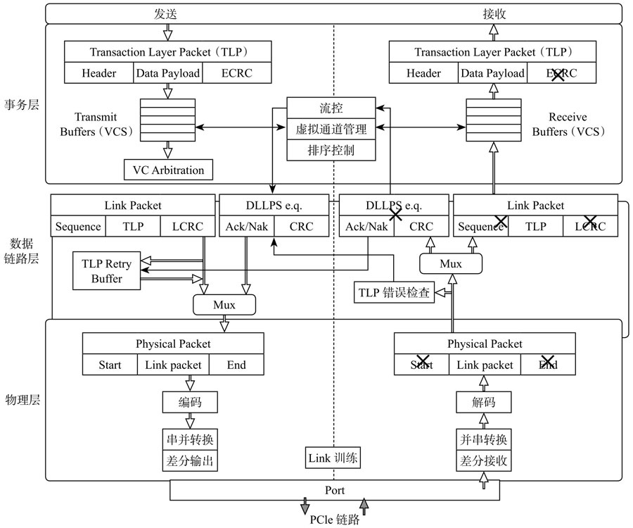

<!-- @import "[TOC]" {cmd="toc" depthFrom=1 depthTo=6 orderedList=false} -->

<!-- code_chunk_output -->

- [1. PCIe 的三层结构](#1-pcie-的三层结构)
- [2. 各层细节](#2-各层细节)
- [3. 发送方打包 TLP 过程](#3-发送方打包-tlp-过程)
- [4. 接收方解包 TLP 过程](#4-接收方解包-tlp-过程)
- [5. 对 PCIe 层次的实现](#5-对-pcie-层次的实现)
- [6. RC 与 EP 通信](#6-rc-与-ep-通信)

<!-- /code_chunk_output -->

绝大多数的总线或者接口, 都是采用分层实现的.

# 1. PCIe 的三层结构

PCIe 定义了三层: 

PCIe 分层结构:

# 2. 各层细节

PCIe 传输的数据从上到下, 都是以**数据包**(`Packet`)的形式传输的, 每层数据包都是有其**固定的格式**.

**事务层**的主要职责是创建(**发送**)或者解析(**接收**) **TLP**(`Transaction Layer Packet`)、**流量控制**、**QoS**、**事务排序**等.

**数据链路层**的主要职责是创建(**发送**)或者解析(**接收**) **DLLP**(`Data Link Layer Packet`)、**Ack/Nak 协议**(链路层检错和纠错)、流控、电源管理等.

**物理层**的主要职责是处理所有的 **Packet 数据物理传输**, **发送端**数据**分发到各个 Lane 传输**(`Stripe`), **接收端**把**各个 Lane 上的数据汇总**起来(`De-stripe`), 每个 Lane 上**加扰**(`Scramble`, 目的是让 0 和 1 分布均匀, 去除信道的电磁干扰 EMI)和**去扰**(`De-scramble`), 以及 `8/10` 或者 `128/130` 编码解码等.

PCIe 各层次细节图:

# 3. 发送方打包 TLP 过程

数据从上到下, 一层层打包, **上层打包完的数据**, 作为**下层**的**原始数据**, 再打包. 就像人穿衣服一样, 穿了内衣穿衬衫, 穿了衬衫穿外套.

**Data** 是**事务层上层**(诸如**命令层**、**NVMe 层**)给的**数据**.

**事务层**给 Data **头上**加个 **Header**, 然后**尾巴**上再加个 **CRC** 校验, 就构成了一个 **TLP**.

这个 TLP 下传到**数据链路层**, 又被数据链路层在**头上**加了个**包序列号**(`Sequence Number`, SN), **尾巴**上再加个 **CRC** 校验, 然后下传到物理层.

**物理层**为其**头上**加个 **Start**, **尾巴**上加个 **End** 符号, 把这些数据**分派到各个 Lane 上**, 然后在每个 Lane 上加**扰码**, 经 `8/10` 或 `128/130` 编码, 最后通过物理传输介质传输给接收方, 如图 5-13 所示.

发送方打包 TLP 过程:

# 4. 接收方解包 TLP 过程

接收方**物理层**是最先接收到这些数据的, **掐头**(`Start`)**去尾**(`End`), 然后交由上层.

在**数据链路层**, **校验序列号**和 **LCRC**, 如果没问题, 剥掉序列号和 LCRC, 往事务层走; 如果校验出差, 通知对方**重传**.

在**事务层**, **校验 ECRC**, 有错, 数据抛弃; 没错, 去掉 ECRC, 获得数据.

整个过程犹如脱衣睡觉, 外套脱了, 衬衫脱了, 内衣也脱了, 光溜溜钻进被窝, 如图 5-14 所示.

接收方解包 TLP 过程:

# 5. 对 PCIe 层次的实现

> 和 PCI 数据裸奔不同, PCIe 的数据是穿衣服的. PCIe 数据以 Packet 的形式传输, 比起 PCI 冷冰冰的数据, PCIe 的数据是鲜活有生命的.

**每个 Endpoint** 都需要实现这三层, **每个 Switch 的 Port** 也需要**实现这三层**.

> 所以一个端口算一个 lspci device? 一个 Switch 有多个 device(一个 port 算一个)?

**RC、Switch 和 EP 都要实现三层**:

# 6. RC 与 EP 通信

如上图所示, **如果 RC 要与 EP1 通信**, 中间要经历怎样的一个过程?

如果把前述的数据发送和接收过程叫作穿衣和脱衣, 那么, RC 与 EP1 数据传输过程中, 则存在好几次这样穿衣脱衣的过程:

RC 帮数据穿好衣服, 发送给 Switch 的上游端口 A, A 为了知道该笔数据**发送给谁**, 就需要**脱掉该数据的衣服**, **找到里面的地址信息**. 衣服脱光后, Switch 发现它是往 EP1 的, 又帮它**换了身新衣服**, 发送给端口 B.

B 又不嫌麻烦的脱掉它的衣服, 换上新衣服, 最后发送给 EP1, 如图所示.

RC 和 EP 通信:

**Switch** 的主要功能是**转发数据**, 为什么还需要**实现事务层**? Switch 必须实现这三层, 因为**数据的目的地信息是在 TLP 中**的, 如果不实现这一层, 就无法知道目的地址, 也就无法实现数据寻址路由.
