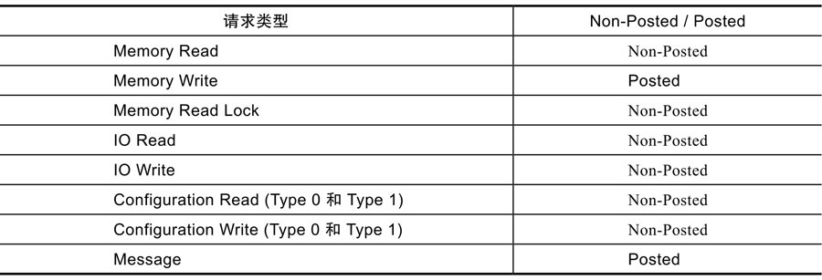
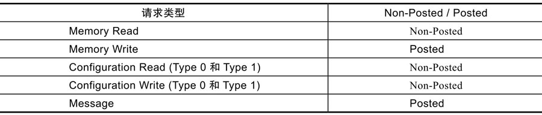
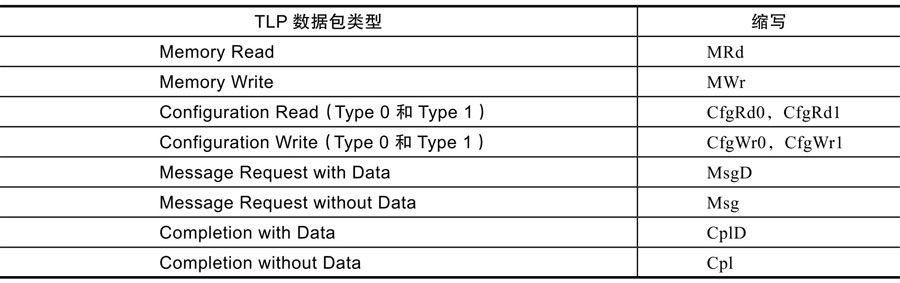
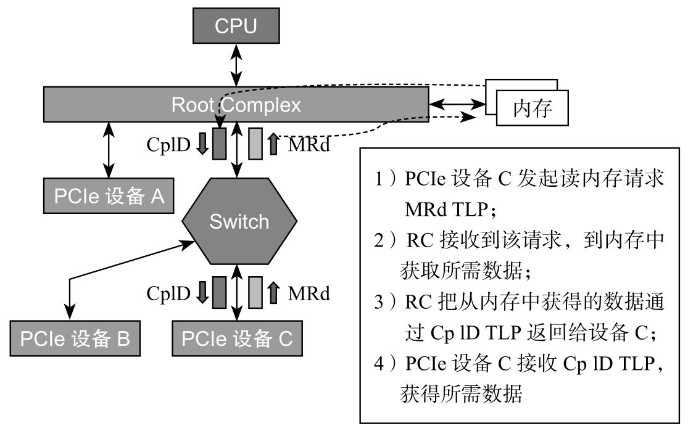
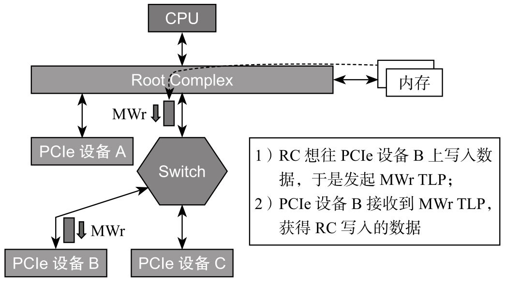

<!-- @import "[TOC]" {cmd="toc" depthFrom=1 depthTo=6 orderedList=false} -->

<!-- code_chunk_output -->

- [1. Packet](#1-packet)
- [2. Request (请求) TLP](#2-request-请求-tlp)
  - [2.1. Non-Posted 和 Posted Request](#21-non-posted-和-posted-request)
  - [2.2. Native PCIe Request](#22-native-pcie-request)
- [3. Completion (响应) TLP](#3-completion-响应-tlp)
- [4. TLP 类型总结](#4-tlp-类型总结)
- [5. TLP 例子](#5-tlp-例子)
  - [5.1. Memory Read](#51-memory-read)
  - [5.2. Memory Write](#52-memory-write)

<!-- /code_chunk_output -->

# 1. Packet

**主机与 PCIe 设备**之间, 或者 **PCIe 设备与设备之间**, 数据传输都是**以 Packet 形式**进行的.

**事务层**根据**上层**(**软件层**或者**应用层**)**请求**(Request)的**类型**、**目的地址**和**其他相关属性**, 把这些**请求打包**, 产生 **TLP**(Transaction Layer Packet, **事务层数据包**).

然后这些 TLP 往下, 经历**数据链路层**、**物理层**, 最终到达**目标设备**.

# 2. Request (请求) TLP

根据**软件层**的**不同请求**, **事务层**产生**四种不同的 TLP 请求**:

* Memory, 访问**内存空间**;

* IO, 访问 **IO 空间**;

* Configuration, 访问**配置空间**;

* Message.

前三种请求在 PCI 或者 PCI-X 时代就有了, 最后的 Message 请求是 **PCIe 新加的**.

在 PCI 或者 PCI-X 时代, 像**中断**、**错误**以及**电源管理相关信息**, 都是通过**边带信号**(`Sideband Signal`)进行传输的, 但 PCIe 干掉了这些边带信号线, 所有的通信都是走**带内信号**, 即**通过 Packet 传输**, 因此, 过去一些**由边带信号线传输的数据**, 比如中断信息、错误信息等, 现在就交由 **Message** 来传输了.

**一个设备的物理空间**, 可以通过**内存映射**(`Memory Map`)的方式映射到主机的主存空间, 有些空间还可以映射到主机的 **IO 空间**(如果主机存在 IO 空间的话). **新的 PCIe 设备只支持内存映射**.

* **Configuration**: **所有配置空间**(`Configuration`)的**访问**, 都是**主机发起**的, 确切地说是 **RC 发起**的, 往往 **只在上电枚举和配置阶段** 会发起 **配置空间的访问**;

* **Message**: 只有在有**中断**或者**有错误**等情况下, 才会有 Message TLP;

* **Memory**: **主机与设备** 或者 **设备与设备之间**, 数据都是**在彼此的 Memory 之间！！！交互**. 这是最常见的.

## 2.1. Non-Posted 和 Posted Request

这四种请求

* 如果**需要对方响应**的, 称为 **Non-Posted TLP**;

* 如果**不指望对方给响应**的, 称为 **Posted TLP**.

> Post, 有 "邮政" 的意思, 我们只管把信投到邮箱, 能不能到达对方, 就取决于邮递员了.

哪些 TLP 是 Posted, 哪些又是 Non-Posted 的呢?

* **Configuration** 和 **IO** 访问, 无论读写, 都是 **Non-Posted** 的, 这样的请求**必须得到设备的响应**;

* **Message TLP** 是 **Posted** 的;

* **Memory Read** 必须是 **Non-Posted** 的, 因为要**返回数据**(返回数据也是响应);

* **Memory Write** 是 **Posted** 的, 主机或者设备可以**不等对方回复**, 趁早把下一笔数据写下去, 这样一定程度上**提高了写的性能**.

> Memory Write, 如果**没有得到对方的响应**, **发送者**就**没有办法**知道数据**有没有成功写入**, 就有**丢数据**的风险.
>
> 虽然这个风险存在(概率很小), 但 **数据链路层** 提供了 **ACK/NAK 机制**, 能很大程度上减小了数据写失败的可能.

Request TLP 类型(一共 8 种):

> 所以, 只要记住**只有 Memory Write 和 Message** 两种 TLP 是 **Posted** 的就可以了, **其他**都是 **Non-Posted** 的.

## 2.2. Native PCIe Request

`Memory Read Lock` 是历史的遗留物, **Native PCIe** 设备已经抛弃了它, 它存在的意义完全是为了兼容 Legacy PCIe 设备. 和 IO 一样, 我们也可以忽略.

Configuration 有 `Type 0` 和 `Type 1`. 在之前的拓扑结构中, 除了 **Endpoint** 之外, 还有 **Switch**, 他们都是 **PCIe 设备**, 但配置种类不同, 因此用 Type 0 和 Type 1 区分, 如表 5-3 所示.

**Native PCIe** 的 Request TLP 类型(**共 5 种**):

> 忽略掉了 Memory Read Lock 和 IO

# 3. Completion (响应) TLP

对 **Non-Posted** 的 Request, 是**一定需要对方响应的**, 对方需要通过**返回**一个 **Completion TLP** 来作为响应.
* 对 **Read Request** 来说, 响应者通过 **Completion TLP** 返回请求者**所需的数据**, 这种 Completion TLP **包含有效数据**;
* 对 **Write Request**(如上图, 现在**只有 Configuration Write** 了)来说, 响应者通过 Completion TLP 告诉**请求者执行状态**, 这样的 Completion TLP **不含有效数据**.

# 4. TLP 类型总结

综上, PCIe 里面**所有的 TLP** = **Request TLP** + **Completion TLP**.

**Native PCIe** 请求和响应 TLP 类型:

> 忽略掉了 Memory Read Lock 和 IO

# 5. TLP 例子

## 5.1. Memory Read

看个 Memory Read 的例子, 如图所示.

PCIe **设备 C 读主机内存的数据**, 因此:

1) **设备 C** 在其**事务层**上生成一个 **Memory Read TLP**, 该 MRd 一路向上, 到达 RC.

2) **RC** 收到该 Request, 就**从内存中读取** PCIe 设备 C 所需的**数据**;

3) **RC** 通过 **Completion with Data TLP**(`CplD`)返回数据, 原路返回, 直到 PCIe 设备 C.

**一个 TLP 最多只能携带 4KB 有效数据**, 因此, 上例中, 如果 PCIe 设备 C 需要读 16KB 的数据, 则 **RC 必须返回 4 个 CplD** 给 PCIe 设备 C. 注意, **PCIe 设备 C 只需发 1 个 MRd** 就可以了.

## 5.2. Memory Write

再看个 Memory Write 的例子, 如图所示.

**主机往 PCIe 设备 B 中写入数据**, 因此:

1. **RC** 在其**事务层**生成了一个 **Memory Write TLP**(要写的**数据在该 TLP 中**), 通过 **Switch** 直到目的地.

> 从内存获取数据

2. 前面说过 Memory Write TLP 是 **Posted** 的, 因此, **PCIe 设备 B 收到数据**后, **不需要**返回 Completion TLP(如果这时返回 Completion TLP, 反而是画蛇添足).

同样的, 由于一个 TLP 只能携带 4KB 数据, 因此主机想往 PCIe 设备 B 上写入 16KB 数据, **RC** 必须**发送 4 个 MWr TLP**.

