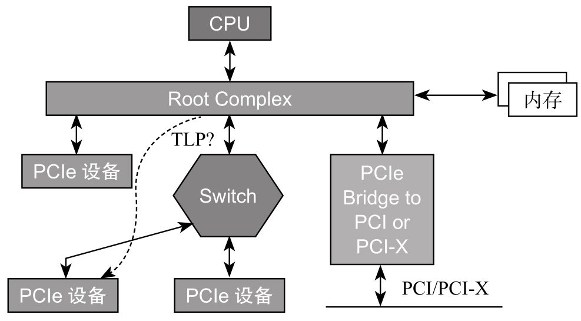
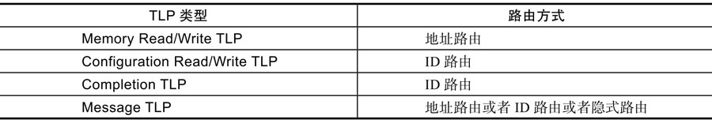
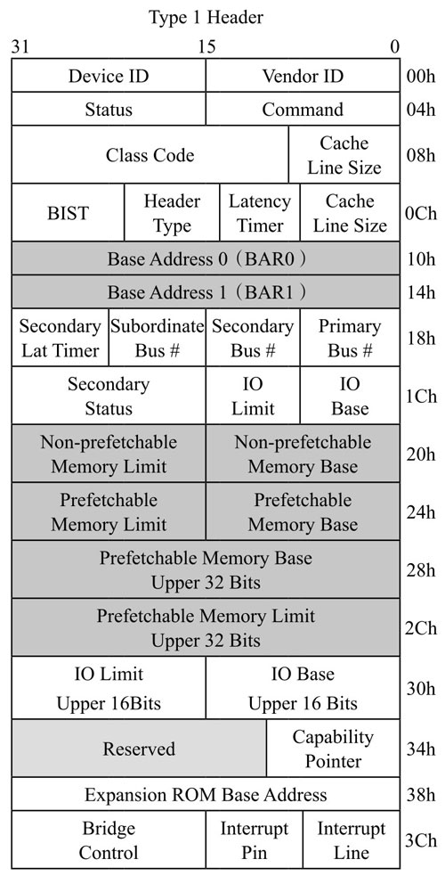
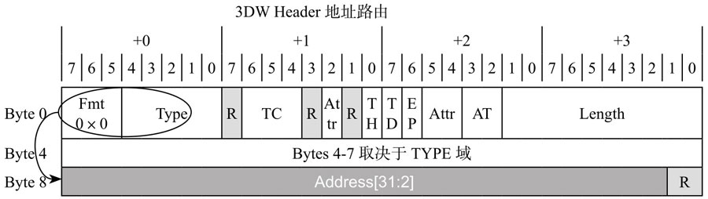
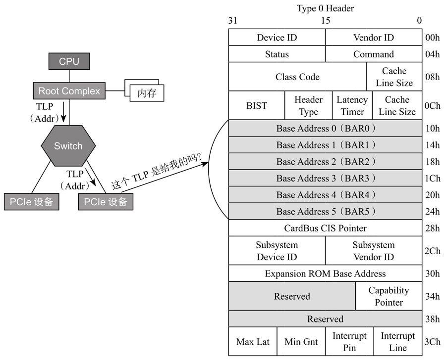
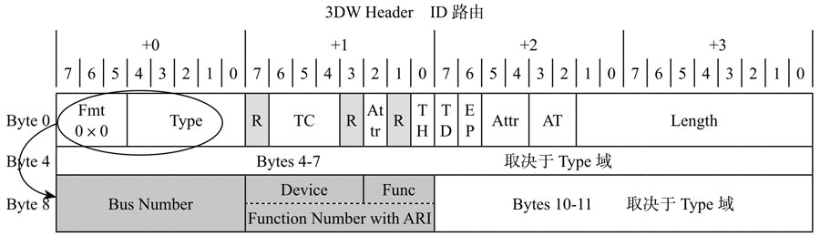
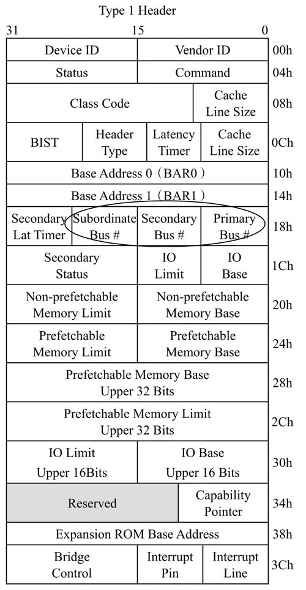
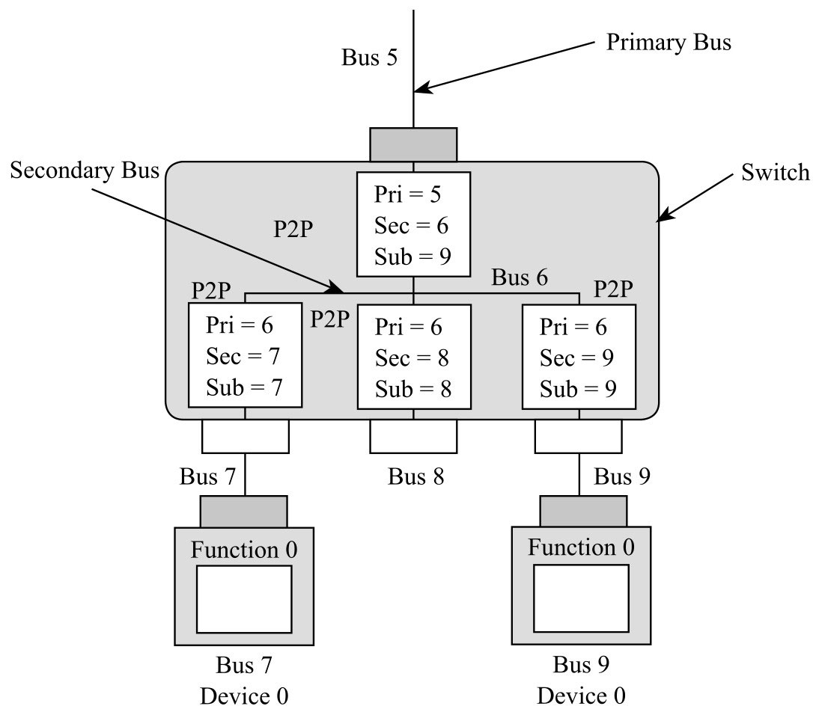
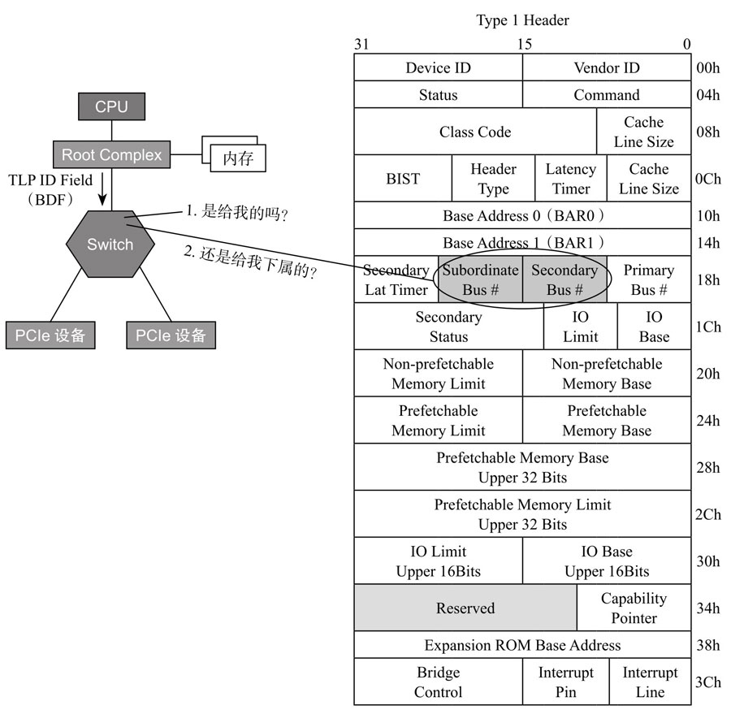
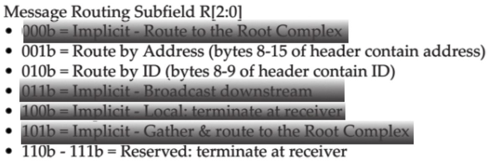

# TLP 路由

以下图所示的简单拓扑结构为例, 讨论**一个 TLP**是怎样**从发起者到达接收者**, 即 TLP 的**路由问题**.

## 三种路由方式

PCIe 共有三种路由方式:

1) 基于**地址**(`Memory Address`)路由

2) 基于**设备 ID**(`Bus Number + Device Number +Function Number`)路由

3) **隐式**(`Implicit`)路由

## 不同 TLP

**不同类型的 TLP**, 其寻址**方式也不同**, 下表总结了每种 TLP 对应的路由方式.

# 地址路由

前面提到, **Switch** 负责**路由**和 **TLP 的转发**, 而**路由信息**是**存储**在 Switch 的 **Configuration 空间**的.

> 这里应该指的是 Switch 中每个端口的 configuration, Switch 本身应该不是一个 device, 本身也就没有 Configuration.

因此, 很有必要先理解 Switch 的 Configuration.

Type 1 Configuration Header:

BAR0 和 BAR1 没有什么好说, 跟前节讲的 Endpoint 的 BAR 意义一样, 存放 **Switch 内部空间**在主机内存空间映射基址.

Switch 有**一个上游端口**(靠近 RC)和**若干个下游端口**, **每个端口**其实是**一个 Bridge**, **都有一个 Configuration**, 每个 Configuration 描述了**其下面连接设备空间映射的范围**, 分别由 `Memory Base` 和 `Memory Limit` 来表示.

* 对上游端口, 其 Configuration 描述的地址范围是它**下游所有设备**的**映射空间范围**;
* 对**每个下游端口**的 Configuration, 描述了连接它的端口设备的**映射空间范围**.

> 下游往上游走的路径是唯一的, 直到 RC.

前面我们看到, `Memory Read` 或者 `Memory Write TLP` 的 Header 里面都有一个**地址信息**, 该地址是 **PCIe 设备内部空间**(**BAR 空间**)在**内存中的映射地址**.

> 肯定是 BAR 空间, configuration 空间是通过 configuration TLP

地址路由 3DW 的 TLP Header:

当**一个 Endpoint** 收到一个 Memory Read 或者 Memory Write TLP, 它会把 **TLP Header** 中的**地址**跟 **Configuration** 当中**所有的 BAR 寄存器**比较, 如果 TLP Header 中的地址落在这些 BAR 的地址空间, 那么它就认为该 TLP 是发给它的, 于是接收该 TLP, 否则就忽略, 如图所示.

EP 通过对比目的地址和自己的 BAR 决定是否接收该 TLP:

当一个 Switch 上游端口收到一个 Memory Read 或者 MemoryWrite TLP, 它首先把 TLP Header 中的地址跟它自己 Configuration 当中的所有 BAR 寄存器比较, 如果 TLP Header 当中的地址落在这些 BAR 的地址空间, 那么它就认为该 TLP 是发给它的, 于是接收该 TLP(这个过程与 Endpoint 的处理方式一样); 如果不是, 则看这个地址是否落在其下游设备的地址范围内(是否在 Memory Base 和 Memory Limit 之间), 如果是, 说明该 TLP 是发给它下游设备的, 因此它要完成路由转发; 如果地址不落在下游设备的地方范围内, 说明该 TLP 不是发给它下游设备的, 则不接受该 TLP, 如图 5-42 所示.

Switch 如何分配地址路由:

刚才的描述是针对 TLP 从 Upstream 流到 Downstream 的路由. 如果 TLP 从下游往上走呢?

它(某端口)首先把 TLP Header 中的地址跟它自己 Configuration 当中的所有 BAR 寄存器比较, 如果 TLP Header 当中的地址落在这些 BAR 的地址空间, 那么它就认为该 TLP 是发给它的, 于是接收该 TLP(跟前面描述一样); 如果不是, 那就看这个地址是否落在其下游设备的地址范围内(是否在 Memory Base 和 Memory Limit 之间). 如果是, 这个时候不是接受, 而是拒绝; 相反, 如果地址不落在下游设备的地址范围内, Switch 则把该 TLP 传上去.

# ID 路由

在一个 PCIe 拓扑结构中, 由 ID = Bus Number + Device Number + Function Number(BDF)能唯一找到某个设备的某个功能. 这种按设备 ID 号来寻址的方式叫作 ID 路由. **Configuration TLP** 和**Completion TLP**(`CplD`)按 **ID 路由**寻址, Message 在某些情况下也是 ID 路由.

使用 ID 路由的 TLP, 其 TLP Header 中含有 BDF 信息.

使用 ID 路由的 3DW **TLP Header**:

* 如果一个 **Endpoint** 收到一个这样的 TLP, 它**用自己的 ID** 和收到 **TLP Header 中的 BDF** 比较, 如果是给自己的, 就**收下**TLP, 否则就**拒绝**.

* 如果是一个 **Switch** 收到这样的一个 TLP, **怎么处理**?我们再回头看看 Switch 的 Configuration Header.

Type 1 Header(Configuration):

注意: 不是一个 Switch 对应一个 Configuration 空间(Type 1 Header), 而是 Switch 的每个 Port 都有一个 Configuration 空间(Type 1 Header).

看三个寄存器: **Subordinate Bus Number**、**Secondary Bus Number** 和 **Primary Bus Number**, 如图.

Primary Bus 和 Secondary Bus 的概念:

对一个 Switch 来说:

* **每个 Port** 靠近 **RC**(上游)的那根 **Bus** 叫作 **Primary Bus**, 其 Number 写在其 Configuration Header 中的 **Primary Bus Number** 寄存器;

* **每个 Port 下面**的那根 Bus 叫作 **Secondary Bus**, 其 Number 写在其 Configuration Header 中的 **Secondary Bus Number** 寄存器;

* 对**上游端口**, **Subordinate Bus** 是其**下游所有端口**连接的 Bus **编号最大的那根 Bus**, Subordinate Bus Number 写在每个 Port 的 Configuration Header 中的 **Subordinate Bus Number** 寄存器.

当一个 Switch 收到一个基于 ID 寻址的 TLP:

1. 首先检查 TLP 中的 BDF 是否与自己的 ID 匹配, 如匹配, 说明该 TLP 是给自己的, 收下;
2. 否则, 检查该 TLP 中的 Bus Number **是否落在 Secondary Bus Number 和 Subordinate Bus Number 之间**. 如果是, 说明该 TLP 是发给其下游设备的, 然后转发到对应的下游端口;
3. 如果是其他情况, 则**拒绝**这些 TLP.

Switch 如何进行 ID 路由:

# 隐式路由

只有 Message TLP 才支持隐式路由. 在 PCIe 总线中, 有些 Message 是与 RC 通信的, RC 是该 TLP 的发送者或者接收者, 因此没有必要明明白白地指定地址或者 ID, 这种路由方式称为隐式路由. Message TLP 还支持地址路由和 ID 路由, 但以隐式路由为主.

Message TLP 的 Header 总是 4DW, 如图 5-47 所示.

Message TLP 的 Header:

Type 字段, 低 3 位, 由 rrr 表示, 指明该 Message 的路由方式, 具体如图 5-48 所示.

Type 域低 3 位决定了 Message TLP 路由方式:

当一个 Endpoint 收到一个 Message TLP, 检查 TLP Header, 如果是 RC 的广播 Message(011b)或者该 Message 终结于它(100b), 它就接受该 Message.

当一个 Switch 收到一个 Message TLP, 检查 TLP Header, 如果是 RC 的广播 Message(011b), 则往它每个下游端口复制该 Message 然后转发. 如果该 Message 终结于它(100b), 则接受该 TLP. 如果下游端口收到发给 RC 的 Message, 则往上游端口转发.

上面说的是 Message 使用隐式路由的情况. 如果是地址路由或者 ID 路由, Message TLP 的路由跟其他的 TLP 一样, 不再赘述.
