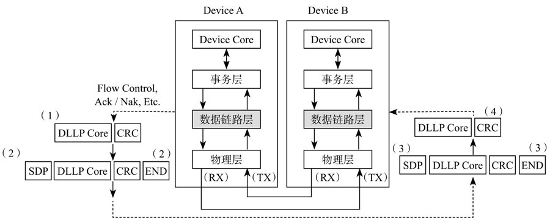
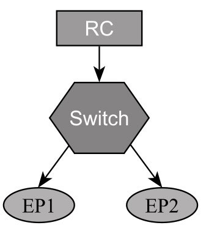
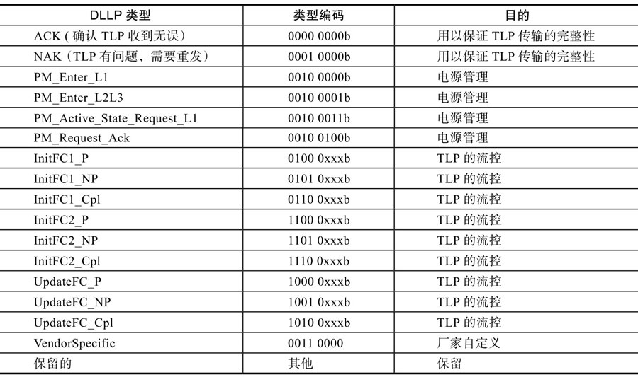
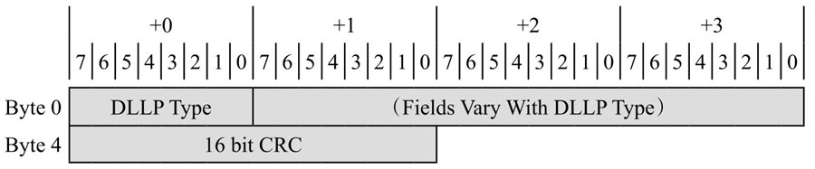
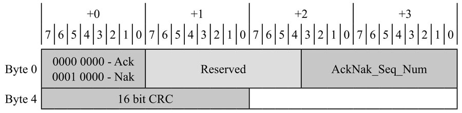
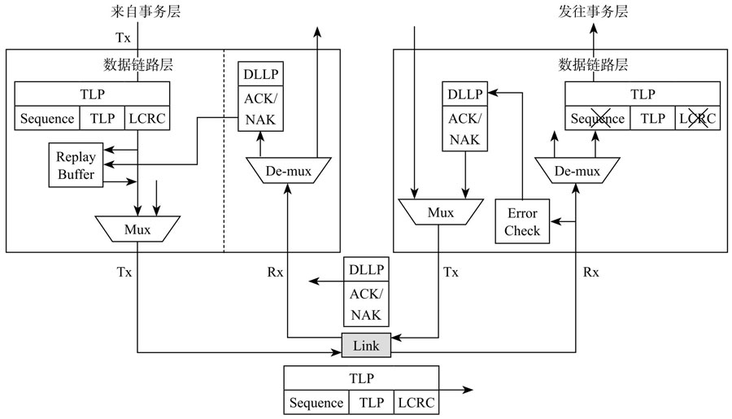
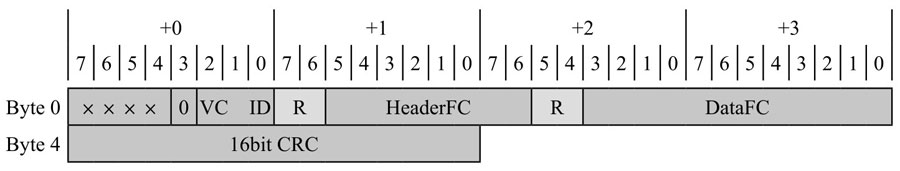
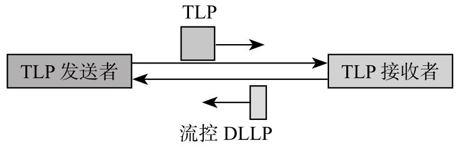
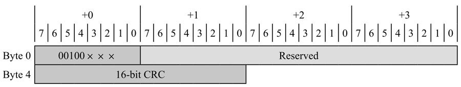

前面看到一个 TLP 源于事务层终于事务层. 但 TLP 不是从发送端一步就跑到接收端它经由发送端的数据链路层和物理层然后是接收端的物理层和数据链路层最终完成 TLP 的发送和接收.

数据链路层位于事务层的下一层理所当然为事务层服务. 那么数据链路层在 TLP 传输过程中起了什么作用呢?

发送端: 数据链路层接收上层传来的 TLP 它给每个 TLP 加上 Sequence Number(序列号下文都用"序列号"来阐述)和 LCRC(Link CRC)然后转交给物理层.

接收端: 数据链路层接收物理层传来的 TLP 检测 CRC 和序列号如果有问题会拒绝接收该 TLP 即不会传到它的事务层并且通知发送端重传; 如果该 TLP 没有问题数据链路层则去除 TLP 中的序列号和 LCRC 交由它的事务层并通知发送端 TLP 正确接收.

从上面的描述可以看出数据链路层保证了 TLP 在数据总线上的正常传输并使用了握手协议(Ack/Nak)和重传(Retry)机制来保证数据传输的一致性和完整性.

数据链路层的作用除了保证 TLP 数据包的正确传输还包括 TLP 流量控制和电源管理等功能. 数据链路层借助 DLLP 来完成这些功能如图 5-49 所示

数据链路层在协议栈中的位置和作用:

DLLP(Data Link Layer Packet 数据链路层的数据包)源于发送端的数据链路层终于接收端的数据链路层因此处于高层的事务层是感知不到它的存在的.

发送端: 数据链路层生成 DLLP 交由物理层物理层加起始(SDP)和结束标志(GEN 1/2 加 END, GEN3 则没有)然后物理传输到对方.

接收端: 物理层对 DLLP 掐头去尾交由数据链路层数据链路层对 DLLP 进行校验不管正确与否 DLLP 都终于这层.

与事务层 TLP 传输不同数据链路层只处理端到端的数据传输. 一个 TLP 可以翻山越岭(经过若干个 Switch)从一个设备传输到相隔很远的设备. 但 DLLP 的传输仅限于相邻的两个端口. 因此 DLLP 中不需要包含路由信息即不需要告诉我这个 DLLP 是哪个设备发起的以及要发送给哪个目标设备.

如图 5-50 所示一个 TLP 可以从 RC 传到 EP1 但 DLLP 的传输只限于 RC 与 Switch 上游 Port, Switch 的上游 Port 与下游 Port 以及 Switch 下游 Port 与 EP1(或者 EP2).

简单的 PCIe 系统示例:

数据链路层主要有四大类型 DLLP:

* 用以确保 TLP 传输完整性的 DLLP: ACK/NAK;

* 流控相关的 DLLP;

* 电源管理相关的 DLLP;

* 厂家自定义 DLLP.

具体如表 5-7 所示.

DLLP 类型:

DLLP 大小为 6B(物理层上加上头尾传输的是 8B)格式如图 5-51 所示.

6B DLLP 格式:

不同类型的 DLLP 格式相同内容不一样.

# ACK/NAK 协议

首先我们来看 `ACK/NAK DLLP` 其格式如下(见图 5-52).

ACK/NAK DLLP 格式:

数据链路层通过 ACK/NAK 协议来保证每个 TLP 的正确传输其基本原理为: TLP 发送端的数据链路层为每个 TLP 加上序列号和 LCRC 在该 TLP 被接收端正确收到之前它会一直保持在一个叫 Replay Buffer 的接口里面. TLP 接收端的数据链路层接收到该 TLP 后做 CRC 校验和序列号检查如果没有问题 TLP 接收端(可能)会生成和发送 ACK DLLP, TLP 发送方接收到 ACK 后知道 TLP 被正确接收因此它会把相关的 TLP 从 Replay Buffer 中清除; 如果 TLP 接收方检测到 TLP 有错误则会生成和发送 NAKDLLPTLP 发送方接收到 NAK 后知道有 TLP 传输出错会重新发送 Replay Buffer 相关的 TLP 给对方. TLP 传输出错往往是瞬态的重传基本能保证 TLP 传输正确. TLP 接收方只有收到正确的 TLP 才会去掉序列号和 LCRC 并把 TLP 交给它的事务层.

前面提到没有收到 ACK 的 TLP 发送端的链路层都会把它(包括序列号和 LCRC)放在 Replay Buffer 中. 在接收端当成功收到一个 TLP 后它的序列号加 1 设置为下一个期望接收到的 TLP 序列号.

假设当前发送端 Replay Buffer 中有序列号分别为 10、11、12、13 的 4 个 TLP 即这些 TLP 发送出去了但还没有得到响应.

假设接收端上一个成功接收到的 TLP 序列号为 11 期望下个接收到的 TLP 序列号为 12. 这时接收端接收到一个 TLP 首先它会对该 TLP 做 LCRC 校验:

(1)校验失败

TLP 接收端会发送一个 NAK 其中 AckNak_SEQ_NUM 设为 11. TLP 发送端接收到该 NAK 后知道 11 和它之前的 TLP(这里是 TLP 10)被成功接收因此 TLP 10 和 TLP 11 会从 ReplayBuffer 清掉(不需要重发). 同时它知道 12 和后面的 TLP(这里是 TLP 13)没有被成功接收因此它们会重发.

(2)校验成功

CRC 没有问题接下来就检查 TLP 的序列号了. 这里有三种情况:

* TLP 接收端发现收到的 TLP 序列号为 12 与预期相符. TLP 接收端可能需要发一个 ACK 也可能不需要发 ACK. 为什么这么说?为减少数据链路层 DLLP 的传输可能设置正确接收到若干个 TLP 后才会返回一个 ACK 并非每成功接收一个 TLP 就返回一个 ACK. 假设这个时候需要返回 ACK 则设 AckNak_SEQ_NUM 为 12. TLP 发送端接收到该 ACK 知道 TLP 12 和它之前所有的 TLP 都被成功接收因此 TLP 10、TLP 11 和 TLP 12 会从 Replay Buffer 清掉.
* TLP 接收端发现收到的 TLP 序列号为 13 与预期不符(预期为 TLP 12). TLP 接收端希望接收到的 TLP 为 12 这个时候收到的却是 13 说明 TLP 12 在半路丢了发生丢包. 这个时候接收端会发一个 NAK 其中 AckNak_SEQ_NUM 设为 11(即上一个成功被接收的 TLP 序列号). TLP 发送端接收到该 DLLP 后知道 TLP 11 和它之前所有的 TLP 都被成功接收因此 TLP 10 和 TLP 11 会从 Replay Buffer 清掉并重发 TLP 12 和它后面的 TLP(这里是 TLP 13).
* TLP 接收端发现收到的 TLP 序列号为 10 与预期不符(预期为 TLP 12). TLP 上次正确接收到的是 TLP 11 这次又收到一个序列号比它小的 TLP 为什么会这样?原因是在 TLP 发送端一个 TLP 在一定时间内没有收到 ACK 它会自动重发所有 Hold 在 Replay Buffer 中的 TLP. 由于发送端的这个超时重发机制导致一个 TLP 会被接收端接收到两次或者更多次(如果接收端一直不能及时响应). TLP 接收端如果收到重复的 TLP 包它会默默扔掉这些重复的 TLP 并发送 ACK 其中的 AckNak_SEQ_NUM 设为 11. TLP 发送端接收到该 DLLP 后知道 TLP 11 和它之前所有的 TLP 都被成功接收因此 TLP 10 和 TLP 11 会从 Replay Buffer 清掉.

图 5-53 是数据链路层内部框图从中我们可以看到 ACK/NAK 是怎样实现的.

数据链路层内部框图:

数据链路层通过 ACK/NAK 协议和 TLP 重传机制保障了 TLP 传输的数据完整性.

问题来了每个 DLLP 在接收端也需要做 CRC 校验那如果 DLLP 出错了怎么办?接收端会丢弃出错的 DLLP 并通过下一个成功的 DLLP 更新之前丢失的信息. 读者可根据上面的例子自行分析.

2. TLP 流控(流量控制 Flow Control)

我们再看看跟流控相关的 DLLP 其格式如图 5-54 所示.

流控 DLLP 格式:

我们不打算对每个流控 DLLP 展开解释这里只简单说说 TLP 流控机制.

TLP 的发送端不能随便向对方发送 TLP 因为接收端处理 TLP 的速度可能赶不上发送 TLP 的速度. 接收端如果没有足够空间接受该 TLP 的话就会拒绝该 TLP 发送端必须重复发送该 TLP 直到对方接受这在一定程度上影响了通信的效率. PCIe 有一套流控机制来保证 TLP 的发送和接收是高效的.

TLP 流控基于 Credit. 每个 TLP 都有一定大小发送者在发送前先看看对方是否有足够的空间来接纳该 TLP 如果有则发送过去否则就 Hold 在那里直到对方有足够的空间再发. 那发送者怎样才能知道对方有多少空间呢?PCIe 使用流控 DLLP 来告知. 接收端会时不时通过 DLLP 来告诉对方我有多少 TLP 接收空间然后发送端依据此信息决定是不是生成 TLP 并发送过去如图 5-55 所示.

TLP 接收者通过流控 DLLP 告知发送者可用 TLP 接收空间:

需要注意的是这里的流控是针对 TLP 传输而言. DLLP 的传输是不需要流控的因为每个 DLLP 的大小只有六个字节跟 TLP 相比非常迷你. 如果 DLLP 需要流控那就麻烦了. TLP 的流控是通过 DLLP 来实现的如果 DLLP 还需要流控那又有谁来帮忙实现呢?

# 电源管理

最后是跟电源管理相关的 DLLP(见图 5-56).

电源管理 DLLP 格式:

关于电源管理请查看第 8 章在这里不做解释.