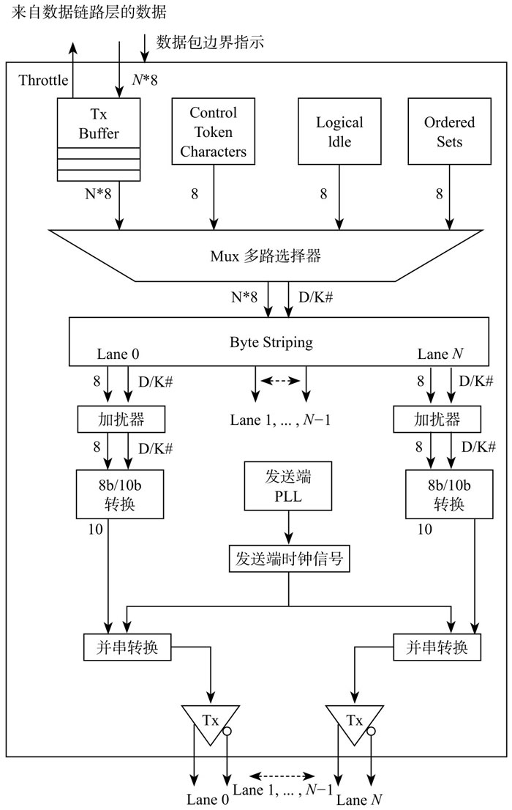
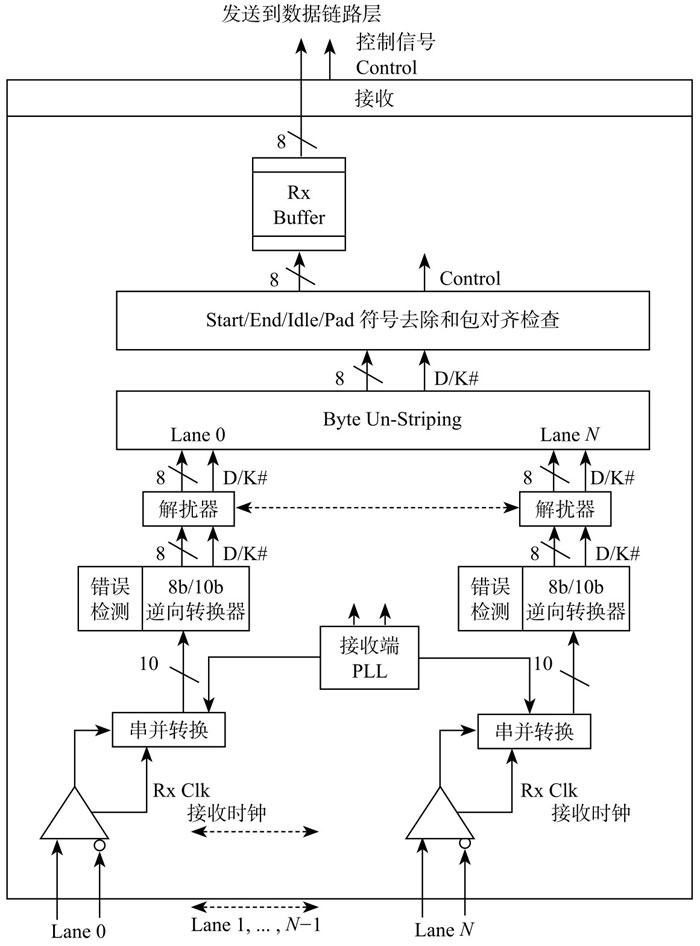
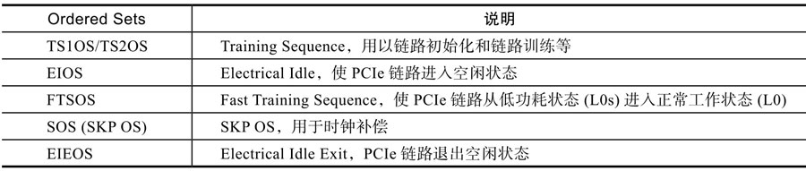

物理层是整个 PCIe 协议层的最底层用来跑腿的. 无论是 TLP 还是 DLLP 到最后都需要物理层来进行实实在在的物理信号传输. 因此有必要深入基层了解一下物理层在做什么.

物理层由电气模块和逻辑模块组成. 电气模块方面我们知道 PCIe 是采用串行总线传输数据使用的是差分信号即用两根信号线上的电平差表示 0 或 1. 与单端信号传输相比差分信号抗干扰能力强能提供更宽的带宽(跑得更快). 打个比方假设用两个信号线上电平差表示 0 和 1 具体来讲差值大于 0 表示 1; 差值小于 0 表示 0. 如果传输过程中存在干扰两个线上加了近乎同样大小的干扰电平两者相减差值几乎不变并不会影响信号传输. 但对单端信号传输来说就很容易受干扰比如 0~1V 表示 0,1~3V 表示 1 一个本来是 0.8V 的电压加入干扰变成 1.5V 相当于 0 变成 1 数据就出错了. 抗干扰能力强因而可以用更快的速度进行数据传输从而提供更宽的带宽(关于 PCIe 速度可参看 5.1 节).

关于电气模块更多详细内容可以去读 PCIe 规范. 对于 SSD 开发人员(尤其是固件开发者)来说我觉得记住"串行总线差分信号"就可以了 PCIe 的快是因为在物理传输上使用了这两大技术.

我们重点看看物理层的逻辑模块如图 5-57 所示.

物理层中发送端逻辑子模块:

* 物理层从数据链路层获得 TLP 或者是 DLLP 然后放到 TxBuffer 里.

* 物理层给 TLP 或者 DLLP 加入头(Start code)和尾(End code、Gen 3 没有尾巴); 给每个 TLP 或者 DLLP 加上边界符号这样接收端就能把 TLP 或者 DLLP 区分开.

* 第一节提到 PCIe 链路上可能有若干个 Lane. 在物理层 TLP 或者 DLLP 数据会分派到每个 Lane 上独立传输. 这个过程叫 Byte Stripping 类似于串并转换.

* 数据进入每条 Lane 后分别加串扰(Scramble)目的是减少电磁干扰(EMI)手段是让数据与随机数据进行异或操作输出伪随机数据然后再发送出去.

* 加扰后的数据进行 8/10 编码(Gen3 是 128/130 编码). 8/10 编码是 IBM 的专利目的主要有: 让数据流中的 0 和 1 个数相当保持直流平衡; 嵌入时钟信息 PCIe 不需要专门的时钟进行信号传输.

* 最后进行并串转换发送到串行物理总线上去.

接收端逻辑模块如图 5-58 所示.

物理层中接收端逻辑子模块:

接收端逆向操作不再赘述.

PCIe 的三层从上到下依次为事务层、数据链路层和物理层. 每层都有自己的数据包定义: 事务层产生 TLP 经过数据链路层和物理层传输给接收方; 数据链路层产生 DLLP 经过物理层传输到对方; 物理层不仅仅为上层 TLP 和 DLLP 做嫁衣其实它也有自己的数据包定义称为 Ordered Sets 简称 OS.

TLP 用以传输应用层或者命令层(事务层的顶头上司)数据 DLLP 用以 ACK/NAK、流控和电源管理等 OS 的功能是物理层用以管理链路的比如链路训练(LinkTraining)、改变链路电源状态等. 表 5-8 是 PCIe 中 OS 列表.

Ordered Sets 列表:

