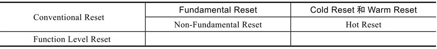
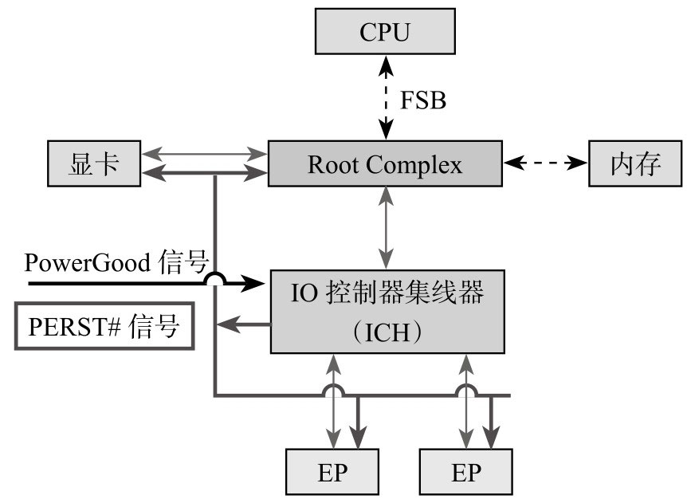

PCIe 是个博大精深的协议跟 Reset 相关的术语就有不少: Cold Reset、Warm Reset、Hot Reset、ConventionalReset、Function Level Reset、Fundamental Reset、Non-Fundamental Reset.

要想完全理解 PCIe Reset 就要提纲挈领快速从一大堆概念中理出头绪.

1. 整理出这些 Reset 之间的关系

这些 Reset 之间是从属关系总线规定了两个复位方式: Conventional Reset 和 Function Level Reset(FLR).

而 Conventional Reset 又进一步分为两大类: FundamentalReset 和 Non-Fundamental Reset.

Fundamental Reset 方式包括 Cold 和 Warm Reset 方式可以用 PCIe 将设备中的绝大多数内部寄存器和内部状态都恢复成初始值.

而 Non-Fundamental Reset 方式为 Hot Reset 方式.

看看表 5-9 有没有感觉好一点?

PCIe Reset 分类:

2. 明白每种 Reset 的功能、实现方式及对设备的影响

Fundamental Reset: 由硬件控制会重启整个设备包括: 重新初始化所有的 State Machine、所有的硬件逻辑、PortState 和 Configuration Register.

当然也有 Fundamental Reset 搞不定的情况就是某些 Register 里属性为"Sticky"的 Field 跟蛋蛋一样坚强任你怎么 Reset 我自岿然不动.

这些 Field 在 Debug 的时候非常有用特别是那些需要 ResetLink 的情况比如在 Link Reset 以后还能保存之前的错误状态这对 FW 以及上层应用来说是很有用的. Fundamental Reset 一般发生在整个系统 Reset 的时候(比如重启电脑)但是也可以只针对某个设备做 Fundamental Reset.

Fundamental Reset 有两种:

Cold Reset: Power Off/On Device 的 Vcc(Vaux 一直在).

Warm Reset(Optional): 保持 Vcc 的情况下由系统触发比如改变系统的电源管理状态可能会触发设备的 WarmReset, PCIe 协议没有定义具体如何触发 Warm Reset 而是把决定权交给系统.

有两种方法对一块 PCIe SSD 做 Fundamental Reset.

系统这边给设备发 `PERST#`(`PCIe Express Reset`)信号以图 5-59 所示为例.

系统上电产生 `PERST#` 信号

...