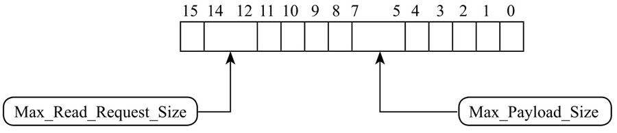

这两部分都在 `Device Control Register`(设备控制寄存器)里, 如图 5-66 所示, 分别由 `bit[14:12]` 和 `bit[7:5]` 控制.

设备控制寄存器:



# Maximum Payload Size(MPS)

控制一个 **TLP** 可以传输的**最大数据长度**. 作为接收方, 必须能处理跟 MPS 设定大小相同的 TLP 数据包, 作为传输方, 不允许创建超过 MPS 设定的 TLP 数据包.

PCIe 协议允许一个**最大**的 **Payload** 可以到**4KB**, 但是规定了在**整个传输路径**上的**所有设备**, 都必须使用**相同的 MPS 设置**, 同时**不能超过**该路径上**任何一个设备**的 `MPS` 能力值. 也就是说, `MPS Capability` 高的设备要迁就低的设备. 以 PCIe SSD 来说, 插到一块老掉牙的主板上(MPS 只有 128 Byte), 你的 Payload Size 再大, 也是没有用的.

系统的 **MPS 值**设置是在**上电以后**的**设备枚举配置阶段**完成的, 以主板上的 PCIe RC 和 PCIe SSD 为例, 它们都在 `Device Capability Register` 里声明自己**能支持的各种 MPS**, **OS** 的 **PCIe 驱动**侦测到他们各自的能力值, 然后**挑低的**那个设置到**两者**的 `Device Control Register` 中.

**PCIe SSD** 自身的 `MPS capability` 则是在其 **PCIe core 初始化阶段**设置的.

# Maximum Read Request Size

在配置阶段, **OS** 的 **PCIe 驱动**也会配置另外一个参数 `Maximum Read Request Size`, 用于控制**一个 Memory Read** 的**最大 Size**, **最大 4KB**(以 128 Byte 为单位).

Read Request Size 是可以大于 MPS 的, 比如**给**一个 `MPS = 128Byte` 的** PCIe SSD** 发一个 **512 Byte** 的 **Read Request**, PCIe SSD 可以通过**返回** 4 个 128 Byte 的 **Cpld**(`Completion with Data TLP`), 或者 8 个 64 Byte 的 Cpld 来完成这个 Request 的响应. **OS 层面**可以通过控制 PCIe SSD 的 Maximum Read Request Size 参数, 平衡多个 PCIe SSD 之间的吞吐量, 避免**系统带宽**(**总共 40 个 Lane**)被某些 SSD 霸占.

同时, Read Request Size 也对 PCIe SSD 的 Performance 有影响, 这个 Size **太小**, 意味着同样的 Data, 需要发送**更多的 Request** 去获取, 而 Read Request 的 TLP 是不带任何 Data Payload 的.

举例来说, 要传 **64KB** 的数据, 如果 `Read Request=128 Byte`, 则需要 512 个 Read TLP, 512 个 TLP 的开销可是不小的.

为了提高特别是大 Block Size Data 的传输效率, 可以尽量把 Read Request Size 设得大一点, 用**更少的次数**传递更多的数据.

# 示例

```
$ lspci -t -v
 \-[0000:00]-+-11.0-[04]----00.0  Sandisk Corp WD Black SN850

$ sudo lspci -vvv -s 00:11.0
00:11.0 PCI bridge: Intel Corporation Device 1bb1 (rev 11) (prog-if 00 [Normal decode])
        ...
        Capabilities: [40] Express (v2) Root Port (Slot+), MSI 00   // 是个 root port
                DevCap: MaxPayload 256 bytes, PhantFunc 0
                        ExtTag+ RBE+
                DevCtl: CorrErr+ NonFatalErr+ FatalErr+ UnsupReq-
                        RlxdOrd- ExtTag+ PhantFunc- AuxPwr- NoSnoop-
                        MaxPayload 256 bytes, MaxReadReq 512 bytes

$ sudo lspci -vvv -s 04:00.0
04:00.0 Non-Volatile memory controller: Sandisk Corp WD Black SN850 (rev 01) (prog-if 02 [NVM Express])
        ...
        Capabilities: [c0] Express (v2) Endpoint, MSI 00            // 是个 endpoint
                DevCap: MaxPayload 512 bytes, PhantFunc 0, Latency L0s <1us, L1 unlimited
                        ExtTag- AttnBtn- AttnInd- PwrInd- RBE+ FLReset+ SlotPowerLimit 0.000W
                DevCtl: CorrErr+ NonFatalErr+ FatalErr+ UnsupReq-
                        RlxdOrd+ ExtTag- PhantFunc- AuxPwr- NoSnoop+ FLReset-
                        MaxPayload 256 bytes, MaxReadReq 512 bytes
```

root port 的 DevCap 中 MaxPayload 是 256 bytes, 而 SSD 的 DevCap 中 MaxPayload 是 512 bytes, 所以 root port 和 SSD 的 DevCtl 中 MaxPayload 都被设置为了 256 bytes.

而 SSD 的 DevCtl 中的 MaxReadReq 被设置成了 512 bytes


