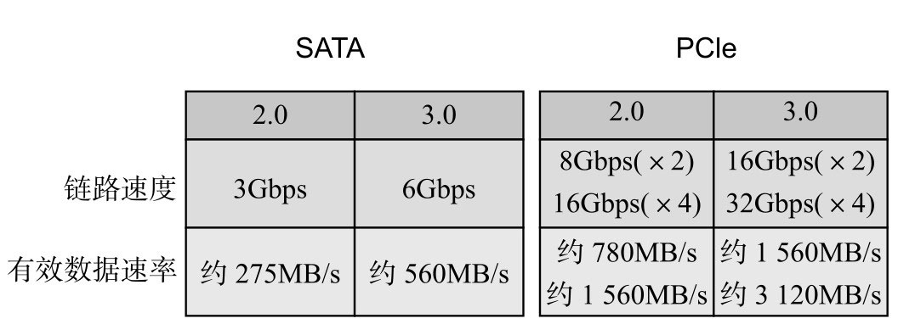
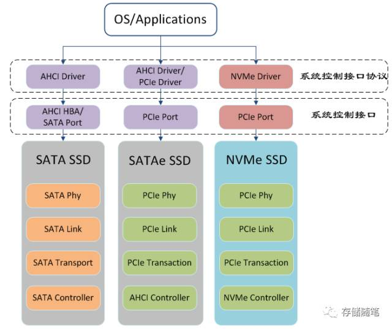
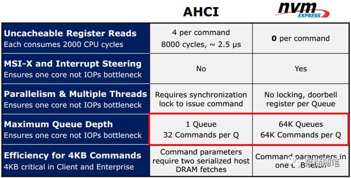
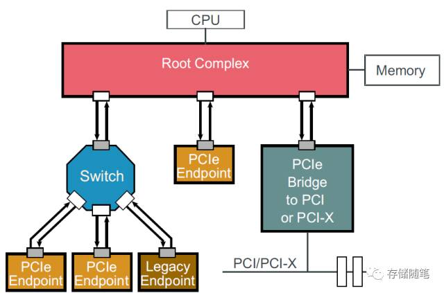
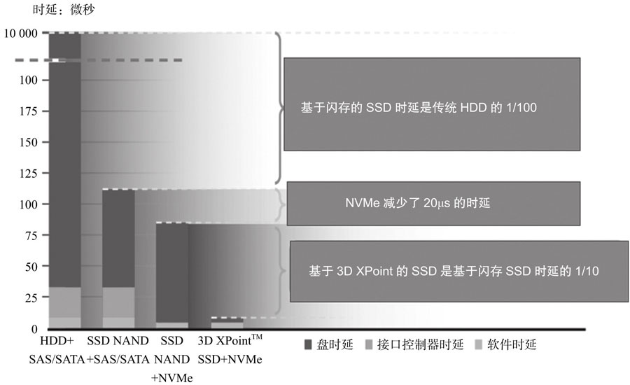
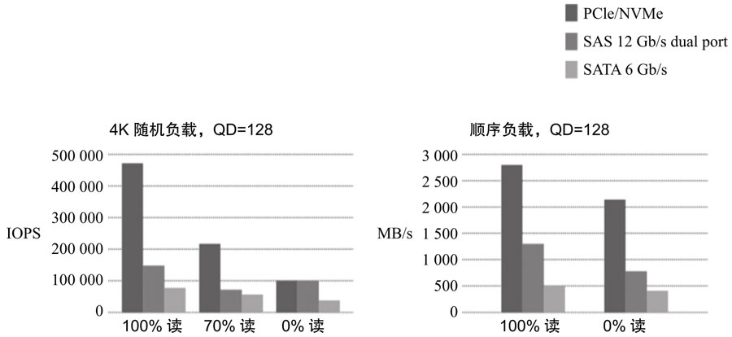
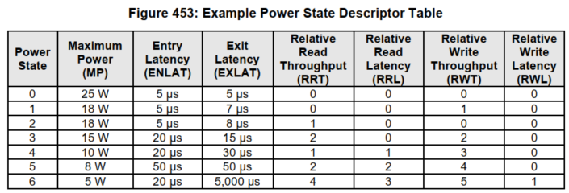

<!-- @import "[TOC]" {cmd="toc" depthFrom=1 depthTo=6 orderedList=false} -->

<!-- code_chunk_output -->

- [1. SATA 和 AHCI](#1-sata-和-ahci)
- [2. PCIe 和 NVMe](#2-pcie-和-nvme)
- [3. 相互关系](#3-相互关系)
- [4. NVMe](#4-nvme)
- [5. NVMe 优势](#5-nvme-优势)
  - [5.1. 低时延 (Latency)](#51-低时延-latency)
  - [5.2. 高性能 (Throughput&IOPS)](#52-高性能-throughputiops)
  - [5.3. 低功耗](#53-低功耗)

<!-- /code_chunk_output -->

# 1. SATA 和 AHCI

HDD 和早期的 SSD 绝大多数都是使用 **SATA 接口**, 跑的是 **AHCI**(`Advanced Host Controller Interface`, **串行 ATA 高级主控接口**/**高级主机控制器接口**)**协议**, 它是由 Intel 联合多家公司研发的系统接口标准.

AHCI 支持 NCQ(Native Command Queuing)功能和热插拔技术. NCQ **最大深度**为 **32**, 即**主机**最多可以发 32 条**命令**给 **HDD** 或者 **SSD** 执行, 跟之前硬盘只能逐条命令执行相比, 硬盘性能大幅提升.

在 HDD 时代或者 SSD 早期, **AHCI 协议 + SATA 接口**足够满足系统性能需求, 因为整个系统的**性能瓶颈**在**硬盘端**(**低速**, **高延时**), 而**不是**在**协议和接口端**.

然而, 随着 SSD 技术的飞速发展, SSD 盘的性能飙升, **底层闪存带宽**越来越**宽**, **介质访问延时**越来越**低**, 系统**性能瓶颈**已经由下转移到上面的**接口**和**协议**处了.

> 即, SATA/AHCI 其实是为机械硬盘 HHD 而生的

AHCI 和 SATA 已经不能满足高性能和低延时 SSD 的需求, 因此 SSD 迫切需要自己更快、更高效的**协议**和**接口**.

# 2. PCIe 和 NVMe

所有 SATA 接口的 SSD, 都不会超过 600MB/s(或者说都不超过 560MB/s). **不是底层闪存带宽不够**, 是 **SATA 接口**速度**限制**了带宽, 因为 SATA 3.0 最高带宽就是 600MB/s, 而且不会再有 SATA 4.0 了. 后来, **AHCI** 也意识到了自身的危机, 并高薪挖来了另一位得力干将 **PCIe**.

SATA 和 PCIe 接口速度对比:

PCIe 呢, 光芒万丈, AHCI 根本就驾驭不了, **AHCI 只有一个命令队列**, 最多**同时**只能发 **32 条命令**.

NVMe 规范登场, 最初的名字叫 NVMHCI, 是在 2007 年的 Intel 开发者论坛(IDF)上被提出来的, 并在同年 Intel 牵头成立 NVMe 开发工作组. 2009 年下半年, 在 Intel 的领导下, 美光、戴尔、三星、Marvell 等巨头, 一起制定了专门为 SSD 服务的 NVMe 协议, 旨在将 SSD 从老旧的 SATA 和 AHCI 中解放出来.

最初制定 NVMe 规范的主要公司:

# 3. 相互关系

下图 AHCI, NVME, SATA, PCIe 相互之间的关系

> PCIe 是接口协议, NVMe 是应用层通信协议.

`SATA Port/AHCI HBA + AHCI Driver` -> `PCIe Port + AHCI Driver/PCIe Driver` -> `PCIe Port + NVMe Driver`

# 4. NVMe

NVMe 即 `Non-Volatile Memory Express`, 是**非易失性存储器标准**, 是跑在 PCIe 接口上的**协议标准**.

NVMe 的**设计之初**就有充分利用了 **PCIe** SSD 的**低延时**以及**并行性**, 还有当代处理器、平台与应用的并行性. 相比 AHCI 标准, NVMe 标准可以带来多方面的性能提升. NVMe 为 SSD 而生, 但不局限于以闪存为媒介的 SSD, 它同样可以应用在高性能和低延时的 **3D XPoint** 这类**新型的介质**上.

首款支持 NVMe 标准的产品是三星 XS1715, 于 2013 年 7 月发布. 随后陆续有企业级的 NVMe 标准 SSD 推出. 2015 年 Intel 750 发布, 标志着 NVMe 标准的产品开始进入消费级市场.

需要指出的是, 在移动设备上, NVMe 也占有一席之地. 苹果自 iPhone 6s 开始, 其存储设备上跑的就是 NVMe 协议标准. 未来移动存储的方向, 笔者认为不是 UFS, 当然更不会是 eMMC, 而是 NVMe, 拭目以待吧.

# 5. NVMe 优势

NVMe 定义了系统接口和命令集. 其目的就是性能更好, 延迟更低, 功耗更低. 那么, NVMe 究竟有什么好? 跟 AHCI 相比, 它有哪些优势?

先对比一下 AHCI 与 NVMe 特点, 看图(来自 Intel FMS 2012)

NVMe 和 AHCI 相比, 它的优势主要体现在以下几点:

## 5.1. 低时延 (Latency)

造成**硬盘存储时延**的三大因素:

* **存储介质**层面. 闪存(Flash)比传统机械硬盘**速度快**太多了.

* **控制器**方面. 从 **SATA** SSD 发展成 **PCIe** SSD, **原生 PCIe 主控与 CPU 直接相连**(其实是 RC), 而不像传统方式, 要通过**南桥控制器中转**再连接 CPU, 因此基于 PCIe 的 SSD 时延更低.

* **软件接口**方面.
  * NVMe 缩短了 **CPU** 到 **SSD** 的**指令路径**, 比如 AHCI 中, 执行命令时则要读取 **4 次寄存器**, 而 NVMe **减少了对寄存器的访问次数**;
  * 使用了 `MSI-X` **中断**管理;
  * **并行&多线程优化** —— NVMe 减少了各个 CPU 核之间的锁同步操作等.

所以基于 **PCIe + NVMe** 的 SSD 具有非常低的延时, 如图所示.

时延对比:

## 5.2. 高性能 (Throughput&IOPS)

> 对于 I/O depth, 并不是越大越好, 需要选择一个合适的值, 其原因如下:
>
> 随着 iodepth 的增大在一定范围内, 带宽、io 延时会增加, 超过一定范围后带宽增加缓慢, 延时继续会增加. 延时增加的原因是因为随着 iodepth 增加都需花更多的时间等待请求 io 数量达到 iodepth 数值后, 才会真正把 io 请求发送给存储, 所以平均每一个 io 的延时都会增大了

理论上, **IOPS** 与**队列深度**(`Queue Depth`)和 **IO 延迟**有关

`IOPS = 队列深度/IO 延迟`

故 IOPS 的性能与队列深度有较大的关系. 但 IOPS 与队列深度**不成正比**, 因为实际应用中, 随着**队列深度**的**增加**, **IO 延迟**也会**提高**.

* **AHCI** 只支持**一个队列**, 在**队列深度**上都可以达到 **32**, 然而这也是 AHCI 所能做到的极限.

* **NVMe** 标准下, 最大的**队列深度**可达 **64K**. 此外, NVMe 的**队列数量**也提高到了 **64K**.

> 队列深度: 队列上的命令数目?
>
> 如果要完全释放 NVMe SSD 的 IOPS 性能, 设计人员要先做好评估, 因为当队列深度达到一定程度后, NVMe SSD 的 IOPS 才会达到最佳.

**PCIe 接口**本身在**性能**上碾压 **SATA**, 再加上 **NVMe** 具有比 **AHCI** 更深、更宽的**命令队列**, NVMe SSD 在性能上秒杀 SATA SSD 是水到渠成的事情. 下图是 NVMe SSD、SAS SSD 和 SATA SSD 的性能对比图.

NVMe, SAS 和 SATA SSD 性能对比图:

## 5.3. 低功耗

NVMe 加入了**自动功耗状态切换**和**动态能耗管理**功能.

NVMe Spec 支持 `1-32` 个电源状态(PS, `Power State`). 在 Host 开启自动电源状态转换功能时, 可以根据自己喜好设置 Idle 多长时间后自动转换其他电源状态. 比如, 我们定义了 6 个 PS, 并且定义在 **Idle**(PS0) 10ms 之后进入 PS1, Idle 50ms 进入 PS2,  Idle 100ms 进入 PS3...这些都是自定义的. 如果 Host 未开启自动电源状态转换功能, 也可以通过下发 Set feature 命令进行电源状态的转换.

> Power Management Capability

自动电源状态切换功能一般只用在消费级 SSD 上, 对笔记本电脑的续航问题有很大的帮助. 在企业级 SSD 中数据的安全性还是第一位的, 不大会考虑功耗的问题.

具体在本书的第 8 章会介绍, 这里不再赘述.

