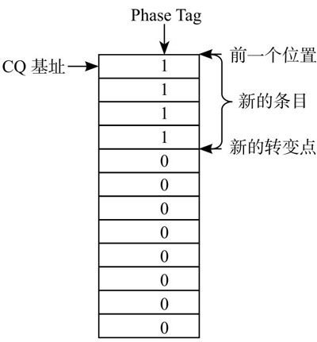

<!-- @import "[TOC]" {cmd="toc" depthFrom=1 depthTo=6 orderedList=false} -->

<!-- code_chunk_output -->

- [1. 协议栈位置](#1-协议栈位置)
- [2. NVMe 工作原理](#2-nvme-工作原理)
  - [2.1. 两种命令集](#21-两种命令集)
    - [2.1.1. Admin 命令集](#211-admin-命令集)
    - [2.1.2. I/O 命令集](#212-io-命令集)
  - [2.2. SQ、CQ](#22-sq-cq)
    - [2.2.1. 对比](#221-对比)
    - [2.2.2. 多个 SQ](#222-多个-sq)
  - [2.3. 队列和 DB](#23-队列和-db)
    - [2.3.1. DB 的作用](#231-db-的作用)
    - [2.3.2. 三者的位置](#232-三者的位置)
    - [2.3.3. 主机维护 SQ 和 CQ](#233-主机维护-sq-和-cq)
    - [2.3.4. 小结](#234-小结)
  - [2.4. 命令处理流程](#24-命令处理流程)

<!-- /code_chunk_output -->

# 1. 协议栈位置

NVMe 是一种**主机**(Host)与 **SSD** 之间**通信的协议**, 它在**协议栈**中隶属高层, 如图所示.

NVMe 在**协议栈**中处于**命令层**和**应用层**协议, 理论上可以**适配**在**任何接口协议**上. 但 NVMe 协议的原配是 **PCIe**, 因此如无特别说明, 后面章节都是基于 `NVMe + PCIe`.

NVMe 是指挥官、军师, 相当于三国时期诸葛亮的角色. 军师设计好计谋, 就交由手下五虎大将去执行. NVMe 的手下大将就是 PCIe, 它所制定的**任何命令**, 都交由 **PCIe** 去**完成**. 虽然 NVMe 的命令也可以由别的接口完成, 但 NVMe 与 PCIe 合作形成的战斗力无疑是最强的.

# 2. NVMe 工作原理

NVMe 制定了主机与 SSD controller 之间通信的命令, 以及命令如何执行的.

## 2.1. 两种命令集

NVMe 有**两种命令**:

* 一种叫 Admin 命令, 用以**主机 管理和控制 SSD**;
* 一种是 I/O 命令, 用以**主机和 SSD 之间数据的传输**.

> 其实还有一种 Fabrics Commands, 对于 NVMe over PCIe 不用关心.

NVMe 命令集:

NVMe 命令总共只要求 13 个(10 Admin Commands + 3 I/O Commands)就完全足够.

跟 ATA 规范中定义的命令相比, NVMe 的命令个数少了很多, 完全是**为 SSD 量身定制**的. 在 **SATA** 时代, 即使只有 **HDD** 才**需要**的命令(SSD 上其实完全没有必要), 但**为了符合协议标准**, SSD 还是需要实现那些毫无意义(完全只是为了兼容性)的命令. 没有办法, 谁叫你 SSD 寄人篱下呢. NVMe 让 SSD 扬眉吐气了一把.

### 2.1.1. Admin 命令集

NVMe 支持的 Admin 命令如图所示

NVMe Admin 命令集:

### 2.1.2. I/O 命令集

NVMe 支持的 I/O 命令如图所示

NVMe NVM 命令集:

## 2.2. SQ、CQ

命令有了, 那么, 主机又是怎么把这些命令发送给 SSD 执行呢?

* 当 **Host** 要下发 **Admin command** 时, 需要一个放置 Admin command 的队列, 这个队列就叫做 Admin Submission Queue, 简称 **Admin SQ**.

* **SSD** 执行完成 Admin command 时, 会生成一个对应的 **Completion** 回应, 此时也需要一个放置 Completion 的队列, 这个队列就叫做 Admin Completion Queue, 简称 **Admin CQ**.

同样, 执行 IO Command 时, 也会有对应的两个队列, 分别是 IO SQ 和 IO CQ.

Admin SQ/CQ 和 IO SQ/CQ:

* SQ 是**主机**用来**发命令**(即由 Host 更新), CQ 是 **SSD** 用来回**命令完成状态**(即由 NVMe Controller 更新);

* 有两种类型的 SQ/CQ: Admin 和 IO, 前者发送 Admin 命令, 后者发送 IO 命令. 不能把 Admin 命令放到 IO SQ 中, 同样, 你也不能把 IO 命令放到 Admin SQ 里面. **IO SQ/CQ** 不是一生下来就有的, 它们是**通过 Admin 命令创建**的;

* 每条 Admin/IO **command** 大小是 **64B**, 每条命令完成状态(**Completion**)大小是 **16B**.

* Admin 和 IO 的 SQ/CQ 均放在 Host 端 Memory 中;

* 系统中**只能**有**一对 Admin SQ/CQ**, 但可以有 **(64K - 1) 对 IO SQ/CQ**;

* `Admin SQ` 和 `Admin CQ` 是**一对一**的关系;

* `IO SQ` 与 `IO CQ` 可以是**一对一**的关系, 也可以是**多对一**的关系(上图); 多个 IO SQ 可以支持多线程工作, 不同 IO SQ 是可以赋予**不同优先级**的;

* `Admin SQ/CQ` **队列深度**可达 **2 ~ 4K**(4096), `IO SQ/CQ` 深度可达 **2 ~ 64K**(65535 个命令);

* `Admin SQ/CQ` **队列深度**是**可以配置**的; `IO SQ/CQ` 的**队列个数**和**队列深度**都可以**灵活配置**; 因此 NVMe 的性能是可以通过配置队列个数和队列深度来灵活调节的.

>需要指出的是, 对 NVMe over Fabrics, SQ 和 CQ 的关系只能是一对一; IO SQ/CQ 也不是通过 Admin 命令创建的.

### 2.2.1. 对比

**AHCI 只有一个命令队列**, 且**队列深度**是固定的 **32**, 和 NVMe 相比, 无论是在命令**队列广度还是深度**上, 都是无法望其项背的;

NVMe 命令队列的百般变化, 更是 AHCI 无法做到的.

一个 PCIe 接口, 可以有 1、2、4、8、12、16、32 条 lane! SATA 也是完全比不上.

### 2.2.2. 多个 SQ

主机端**每个 CPU 核**(Core)可以有**一个或者多个 SQ**, 但**只有一个 CQ**.

给每个 CPU 核分配一对 SQ/CQ 好理解, 为什么**一个 CPU 核**中还要**多个 SQ** 呢?

一是**性能需求**, **一个 CPU 核**中有**多线程**, 可以做到**一个线程独享一个 SQ**; 二是 **QoS** 需求, 什么是 QoS? `Quality of Service`, 服务质量. 脑补一个场景, 一边看电影, 同时在后台下载电影, 由于电脑配置差, 看个电影都卡. NVMe 建议, 你设置两个 SQ, 一个赋予**高优先级**, 一个**低优先级**, 把看电影所需的命令放到高优先级的 SQ, 下载所需的命令放到低优先级的 SQ, 这样, 你的电脑就能把有限的资源优先满足你看电影了. 至于下载慢不慢已经不重要了. 能流畅看完一部电影, 就是好的 QoS. 实际系统中用多少个 SQ, 取决于系统配置和性能需求, 可灵活设置 I/O SQ 个数.

关于系统中 **IO SQ 的个数**, NVMe 白皮书给出如下建议(见下表):

## 2.3. 队列和 DB

SQ/CQ 中的 "Q" 指 Queue, 队列的意思(见图), 无论 SQ 还是 CQ, 都是**队列**, 并且是**环形队列**.

队列有几个要素, 除了**队列深度**、**队列内容**, 还有队列的**头部**(Head)和**尾部**(Tail). 其实, 队列可以是**连续的物理空间**, 也可以**不连续**.

队列(Queue)的概念:

* **Head**: 指向**下一个将要被执行的命令**所在的**位置**.
* **Tail**: 指向队列中的**下一个空位**, 即**新来的**要占的**位置**;
* 当**队列为空**时, `Head = Tail`;
* 当**队列为满**时, `Head = Tail + 1`;

如下图所示是一个**队列生产者/消费者**(Producer/Consumer)**模型**: **生产者**往队列的**尾部写入**东西, **消费者**从队列的**头部取出**东西.

* 对一个 **SQ** 来说
  * **生产者**是**主机**, 因为它向 SQ 的**尾部写入命令**;
  * **消费者**是 **SSD**, 因为它从 SQ 的**头部取出**指令执行;

* 对一个 **CQ** 来说, 刚好相反
  * **生产者**是 **SSD**, 因为它向 CQ 的**尾部写入**命令完成信息;
  * **消费者**则是**主机**, 它从 CQ 的**头部取出**命令完成信息.

**DB** 就是用来**记录**了一个 SQ 或者 CQ 的**头和尾**.

* **每个** SQ 或者 CQ, 都有**两个**对应的 **DB 寄存器**: **Head DB** 和 **Tail DB**.

* DB 是在 **SSD Controller** 中的**寄存器**

下面举个例子说明.

1. 开始假设 SQ1 和 CQ1 是空的, `Head = Tail = 0`, 如图所示.

SQ、CQ、DB 初始化状态:

2. 这个时候, **主机**往 **SQ1** 中**写入了三个命令**, **SQ1** 的 **Tail** 则变成 **3**. **主机**往 SQ1 写入三个命令后, 然后漂洋过海去**更新 SSD Controller 端**的 **SQ1 Tail DB 寄存器**, 值为 **3**. 主机更新这个寄存器的同时, 也是在**告诉 SSD Controller**: 有新命令了, 帮忙去我那里取一下, 如图所示.

> tail 是下一个空位, 从 0 开始计数, 所以是 3

主机往 SQ 中写入三个命令:

3. **SSD Controller** 收到通知后, 于是派人去 **SQ1** 把 **3 个命令**都取回来执行. SSD 把 SQ1 的**三个命令都消费**了, **SQ1** 的 **Head** 从而也调整为 **3**, **SSD Controller** 会把这个 Head 值写入本地的 **SQ1 Head DB 寄存器**, 如图所示.

SSD 取走三个命令:

4. SSD **执行完**了**两个命令**, 于是往 **CQ1** 中**写入两个命令完成信息**, 更新 CQ1 对应的 **Tail DB 寄存器**, 值为 **2**. 同时发消息给主机: 有命令完成, 请注意查看, 如图所示.

SSD 完成两个命令后写 CQ:

5. **主机**收到 SSD 的短信通知(**中断信息**), 于是从 **CQ1** 中**取出**那两条完成信息. 处理完毕, 主机又漂洋过海地往 **CQ1 Head DB 寄存器**中写入 CQ1 的 head, 值为 2, 如图所示.

主机处理完 CQ 中的两个命令状态:

### 2.3.1. DB 的作用

那么, DB 在命令处理流程中起了什么作用呢?

首先, 如前文提到的, 它记住了 SQ 和 CQ 的头和尾.

* 对 **SQ** 来说, **SSD** 是**消费者**
   * 它直接和**队列的头**打交道, 很清楚 SQ 的头在哪里, 所以 **SQ head DB** 由 **SSD** 自己**维护**;
   * 但它**不知道队伍有多长**, 尾巴在哪, **后面还有多少命令等待执行**, 相反, **主机**知道, 所以 **SQ Tail DB** 由**主机**来更新.
   * SSD 结合 SQ 的头和尾, 就知道还有多少命令在 SQ 中等待执行了.

* 对 **CQ** 来说, **SSD** 是**生产者**
  * 它很清楚 CQ 的尾巴在哪里, 所以 **CQ Tail DB** 由**自己更新**;
  * 但是 SSD **不知道主机**处理了多少条命令完成信息, 需要**主机告知**, 因此 **CQ Head DB** 由**主机更新**.
  * SSD 根据 CQ 的头和尾, 就知道 CQ 还能不能, 以及能接受多少命令完成信息.

Doorbell, 可以简称 DB, 是 NVMe Spec 定义的寄存器; Pointer register 是**主控厂商**自定义的寄存器:

DB 还起到了**通知作用**:

* **主机**更新 **SQ Tail DB** 的同时, 也是在告知 SSD **有新的命令**需要处理;
* **主机**更新 **CQ Head DB** 的同时, 也是在告知 SSD, 你返回的命令完成状态信息我已经处理, 同时表示谢意.

### 2.3.2. 三者的位置

`Submission Queue`(**SQ**)、`Completion Queue`(**CQ**)和 `Doorbell Register`(**DB**).

**SQ** 和 **CQ** 位于主机的**内存**中, **DB** 则位于 SSD 的**控制器内部**, 如下图所示.

图可以看到, **SQ 和 CQ 在主机的内存**(Memory)中以及 **DB 在 SSD 端**.

而且上图让我们对**一个 PCIe 系统**有一个直观的认识. 图中的 **NVMe 子系统**一般就是 **SSD**. 请看这张图几秒钟, 然后闭上眼, 脑补 SSD 所处的位置: **SSD** 作为一个 **PCIe Endpoint**(EP)通过 **PCIe** 连着 `Root Complex`(**RC**), 然后 RC 连接着 **CPU** 和**内存**. RC 是什么? 我们可以认为 RC 就是 CPU 的代言人或者助理. 作为系统中的最高层, CPU 说: "我很忙的, 你 SSD 有什么事情先跟我助理说！"尽管如此, SSD 的地位还是较过去提升了一级, **过去** SSD 别说直接接触霸道总裁, 就是连助理的面都见不到, SSD 和助理之间还隔着一座**南桥**.

> 所以 NVMe SSD 最好直接挂在 root port 上, 不要在 Switch 的 PCIe Endpoint, 因为 Switch 会对 message 进行解析然后路由, 从而增加了路径.

* **SQ** 位于**主机内存**中, **主机**要**发送命令**时, 先把准备好的命令**放在 SQ 中**, 然后**通知 SSD** 来取;

* **CQ** 也是位于**主机内存**中, 一个命令执行完成, 成功或失败, SSD 总会往 CQ 中写入命令完成状态.

* DB(大宝)又是干什么用的呢? **主机发送命令时**, 不是直接往 SSD 中发送命令, 而是把命令准备好放在自己的内存中, 那怎么通知 SSD 来获取命令执行呢? 主机就是通过**写 SSD 端的大宝寄存器**来**告知 SSD** 的.

### 2.3.3. 主机维护 SQ 和 CQ

从上表的信息中, 可以发现:

* 这个四个寄存器全部放在 Controller 内存中. 也就是说 Controller 知道这 SQ Tail/Head 和 CQ Tail/Head 的全部信息;

* **主机**对 DB 只能写(还**仅限于**写 **SQ Tail DB 和 CQ Head DB**), **不能读取 DB**.

在这个限制下, 我们看看**主机**是怎样维护 SQ 和 CQ 的.

**SQ** 的 **Tail** 没有问题, 主机是**生产者**, 对新命令来说, 它清楚自己应该站在队伍哪里. 但是 **Head** 呢? SSD 在取指的时候, 是偷偷进行的, 主机对此毫不知情. **主机**发了取指通知后, 它并**不清楚 SSD 什么时候去取命令**、**取了多少命令**. 怎么办? 见下图.

**SQ** 的 **Head DB** 在 **Completion 报文**里:

这是什么? 这是 **SSD** 往 **CQ** 中写入的**命令完成状态信息**(16 字节).

是的, **SSD** 往 **CQ** 中**写入命令状态信息**的**同时**, 还把 **SQ Head DB 的信息**告知了主机！这样, **主机**对 **SQ 队列**的**头部和尾部的信息**就都有了, 可以轻松玩转 SQ.

CQ 呢? **主机**知道它队列的 Head, 不知道 Tail. 那**怎么能知道尾部**呢? 思路很简单, 既然 SSD 知道, 那你告诉我呗！SSD 怎么告诉主机呢? 还是**通过 SSD 返回命令状态信息**获取. 看到上图中所示的 "**P**" 了吗? 干什么用? 做**标记用**.

具体是这样的: 一开始 **CQ** 队列中**每条命令完成条目**中的 "P" 比特位被初始化为 0, **SSD** 在往 CQ 中**写入命令完成条目时**, 会把 "P" 写成 1(如果之前该位置为 1, Controller 写 CQ 的时候**翻转该比特**, 即写 0). 记住一点, **CQ** 是在**主机端的内存**中, 主机可以检查 CQ 中的所有内容, 当然包括 "P"了. **主机记住上次队列的尾部**, 然后往下**一个一个检查** "P", 就能得出**新的队列尾部**了. 就是这样, 如下图所示.

主机根据 PhaseTag 计算 CQ 队列的尾部:

### 2.3.4. 小结

* DB 在 SSD Controller 端, 是寄存器;

* DB 记录着 SQ 和 CQ 队列的头部和尾部;

* 每个 SQ 或者 CQ 有两个 DB —— Head DB 和 Tail DB;

* 主机只能写 DB, 不能读 DB;

* 主机通过 SSD 往 CQ 中写入的命令完成状态获取其队列头部或者尾部.

## 2.4. 命令处理流程

我们来看看 NVMe 是如何处理命令的, 如图所示.

NVMe 命令处理流程:

在 NVMe Spec 中 Command 执行的流程有八步, Host 与 Controller 之间用 PCIe TLP 传递信息.

第一步, Host 提交新的 Command. Host 下发一个新 Command 时, 将其放入 Host 内存中 SQ;

第二步, Host 通知 Controller 提取 Command. 更新在 Controller 内部的寄存器 **SQ Tail Doorbell** register, 会填充进去 SQ Tail entry pointer 的值;

第三步, NVMe Controller 从 SQ 提取 Command. 取走 Command 之后, 需要在 Controller 内部的 **SQ Head Pointer** 寄存器中更新 Head 所在的位置. NVMe 没有规定 Command 存入队列的执行顺序, Controller 可以一次取出**多个 Command** 进行**批量处理**;

第四步, NVMe Controller 执行从 SQ 提取的 Commands. 一个队列中的 Command **执行顺序**是**不固定的**(可能导致先提交的请求后处理), 这涉及到 NVMe Spec 定义的**命令仲裁机制**, 在后续文章中介绍. 执行 Read/Wirte Command 时, 这个过程也会与 Host Memory 进行数据传递;

第五步, NVMe Controller 将 Commands 的完成状态写入 CQ. 此时, Controller 需要更新 **CQ Tail Pointer** 寄存器;

第六步, NVMe Controller 通知 Host 检查 Commands 的完成状态. Controller 通过发送一个中断信息告知 Host: "您提交的 Commands, 我已经执行完毕了, 请您检查结果！";

第七步, 收到中断, Host 检查 CQ 中的 Completion 信息;

第八步, Host 告知 Controller 已处理完成 Completion 信息. Host 更新 Controller 内部的 **CQ Head Doorbell** 寄存器. 告知 Controller: "您发送回来的 Command 执行结果, 我已处理完毕, 非常感谢！".

